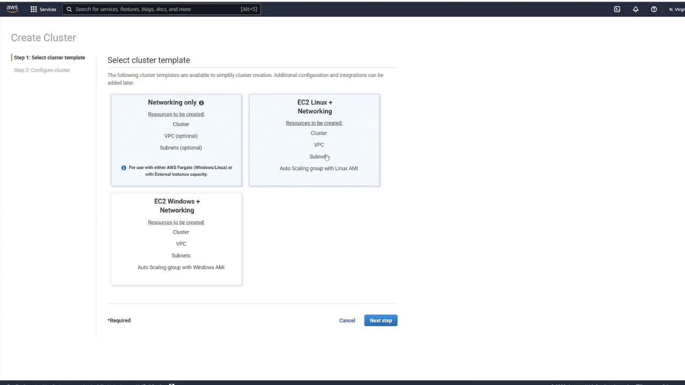
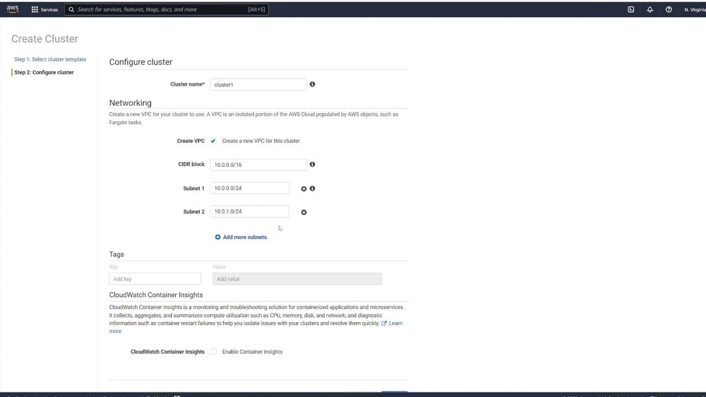
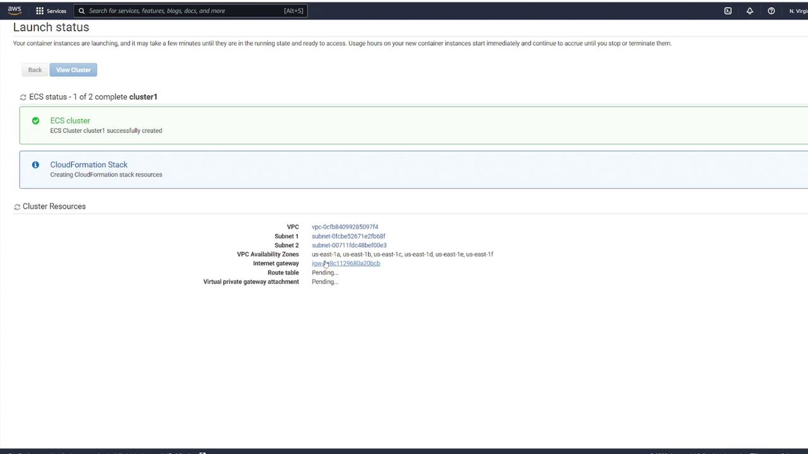

# Demo Creating new cluster

Source: https://notes.kodekloud.com/docs/Amazon-Elastic-Container-Service-AWS-ECS/Deploying-a-new-application-from-scratch/Demo-Creating-new-cluster/page

Learn to create a new Amazon ECS cluster using the AWS Management Console with Fargate, avoiding EC2 instance launches.

In this lesson, you will learn how to create a new Amazon ECS cluster using the AWS Management Console. Follow the steps below to configure your cluster with Fargate and avoid launching EC2 instances.

## Step 1: Choose a Cluster Template

Click on the **Create Cluster** button. You will see three template options:

1. **Networking only** – Ideal for using Fargate.
2. **EC2 Linux + Networking** – Use this if you plan to run EC2 instances with Linux.
3. **EC2 Windows + Networking** – Use this if you plan to run EC2 instances with Windows.

Since the goal is to use Fargate, select the **Networking only** option. Then, provide a name for your cluster, such as **cluster1**. You also have the option to customize your VPC configuration by modifying the default CIDR block and subnets. If no customization is required, leave these settings as they are. When you click **Create**, the system will automatically provision a VPC with your specified CIDR block and two subnets.

## Step 2: Configure Networking Settings

After selecting your cluster template, adjust any additional networking settings as needed. This includes configuring the VPC, CIDR block, and subnets. You may also add tags or enable CloudWatch Container Insights. Once you have reviewed the settings, click **Create** to continue.

> **lightbulb** After configuring your networking settings, ensure that the VPC and subnet settings meet your organizational requirements.

## Step 3: View Cluster Details

Once the cluster is created, click **View Cluster** to access its details. This action will take you to the cluster details page where you can verify the successful creation and review the configuration details.

On the details page, you will see that **cluster1** is now active. The dashboard provides an overview of the cluster status, task counts, and services. Although the cluster is active, note that there are no registered container instances or running tasks yet.

> **triangle-alert** Ensure you have reviewed all configuration parameters and networking settings before finalizing your cluster creation to avoid configuration issues later.

- [Watch Video](https://learn.kodekloud.com/user/courses/amazon-elastic-container-service-aws-ecs/module/5d992c10-db1a-4e88-91f3-83c23d3595d0/lesson/a8e641f2-1be0-4d27-af07-cb5c48697f45)
