# Use default AWS managed KMS key
aws s3 cp file.txt s3://my-bucket/ --sse aws:kms

# Specify a custom CMK
aws s3 cp file.txt s3://my-bucket/ \
  --sse aws:kms \
  --sse-kms-key-id alias/my-kms-key
```

**Boto3 Example**

```python theme={null}
import boto3

s3 = boto3.client('s3')

# Default KMS key
s3.put_object(
    Bucket='my-bucket',
    Key='file.txt',
    Body=b'Data',
    ServerSideEncryption='aws:kms'
)

# Custom CMK
s3.put_object(
    Bucket='my-bucket',
    Key='file2.txt',
    Body=b'More data',
    ServerSideEncryption='aws:kms',
    SSEKMSKeyId='arn:aws:kms:us-west-2:123456789012:key/abcd-efgh'
)
```

***

## SSE-C (Server-Side Encryption with Customer-Provided Keys)

With SSE-C, you provide the encryption key on each request:

* Key management: Client
* Encryption/decryption: S3
* S3 stores only the MD5 hash of your key for verification

<Frame>
  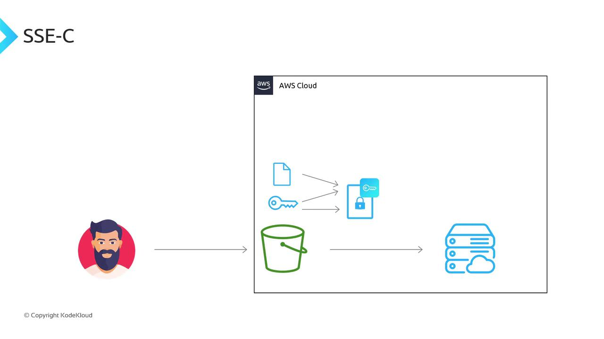
</Frame>

Include these headers (or equivalent CLI/SDK options):

* `x-amz-server-side-encryption-customer-algorithm: AES256`
* `x-amz-server-side-encryption-customer-key: <Base64-encoded key>`
* `x-amz-server-side-encryption-customer-key-MD5: <Base64-encoded MD5 of key>`

<Callout icon="triangle-alert">
  AWS does not store your customer-provided key. If you lose the key, your data cannot be decrypted.
</Callout>

**AWS CLI Example**

```bash theme={null}
aws s3 cp file.txt s3://my-bucket/ \
  --sse-c AES256 \
  --sse-c-key fileb://key.bin \
  --sse-c-copy-source-key fileb://key.bin
```

**Boto3 Example**

```python theme={null}
import hashlib
import boto3

# Read or generate a 256-bit key
with open('key.bin', 'rb') as f:
    key = f.read()
md5 = hashlib.md5(key).digest()

s3 = boto3.client('s3')
s3.put_object(
    Bucket='my-bucket',
    Key='file.txt',
    Body=b'Sensitive data',
    SSECustomerAlgorithm='AES256',
    SSECustomerKey=key,
    SSECustomerKeyMD5=md5
)
```

***

## Encryption Headers and Comparison Summary

Below is a quick reference of S3 server-side encryption headers:

<Frame>
  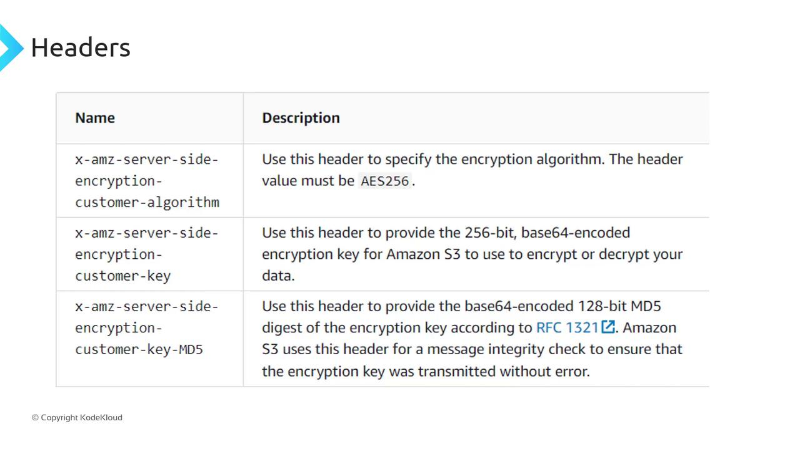
</Frame>

| Encryption Method | Key Management | Encryption/Decryption |
| ----------------- | -------------- | --------------------- |
| Client-Side       | Client         | Client                |
| SSE-C             | Client         | S3                    |
| SSE-S3            | AWS S3         | AWS S3                |
| SSE-KMS           | AWS KMS        | AWS S3 / AWS KMS      |

<Frame>
  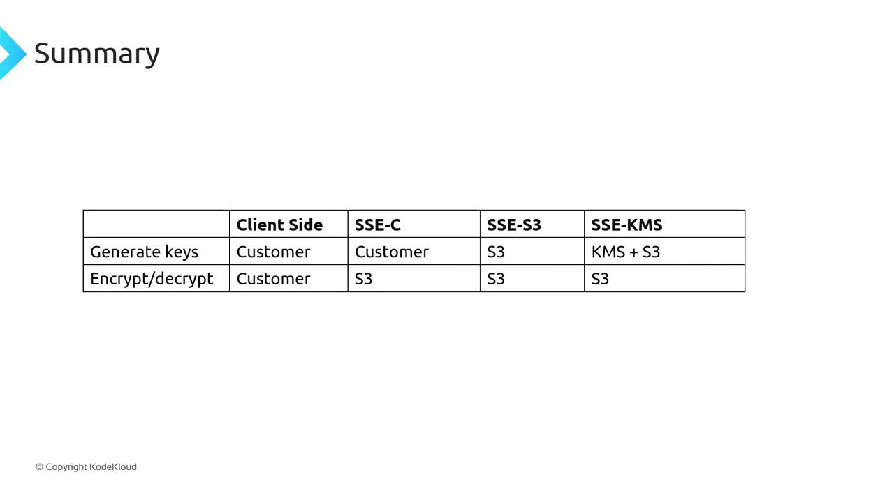
</Frame>

Choose the encryption approach that balances control, security, and operational overhead for your use case.

***

## Links and References

* [Amazon S3 Encryption Overview](https://docs.aws.amazon.com/AmazonS3/latest/dev/sse.html)
* [AWS KMS Developer Guide](https://docs.aws.amazon.com/kms/latest/developerguide/)
* [AWS CLI S3 Command Reference](https://docs.aws.amazon.com/cli/latest/reference/s3/index.html)

<CardGroup>
  <Card title="Watch Video" icon="video" href="https://learn.kodekloud.com/user/courses/amazon-simple-storage-service-amazon-s3/module/90fd6d76-d0d4-481c-b267-b9247a005a6e/lesson/eef86cb6-c62a-4a7a-bbff-5b24c3e63ff0" />
</CardGroup>


# S3 Replication

Source: https://notes.kodekloud.com/docs/Amazon-Simple-Storage-Service-Amazon-S3/AWS-S3-Advanced-Features/S3-Replication/page

Amazon S3 Replication allows automatic copying of objects between buckets to enhance data protection, compliance, and performance.

Amazon S3 Replication enables automatic, asynchronous copying of objects from a source bucket to one or more destination buckets. By configuring replication, you can meet compliance mandates, protect against accidental data loss, and serve data with low latency by placing it closer to your users or workloads.

## Why Use S3 Replication?

Replication offers several benefits:

* Maintain multiple copies of objects in separate locations for disaster recovery
* Comply with regulatory requirements for geographically isolated data
* Reduce read latency by storing objects nearer to end users
* Enhance application performance by keeping data close to processing servers

<Frame>
  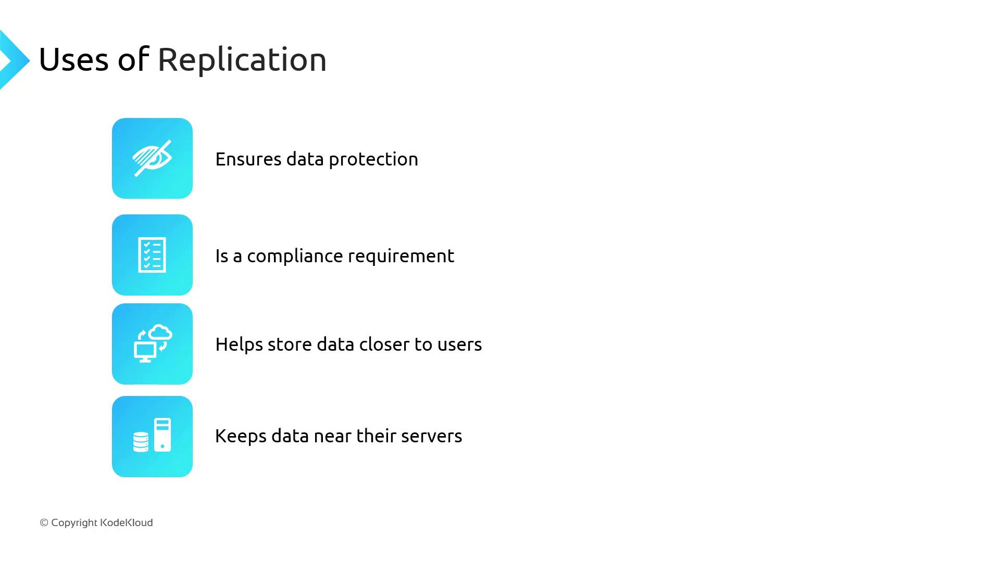
</Frame>

## Types of Replication

| Replication Type               | Description                                                                                           |
| ------------------------------ | ----------------------------------------------------------------------------------------------------- |
| Same-Region Replication (SRR)  | Copy objects to another bucket within the same AWS Region.                                            |
| Cross-Region Replication (CRR) | Copy objects to a bucket in a different AWS Region.                                                   |
| Multi-Destination Replication  | Replicate objects from one source bucket to multiple destination buckets (same or different Regions). |

***

## Same-Region Replication Use Cases

Even when operating in a single Region, SRR can solve key challenges:

* **Log Aggregation:** Consolidate logs from multiple application buckets into a central bucket for unified analytics.
* **Prod-to-Test Synchronization:** Keep your development or staging environments up to date with production data for realistic testing.

<Frame>
  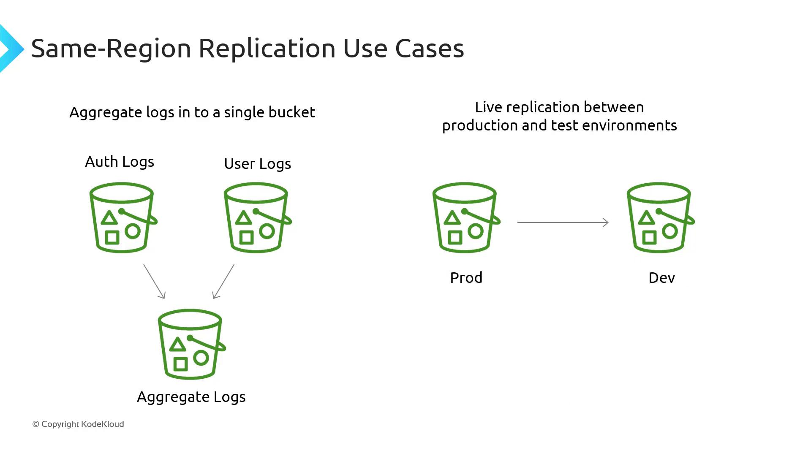
</Frame>

***

## Cross-Region Replication Use Cases

CRR is ideal when you need to:

* Fulfill compliance requirements by storing copies in separate Regions
* Deliver content faster to global audiences by minimizing latency
* Increase operational resilience by providing local access to data for multi-Region applications

<Frame>
  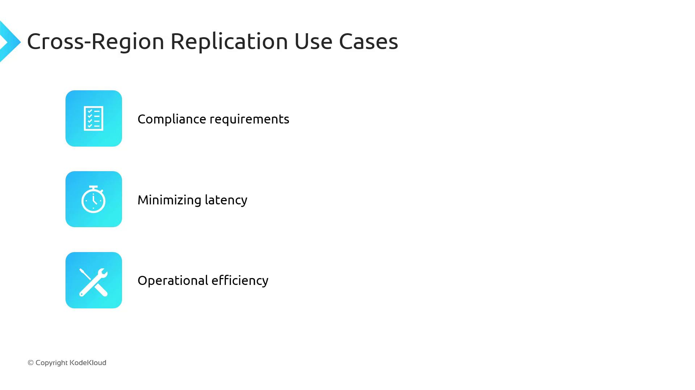
</Frame>

***

## One-Way vs. Bidirectional Replication

By default, replication in S3 is **one-way**: changes in the source bucket propagate to the destination, but updates in the destination do not return to the source. For active-active deployments or automated failover, you can configure **bidirectional replication** manually to synchronize changes both ways.

<Frame>
  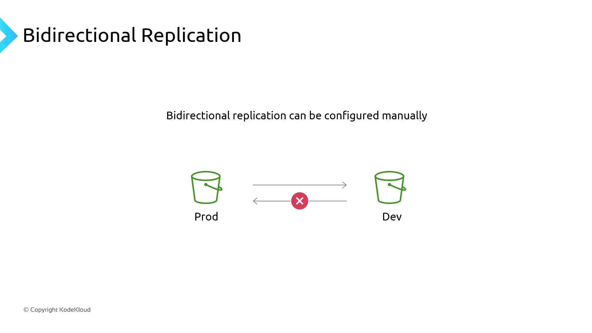
</Frame>

Use Case: During a regional failover, promote the replica bucket as primary. Bidirectional replication ensures that changes made in the failover Region synchronize back when the original Region is restored.

***

## Replication Requirements

Before enabling replication, verify these prerequisites:

| Requirement               | Details                                                                                  |
| ------------------------- | ---------------------------------------------------------------------------------------- |
| Versioning Enabled        | Turn on versioning for both the source and destination buckets.                          |
| IAM Permissions           | Grant AWS S3 the necessary IAM role or policy to perform replication actions.            |
| S3 Object Lock (optional) | If enabled on the source bucket, Object Lock must also be configured on the destination. |

<Callout icon="triangle-alert">
  Replication will not start until versioning is activated on both buckets. The S3 console will prompt you if versioning is missing.
</Callout>

<Frame>
  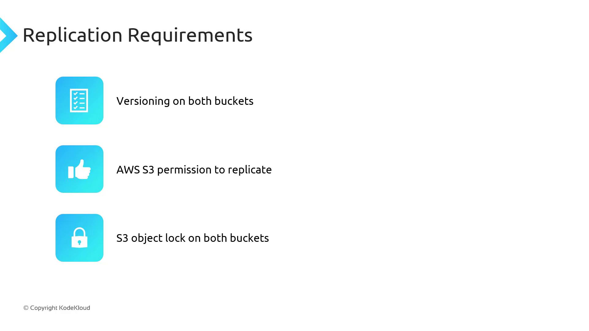
</Frame>

***

## Object Replication Details

* **New vs. Existing Objects:** Only objects created *after* replication configuration are auto-copied. To migrate existing objects, use a one-time [Batch Operations job](https://docs.aws.amazon.com/AmazonS3/latest/userguide/batch-ops.html).
* **Encryption:** Objects encrypted with SSE-S3, SSE-KMS, or client-side encryption replicate transparently.
* **Glacier Classes:** Objects in **Glacier Flexible Retrieval** and **Glacier Deep Archive** replicate like standard objects, but you must restore them before access.
* **Metadata & Tags:** All object metadata, ACLs, and tags are preserved during replication.
* **Storage Class Overrides:** Optionally, convert storage classes on the destination—for example, replicate `S3 Standard` to `S3 Standard-IA` in the target bucket.

<Frame>
  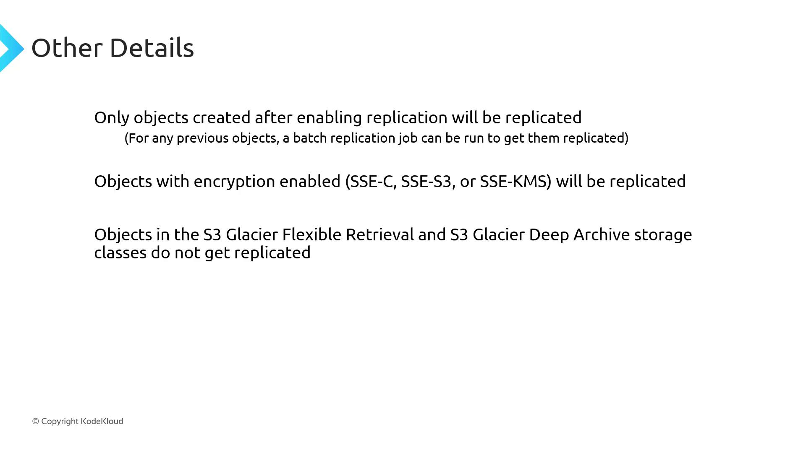
</Frame>

***

## Delete Markers and Version Deletions

* **Delete Markers:** Not replicated by default. You can enable marker replication if your workflow requires it.
* **Version Deletions:** Removing a specific object version in the source bucket does *not* delete it in the destination—protecting against accidental or malicious data loss.

<Frame>
  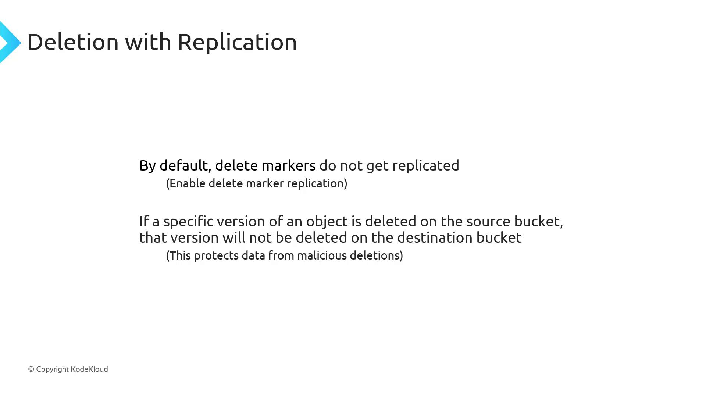
</Frame>

***

## Cross-Account Replication Permissions

| Scenario               | Configuration                                                                                       |
| ---------------------- | --------------------------------------------------------------------------------------------------- |
| Same AWS Account       | Create an IAM role in the source account with S3 replicate permissions.                             |
| Different AWS Accounts | In addition to the source IAM role, attach a bucket policy on the destination to allow replication. |

<Frame>
  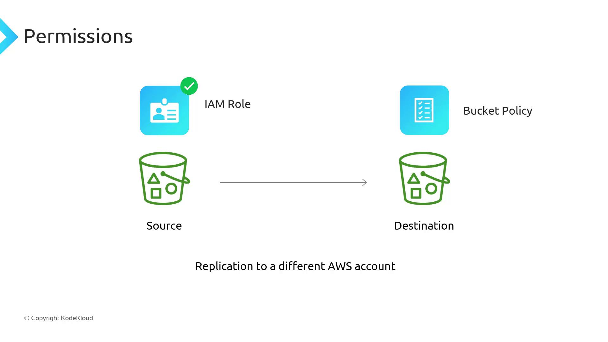
</Frame>

***

## Replication Latency and Replication Time Control (RTC)

Replication is inherently asynchronous and may take minutes or hours, depending on object size and count. If you require replication within 15 minutes to fulfill strict SLA or regulatory requirements, enable **Replication Time Control (RTC)**.

<Callout icon="lightbulb">
  Replication Time Control (RTC) guarantees that new objects are copied within 15 minutes of creation. This feature incurs additional costs—see the [Amazon S3 Pricing](https://aws.amazon.com/s3/pricing/) page for details.
</Callout>

<CardGroup>
  <Card title="Watch Video" icon="video" href="https://learn.kodekloud.com/user/courses/amazon-simple-storage-service-amazon-s3/module/90fd6d76-d0d4-481c-b267-b9247a005a6e/lesson/6d3f6520-5733-4225-8adc-a9926fbe3710" />
</CardGroup>
