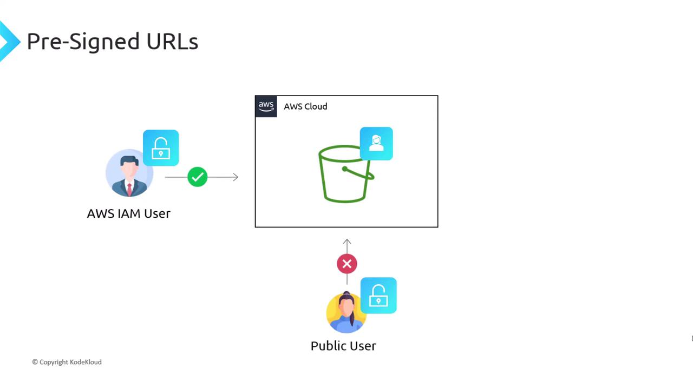
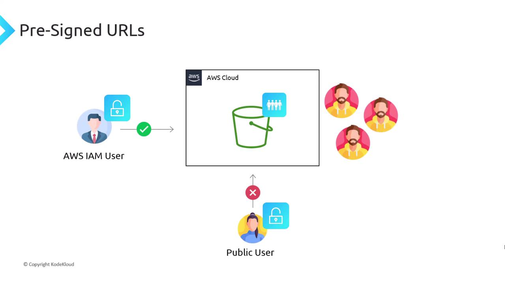
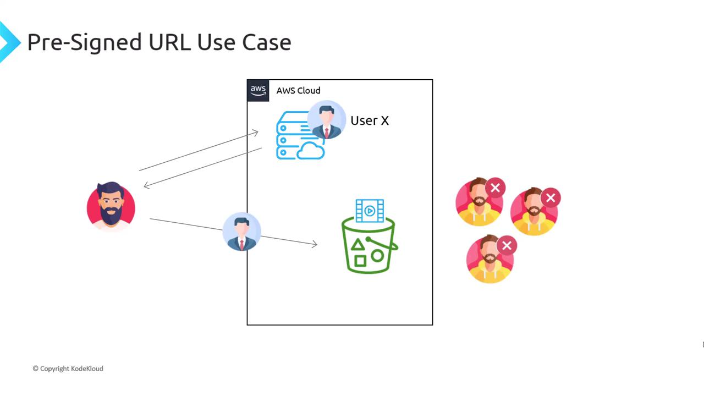

# Presigned URLs

Source: https://notes.kodekloud.com/docs/Amazon-Simple-Storage-Service-Amazon-S3/AWS-S3-Advanced-Features/Presigned-URLs/page

Pre-signed URLs provide secure, temporary access to private Amazon S3 objects without sharing AWS credentials.

Pre-signed URLs are a powerful Amazon S3 feature that let you grant time-limited access to private objects without sharing AWS credentials. By embedding your IAM user’s credentials and permissions into a URL, you can allow third parties to download or upload files directly to your S3 bucket. This approach keeps your bucket private and eliminates the need to proxy large files through your backend.

## Why Use Pre-Signed URLs?

Imagine you have a private S3 bucket managed by an IAM-authenticated user. That user can list, upload, and download objects, but external (public) users cannot:



Two common—but suboptimal—alternatives are:

* Creating an AWS account for every external user (not scalable)
* Making the bucket public (exposes all objects)



Instead, generate a pre-signed URL that allows the public user to perform a single action (GET or PUT) before it expires. S3 processes the request as if it came from your IAM user.

## How Pre-Signed URLs Work

1. **Generate URL**: Your backend calls the S3 API to create a pre-signed URL, specifying the bucket, object key, operation (`get_object` or `put_object`), and expiration.
2. **Share URL**: Send the URL to the client (public user).
3. **Perform Action**: The client uses the URL to upload or download directly from S3.
4. **Automatic Validation**: S3 verifies the signature, ensures the URL hasn’t expired, and checks permissions.

## Use Case: Secure Video Streaming

A streaming service stores videos in S3. When a paying customer requests a video, the backend issues a pre-signed GET URL so the client can stream directly from S3:



```python theme={null}
import boto3
from botocore.exceptions import ClientError

def create_presigned_get_url(bucket_name, object_key, expiration=3600):
    s3 = boto3.client('s3')
    try:
        return s3.generate_presigned_url(
            'get_object',
            Params={'Bucket': bucket_name, 'Key': object_key},
            ExpiresIn=expiration
        )
    except ClientError as e:
        print(f"Error generating GET URL: {e}")
        return None
