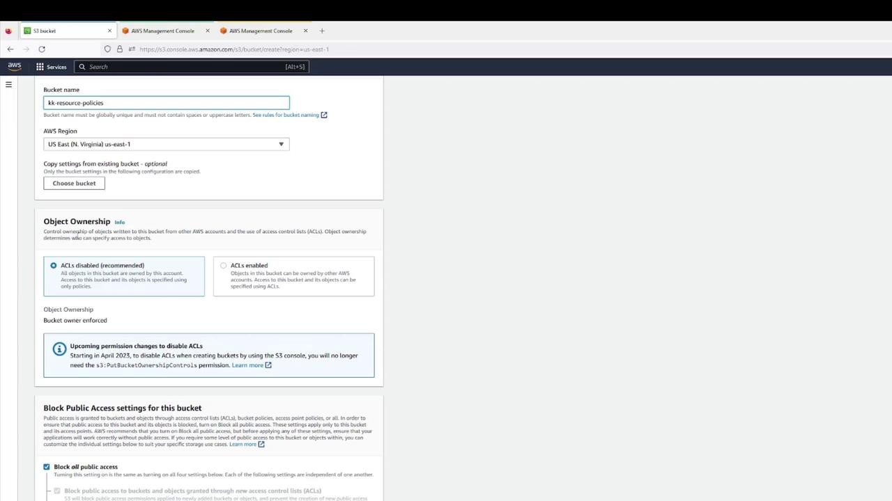
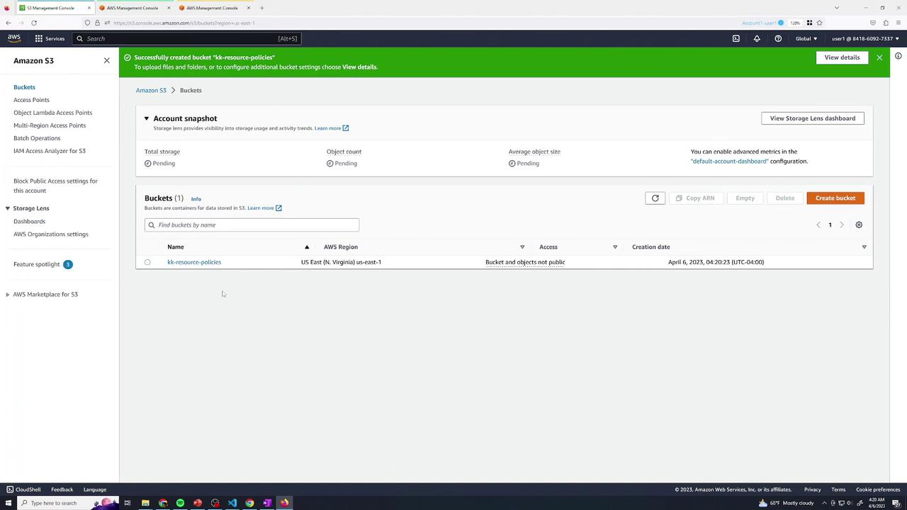
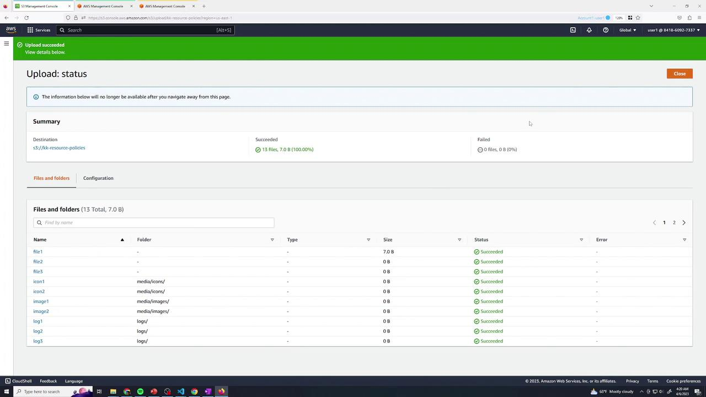
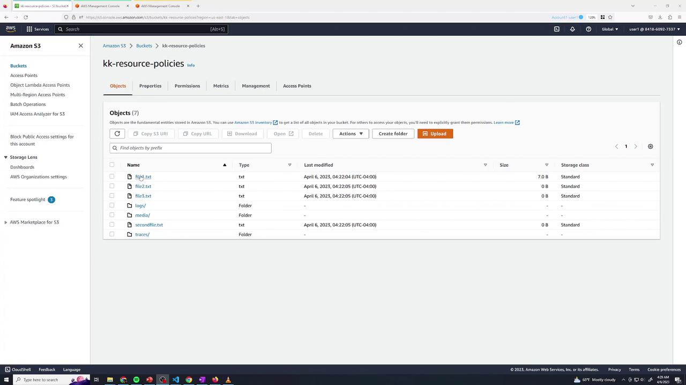
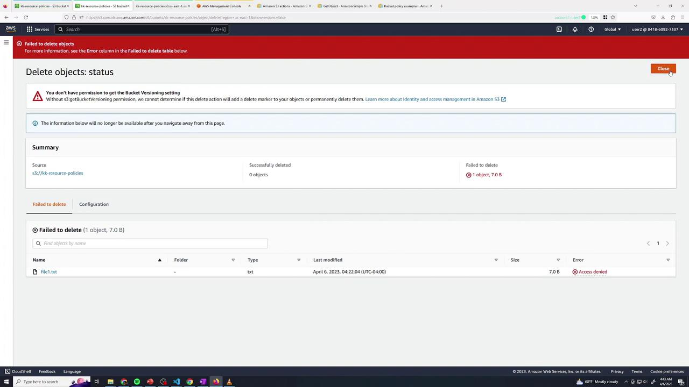
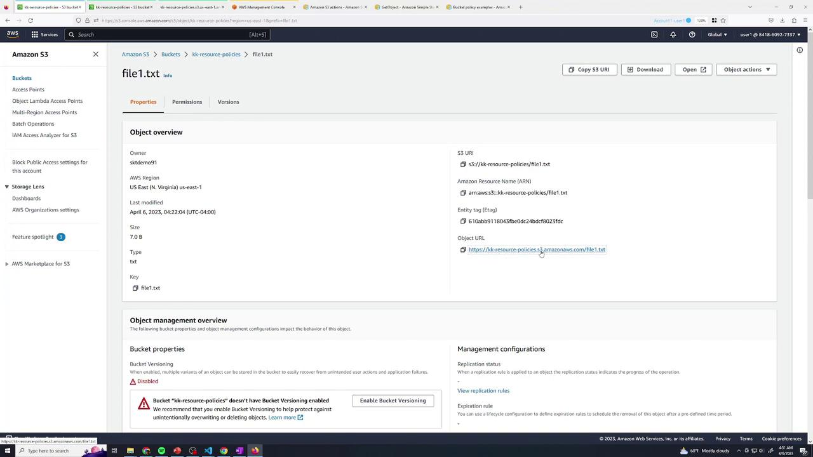

# Demo S3 ACLs Resource Policies

Source: https://notes.kodekloud.com/docs/Amazon-Simple-Storage-Service-Amazon-S3/AWS-S3-Core-Concepts/Demo-S3-ACLs-Resource-Policies/page

This guide explains how to use AWS S3 bucket policies to manage access for different users and scenarios.

In this guide, you’ll learn how to use AWS S3 bucket policies (resource policies) to grant or restrict access for:

1. Users in the same AWS account
2. Anonymous (public) users
3. Users in a different AWS account

You’ll simulate three users using browser tabs with colored labels:

* **Blue**: Account 1, User 1 (Bucket Owner)
* **Green**: Account 1, User 2
* **Yellow**: Account 2, User Admin

Switch among these tabs to verify permissions.

***

## Test Environment

| Tab Color | AWS Account | IAM Identity   | Purpose                     |
| --------- | ----------- | -------------- | --------------------------- |
| Blue      | Account 1   | User 1 (owner) | Create bucket & edit policy |
| Green     | Account 1   | User 2         | Test limited access         |
| Yellow    | Account 2   | User Admin     | Test cross-account access   |

***

## 1. Create the S3 Bucket (User 1)

1. In the **Blue** tab, open the [AWS S3 Console](https://console.aws.amazon.com/s3/).
2. Click **Create bucket** and configure:
   * Bucket name: `kk-resource-policies`
   * Region: your choice
   * Object Ownership: Bucket owner preferred
   * Block all public access: **Enabled**
   * Versioning: **Disabled**

<Frame>
  
</Frame>

3. Confirm creation.

<Frame>
  
</Frame>

4. Upload a set of files (e.g., text & log files).

<Frame>
  
</Frame>

5. Verify all objects are listed:

<Frame>
  
</Frame>

By default, as the bucket owner:

* Listing and “Open” via console (authenticated) works.
* Public URL returns **AccessDenied**:

```xml theme={null}
<Error>
  <Code>AccessDenied</Code>
  <Message>Access Denied</Message>
  <RequestId>12SIDZRCRIXS94G00</RequestId>
  <HostId>…</HostId>
</Error>
```

***

## 2. Baseline IAM Permissions for User 2

Switch to the **Green** tab. User 2 currently has only list permissions:

```json theme={null}
{
  "Version": "2012-10-17",
  "Statement": [
    {
      "Sid": "ListBucketsOnly",
      "Effect": "Allow",
      "Action": [
        "s3:ListAllMyBuckets",
        "s3:ListBucket"
      ],
      "Resource": "*"
    }
  ]
}
```

User 2 can list buckets and objects but **cannot** read or delete data. Opening `file1.txt` returns **AccessDenied**.

***

## 3. Grant User 2 Read Access to logs/

Return to **Blue** (User 1) and edit the bucket policy under **Permissions** → **Bucket Policy**. Add:

```json theme={null}
{
  "Sid": "User2AllowLogs",
  "Effect": "Allow",
  "Principal": {
    "AWS": "arn:aws:iam::<YOUR_ACCOUNT_ID>:user/user2"
  },
  "Action": "s3:GetObject",
  "Resource": "arn:aws:s3:::kk-resource-policies/logs/*"
}
```

Save the policy.

### Test Read Access

In **Green**, open `logs/log1` → download succeeds.

<Frame>
  
</Frame>

Attempting to open `file1.txt` (outside `logs/`) still yields **AccessDenied**:

```xml theme={null}
<Error>
  <Code>AccessDenied</Code>
  <Message>Access Denied</Message>
  …
</Error>
```

***

## 4. Grant User 2 Delete Access in traces/

Back in **Blue**, append another statement:

```json theme={null}
{
  "Sid": "User2AllowDeleteTraces",
  "Effect": "Allow",
  "Principal": {
    "AWS": "arn:aws:iam::<YOUR_ACCOUNT_ID>:user/user2"
  },
  "Action": "s3:DeleteObject",
  "Resource": "arn:aws:s3:::kk-resource-policies/traces/*"
}
```

Save and switch to **Green**:

* Deleting `traces/trace1` → **Success**
* Deleting `file1.txt` → **AccessDenied**

<Frame>
  
</Frame>

***

## 5. Combining Multiple Actions

You can merge permissions when they apply to the same resource path:

```json theme={null}
{
  "Sid": "User2GetAndDeleteLogs",
  "Effect": "Allow",
  "Principal": {
    "AWS": "arn:aws:iam::<YOUR_ACCOUNT_ID>:user/user2"
  },
  "Action": [
    "s3:GetObject",
    "s3:DeleteObject"
  ],
  "Resource": "arn:aws:s3:::kk-resource-policies/logs/*"
}
```

<Callout icon="lightbulb">
  Ensure that all listed actions in one statement target the same ARN pattern.
</Callout>

***

## 6. Allow Public Read Access to media/

To expose only the `media/` prefix publicly:

1. In **Permissions**, disable “Block public access” (if enforced).
2. Add:

```json theme={null}
{
  "Sid": "AllowPublicMedia",
  "Effect": "Allow",
  "Principal": "*",
  "Action": "s3:GetObject",
  "Resource": "arn:aws:s3:::kk-resource-policies/media/*"
}
```

After saving, any object under `media/` is publicly readable.

<Frame>
  
</Frame>

***

## 7. Grant Cross-Account Access (Account 2)

In **Yellow** (Account 2, User Admin), test listing:

```bash theme={null}
aws s3 ls s3://kk-resource-policies
