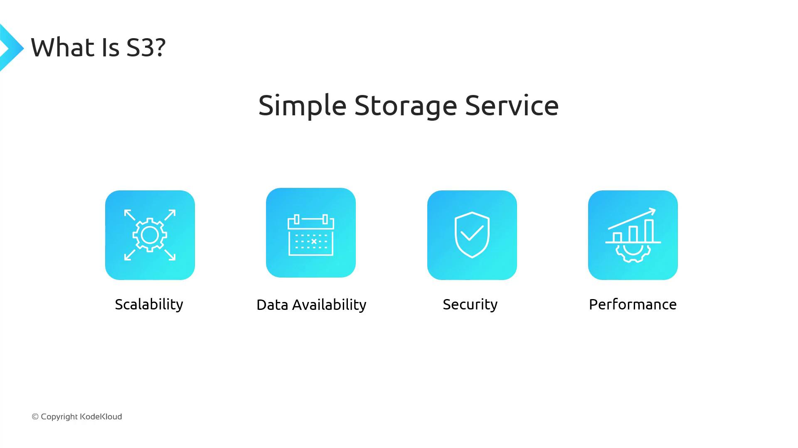
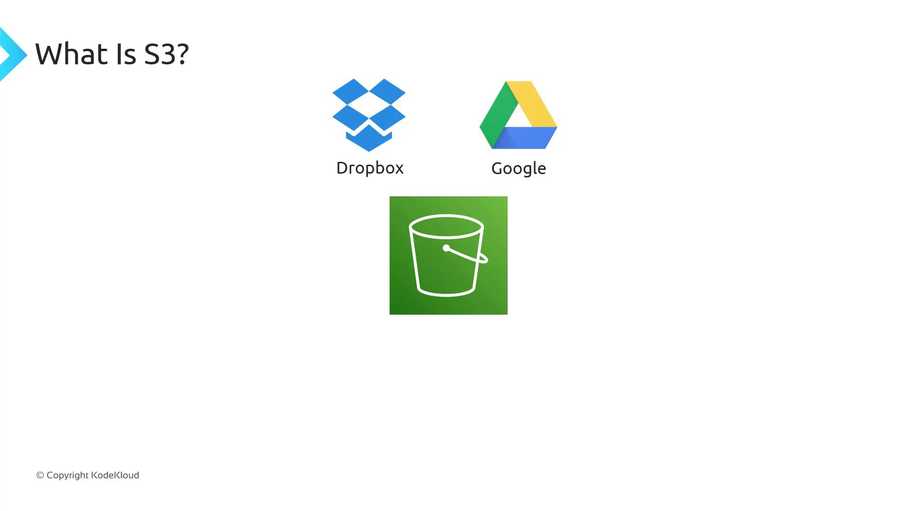
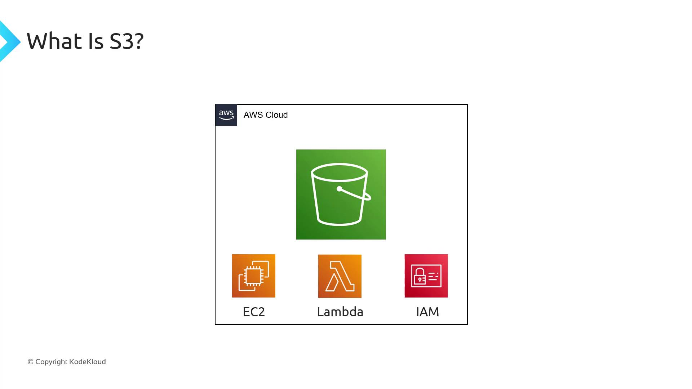
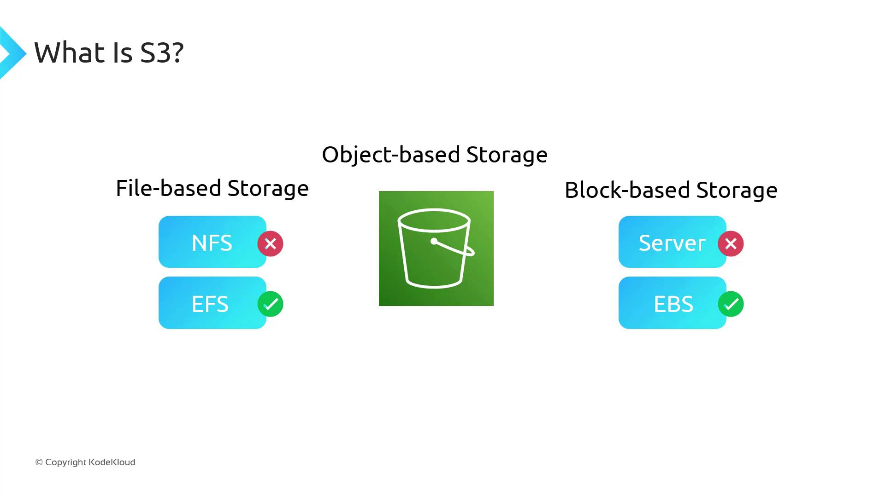
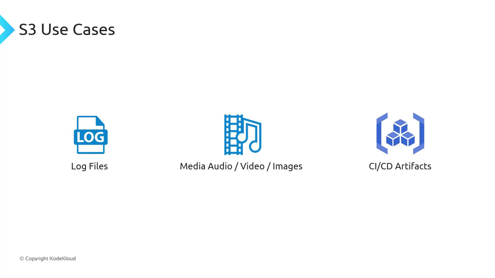
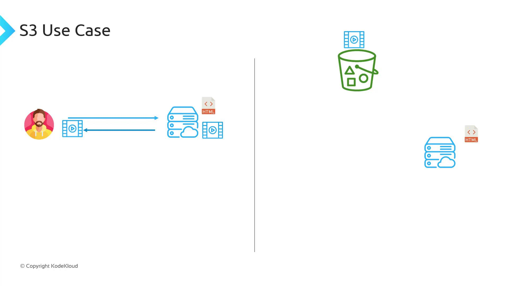

# What is AWS S3

Source: https://notes.kodekloud.com/docs/Amazon-Simple-Storage-Service-Amazon-S3/AWS-S3-Core-Concepts/What-is-AWS-S3/page

Amazon S3 is a fully managed object storage solution offering scalability, data availability, security, and performance within the AWS ecosystem.

Amazon S3 (Simple Storage Service) is a fully managed object storage solution offering industry-leading scalability, data availability, security, and performance. Think of it as a highly durable, highly available file store—similar to Dropbox or Google Drive—but deeply integrated into the AWS ecosystem.

## Key Features

<Frame>
  
</Frame>

* Virtually unlimited storage capacity
* 99.999999999% (11 9’s) of data durability
* Fine-grained access control with IAM policies and bucket policies
* Multiple interfaces: Console, AWS CLI, AWS SDKs, REST API

## Seamless AWS Integration

Because S3 is an AWS-native service, it integrates seamlessly with services like EC2, Lambda, and IAM. You can manage buckets and objects using:

* AWS Management Console
* AWS CLI
* AWS SDKs (e.g., Boto3 for Python)
* RESTful API calls

<Frame>
  
</Frame>

<Frame>
  
</Frame>

## Object Storage vs. File and Block Storage

S3 is **object-based** storage: you upload whole objects (files) rather than individual blocks. It uses a flat namespace rather than a hierarchical filesystem, so you cannot mount an S3 bucket like an EBS volume or NFS share.

| Storage Type | Description                       | Examples                  |
| ------------ | --------------------------------- | ------------------------- |
| Object       | Stores entire files as objects    | Amazon S3                 |
| File         | Shares directories over a network | NFS, Amazon EFS           |
| Block        | Presents raw block devices to OS  | EBS, direct-attached SSDs |

<Frame>
  
</Frame>

## Common Use Cases

* Storing application log files
* Hosting media assets (images, videos, audio)
* Saving CI/CD pipeline artifacts

<Frame>
  
</Frame>

## Real-World Example: Offloading Media for a Website

In traditional web hosting, your server handles HTML, CSS, JavaScript, and all media. As traffic scales—imagine YouTube or Netflix—storing petabytes of video on web servers becomes costly and unscalable.

With S3:

1. Keep only static assets (HTML/CSS/JS) on your web server
2. Offload large media files to an S3 bucket
3. Reference S3 URLs in your HTML so browsers fetch content directly from S3

<Frame>
  
</Frame>

## Key Terminology

### Buckets

A **bucket** is a container for objects—think of it as a top-level folder. Names must be globally unique across all AWS accounts.

```bash theme={null}
