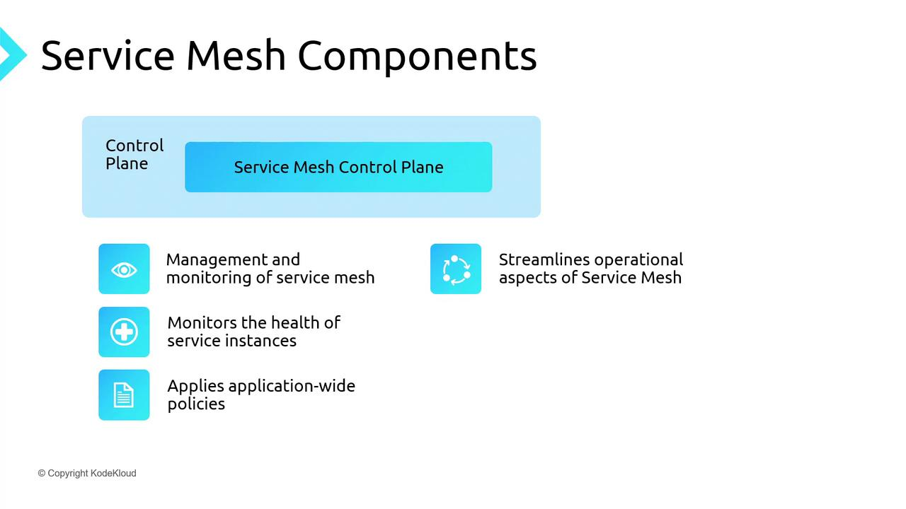
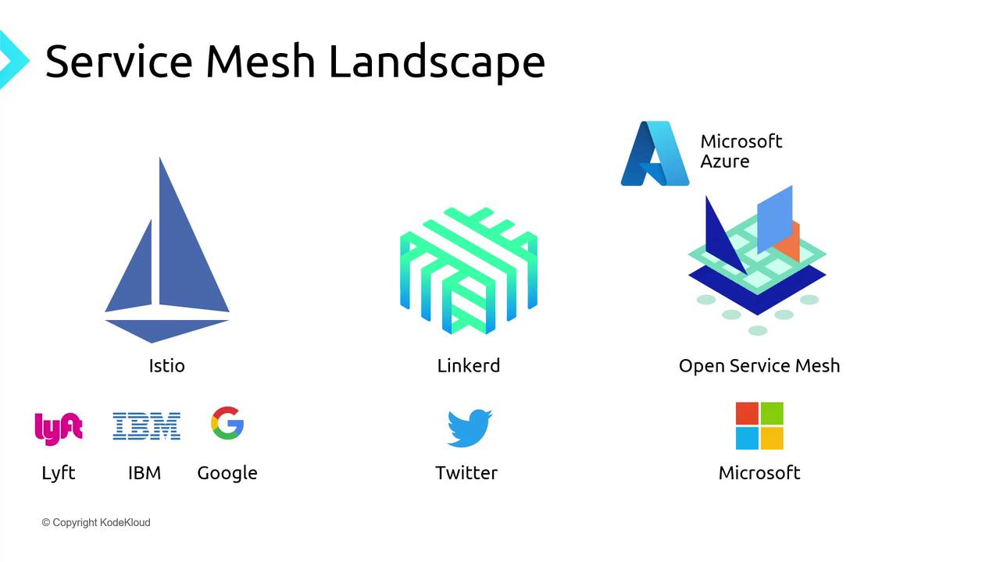
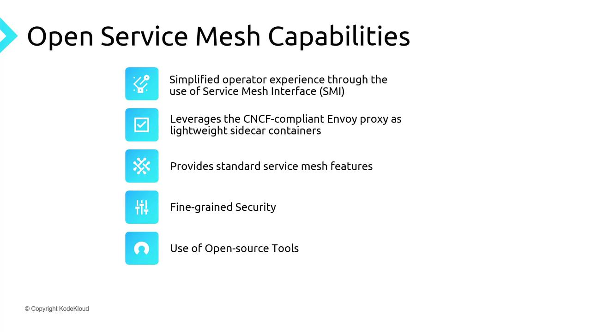
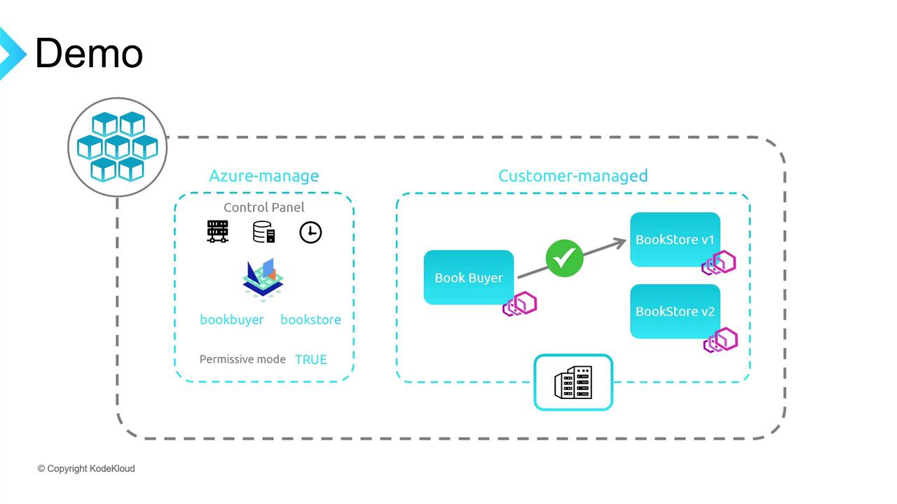

# Check if azure-policy add-on is enabled
az aks show \
  --resource-group AKSPolicyDemo \
  --name AKSPolicyDemo \
  --query addonProfiles.azurepolicy

# Enable the Azure Policy add-on
az aks enable-addons \
  --resource-group AKSPolicyDemo \
  --name AKSPolicyDemo \
  --addons azure-policy
```

This installs:

* An **azure-policy** deployment in `kube-system`.
* Gatekeeper pods in `gatekeeper-system`.

Validate:

```bash theme={null}
# Azure Policy components
kubectl get pods -n kube-system | grep policy

# Gatekeeper components
kubectl get pods -n gatekeeper-system
```

Example output:

```bash theme={null}
# kube-system
azure-policy-58b80f747-lbkcn        1/1   Running   0   70s
azure-policy-webhook-rcf579d-4khjy 1/1   Running   0   70s

# gatekeeper-system
gatekeeper-audit-c99f9f6d-5mlqt        1/1   Running   0   99s
gatekeeper-controller-6d47b67cbc-xsgvd 1/1   Running   0   99s
gatekeeper-controller-6d47b67cbc-7g1lr 1/1   Running   0   99s
```

***

## Enforcing Kubernetes-Native Policies

Next, apply a service-port policy:

1. In Azure portal **Policy** > **Definitions**, search for **Kubernetes clusters should only expose allowed ports on services**.
2. Click **Assign**, select scope, and set allowed ports to `80` and `443`.

Deploy an NGINX service on port 80:

```yaml theme={null}
# KK-AKSPolicyDemo.yaml
apiVersion: v1
kind: Service
metadata:
  name: service-allow-ports
spec:
  type: ClusterIP
  selector:
    app: nginx
  ports:
    - protocol: TCP
      port: 80
```

```bash theme={null}
kubectl apply -f KK-AKSPolicyDemo.yaml
```

Works because port 80 is permitted. Next, try port 8080:

```yaml theme={null}
# KK-AKSPolicyDemo2.yaml
apiVersion: v1
kind: Service
metadata:
  name: service-allow-port-8080
spec:
  type: NodePort
  selector:
    app: nginx
  ports:
    - protocol: TCP
      port: 8080
```

```bash theme={null}
kubectl apply -f KK-AKSPolicyDemo2.yaml
```

Gatekeeper denies it:

```bash theme={null}
Error from server (Forbidden): admission webhook "validation.gatekeeper.sh" denied the request:
[azurepolicy-k8sazurerv1serviceallowedports=...]
Port 8080 for service service-allow-port-8080 has not been allowed.
```

***

## How Policy Enforcement Works

When the Azure Policy add-on is active, Gatekeeper syncs assignments every 15 minutes and integrates into the Kubernetes API flow:

1. **kubectl** → API Server
2. **Authentication**
3. **Authorization (RBAC)**
4. **Admission Controllers** (including Gatekeeper)
5. **Execution**

Gatekeeper validates resource definitions against your policies before finalizing the operation.

<Frame>
  
</Frame>

***

## Additional Resources

* [Azure Policy overview](https://docs.microsoft.com/azure/governance/policy/)
* [Azure Kubernetes Service (AKS)](https://docs.microsoft.com/azure/aks/)
* [Open Policy Agent (OPA)](https://www.openpolicyagent.org/)
* [Gatekeeper GitHub](https://github.com/open-policy-agent/gatekeeper)

<CardGroup>
  <Card title="Watch Video" icon="video" href="https://learn.kodekloud.com/user/courses/azure-kubernetes-service/module/d229c32e-4ff2-47ce-8be7-3dd99d62753f/lesson/7a8bfde2-64e4-48d9-b853-c6cf61408c01" />
</CardGroup>


# Open Service Mesh

Source: https://notes.kodekloud.com/docs/Azure-Kubernetes-Service/AKS-Security/Open-Service-Mesh/page

This article discusses Open Service Mesh in Kubernetes, focusing on its architecture, features, and deployment on Azure Kubernetes Service.

A service mesh in Kubernetes offers a dedicated communication layer that abstracts networking and infrastructure concerns away from application code. By injecting a lightweight proxy—called a sidecar—next to each service instance, it intercepts all inbound and outbound traffic. This approach provides consistent traffic management, mTLS security, and observability without changing your application.

Services (e.g., frontend, middle-tier, backend) run alongside their respective sidecar proxies. Although deployed together, proxies are managed independently, allowing you to update or scale them separately. The result is a clean codebase while the mesh transparently handles retries, circuit breaking, encryption, and more.

Open Service Mesh (OSM) for AKS consists of two main layers: the data plane and the control plane.

## Data Plane

The data plane is responsible for the actual routing of network traffic between services. Its key functions include:

* **Service discovery**: Automatically finding and routing to healthy instances.
* **Traffic management**: Implementing retries, circuit breakers, and load balancing.
* **Security**: Establishing mutual TLS (mTLS) channels for encrypted, authenticated communication.

<Frame>
  
</Frame>

## Control Plane

The control plane provides centralized orchestration and visibility. It:

* **Provisions** and scales service instances.
* **Monitors** pod health and replaces unhealthy instances.
* **Enforces policies** such as rate limits, access control, and routing rules.

<Frame>
  
</Frame>

## Popular Service Mesh Implementations

| Implementation          | Language/Platform | Key Characteristics                                    |
| ----------------------- | ----------------- | ------------------------------------------------------ |
| Istio                   | Go                | Extensible, full-featured, advanced policy engine      |
| Linkerd                 | Scala (JVM)       | Lightweight, simplicity-first, low overhead            |
| Open Service Mesh (OSM) | Go                | CNCF-compliant, Envoy-based, lightweight control plane |

<Frame>
  
</Frame>

On Azure Kubernetes Service (AKS), OSM was the original built-in mesh, and Istio is now available in preview. This guide will focus on deploying and using OSM on AKS.

## Features of Open Service Mesh

* Simplified control plane for easy operations
* Envoy sidecars for CNCF-approved, high-performance proxying
* Traffic policies: access control, traffic splitting, telemetry
* Fine-grained mTLS for service-to-service encryption
* Integration with Prometheus, Grafana, Jaeger for monitoring and tracing
* Support for external certificate authorities in production

<Frame>
  
</Frame>

## Demo Architecture

We’ll deploy a sample **bookstore** application on AKS with OSM in permissive mode. The demo includes:

* **Book Buyer** (client)
* **Bookstore V1** (primary backend)
* **Bookstore V2** (for traffic splitting)
* **Book Warehouse** (additional service)

The workflow covers enabling OSM, onboarding namespaces, testing default traffic, toggling permissive mode, applying explicit policies, and performing traffic splits.

<Frame>
  
</Frame>

### Prerequisites

* Azure CLI installed
* `kubectl` configured locally
* `osm` CLI for namespace onboarding

### 1. Create Resource Group and AKS Cluster

```bash theme={null}
