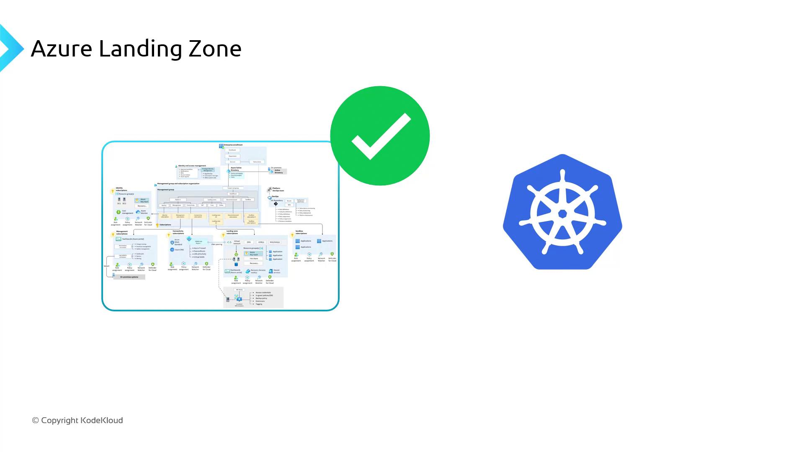
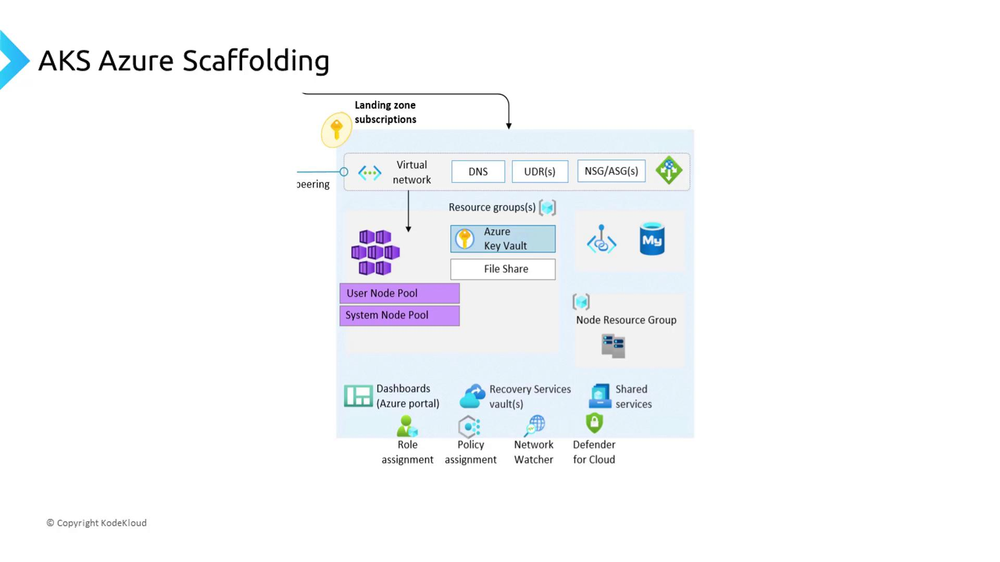

# Create a single Azure SQL Database
az sql db create \
  --resource-group myRG \
  --server mySqlServer \
  --name myDatabase \
  --service-objective S0
```

<Callout icon="lightbulb">
  Azure SQL Database Hyperscale supports up to 100 TB of storage and rapid auto-scaling—ideal for unpredictable workloads.
</Callout>

## Azure Database for Open Source Relational Engines

Azure’s managed services for MySQL, MariaDB, and PostgreSQL deliver community-driven engines with enterprise features:

| Engine         | Deployment Model         | High Availability | Scaling Options            |
| -------------- | ------------------------ | ----------------- | -------------------------- |
| **MySQL**      | Single Server            | Zone redundant    | Vertical and read replicas |
| **MariaDB**    | Single Server            | Zone redundant    | Vertical scaling           |
| **PostgreSQL** | Single & Flexible Server | Built-in HA       | Read replicas, burst       |

**Quickstart: Deploy PostgreSQL Flexible Server**

```bash theme={null}
az postgres flexible-server create \
  --resource-group myRG \
  --name myFlexServer \
  --location eastus \
  --tier Burstable \
  --storage-size 128
```

## Azure Cosmos DB

Azure Cosmos DB is a fully managed, globally distributed NoSQL database service with multi-model support and five well-defined consistency levels:

* **Core (SQL) API** for schemaless JSON.
* **MongoDB API** for wire-protocol compatibility.
* **Gremlin API** for graph data models.
* **Cassandra API** for wide-column workloads.
* **Table API** for key–value storage.

<Callout icon="triangle-alert">
  Selecting a consistency level has cost and performance implications. Review [Consistency levels in Azure Cosmos DB](https://docs.microsoft.com/azure/cosmos-db/consistency-levels) before production deployments.
</Callout>

### Global Distribution & Throughput

```json theme={null}
{
  "location": "East US",
  "locations": [
    { "locationName": "East US", "failoverPriority": 0 },
    { "locationName": "West Europe", "failoverPriority": 1 }
  ],
  "databaseThroughput": 400
}
```

## Links and References

* [Azure SQL Database Documentation](https://docs.microsoft.com/azure/azure-sql/)
* [Azure Database for MySQL](https://docs.microsoft.com/azure/mysql/)
* [Azure Database for PostgreSQL](https://docs.microsoft.com/azure/postgresql/)
* [Azure Cosmos DB Overview](https://docs.microsoft.com/azure/cosmos-db/)

<CardGroup>
  <Card title="Watch Video" icon="video" href="https://learn.kodekloud.com/user/courses/azure-kubernetes-service/module/4a7168ba-8262-47d0-a9de-7a4342b0b0f6/lesson/198e355c-e2bb-40bd-84c3-5f649d9c5960" />
</CardGroup>


# Azure Landing Zone

Source: https://notes.kodekloud.com/docs/Azure-Kubernetes-Service/Just-Enough-Azure-for-AKS/Azure-Landing-Zone/page

Azure Landing Zone provides a scalable framework for building compliant cloud infrastructure tailored to organizational standards before deploying workloads.

Azure Scaffolding—formally known as the Azure Landing Zone—delivers a repeatable, compliant, and scalable framework for building your cloud infrastructure to meet organizational standards. While each enterprise customizes its landing zone, the core goal remains the same: establish foundational services before deploying workloads.

<Frame>
  
</Frame>

<Callout icon="lightbulb">
  An Azure Landing Zone isn’t one-size-fits-all. Tailor networking, identity, and security controls to align with your company’s policies and compliance requirements.
</Callout>

## Key Infrastructure Domains

Think of a landing zone as the infrastructure “blueprint” for your cloud environment—much like a city plan that must exist before any buildings go up. Core areas include:

* **Networking**: Virtual networks and subnets create the “roads” that connect your resources.
* **Identity & Access**: Azure Active Directory, role-based access controls, and managed identities provision secure access.
* **Security & Governance**: Azure Policy, Blueprints, and resource locks enforce organizational standards, similar to building codes.
* **Monitoring & Operations**: Azure Monitor, Log Analytics, and automation scripts collect telemetry and handle incident response.
* **Cost Management**: Budgets, chargeback rules, and tagging strategies help track and optimize spend.

### Landing Zone Domains at a Glance

| Domain                                 | Purpose                                      | Azure Service Examples                                 |
| -------------------------------------- | -------------------------------------------- | ------------------------------------------------------ |
| Identity & Access Management           | Secure authentication and authorization      | Azure AD, Privileged Identity Management (PIM)         |
| Network Topology & Connectivity        | Private and hybrid connectivity              | Azure Virtual Network, VPN Gateway, ExpressRoute       |
| Resource Organization & Tagging        | Logical grouping and billing                 | Resource Groups, Management Groups, Tag Policies       |
| Security Controls & Policy Enforcement | Compliance enforcement and threat protection | Azure Policy, Azure Security Center                    |
| Governance & Compliance Auditing       | Continuous compliance monitoring             | Azure Blueprints, Compliance Manager                   |
| Monitoring, Logging & Diagnostics      | Health checks, alerts, and telemetry         | Azure Monitor, Log Analytics, Application Insights     |
| Cost Management & Chargeback           | Budgeting and cost allocation                | Azure Cost Management, Budgets, Tags                   |
| Automation & DevOps Integration        | CI/CD pipelines and infrastructure as code   | Azure DevOps, GitHub Actions, ARM Templates, Terraform |

<Callout icon="triangle-alert">
  Skipping proper scaffolding can lead to inconsistent deployments and security gaps. Always validate your landing zone against Azure’s Well-Architected Framework.
</Callout>

## AKS-Specific Landing Zone

When deploying Azure Kubernetes Service (AKS), you’ll extend the general landing zone with AKS-specific scaffolding. This ensures that:

* Virtual networks and subnets are preconfigured for pod-to-pod and pod-to-service traffic.
* Route tables, network security groups (NSGs), and Azure Firewall rules enforce network segmentation.
* Managed identities and Azure Key Vault integrate for secure secret management.
* Log and metric pipelines feed into Azure Monitor and a centralized SIEM for observability.

<Frame>
  
</Frame>

By leveraging an AKS landing zone, your clusters gain predictable connectivity, robust security controls, and seamless integration with other Azure services—accelerating your path to production.

***

## Links and References

* [Azure Landing Zones Overview](https://learn.microsoft.com/azure/cloud-adoption-framework/landing-zones/overview)
* [Azure Kubernetes Service (AKS) Documentation](https://learn.microsoft.com/azure/aks/)
* [Azure Well-Architected Framework](https://learn.microsoft.com/azure/architecture/framework/)

<CardGroup>
  <Card title="Watch Video" icon="video" href="https://learn.kodekloud.com/user/courses/azure-kubernetes-service/module/4a7168ba-8262-47d0-a9de-7a4342b0b0f6/lesson/2faef872-a862-48a6-9de6-42e1e545817d" />
</CardGroup>
