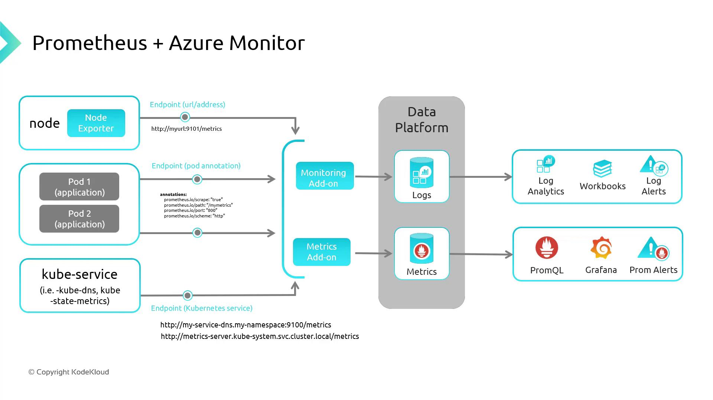
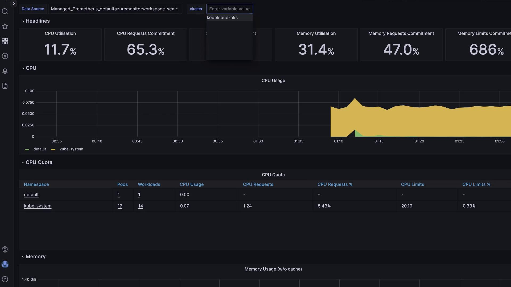

# Verify AMA deployments
kubectl get daemonset ama-logs -n kube-system
kubectl get replicaset ama-logs-rs -n kube-system

# Create test namespace
kubectl create namespace containerinsightstest
kubectl config set-context --current --namespace=containerinsightstest

# Start an interactive shell pod
kubectl run test-shell --rm -it --image=ubuntu -- bash
```

Inside the `test-shell` pod:

```bash theme={null}
apt update && apt install -y stress
stress --cpu 10
```

This generates 10 CPU workers, driving node CPU usage upward. In the portal, return to **Container Insights > Cluster**, enable live updates, and watch the CPU graph spike.

## Viewing Node and Container Details

Within Container Insights:

* **Nodes** tab: Displays per-node CPU/memory metrics. The stressed node will be easily identifiable.
* **Containers** tab: Lists every container and its performance metrics.

Click on `test-shell` to view its live status, console output, and event timeline:

```text theme={null}
4 mins ago [Pod] [test-shell] Pulling image "ubuntu"
4 mins ago [Pod] [test-shell] Pulled: Successfully pulled image "ubuntu" in 1.80s
4 mins ago [Pod] [test-shell] Created: Created container test-shell
4 mins ago [Pod] [test-shell] Started: Started container test-shell
243 secs ago [Pod] [test-shell] Scheduled: Assigned to aks-agentpool-77882287-vmss000000
```

## Cost Considerations

Azure Monitor charges based on the volume of data ingested into Log Analytics. Enabling Managed Prometheus increases ingestion volume, and Azure Managed Grafana incurs additional per-user costs.

<Callout icon="lightbulb">
  Review your ingestion rates and retention settings in your Log Analytics workspace to optimize costs.
</Callout>

## Integrating Prometheus and Grafana

Azure Monitor for Containers can natively scrape Prometheus endpoints—no self-hosted server needed. Expose your metrics endpoint to AMA, and configure PromQL alerts.

| Component  | Purpose                                            |
| ---------- | -------------------------------------------------- |
| Prometheus | Pull-based metric collection and querying (PromQL) |
| Grafana    | Dashboarding and multi-source alerting             |

<Frame>
  
</Frame>

If you enabled Grafana during cluster creation:

1. Open the Grafana resource in the Azure portal.
2. Copy the **Instance URL** and sign in with Azure AD.
3. Browse pre-built Azure dashboards under **Dashboards**.

<Frame>
  
</Frame>

Thank you for learning how to leverage Container Insights for AKS. For more details, see [Azure Monitor for Containers documentation](https://docs.microsoft.com/azure/azure-monitor/containers/container-insights-overview).

<CardGroup>
  <Card title="Watch Video" icon="video" href="https://learn.kodekloud.com/user/courses/azure-kubernetes-service/module/5b5575f8-6539-491b-9d85-6f0ae23714b5/lesson/7200f0fb-def6-40c0-9fe2-39e272f32189" />
</CardGroup>


# Summary

Source: https://notes.kodekloud.com/docs/Azure-Kubernetes-Service/Observability/Summary/page

This article compares Azure Container Insights and Prometheus + Grafana for monitoring Azure Kubernetes Service.

In this lesson, we compared two leading monitoring solutions for Azure Kubernetes Service (AKS):

* **Azure Container Insights** – an integrated, managed service in Azure Monitor
* **Prometheus + Grafana** – an open-source monitoring stack for full control

Choosing the right approach comes down to your priorities: ease of setup, customization depth, maintenance overhead, and cost.

***

## 1. Azure Container Insights

Azure Container Insights delivers end-to-end visibility into your AKS clusters with minimal configuration. Key capabilities include:

* Automatic collection of CPU, memory, and network metrics
* Container-level logs and performance telemetry
* Built-in queries and visualizations in Azure Monitor
* Seamless integration with Azure Alerts and Workbooks

<Callout icon="lightbulb">
  Container Insights is fully managed by Azure Monitor. You incur data ingestion and retention charges, but you avoid operating your own monitoring infrastructure.
</Callout>

Learn more: [Container Insights overview](https://learn.microsoft.com/azure/azure-monitor/containers/container-insights-overview)

***

## 2. Prometheus + Grafana

The Prometheus + Grafana stack is a popular open-source alternative that emphasizes flexibility:

* **Prometheus**\
  • Scrapes time-series metrics from AKS, nodes, and custom exporters\
  • Built-in Alertmanager for defining alert rules and notifications

* **Grafana**\
  • Connects to Prometheus (and other datasources)\
  • Provides interactive dashboards with rich visualizations\
  • Supports annotations, templating, and provisioning

<Callout icon="triangle-alert">
  Running Prometheus and Grafana requires provisioning, scaling, and maintaining storage for long-term metrics. Ensure you plan for high-availability and backup.
</Callout>

Explore more:

* [Prometheus documentation](https://prometheus.io/docs/introduction/overview/)
* [Grafana documentation](https://grafana.com/docs/)

***

## 3. Feature Comparison

| Feature          | Container Insights                              | Prometheus + Grafana                              |
| ---------------- | ----------------------------------------------- | ------------------------------------------------- |
| Setup Complexity | Low (Azure-managed)                             | Medium to high (self-managed)                     |
| Customization    | Azure Monitor queries & Workbooks               | Full Grafana dashboard and alerting customization |
| Maintenance      | Managed by Azure                                | You manage upgrades, scaling, and storage         |
| Data Retention   | Default 30 days (configurable in Azure Monitor) | Configurable via remote write or object storage   |
| Alerting         | Azure Alerts integration                        | Prometheus Alertmanager and Grafana Alerting      |
| Cost Model       | Pay for data ingestion & retention              | Infrastructure + storage costs (or Grafana Cloud) |

***

## 4. Next Steps

In the next module, we will survey all Azure platforms capable of hosting container workloads, including:

* Azure Container Instances
* Azure App Service for Containers
* Azure Red Hat OpenShift

Stay tuned!

***

## Links and References

* [Azure Kubernetes Service (AKS)](https://azure.microsoft.com/services/kubernetes-service/)
* [Azure Monitor Documentation](https://learn.microsoft.com/azure/azure-monitor/)
* [Docker Hub](https://hub.docker.com/)
* [Terraform Registry](https://registry.terraform.io/)

<CardGroup>
  <Card title="Watch Video" icon="video" href="https://learn.kodekloud.com/user/courses/azure-kubernetes-service/module/5b5575f8-6539-491b-9d85-6f0ae23714b5/lesson/95efa405-574a-4b86-a046-e27a197f4d36" />
</CardGroup>
