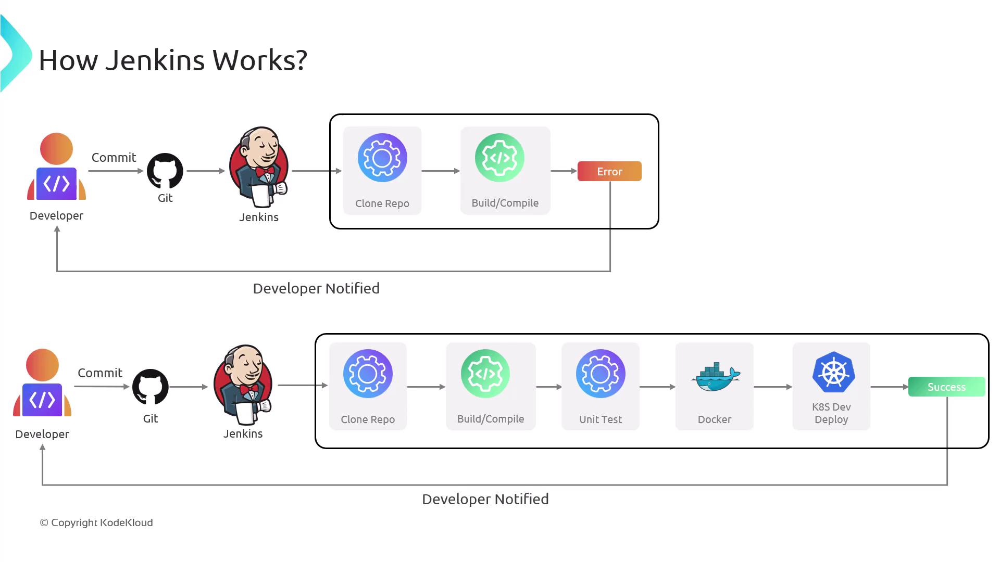
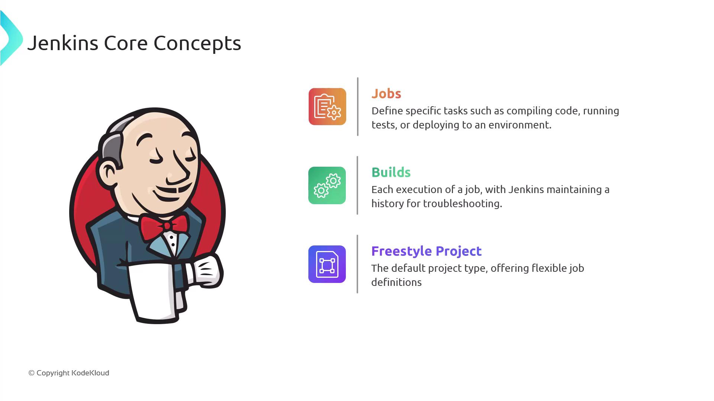
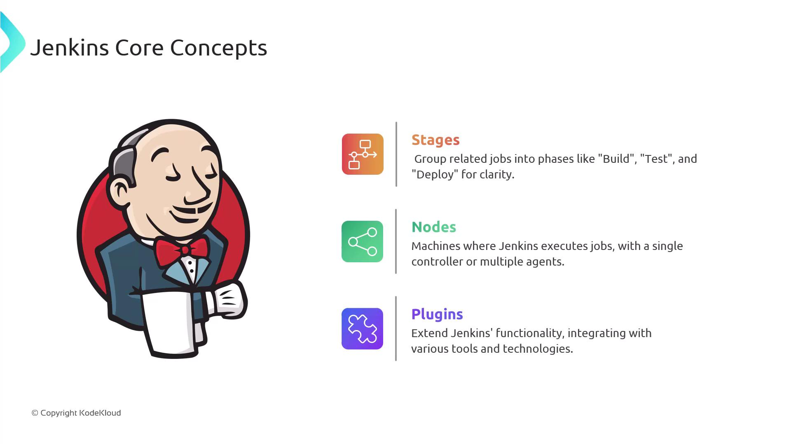
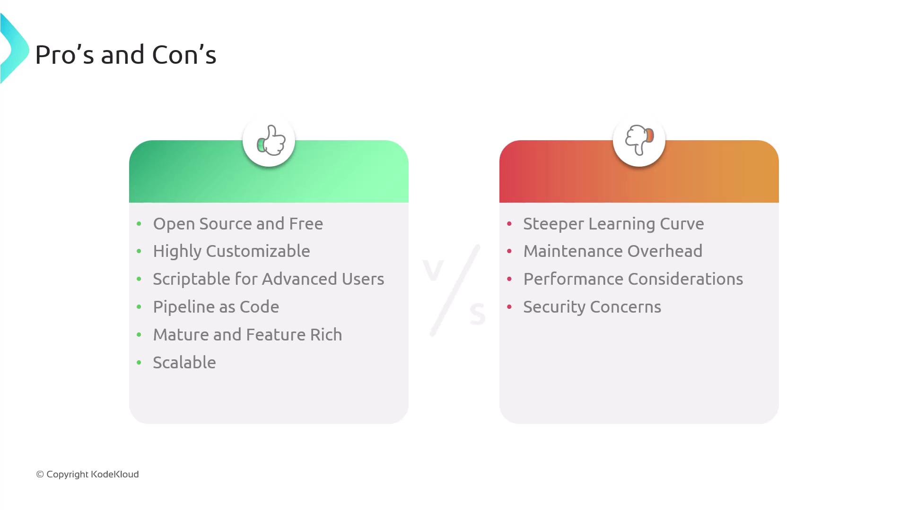

# Introduction to Jenkins

Source: https://notes.kodekloud.com/docs/Certified-Jenkins-Engineer/Introduction-and-Basics/Introduction-to-Jenkins/page

Jenkins is an open-source automation server that powers continuous integration and delivery, automating software pipelines from building to deploying applications.

Jenkins is an open-source automation server that powers continuous integration and delivery (CI/CD). It automates your software pipeline—from building and testing to deploying applications—every time you push code. By integrating with popular tools like Git, Docker, and Kubernetes, Jenkins helps teams deliver high-quality software faster and with fewer manual steps.

<Callout icon="lightbulb">
  Jenkins supports over 1,800 plugins, making it easy to connect with version control systems, build tools, testing frameworks, and cloud providers.
</Callout>

## How Jenkins Works

1. **Trigger**\
   A developer pushes code changes to a Git repository (e.g., GitHub, GitLab, Bitbucket).
2. **Detection**\
   Jenkins polls the repository or listens for webhooks.
3. **Checkout & Build**\
   The server clones the latest code, compiles it, and runs unit tests.
4. **Test & Report**\
   If tests fail, Jenkins notifies the team via email, Slack, or other channels.
5. **Deploy**\
   On success, Jenkins can package the artifact into a Docker image and deploy it to a Kubernetes cluster or EC2 instance.
6. **Feedback**\
   Build and deployment statuses are displayed in the Jenkins UI and communicated back to the team.

<Frame>
  
</Frame>

## Core Concepts

| Concept           | Description                                                                                                       | Example                                          |
| ----------------- | ----------------------------------------------------------------------------------------------------------------- | ------------------------------------------------ |
| Job               | A task definition for building, testing, or deploying code. Each run is a **build**, tracked with status history. | Compile a Java project or run a shell script.    |
| Freestyle Project | A GUI-based job type that lets you drag-and-drop build steps and post-build actions.                              | Combine Maven build, JUnit tests, and archiving. |
| Pipeline          | A Groovy-based script in a `Jenkinsfile` that defines multi-stage workflows as code.                              | `pipeline { stages { stage('Test') { ... }}}`    |
| Stage             | A logical block within a pipeline (e.g., Build, Test, Deploy) that visualizes progress.                           | `stage('Deploy') { steps { ... } }`              |
| Node              | The machine where Jenkins executes tasks. A **controller** orchestrates, and **agents** run jobs concurrently.    | On-premise VM or Kubernetes pod.                 |
| Plugin            | An extension to integrate external tools or add functionality.                                                    | Git, Docker, Slack, AWS, Azure, etc.             |

<Frame>
  
</Frame>

<Frame>
  
</Frame>

## Pros and Cons

### Pros

* Free and open-source with no licensing fees.
* Huge plugin ecosystem for SCM, containers, cloud, and testing.
* **Pipeline as Code**: Version-controlled `Jenkinsfile` for reproducible builds.
* Customizable with Groovy scripts and shared libraries.
* Scalable through distributed agents and cloud-based executors.
* Rich reporting: parallel builds, artifacts, test results, and notifications.

### Cons

* The UI and configuration options can be complex for new users.
* Requires regular maintenance—core updates and plugin compatibility checks.
* A single server may become a bottleneck; additional agents are needed for heavy workloads.
* Security is user-managed: choose trusted plugins, apply patches, and enforce role-based access.
* Unlike hosted solutions (e.g., [GitHub Actions](https://github.com/features/actions), [GitLab CI/CD](https://docs.gitlab.com/ee/ci/)), you handle hosting and scalability.

<Callout icon="triangle-alert">
  Ensure you follow security best practices: upgrade Jenkins regularly, limit plugin installations, and configure proper access controls.
</Callout>

<Frame>
  
</Frame>

***

## Further Reading & References

* [Jenkins Official Documentation](https://www.jenkins.io/doc/)
* [Jenkins Pipeline Syntax](https://www.jenkins.io/doc/book/pipeline/syntax/)
* [Continuous Integration with Jenkins](https://www.jenkins.io/solutions/ci/)
* [Docker Hub](https://hub.docker.com/)
* [Kubernetes Documentation](https://kubernetes.io/docs/)
* [Terraform Registry](https://registry.terraform.io/)

<CardGroup>
  <Card title="Watch Video" icon="video" href="https://learn.kodekloud.com/user/courses/certified-jenkins-engineer/module/2e8ea9bb-e5bb-428e-85d9-89f2eb816adb/lesson/f279bd95-d2d0-4e42-bed0-adbbf25e056d" />
</CardGroup>
