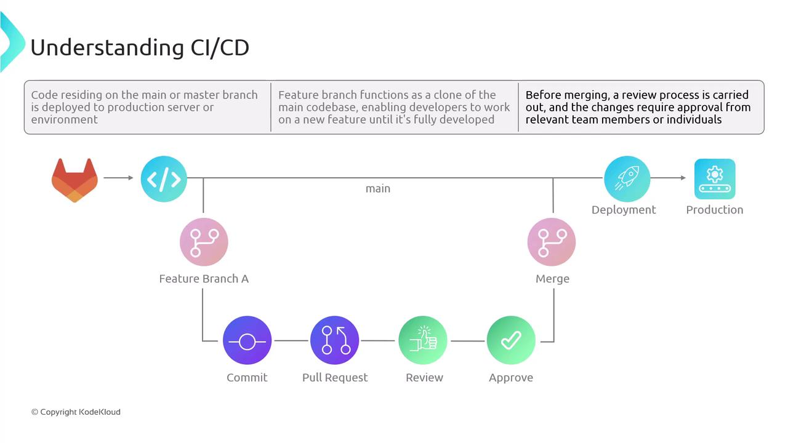
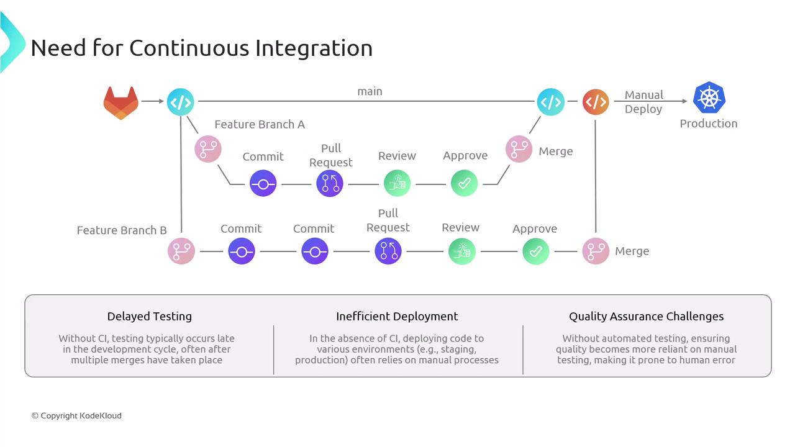
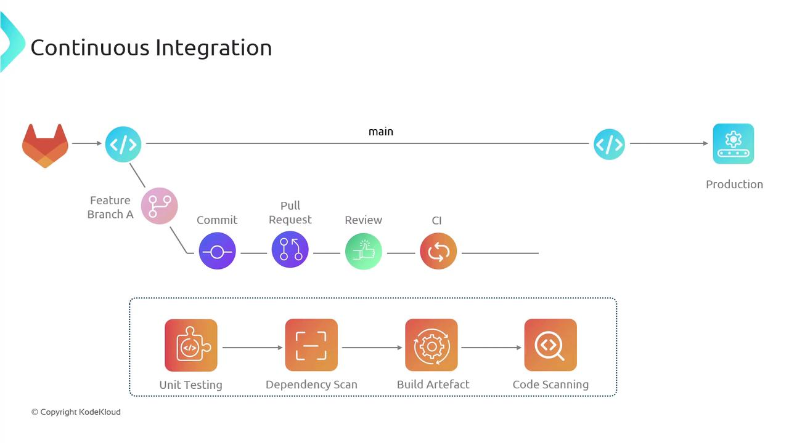
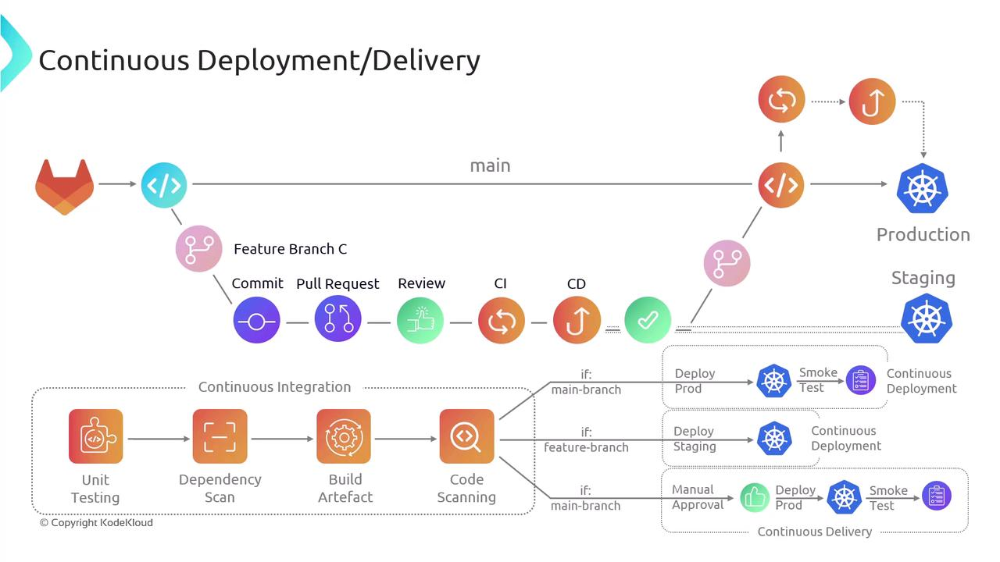

# Basics of CICD

Source: https://notes.kodekloud.com/docs/Certified-Jenkins-Engineer/Introduction-and-Basics/Basics-of-CICD/page

This article explains the concepts and workflows of Continuous Integration and Continuous Delivery (CI/CD) in software development.

Continuous Integration and Continuous Delivery (CI/CD) automate the process of integrating code changes, running tests, and deploying applications. In most projects, source code is stored in a Git repository for version control. While we use **Gitty** in this guide, these concepts apply equally to [GitHub](https://github.com), [GitLab](https://gitlab.com), [Bitbucket](https://bitbucket.org), or any Git-based service.

<Callout icon="lightbulb">
  You can substitute **Gitty** with your preferred Git hosting platform without altering the workflows described here.
</Callout>

Developers branch from the main (or master) line to add features or fix bugs. After completing changes, a pull request (or merge request) initiates a code review. Once approved, the code merges back into **main** and deploys to production—either manually or automatically.

<Frame>
  
</Frame>

## Risks of Manual Integration Workflows

Delaying integration until merge time can introduce stability issues. Below are common challenges in projects without automated CI/CD:

| Challenge              | Impact                                            | Automated Solution                                    |
| ---------------------- | ------------------------------------------------- | ----------------------------------------------------- |
| Delayed Testing        | Bugs are detected late, making fixes more complex | Early automated unit and integration tests            |
| Inefficient Deployment | Configuration drift and inconsistent environments | Automated deployments to dev, staging, and production |
| QA Bottlenecks         | Manual QA overload and human error                | Continuous test suites in the pipeline                |

<Frame>
  
</Frame>

## Continuous Integration (CI)

Continuous Integration automates the frequent merging and testing of code changes. Consider this scenario:

1. Developer 1 creates **feature-branch A**, commits updates, and opens a pull request into **main**.
2. An automated CI pipeline triggers on the pull request, executing:
   * Unit tests
   * Dependency scanning
   * Artifact building
   * Vulnerability scanning
3. If any stage fails, the pipeline stops. The developer fixes issues, pushes updates, and the pipeline reruns.
4. Once all tests pass, the pull request is approved and merged. The CI pipeline may run again on **main** to validate combined changes.

A similar flow applies to **feature-branch B**, ensuring that combined changes integrate smoothly without regressions. This continuous loop of merging, testing, and validating contributions is the essence of Continuous Integration.

| CI Stage               | Purpose                                | Tools / Examples                      |
| ---------------------- | -------------------------------------- | ------------------------------------- |
| Unit Testing           | Verify individual code units           | `pytest`, `JUnit`                     |
| Dependency Scanning    | Detect vulnerable libraries            | `npm audit`, `OWASP Dependency-Check` |
| Artifact Building      | Package code into deployable artifacts | `Docker`, `Maven`                     |
| Security Code Scanning | Identify security vulnerabilities      | `SonarQube`, `Snyk`                   |

<Frame>
  
</Frame>

<Callout icon="triangle-alert">
  Always rerun your CI pipeline after merging into **main**. Skipping this step can introduce integration bugs that are harder to trace.
</Callout>

## Continuous Delivery vs. Continuous Deployment

After CI succeeds, many teams still deploy manually. By extending the pipeline with CD stages, you can automate deployments to staging and production:

* **Continuous Delivery**\
  CI triggers an automated deployment to a staging environment. Production release requires a manual approval step to minimize risk and coordinate releases.

* **Continuous Deployment**\
  A successful CI run on **main** automatically deploys to production without human intervention, delivering end-to-end automation from commit to release.

In practice, feature branches can be deployed automatically to staging for live testing. Once tests pass in staging and approvals are granted, the same artifacts promote to production—completing a robust CI/CD process.

<Frame>
  
</Frame>

## Links and References

* [CI/CD Overview – Azure DevOps](https://docs.microsoft.com/azure/devops/learn/what-is-ci-cd)
* [Jenkins Documentation](https://www.jenkins.io/doc/)
* [Git Basics](https://git-scm.com/book/en/v2)
* [Continuous Delivery vs Continuous Deployment](https://martinfowler.com/bliki/ContinuousDelivery.html)

<CardGroup>
  <Card title="Watch Video" icon="video" href="https://learn.kodekloud.com/user/courses/certified-jenkins-engineer/module/2e8ea9bb-e5bb-428e-85d9-89f2eb816adb/lesson/ed94dad8-6a39-4475-8c47-47ba4719b357" />
</CardGroup>
