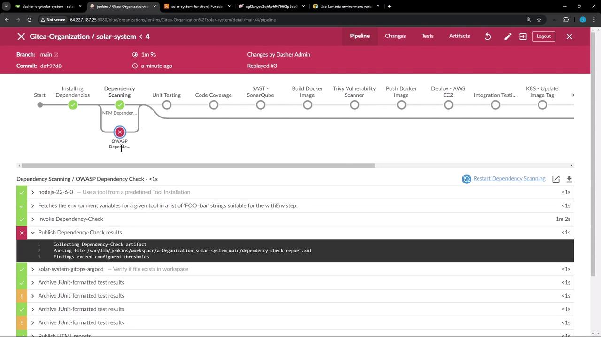
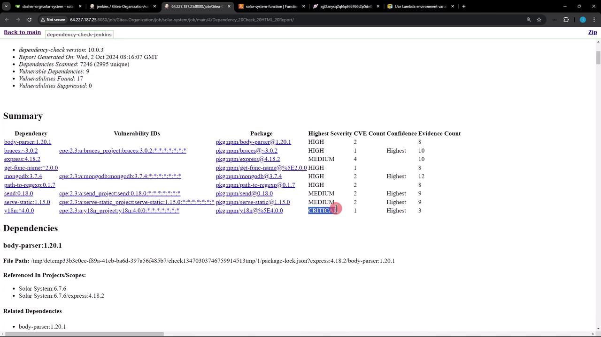
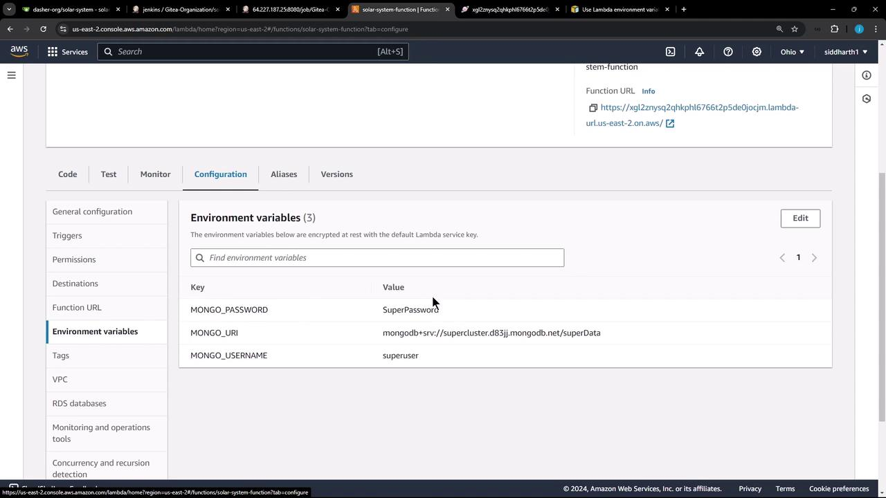
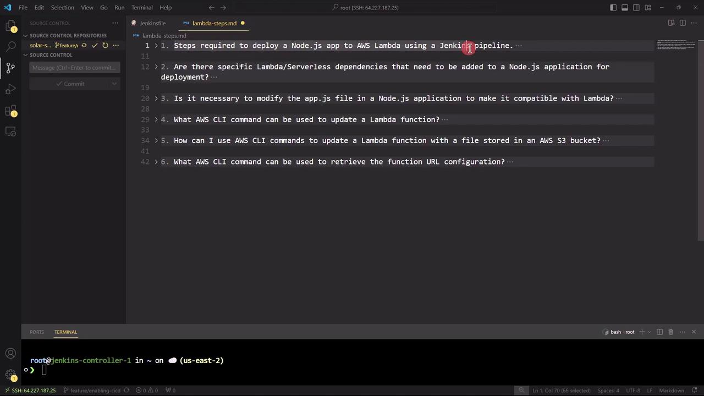

# Update environment variables
aws lambda update-function-configuration \
  --function-name my-function \
  --environment "Variables={BUCKET=amzn-s3-demo-bucket,KEY=file.txt}"

# Confirm the update
aws lambda get-function-configuration \
  --function-name my-function
```

## Integrating with Jenkins

We’ll extend the `Jenkinsfile` to:

1. Zip application code
2. Upload the ZIP to S3
3. Update Lambda environment variables
4. Deploy new code to Lambda

Below is a sample pipeline and a breakdown of each stage.

### Sample Jenkinsfile

```groovy theme={null}
pipeline {
  agent any

  environment {
    MONGO_URI          = "mongodb+srv://supercluster.d83jj.mongodb.net/superData"
    MONGO_DB_CREDS     = credentials('mongo-db-credentials')
    MONGO_USERNAME     = credentials('mongo-db-username')
    MONGO_PASSWORD     = credentials('mongo-db-password')
    SONAR_SCANNER_HOME = tool 'sonarqube-scanner-610'
    GITEA_TOKEN        = credentials('gitea-api-token')
  }

  stages {
    stage('Installing Dependencies') { steps { /* ... */ } }
    stage('Dependency Scanning')     { steps { /* ... */ } }
    stage('Unit Testing')            { steps { /* ... */ } }
    stage('Code Coverage')           { steps { /* ... */ } }
    stage('Deploy to AWS Lambda') {
      steps {
        // 1. Zip application code
        sh '''
          zip -qr solar-system-lambda-${BUILD_ID}.zip app* package* index.html node*
          ls -ltr solar-system-lambda-${BUILD_ID}.zip
        '''

        // 2. Upload ZIP to S3
        s3Upload(
          file: "solar-system-lambda-${BUILD_ID}.zip",
          bucket: 'solar-system-lambda-bucket'
        )

        // 3. Update Lambda configuration
        aws lambda update-function-configuration \
          --function-name solar-system-function \
          --environment '{"Variables":{"MONGO_USERNAME":"${MONGO_USERNAME}","MONGO_PASSWORD":"${MONGO_PASSWORD}","MONGO_URI":"${MONGO_URI}"}}'

        // 4. Deploy new code
        aws lambda update-function-code \
          --function-name solar-system-function \
          --s3-bucket solar-system-lambda-bucket \
          --s3-key solar-system-lambda-${BUILD_ID}.zip
      }
    }
  }
}
```

### Pipeline Stages Overview

| Stage                   | Purpose                                               |
| ----------------------- | ----------------------------------------------------- |
| Installing Dependencies | Install project dependencies (e.g., NPM, Maven)       |
| Dependency Scanning     | Run `npm audit` and OWASP Dependency Check            |
| Unit Testing            | Execute unit tests                                    |
| Code Coverage           | Generate coverage reports                             |
| Deploy to AWS Lambda    | Zip code, upload to S3, update configuration and code |

## Handling OWASP Dependency Check Failures

If the OWASP scan reports critical vulnerabilities, you can configure the publisher to continue the build:

```groovy theme={null}
stage('Dependency Scanning') {
  parallel {
    stage('NPM Dependency Audit') {
      steps {
        // npm audit steps
      }
    }
    stage('OWASP Dependency Check') {
      steps {
        dependencyCheck additionalArguments: '''
          --scan './'
          --out './'
          --format 'ALL'
          --disableYarnAudit
          --prettyPrint
        ''', odcInstallation: 'OWASP-DepCheck-10'
        dependencyCheckPublisher failedTotalCritical: 1, pattern: 'dependency-check-report.xml', stopBuild: false
      }
    }
  }
}
```

<Callout icon="triangle-alert">
  Setting `stopBuild: false` allows the pipeline to proceed despite critical vulnerabilities. Be sure to review the detailed report and address issues in your next sprint.
</Callout>

Pipeline logs will show any OWASP failures and continue execution.

<Frame>
  
</Frame>

<Frame>
  
</Frame>

## Verifying on AWS Lambda Console

Once the pipeline succeeds, open the AWS Lambda console and navigate to the **Configuration** tab to confirm the new environment variables:

<Frame>
  
</Frame>

## Testing the Application

Invoke your function’s endpoint or run a test to ensure it’s using the updated variables and code:

```json theme={null}
{
  "status": "live"
}
```

If you receive a `200 OK` response with `{"status":"live"}`, your Lambda update was successful.

***

## Links and References

* [AWS CLI Command Reference: update-function-configuration][aws-cli-ref]
* [Jenkins Pipeline Syntax](https://www.jenkins.io/doc/book/pipeline/syntax/)
* [OWASP Dependency Check](https://owasp.org/www-project-dependency-check/)

[aws-cli-ref]: https://docs.aws.amazon.com/cli/latest/reference/lambda/update-function-configuration.html

<CardGroup>
  <Card title="Watch Video" icon="video" href="https://learn.kodekloud.com/user/courses/certified-jenkins-engineer/module/7e65cc00-b745-498e-8351-c294cbe958ec/lesson/3758be02-627a-49c4-9b16-b470ccfff42b" />
</CardGroup>


# Demo Using GenAI to Generate Steps for Lambda Deployment

Source: https://notes.kodekloud.com/docs/Certified-Jenkins-Engineer/AWS-Lambda-and-Advanced-Deployment-Techniques/Demo-Using-GenAI-to-Generate-Steps-for-Lambda-Deployment/page

This article outlines steps to deploy a Node.js application to AWS Lambda using a Jenkins pipeline, leveraging Microsoft Copilot for guidance.

Before automating AWS Lambda deployment with a Jenkins pipeline, it’s crucial to adapt a Node.js application (originally designed for Docker on EC2 and Kubernetes) to run seamlessly in a serverless environment. Instead of sifting through extensive AWS documentation, we used Microsoft Copilot to outline high-level steps. Below are the questions we asked and the concise answers that guided our Lambda-ready changes and pipeline design.

***

## 1. What are the steps required to deploy a Node.js application to AWS Lambda using a Jenkins pipeline?

<Frame>
  
</Frame>

Copilot mapped out these key stages:

1. Configure AWS and Jenkins
   * Ensure AWS CLI is installed and credentials are set:\
     `aws configure`
   * Install Jenkins plugins: Git, NodeJS, AWS Lambda, Pipeline

2. Install Dependencies
   ```bash theme={null}
   npm install
   ```

3. Run Tests (if applicable)
   ```bash theme={null}
   npm test
   ```

4. Package the Application
   ```bash theme={null}
   zip -r my-node-app.zip index.js node_modules
   ```

5. Deploy to Lambda
   ```bash theme={null}
   aws lambda create-function \
     --function-name my-node-app \
     --zip-file fileb://my-node-app.zip \
     --handler index.handler \
     --runtime nodejs14.x \
     --role arn:aws:iam::<AWS_ACCOUNT_ID>:role/<ROLE_NAME>
   ```

6. Define Jenkins Pipeline (Jenkinsfile)
   ```groovy theme={null}
   pipeline {
     agent any
     stages {
       stage('Checkout') { steps { git url: 'https://repo-url.git' } }
       stage('Install')  { steps { sh 'npm install' } }
       stage('Test')     { steps { sh 'npm test' } }
       stage('Package')  { steps { sh 'zip -r my-node-app.zip index.js node_modules' } }
       stage('Deploy') {
         steps {
           withAWS(credentials: 'aws-creds') {
             sh '''
             aws lambda update-function-code \
               --function-name my-node-app \
               --zip-file fileb://my-node-app.zip \
               --publish
             '''
           }
         }
       }
     }
   }
   ```

<Callout icon="triangle-alert">
  Ensure that your Jenkins `aws-creds` credential has the necessary IAM permissions to create and update Lambda functions.
</Callout>

To summarize, here’s a quick overview of each pipeline stage:

| Stage    | Description                                   | Command                                                                                                    |
| -------- | --------------------------------------------- | ---------------------------------------------------------------------------------------------------------- |
| Checkout | Clone the Git repository                      | `git clone https://repo-url.git`                                                                           |
| Install  | Install Node.js dependencies                  | `npm install`                                                                                              |
| Test     | Run unit and integration tests                | `npm test`                                                                                                 |
| Package  | Archive the application code and dependencies | `zip -r my-node-app.zip index.js node_modules`                                                             |
| Deploy   | Update AWS Lambda function code               | `aws lambda update-function-code --function-name my-node-app --zip-file fileb://my-node-app.zip --publish` |

***

## 2. Are there any specific Lambda or serverless dependencies to add?

To adapt Express for Lambda’s event-driven model, install these packages:

```bash theme={null}
npm install express serverless-http
