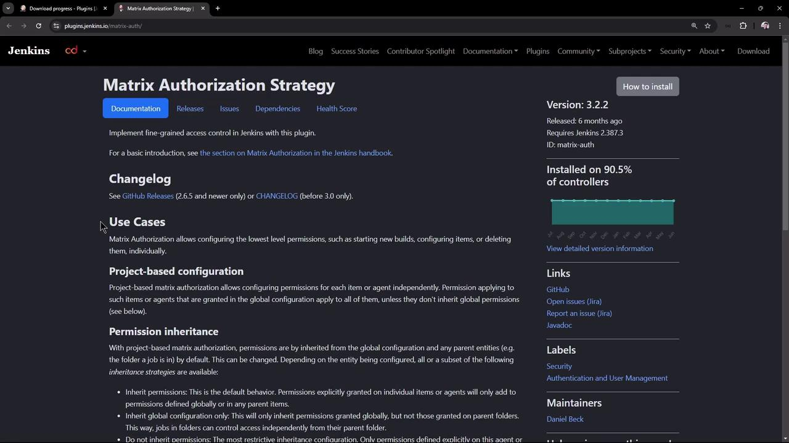
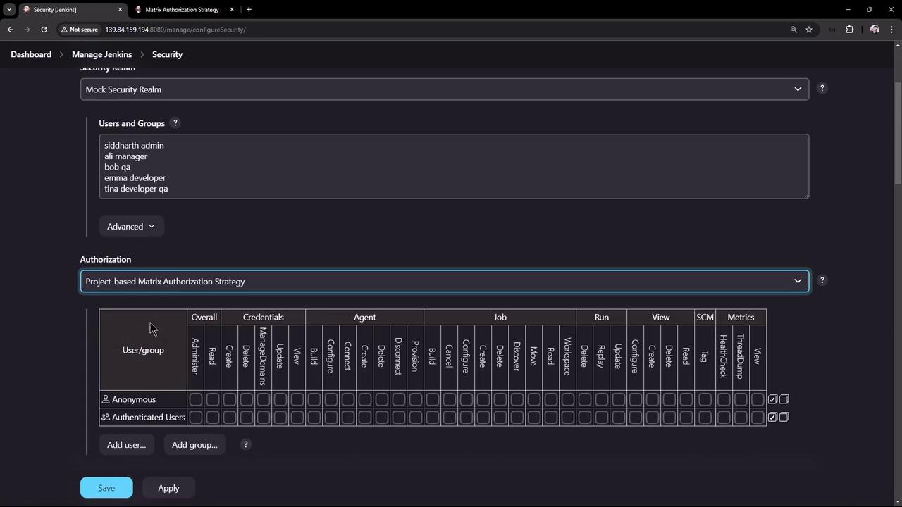
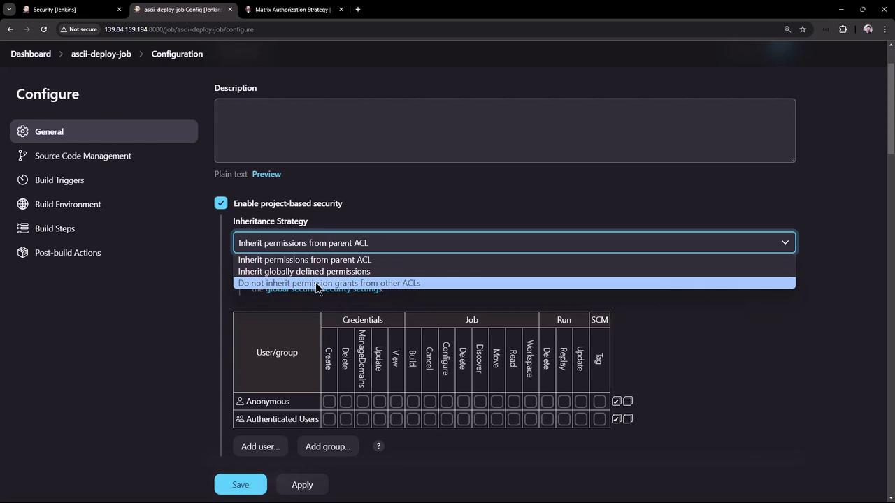
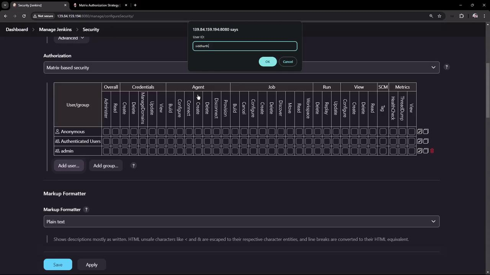
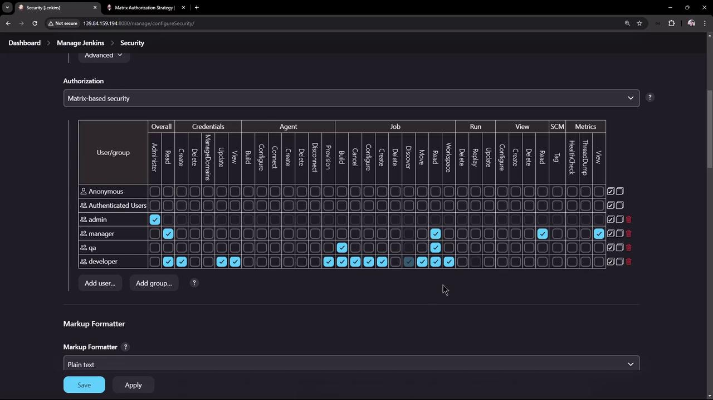
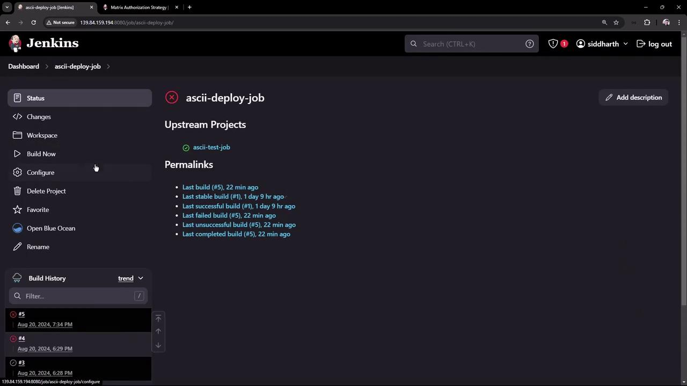
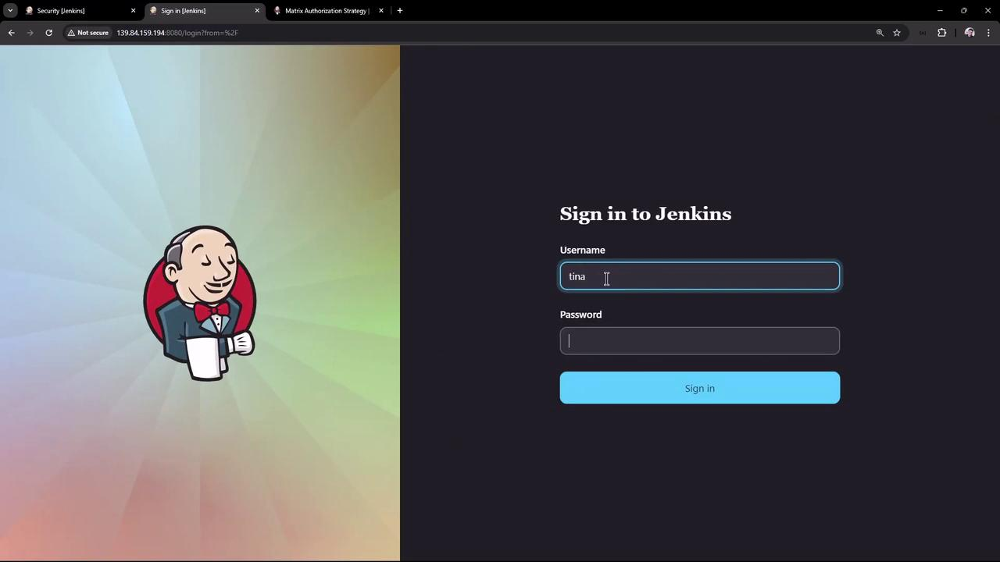

# Example output:
# < X-SSH-Endpoint: localhost:53801
```

Next, add your SSH public key in **Jenkins » People » YourUser » Configure**.

<Callout icon="lightbulb">
  Make sure your SSH key is correctly formatted (RFC4716 or OpenSSH) before pasting into Jenkins.
</Callout>

### List Available Commands

Once SSH is configured, list all CLI commands:

```bash theme={null}
ssh -l username -p 53801 localhost help
```

### Trigger a Job via SSH

Build a job named `hello-kodekloud` and stream console output:

```bash theme={null}
ssh -l username -p 53801 localhost build hello-kodekloud -f -v
```

Sample output:

```bash theme={null}
Started hello-kodekloud #1
Building in workspace /tmp/jenkins/workspace/hello-kodekloud
+ echo Hello KodeKloud
Hello KodeKloud
Finished: SUCCESS
```

***

## Jenkins CLI Client (jenkins-cli.jar)

If SSH isn’t an option, download the `jenkins-cli.jar` from your Jenkins master:

```bash theme={null}
wget http://JENKINS_URL/jnlpJars/jenkins-cli.jar
```

Use HTTP or WebSocket transport:

```bash theme={null}
java -jar jenkins-cli.jar -s http://JENKINS_URL/ -webSocket help
```

Common commands:

```bash theme={null}
# List all jobs
java -jar jenkins-cli.jar -s JENKINS_URL -auth user:APITOKEN list-jobs

# Trigger a build
java -jar jenkins-cli.jar -s JENKINS_URL -auth user:APITOKEN build my-job

# Fetch job configuration (XML)
java -jar jenkins-cli.jar -s JENKINS_URL -auth user:APITOKEN get-job my-job
```

***

## Jenkins REST API

The [Jenkins REST API](https://www.jenkins.io/doc/book/using/remote-access-api/) provides HTTP endpoints for jobs, nodes, plugins, and more.

### Install a Plugin

Use `curl` to install or update plugins:

```bash theme={null}
curl -s -X POST \
  --data '<jenkins><install plugin="git@4.10.0" /></jenkins>' \
  -H 'Content-Type: text/xml' \
  http://JENKINS_URL/pluginManager/installNecessaryPlugins \
  --user admin:${JENKINS_TOKEN}
```

### Authentication Methods

Jenkins supports multiple authentication schemes. Use API tokens to avoid exposing plain passwords.

| Method     | Usage                              | Pros               | Cons                               |
| ---------- | ---------------------------------- | ------------------ | ---------------------------------- |
| Basic Auth | `--user user:password`             | Simple setup       | Exposes credentials in scripts     |
| API Token  | `--user user:APITOKEN`             | Secure, revocable  | Requires token generation per user |
| SSH Key    | SSH transport for CLI (`ssh -l …`) | Key-based security | Needs SSH endpoint enabled in UI   |

<Callout icon="triangle-alert">
  Never commit credentials or API tokens into version control. Use environment variables or secret managers.
</Callout>

***

## References

* [Jenkins CLI Documentation](https://www.jenkins.io/doc/book/managing/cli/)
* [Jenkins Remote Access API](https://www.jenkins.io/doc/book/using/remote-access-api/)
* [Managing Jenkins Plugins](https://www.jenkins.io/doc/book/managing/plugins/)

Use these methods to automate job creation, builds, plugin management, and achieve consistent, repeatable CI/CD processes with Jenkins.

<CardGroup>
  <Card title="Watch Video" icon="video" href="https://learn.kodekloud.com/user/courses/certified-jenkins-engineer/module/4d6d1f39-307c-4fdb-8d2b-834c1650e792/lesson/e4400cdc-9c6b-40aa-823c-e99189d4b354" />
</CardGroup>


# Demo Authorization Matrix Authorization Strategy

Source: https://notes.kodekloud.com/docs/Certified-Jenkins-Engineer/Automation-and-Security/Demo-Authorization-Matrix-Authorization-Strategy/page

Learn to implement fine-grained access control in Jenkins using the Matrix Authorization Strategy plugin through installation, configuration, and validation steps.

Unlock fine-grained access control in Jenkins using the **Matrix Authorization Strategy** plugin. In this tutorial, you’ll learn to:

1. Install the plugin
2. Compare project-based vs global matrix strategies
3. Configure role-based permissions
4. Validate access with sample user accounts

## Prerequisites

* A running Jenkins instance
* Admin credentials (e.g., **Barahalikar Siddharth**)

## 1. Install the Matrix Authorization Strategy Plugin

1. Sign in as **admin**.
2. Navigate to **Manage Jenkins → Manage Plugins → Available**.
3. Search for **Matrix Authorization Strategy** and click **Install without restart**.

This plugin supports both **global** and **project-level** access matrices.

<Frame>
  
</Frame>

## 2. Project-Based Matrix Authorization

1. Go to **Manage Jenkins → Configure Global Security**.
2. Under **Authorization**, select **Project-based Matrix Authorization Strategy** and click **Apply**.
3. Open a job (e.g., *ascii-deploy-job*), choose **Configure**, then enable **Project-based security**.
4. Decide whether to **inherit global permissions** or define a **custom ACL** for this job.

<Frame>
  
</Frame>

<Frame>
  
</Frame>

<Callout icon="lightbulb">
  If you only need instance-wide controls, return to **Configure Global Security** and choose **Matrix-based Security** instead.
</Callout>

## 3. Global Matrix-Based Security

1. Open **Manage Jenkins → Configure Global Security**.
2. Select **Matrix-based Security** in the **Authorization** section.
3. Strip all permissions from **anonymous**. Leave **authenticated** unchecked (we’ll grant *Overall Read* later).
4. Click **Add user or group**, enter each name, and confirm. Jenkins will warn if the user/group doesn’t exist.

<Frame>
  
</Frame>

### 3.1 Define Group Permissions

Configure these four groups:

| Group         | Permissions                                                                                                                                                  |
| ------------- | ------------------------------------------------------------------------------------------------------------------------------------------------------------ |
| **admin**     | Overall → Administer                                                                                                                                         |
| **manager**   | Overall: Read<br />Job: Read<br />View: Read<br />Metrics: Read                                                                                              |
| **QA**        | Job: Read, Build                                                                                                                                             |
| **developer** | Overall: Read<br />Credentials: Create, Update, View<br />Agent: Provision<br />Job: All except Delete<br />View: Create, Read, Configure<br />Metrics: Read |

<Frame>
  
</Frame>

Once permissions are set, click **Save** to apply.

<Frame>
  
</Frame>

## 4. Test Role-Based Access

### 4.1 Admin: Full Control

As **admin**, verify you can view, configure, build, and delete the *ascii-deploy-job*.

<Frame>
  
</Frame>

### 4.2 Tina (QA + Developer)

Log in as **Tina**:

<Frame>
  
</Frame>

* **Jobs**: *Delete* is hidden
* **Credentials**: Create, View, Update (no delete)
* **Manage Jenkins**: Not accessible

### 4.3 Bob (QA Only)

Initially, **Bob** is denied access (no *Overall Read*). To fix:

1. Log in as **admin**.
2. Grant **authenticated** or **QA** the *Overall Read* permission.
3. Re-login as **Bob**.

Now Bob can view and build jobs but cannot delete or manage credentials.

### 4.4 Ali (Manager)

Log in as **Ali** (manager):

* **Overall**: Read
* **Job & View**: Read
* **Metrics**: Read

Ali can open jobs and view logs but cannot build, configure, or delete.

***

You’ve now secured your Jenkins instance with **Matrix Authorization Strategy**. Adjust role permissions as your team and security requirements evolve.

## References

* [Jenkins Authentication and Authorization](https://www.jenkins.io/doc/book/security/authentication/)
* [Matrix Authorization Strategy Plugin](https://plugins.jenkins.io/matrix-auth/)

<CardGroup>
  <Card title="Watch Video" icon="video" href="https://learn.kodekloud.com/user/courses/certified-jenkins-engineer/module/4d6d1f39-307c-4fdb-8d2b-834c1650e792/lesson/62cdc44f-2973-41a4-823b-406b8da0199e" />
</CardGroup>
