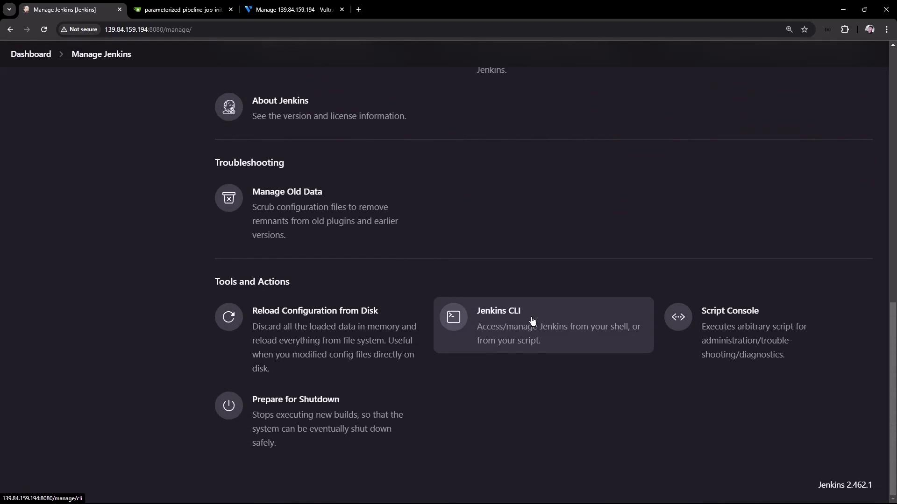

# Demo Jenkins CLI Build a job

Source: https://notes.kodekloud.com/docs/Certified-Jenkins-Engineer/Automation-and-Security/Demo-Jenkins-CLI-Build-a-job/page

This tutorial teaches how to use Jenkins CLI to download, authenticate, and trigger jobs from the terminal for CI/CD automation.

In this tutorial, you’ll learn how to download the Jenkins CLI, authenticate, and trigger jobs directly from your terminal. This approach helps automate deployments and integrate Jenkins into your CI/CD workflows.

## 1. Download the Jenkins CLI JAR

Navigate to **Manage Jenkins → Jenkins CLI** and copy the link to `jenkins-cli.jar`:

<Frame>
  
</Frame>

<Callout icon="lightbulb">
  Replace `http://139.84.159.194:8080/` with your own Jenkins URL if different.
</Callout>

On your Jenkins controller VM:

```bash theme={null}
