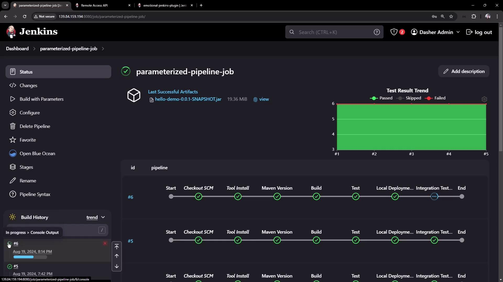
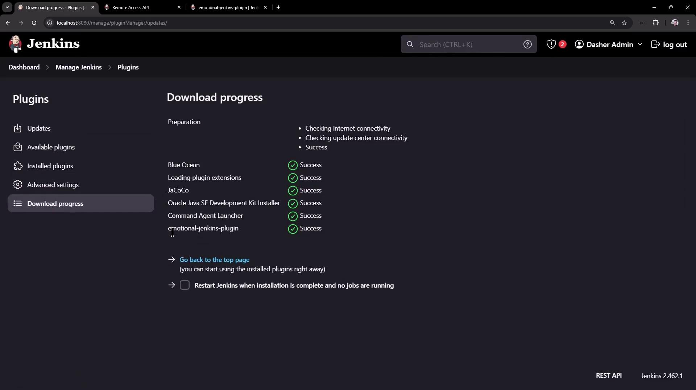

# Demo Jenkins REST API install a plugin

Source: https://notes.kodekloud.com/docs/Certified-Jenkins-Engineer/Automation-and-Security/Demo-Jenkins-REST-API-install-a-plugin/page

Automate CI/CD tasks with Jenkins REST API, including job management and plugin installation using `curl` commands and API tokens.

Leverage the Jenkins REST API to automate common CI/CD tasks—listing jobs, inspecting job details, triggering parameterized builds, and installing plugins programmatically. This tutorial demonstrates each step using `curl` commands, JSON/XML endpoints, and Jenkins API tokens.

## Key Jenkins REST API Endpoints

| Endpoint                                 | Action                         | HTTP Method |
| ---------------------------------------- | ------------------------------ | ----------- |
| `/api/json?tree=jobs[name]`              | List all jobs                  | GET         |
| `/job/{JOB_NAME}/api/json`               | Retrieve detailed job metadata | GET         |
| `/job/{JOB_NAME}/buildWithParameters`    | Trigger a parameterized build  | POST        |
| `/crumbIssuer/api/json`                  | Obtain CSRF crumb              | GET         |
| `/pluginManager/installNecessaryPlugins` | Install one or more plugins    | POST        |

***

## 1. Retrieving the List of Jobs

Fetch all jobs in JSON and limit the fields with the `tree` parameter to minimize payload:

```bash theme={null}
curl http://JENKINS_URL/api/json?tree=jobs[name]
```

Sample response:

```json theme={null}
{
  "_class": "hudson.model.Hudson",
  "jobs": [
    {"_class":"hudson.model.FreeStyleProject","name":"ascii-build-job"},
    {"_class":"hudson.model.FreeStyleProject","name":"ascii-deploy-job"},
    {"_class":"hudson.model.FreeStyleProject","name":"ascii-test-job"},
    {"_class":"hudson.model.FreeStyleProject","name":"Generate ASCII Artwork"},
    {"_class":"org.jenkinsci.plugins.workflow.job.WorkflowJob","name":"hello-world-pipeline"},
    {"_class":"org.jenkinsci.plugins.workflow.multibranch.WorkflowMultiBranchProject","name":"jenkins-hello-world"},
    {"_class":"org.jenkinsci.plugins.workflow.job.WorkflowJob","name":"parameterized-pipeline-job"}
  ]
}
```

The `tree=jobs[name]` query reduces the JSON to just the `name` field of each job.

***

## 2. Retrieving Job Details

Query a specific job’s API endpoint with authentication. Using [`jq`](https://stedolan.github.io/jq/) formats the JSON:

```bash theme={null}
curl -u admin:API_TOKEN \
  http://JENKINS_URL/job/parameterized-pipeline-job/api/json | jq
```

Abbreviated example output:

```json theme={null}
{
  "name": "parameterized-pipeline-job",
  "url": "http://JENKINS_URL/job/parameterized-pipeline-job/",
  "buildable": true,
  "builds": [
    {"number":5,"url":".../job/parameterized-pipeline-job/5/"},
    {"number":4,"url":".../job/parameterized-pipeline-job/4/"}
  ],
  "nextBuildNumber": 6,
  "property": [
    {
      "_class": "hudson.model.ParametersDefinitionProperty",
      "parameterDefinitions": [
        {
          "name": "BRANCH_NAME",
          "defaultParameterValue": {"value": "main"},
          "description": "The Git branch to build"
        },
        {
          "name": "APP_PORT",
          "defaultParameterValue": {"value": "6767"},
          "description": "Application port for tests"
        }
      ]
    }
  ]
}
```

***

## 3. Triggering a Build with Parameters

Use the `buildWithParameters` endpoint to start a parameterized job. Always use the `POST` method:

```bash theme={null}
curl -u admin:API_TOKEN \
  -X POST \
  http://JENKINS_URL/job/parameterized-pipeline-job/buildWithParameters \
  -d BRANCH_NAME=test \
  -d APP_PORT=6767
```

<Callout icon="triangle-alert">
  If Jenkins enforces CSRF protection, you will receive a `403 No valid crumb` error unless you include a valid crumb header.
</Callout>

### 3.1 Obtaining and Using a Crumb

1. Fetch the crumb from Jenkins:

   ```bash theme={null}
   CRUMB=$(curl -u admin:API_TOKEN \
     http://JENKINS_URL/crumbIssuer/api/json | jq -r .crumb)
   ```

2. Include the crumb in your build request:

   ```bash theme={null}
   curl -u admin:API_TOKEN \
     -H "Jenkins-Crumb:$CRUMB" \
     -X POST \
     http://JENKINS_URL/job/parameterized-pipeline-job/buildWithParameters \
     -d BRANCH_NAME=test \
     -d APP_PORT=6767
   ```

After triggering, verify in the Jenkins UI that build #6 is “in progress”:

<Frame>
  
</Frame>

***

## 4. Installing a Plugin via REST API

You can install plugins by posting an XML payload to the `installNecessaryPlugins` endpoint.

```bash theme={null}
curl -u admin:API_TOKEN \
  -X POST http://JENKINS_URL/pluginManager/installNecessaryPlugins \
  -H 'Content-Type: text/xml' \
  -d '<jenkins>
        <install plugin="emotional-jenkins-plugin@1.2" />
        <!-- Add more <install plugin="groupId/artifactId@version" /> entries as needed -->
      </jenkins>'
```

<Callout icon="lightbulb">
  Always authenticate using an API token and set `Content-Type: text/xml` when sending XML payloads.
</Callout>

Once the request completes, navigate to **Manage Jenkins → Manage Plugins → Advanced** to monitor download progress:

<Frame>
  
</Frame>

***

## Conclusion

In this article, you have learned how to:

* List and filter jobs using the Jenkins REST API
* Retrieve detailed metadata for a given job
* Trigger parameterized builds, handling CSRF crumbs
* Install and manage Jenkins plugins programmatically

Use these API techniques to integrate Jenkins into your automation workflows and scale your CI/CD pipelines.

## Links and References

* [Jenkins REST API Reference](https://www.jenkins.io/doc/book/using/remote-access-api/)
* [Jenkins Pipeline Syntax](https://www.jenkins.io/doc/book/pipeline/syntax/)
* [Jenkins CSRF Protection](https://www.jenkins.io/doc/book/system-administration/security/#cross-site-request-forgery-csrf-protection)

<CardGroup>
  <Card title="Watch Video" icon="video" href="https://learn.kodekloud.com/user/courses/certified-jenkins-engineer/module/4d6d1f39-307c-4fdb-8d2b-834c1650e792/lesson/cac5f86b-dc77-47d4-9f55-f0c0f54823bd" />
</CardGroup>
