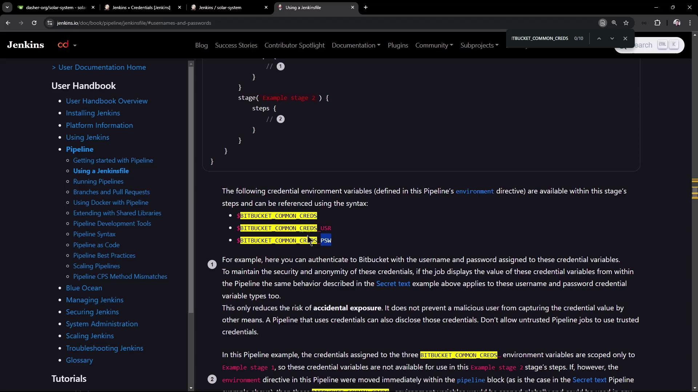
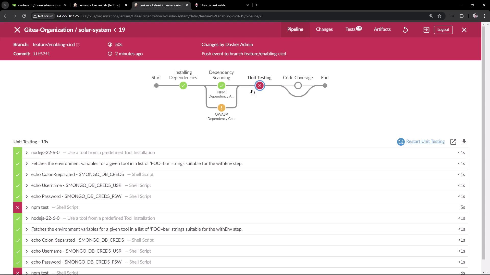
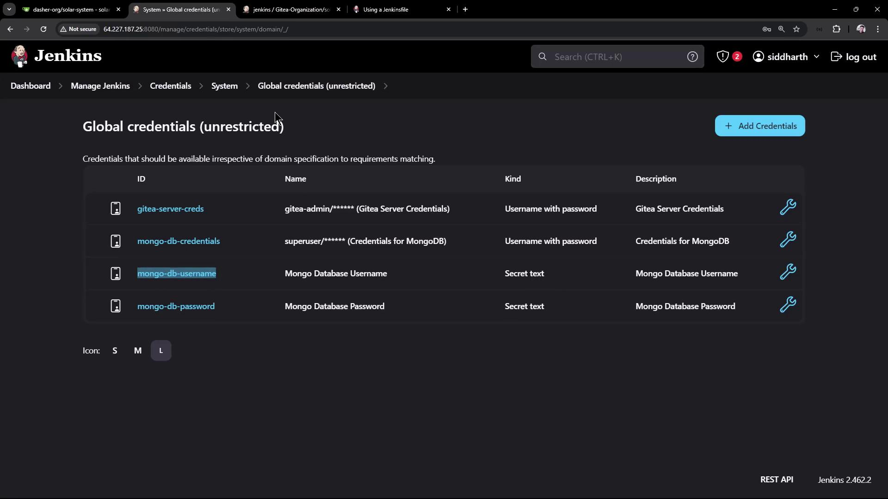

# Demo Refactoring Jenkinsfile

Source: https://notes.kodekloud.com/docs/Certified-Jenkins-Engineer/Code-Quality-and-Testing/Demo-Refactoring-Jenkinsfile/page

This guide explains how to refactor a Jenkins pipeline for better credential handling and report management.

In this guide, we’ll walk through refactoring a Jenkins pipeline to:

* Simplify credential handling
* Remove duplicate `withCredentials` blocks
* Centralize test report and HTML publishing in a `post` section

This approach reduces boilerplate and improves maintainability of your Jenkinsfile.

***

## Original Jenkinsfile Snippet

Both the **Unit Testing** and **Code Coverage** stages currently use identical `withCredentials` wrappers:

```groovy theme={null}
pipeline {
    agent any

    environment {
        MONGO_URI = "mongodb+srv://supercluster.d83jj.mongodb.net/superData"
    }

    options {
        // ...
    }

    stages {
        stage('Installing Dependencies') { /* ... */ }
        stage('Dependency Scanning')  { /* ... */ }

        stage('Unit Testing') {
            options { retry(2) }
            steps {
                withCredentials([usernamePassword(
                    credentialsId: 'mongo-db-credentials',
                    passwordVariable: 'MONGO_PASSWORD',
                    usernameVariable: 'MONGO_USERNAME'
                )]) {
                    sh 'npm test'
                }
            }
            junit allowEmptyResults: true, testResults: 'test-results.xml'
        }

        stage('Code Coverage') {
            steps {
                withCredentials([usernamePassword(
                    credentialsId: 'mongo-db-credentials',
                    passwordVariable: 'MONGO_PASSWORD',
                    usernameVariable: 'MONGO_USERNAME'
                )]) {
                    sh 'npm run coverage'
                }
                publishHTML(
                    allowMissing: true,
                    alwaysLinkToLastBuild: true,
                    keepAll: true,
                    reportDir: 'coverage/lcov-report',
                    reportFiles: 'index.html',
                    reportName: 'Code Coverage HTML Report'
                )
            }
        }
    }
}
```

```bash theme={null}
root@jenkins-controller-1 in solar-system on ⬢ feature/enabling-cicd via 🐍 v20.16.0
>
```

***

## 1. Injecting Credentials via `environment`

Instead of wrapping every stage in `withCredentials`, Jenkins can populate environment variables automatically:

| Environment Variable | Value               |
| -------------------- | ------------------- |
| `MY_CREDS`           | `username:password` |
| `MY_CREDS_USR`       | `username`          |
| `MY_CREDS_PSW`       | `password`          |

<Frame>
  
</Frame>

### Define a Single Credential

```groovy theme={null}
pipeline {
    agent any

    environment {
        MONGO_DB_CREDS = credentials('mongo-db-credentials')
    }

    stages {
        stage('Unit Testing') {
            options { retry(2) }
            steps {
                // No explicit withCredentials needed
                sh 'npm test'
            }
            junit allowEmptyResults: true, testResults: 'test-results.xml'
        }
    }
}
```

<Callout icon="lightbulb">
  You can echo these variables to confirm that Jenkins injects them correctly, but remember that secrets remain masked in logs.
</Callout>

```groovy theme={null}
stage('Unit Testing') {
    options { retry(2) }
    steps {
        sh 'echo Colon-Separated → $MONGO_DB_CREDS'
        sh 'echo Username → $MONGO_DB_CREDS_USR'
        sh 'echo Password → $MONGO_DB_CREDS_PSW'
        sh 'npm test'
    }
    junit allowEmptyResults: true, testResults: 'test-results.xml'
}
```

```bash theme={null}
root@jenkins-controller-1 in solar-system on ⬢ feature/enabling-cid via ⬢ v20.16.0
```

***

## 2. Why the Stage Fails

After pushing, the build fails:

<Frame>
  
</Frame>

Although the variables are injected:

* `$MONGO_DB_CREDS` is masked
* `$MONGO_DB_CREDS_USR` is displayed
* `$MONGO_DB_CREDS_PSW` is masked

Your test suite still expects `MONGO_USERNAME` and `MONGO_PASSWORD`, so the stage cannot authenticate.

***

## 3. Defining Separate Secret-Text Credentials

To match your test code, split the single credential into two **Secret text** entries:

1. In Jenkins UI, go to **Credentials > Global**.
2. Add **Secret text** credentials:
   * **ID:** `mongo-db-username` → *MongoDB username*
   * **ID:** `mongo-db-password` → *MongoDB password*

<Frame>
  
</Frame>

3. Update the `environment` block accordingly:

```groovy theme={null}
pipeline {
    agent any

    environment {
        MONGO_URI      = "mongodb+srv://supercluster.d83jj.mongodb.net/superData"
        MONGO_DB_CREDS = credentials('mongo-db-credentials')     // optional composite
        MONGO_USERNAME = credentials('mongo-db-username')
        MONGO_PASSWORD = credentials('mongo-db-password')
    }

    stages {
        stage('Unit Testing') {
            options { retry(2) }
            steps {
                sh 'echo DB Creds    → $MONGO_DB_CREDS'
                sh 'echo Username    → $MONGO_USERNAME'
                sh 'echo Password    → $MONGO_PASSWORD'
                sh 'npm test'
            }
            junit allowEmptyResults: true, testResults: 'test-results.xml'
        }

        stage('Code Coverage') {
            steps {
                catchError(buildResult: 'SUCCESS', stageResult: 'UNSTABLE') {
                    sh 'npm run coverage'
                }
                publishHTML(
                    allowMissing: true,
                    alwaysLinkToLastBuild: true,
                    keepAll: true,
                    reportDir: 'coverage/lcov-report',
                    reportFiles: 'index.html',
                    reportName: 'Code Coverage HTML Report'
                )
            }
        }
    }
}
```

***

## 4. Centralizing Reports in `post { always { ... } }`

Rather than repeating `junit` and `publishHTML` in each stage, use a `post` block to archive all reports after every build:

```groovy theme={null}
pipeline {
    agent any

    environment { /* ... */ }
    options     { /* ... */ }

    stages {
        stage('Installing Dependencies')     { /* ... */ }
        stage('Dependency Scanning')          { /* ... */ }
        stage('OWASP Dependency Check')       { /* ... */ }
        stage('Unit Testing')                 { /* ... */ }
        stage('Code Coverage')                { /* ... */ }
    }

    post {
        always {
            junit allowEmptyResults: true, testResults: 'test-results.xml'
            junit allowEmptyResults: true, testResults: 'dependency-check-junit.xml'
            publishHTML(
                allowMissing: true,
                alwaysLinkToLastBuild: true,
                keepAll: true,
                reportDir: 'coverage/lcov-report',
                reportFiles: 'index.html',
                reportName: 'Code Coverage HTML Report'
            )
            // Add additional publishHTML calls as needed
        }
    }
}
```

<Callout icon="triangle-alert">
  Don’t forget to adjust `testResults` patterns if you rename or relocate report files—otherwise Jenkins may skip them.
</Callout>

***

## 5. Run the Refactored Pipeline

With credentials injected at the top and reports centralized, the build should now succeed:

```bash theme={null}
> npm test
> mocha app-test.js --timeout 10000 --reporter mocha-junit-reporter --exit
Server successfully running on port - 3000
...
> npm run coverage
...
[htmlpublisher] Archiving HTML reports...
...
```

***

## Final Full Example

```groovy theme={null}
pipeline {
    agent any

    environment {
        MONGO_URI      = "mongodb+srv://supercluster.d83jj.mongodb.net/superData"
        MONGO_DB_CREDS = credentials('mongo-db-credentials')
        MONGO_USERNAME = credentials('mongo-db-username')
        MONGO_PASSWORD = credentials('mongo-db-password')
    }

    options {
        // ...
    }

    stages {
        stage('Installing Dependencies')    { /* ... */ }

        stage('Dependency Scanning')        { /* ... */ }

        stage('Unit Testing') {
            options { retry(2) }
            steps {
                sh 'echo DB Creds    → $MONGO_DB_CREDS'
                sh 'echo Username    → $MONGO_USERNAME'
                sh 'echo Password    → $MONGO_PASSWORD'
                sh 'npm test'
            }
        }

        stage('Code Coverage') {
            steps {
                catchError(buildResult: 'SUCCESS', stageResult: 'UNSTABLE') {
                    sh 'npm run coverage'
                }
            }
        }
    }

    post {
        always {
            junit allowEmptyResults: true, testResults: 'test-results.xml'
            junit allowEmptyResults: true, testResults: 'dependency-check-junit.xml'
            publishHTML(
                allowMissing: true,
                alwaysLinkToLastBuild: true,
                keepAll: true,
                reportDir: 'coverage/lcov-report',
                reportFiles: 'index.html',
                reportName: 'Code Coverage HTML Report'
            )
            // Add other publishHTML steps here
        }
    }
}
```

***

## Links and References

* [Jenkins Pipeline Syntax: Environment](https://www.jenkins.io/doc/book/pipeline/syntax/#environment)
* [Jenkins Credentials Binding Plugin](https://plugins.jenkins.io/credentials-binding/)
* [Mocha JUnit Reporter](https://github.com/michaelleeallen/mocha-junit-reporter)
* [Jenkins HTML Publisher Plugin](https://plugins.jenkins.io/htmlpublisher/)

<CardGroup>
  <Card title="Watch Video" icon="video" href="https://learn.kodekloud.com/user/courses/certified-jenkins-engineer/module/7214771c-8a65-4b34-94a9-43665202a4e4/lesson/c25132c4-adfa-4401-96f4-5ae48c3f5331" />
</CardGroup>
