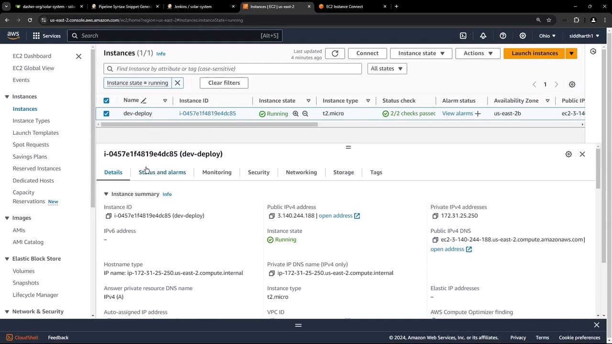
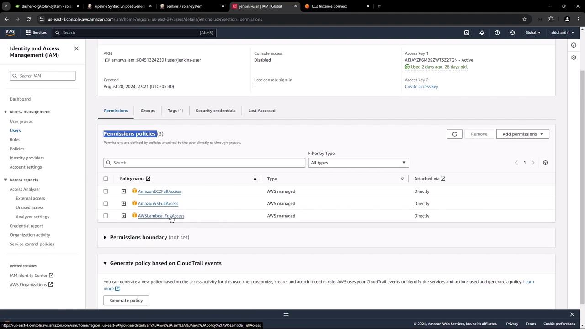
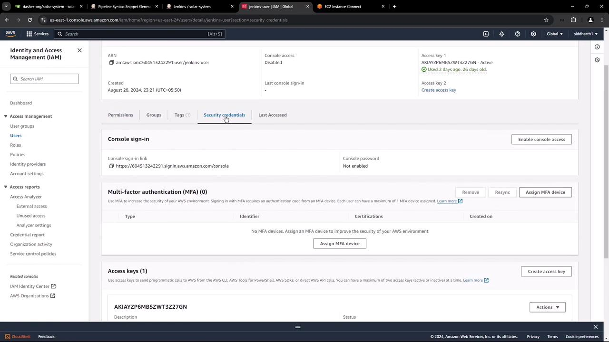
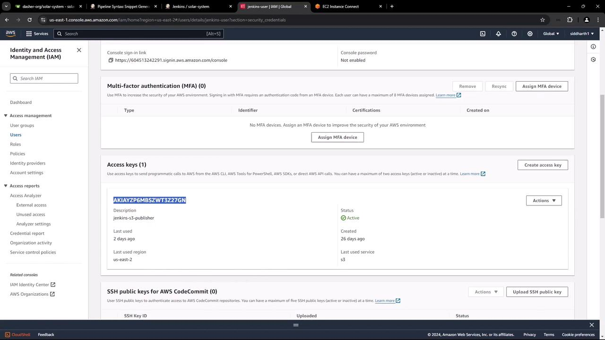
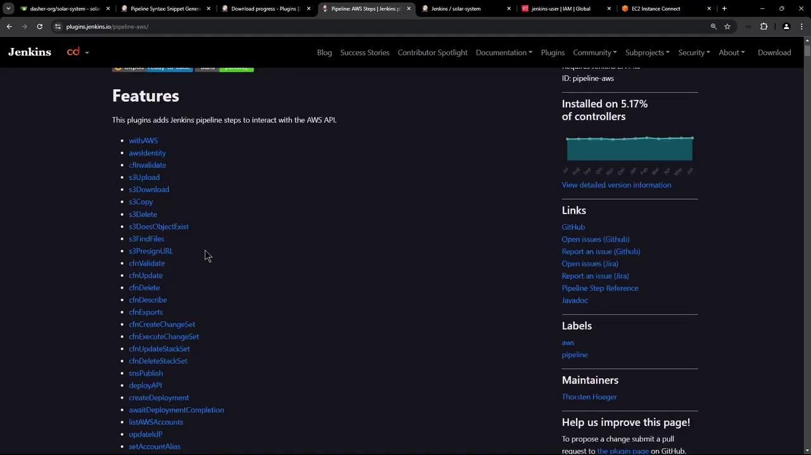
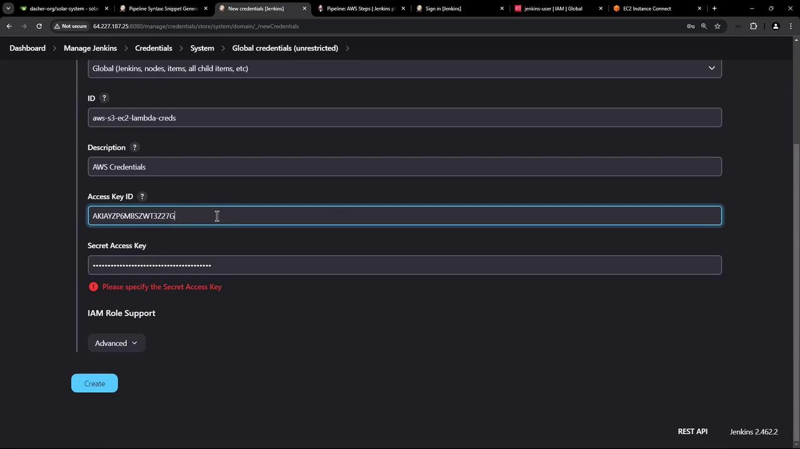
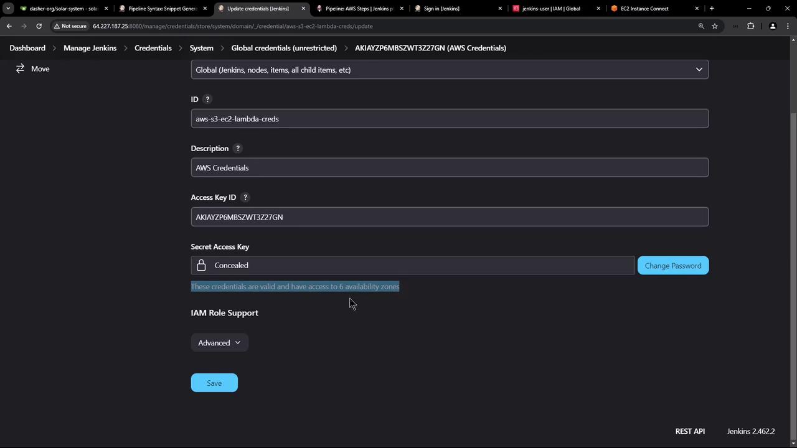
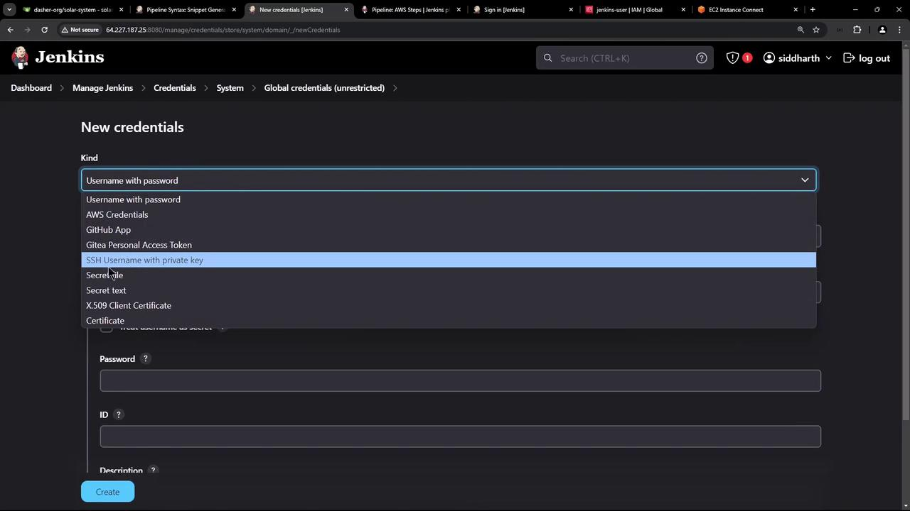
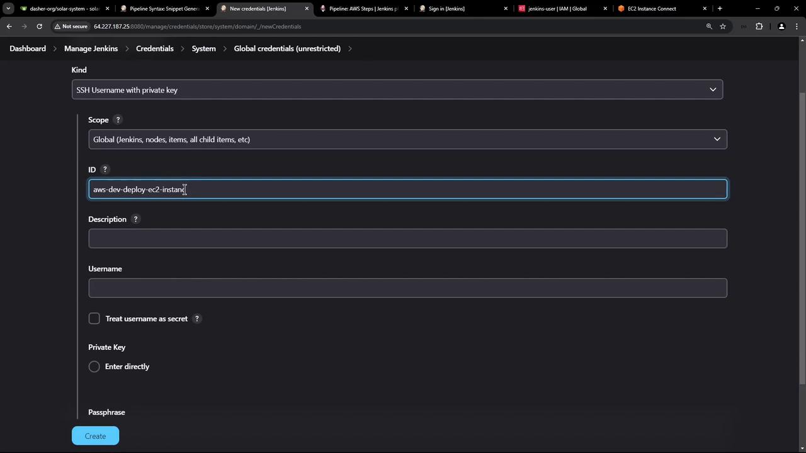

# Demo Exploring AWS and Setting up Jenkins Instance

Source: https://notes.kodekloud.com/docs/Certified-Jenkins-Engineer/Containerization-and-Deployment/Demo-Exploring-AWS-and-Setting-up-Jenkins-Instance/page

This article covers setting up a Jenkins deployment instance using AWS services, including configuring IAM and SSH credentials for automated deployments.

In this lesson, we begin the deployment phase of our CI/CD pipeline using AWS services—EC2, S3, and Lambda. You’ll see how to prepare your AWS environment, install necessary Jenkins plugins, and configure both AWS and SSH credentials to automate deployments.

## Reviewing the EC2 Instance

Navigate to the EC2 Instances dashboard in the AWS Console. You should see a single instance named **dev-deploy** in the **running** state.

<Frame>
  
</Frame>

This VM already has Docker installed. To verify, SSH into the instance and run:

```bash theme={null}
sudo docker ps
```

```text theme={null}
CONTAINER ID   IMAGE                                                   NAMES
f0f9299ee8fe   siddharth67/solar-system:7d1e24920bd455706b179c6724d5566d797634   solar-system
0.0.0.0:3000->3000/tcp
```

We’ll use this EC2 host to deploy our feature-branch Docker images.

## Setting Up AWS IAM Credentials

Create an IAM user (`jenkins-user`) with full access to EC2, S3, and Lambda. Attach these managed policies:

| Policy Name           | Service | Access Level |
| --------------------- | ------- | ------------ |
| AmazonEC2FullAccess   | EC2     | Full         |
| AmazonS3FullAccess    | S3      | Full         |
| AWSLambda\_FullAccess | Lambda  | Full         |

<Frame>
  
</Frame>

Once created, AWS will display the **Access Key ID** and **Secret Access Key**.

<Frame>
  
</Frame>

<Callout icon="triangle-alert">
  Keep your **Access Key ID** and **Secret Access Key** safe—do not commit them to source control.
</Callout>

Finally, review your user details to confirm MFA and key status:

<Frame>
  
</Frame>

## Installing the AWS Steps Plugin in Jenkins

To enable AWS API calls in your pipelines, install the **Pipeline: AWS Steps** plugin:

1. In Jenkins, go to **Manage Jenkins** → **Manage Plugins** → **Available**.
2. Search for **Pipeline: AWS Steps**, select it, and click **Install without restart**.
3. Restart Jenkins when prompted.

<Frame>
  
</Frame>

Here are a few example steps you can use in your `Jenkinsfile`:

| Step              | Description                           | Example                                                             |
| ----------------- | ------------------------------------- | ------------------------------------------------------------------- |
| s3DoesObjectExist | Check if an object exists in a bucket | `exists = s3DoesObjectExist(bucket: 'my-bucket', path: 'file.txt')` |
| s3FindFiles       | List files in an S3 bucket            | `files = s3FindFiles(bucket: 'my-bucket', glob: 'path/to/*.ext')`   |

<Callout icon="lightbulb">
  After plugin installation, always restart Jenkins to load new pipeline steps.
</Callout>

## Configuring AWS Credentials in Jenkins

Next, store your IAM keys in Jenkins:

1. Go to **Manage Jenkins** → **Manage Credentials** → **(global)** → **Add Credentials**.
2. Select **Kind: AWS Credentials**.
3. Enter an **ID** (e.g., `aws-s3-ec2-lambda`), paste your **Access Key ID** and **Secret Access Key**, then save.

<Frame>
  
</Frame>

Jenkins will validate these credentials automatically:

<Frame>
  
</Frame>

## Adding SSH Credentials for EC2

To deploy Docker images over SSH, install the **SSH Agent** plugin:

1. Go to **Manage Jenkins** → **Manage Plugins** → **Available**.
2. Search for **SSH Agent** and install.

Then add your EC2 key:

1. Navigate to **Manage Jenkins** → **Manage Credentials** → **(global)** → **Add Credentials**.
2. Choose **SSH Username with private key**.
3. Specify an **ID** (e.g., `aws-devops-deploy-ec2`), **Username** (`ubuntu`), and paste your private key.
4. Save.

<Frame>
  
</Frame>

<Frame>
  
</Frame>

***

With AWS Steps and SSH Agent plugins installed, AWS IAM and SSH credentials configured, you’re ready to add a pipeline stage that connects to your EC2 instance and deploys Docker images.

## Links and References

* [AWS IAM Documentation](https://docs.aws.amazon.com/iam/)
* [Jenkins Plugin: Pipeline AWS Steps](https://plugins.jenkins.io/pipeline-aws/)
* [Jenkins Plugin: SSH Agent](https://plugins.jenkins.io/ssh-agent/)

<CardGroup>
  <Card title="Watch Video" icon="video" href="https://learn.kodekloud.com/user/courses/certified-jenkins-engineer/module/e16e4b93-31c4-479b-96b8-f0d26cde31cd/lesson/136f41da-5da5-4057-ac72-4911deb3fe54" />
</CardGroup>
