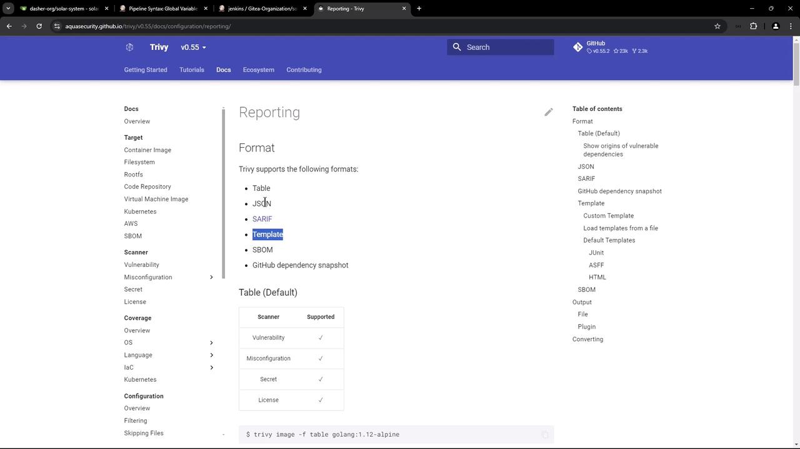
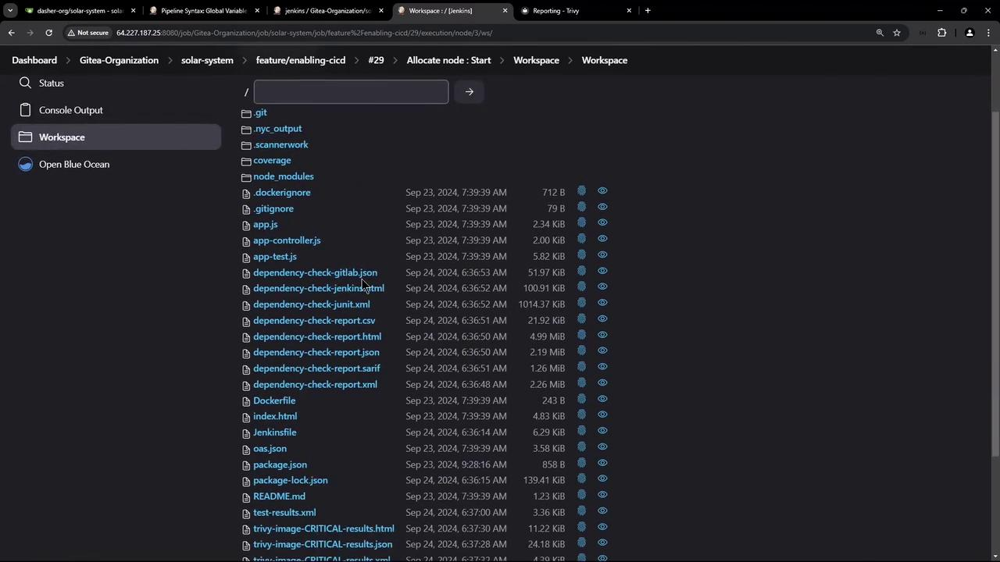
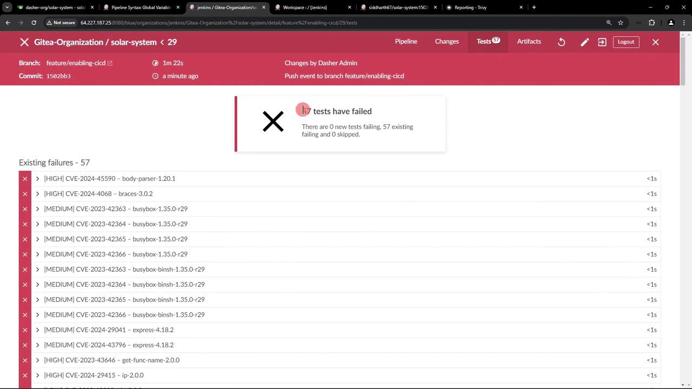
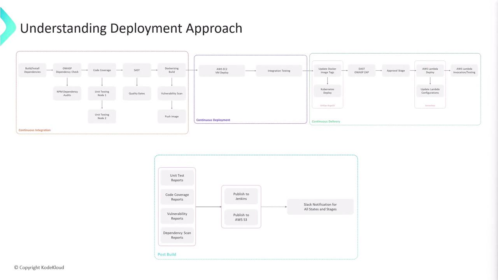

# Install via script
curl -sL https://raw.githubusercontent.com/aquasecurity/trivy/main/contrib/install.sh | sh

# Or build from GitHub
git clone --depth 1 --branch v0.55.2 https://github.com/aquasecurity/trivy
cd trivy
go install ./cmd/trivy
```

## Basic Usage

Scan a Docker image for vulnerabilities:

```bash theme={null}
trivy image python:3.4-alpine
```

Scan a local project directory for vulnerabilities and secrets:

```bash theme={null}
trivy fs --scanners vuln,secret,misconfig ./myproject
```

Get Trivy version and help:

```bash theme={null}
trivy -v           # e.g. Version: 0.55.2
trivy image --help # Image-scan options
```

<Callout icon="lightbulb">
  By default, Trivy exits with code `0` even if it finds non-critical issues. Use `--exit-code` to control build failures based on severity.
</Callout>

## Integrating Trivy into a Jenkins Pipeline

Add a **Trivy Vulnerability Scanner** stage immediately after your Docker build. Below is an example declarative pipeline:

```groovy theme={null}
pipeline {
  agent any
  stages {
    stage('Build Docker Image') {
      steps {
        // your build steps...
      }
    }

    stage('Trivy Vulnerability Scanner') {
      steps {
        // Medium/Low scan does not fail build
        sh '''
          trivy image siddharth67/solar-system:$GIT_COMMIT \
            --severity LOW,MEDIUM,HIGH \
            --exit-code 0 \
            --quiet \
            --format json -o trivy-image-medium.json

          # Critical scan fails on findings
          trivy image siddharth67/solar-system:$GIT_COMMIT \
            --severity CRITICAL \
            --exit-code 1 \
            --quiet \
            --format json -o trivy-image-critical.json
        '''
      }
      post {
        always {
          // Convert JSON to HTML and JUnit XML
          sh '''
            trivy convert --format template \
              --template "/usr/local/share/trivy/templates/html.tpl" \
              --output trivy-image-medium.html trivy-image-medium.json

            trivy convert --format template \
              --template "/usr/local/share/trivy/templates/html.tpl" \
              --output trivy-image-critical.html trivy-image-critical.json

            trivy convert --format template \
              --template "/usr/local/share/trivy/templates/junit.tpl" \
              --output trivy-image-medium.xml trivy-image-medium.json

            trivy convert --format template \
              --template "/usr/local/share/trivy/templates/junit.tpl" \
              --output trivy-image-critical.xml trivy-image-critical.json
          '''

          // Publish JUnit test reports
          junit allowEmptyResults: true, testResults: 'trivy-image-*.xml'

          // Publish HTML vulnerability reports
          publishHTML([
            allowMissing: true, alwaysLinkToLastBuild: true, keepAll: true,
            reportDir: '.', reportFiles: 'trivy-image-critical.html',
            reportName: 'Critical Vulnerabilities', useWrapperFileDirectly: true
          ])
          publishHTML([
            allowMissing: true, alwaysLinkToLastBuild: true, keepAll: true,
            reportDir: '.', reportFiles: 'trivy-image-medium.html',
            reportName: 'Medium/Low Vulnerabilities', useWrapperFileDirectly: true
          ])
        }
      }
    }

    stage('Push to Registry') {
      steps {
        // your push steps...
      }
    }
  }
}
```

<Callout icon="triangle-alert">
  The critical-scan stage uses `--exit-code 1`. Any CRITICAL vulnerability will fail the build immediately.
</Callout>

## Supported Reporting Formats

Trivy supports several output formats:

| Format   | Description                                              |
| -------- | -------------------------------------------------------- |
| Table    | Human-readable table view                                |
| JSON     | Machine-parsable data                                    |
| SARIF    | Static Analysis Results Interchange Format               |
| Template | Custom reports via Go templates (HTML, JUnit, CycloneDX) |

Templates are installed at:

```bash theme={null}
ls /usr/local/share/trivy/templates
# asff.tpl  gitlab-codequality.tpl  gitlab.tpl  html.tpl  junit.tpl
```

<Frame>
  
</Frame>

To convert a JSON output into a CycloneDX SBOM:

```bash theme={null}
trivy image --format json -o result.json debian:11
trivy convert --format cyclonedx --output result.cdx result.json
```

## Reviewing Scan Results

After your Jenkins job completes, the workspace will contain:

<Frame>
  
</Frame>

* **trivy-image-medium.html** / **.json / .xml**
* **trivy-image-critical.html** / **.json / .xml**

In Jenkins’ **Test Results** view, Trivy’s JUnit entries appear alongside other CI tests:

<Frame>
  
</Frame>

## Adjusting Severity Thresholds

To treat HIGH severity like MEDIUM (only fail on CRITICAL), include HIGH in the non-failing scan:

```groovy theme={null}
steps {
  sh '''
    trivy image siddharth67/solar-system:$GIT_COMMIT \
      --severity LOW,MEDIUM,HIGH \
      --exit-code 0 \
      --quiet \
      --format json -o trivy-image-medium.json

    trivy image siddharth67/solar-system:$GIT_COMMIT \
      --severity CRITICAL \
      --exit-code 1 \
      --quiet \
      --format json -o trivy-image-critical.json
  '''
}
```

## Summary

In this tutorial, you learned how to:

* Install Trivy on various platforms
* Execute basic vulnerability scans on images and filesystems
* Integrate Trivy into a Jenkins pipeline with pass/fail thresholds
* Convert JSON results to HTML, JUnit, or CycloneDX formats
* Publish and review vulnerability reports in Jenkins

Trivy also supports scanning IaC files, detecting sensitive data, and auditing software licenses. For advanced scenarios, visit the [official Trivy documentation](https://aquasecurity.github.io/trivy/).

## Links and References

* [Trivy GitHub Repository](https://github.com/aquasecurity/trivy)
* [Aqua Security Documentation](https://aquasecurity.github.io/)
* [Jenkins Pipeline Syntax](https://www.jenkins.io/doc/book/pipeline/syntax/)

<CardGroup>
  <Card title="Watch Video" icon="video" href="https://learn.kodekloud.com/user/courses/certified-jenkins-engineer/module/e16e4b93-31c4-479b-96b8-f0d26cde31cd/lesson/a792f39b-46ff-45dd-9125-4da7b5e9b191" />
</CardGroup>


# Understanding Deployment Approach

Source: https://notes.kodekloud.com/docs/Certified-Jenkins-Engineer/Containerization-and-Deployment/Understanding-Deployment-Approach/page

This article explores a deployment strategy for CI/CD pipelines, covering feature branch deployment, pull request validation, and main branch production deployment.

In this article, we’ll explore a robust deployment strategy that takes your code from feature branches all the way to a production-ready, serverless environment. By integrating continuous integration (CI), automated deployment, and security testing, you get fast feedback and confidence at every stage.

<Frame>
  
</Frame>

## 1. Feature Branch Deployment to AWS EC2

When a new commit is pushed to any feature branch, the CI pipeline automatically:

1. Executes build, unit tests, and lint checks.
2. Builds a Docker image and pushes it to a container registry.
3. Connects to a designated AWS EC2 instance via SSH.
4. Pulls and deploys the updated Docker image.
5. Runs integration tests against the EC2-hosted service.

<Callout icon="lightbulb">
  Ensure your AWS credentials and SSH keys are securely stored in your CI/CD environment variables.
</Callout>

This end-to-end validation on EC2 guarantees that new features won’t break existing functionality before merging.

## 2. Pull Request Validation with Kubernetes & DAST

On opening a pull request, we spin up an ephemeral preview environment:

1. Argo CD syncs the Docker image to a Kubernetes namespace.
2. Dynamic Application Security Testing (DAST) is performed using [OWASP ZAP](https://www.zaproxy.org/) against the running application.

<Callout icon="triangle-alert">
  DAST scans can produce false positives—review findings carefully and tune your OWASP ZAP policies.
</Callout>

This stage provides rapid feedback on both functionality and security before code merges into `main`.

## 3. Main Branch Deployment to AWS Lambda

Once pull requests are merged into `main`, the pipeline proceeds to production:

1. Packages the application as an AWS Lambda deployment package.
2. Updates Lambda configuration (environment variables, memory allocation, timeouts).
3. Deploys via the AWS CLI or Infrastructure as Code tool.
4. Invokes the function to confirm successful deployment and correct behavior.

This serverless approach ensures scalability and cost-efficiency in your production environment.

## Workflow Summary

| Stage                         | Trigger                | Environment          | Deployment Target       | Tests                            |
| ----------------------------- | ---------------------- | -------------------- | ----------------------- | -------------------------------- |
| Feature Branch Deployment     | Push to `feature/*`    | AWS EC2              | Docker container on EC2 | Integration tests                |
| Pull Request Validation       | Open PR against `main` | Kubernetes (Argo CD) | Synced pods/services    | OWASP ZAP DAST scans             |
| Main Branch Production Deploy | Merge into `main`      | AWS Lambda           | Serverless function     | Post-deployment invocation check |

## Links and References

* [AWS EC2](https://aws.amazon.com/ec2/)
* [AWS Lambda](https://aws.amazon.com/lambda/)
* [Argo CD](https://argo-cd.readthedocs.io/)
* [OWASP ZAP](https://www.zaproxy.org/)
* [CI/CD Best Practices](https://www.redhat.com/en/topics/devops/what-is-ci-cd)

<CardGroup>
  <Card title="Watch Video" icon="video" href="https://learn.kodekloud.com/user/courses/certified-jenkins-engineer/module/e16e4b93-31c4-479b-96b8-f0d26cde31cd/lesson/91f5171d-f6ae-4b70-bf8f-b68473bc01f0" />
</CardGroup>
