# Simulate a long-running task
sleep 3600

# Deployment steps
sudo apt-get update
sudo apt-get install cowsay -y
export PATH="$PATH:/usr/games:/usr/local/games"
cat advice.message | cowsay -f "$(ls /usr/share/cowsay/cows | shuf -n 1)"
```

<Callout icon="lightbulb">
  Adjust the `sleep` duration to suit your testing environment.
</Callout>

Save and apply the job configuration in Jenkins.

***

## 2. Trigger the Build and Test Jobs

1. In Jenkins, click **Build Now** for **ascii-build-job**.
2. **ascii-build-job** will automatically trigger **ascii-test-job**.

### Test Job Failure

Because our advice quote has five words or fewer, the test script will fail. Inspect **ascii-test-job**’s console output:

```bash theme={null}
Started by upstream project "ascii-build-job" build number 5
Running as SYSTEM
Building in workspace /var/lib/jenkins/workspace/ascii-test-job
Copied 1 artifact from "ascii-build-job" build number 5
[ascii-test-job] $ /bin/sh -xe /tmp/jenkins1567.sh
+ ls advice.json
advice.json
+ jq -r .slip.advice advice.json
+ wc -w
+ [ 4 -gt 5 ]
+ cat advice.message
Advice -  Sing in the shower.
+ echo "Advice has 5 words or less"
Advice has 5 words or less
+ exit 1
Build step 'Execute shell' marked build as failure
Finished: FAILURE
```

Because the test failed, **ascii-deploy-job** will **not** run.

***

## 3. Rerun and Deploy

1. Update the advice text so it contains **more than five words**.
2. Trigger **ascii-build-job** again.

This time:

* **ascii-test-job** completes successfully.
* **ascii-deploy-job** enters the queue and then starts.

Check **ascii-deploy-job**’s console to confirm the `sleep` invocation:

```bash theme={null}
Started by upstream project "ascii-test-job" build number 6
Running as SYSTEM
Building in workspace /var/lib/jenkins/workspace/ascii-deploy-job
Copied 1 artifact from "ascii-test-job" build number 6
[ascii-deploy-job] $ /bin/sh -xe /tmp/jenkins9836.sh
+ sleep 3600
```

***

## 4. Simulate Controller Failure

While **ascii-deploy-job** is sleeping, simulate a controller outage.

<Callout icon="triangle-alert">
  Stopping the Jenkins controller will immediately terminate all running Freestyle jobs.
</Callout>

1. SSH into the Jenkins controller host.
2. Stop Jenkins:
   ```bash theme={null}
   sudo systemctl stop jenkins
   sudo systemctl status jenkins
   ```
   The service should display **inactive**.
3. Refresh the Jenkins UI— it will be unreachable.
4. Start Jenkins again:
   ```bash theme={null}
   sudo systemctl start jenkins
   sudo systemctl status jenkins
   ```
   You should see output similar to:
   ```bash theme={null}
   ● jenkins.service - Jenkins Continuous Integration Server
      Loaded: loaded (/usr/lib/systemd/system/jenkins.service; enabled; preset: enabled)
      Active: active (running) since Mon 2024-08-19 10:51:25 UTC; 3s ago
    Main PID: 37656 (java)
       Tasks: 49
      Memory: 310.4M (peak: 310.9M)
        CPU: 15.0s
   CGroup: /system.slice/jenkins.service
           └─37656 /usr/bin/java -jar /usr/share/java/jenkins.war --webroot=/var/cache/jenkins/war
   ```
5. Log back into the UI and open **ascii-deploy-job**. The build will have failed:
   ```bash theme={null}
   [ascii-deploy-job] $ /bin/sh -xe /tmp/jenkins9836.sh
   + sleep 3600
   Build step 'Execute shell' marked build as failure
   Finished: FAILURE
   ```

***

## 5. Observations

When the Jenkins controller goes down:

* Any running Freestyle jobs are **terminated**.
* Builds do **not** resume after restart.

<Callout icon="triangle-alert">
  Freestyle projects cannot resume after a controller restart. Consider using [Pipeline projects](https://www.jenkins.io/doc/book/pipeline/) for better resilience and survivability.
</Callout>

***

## 6. Jenkins Dashboard and Icon Legend

On the Jenkins dashboard, monitor your jobs’ statuses:

<Frame>
  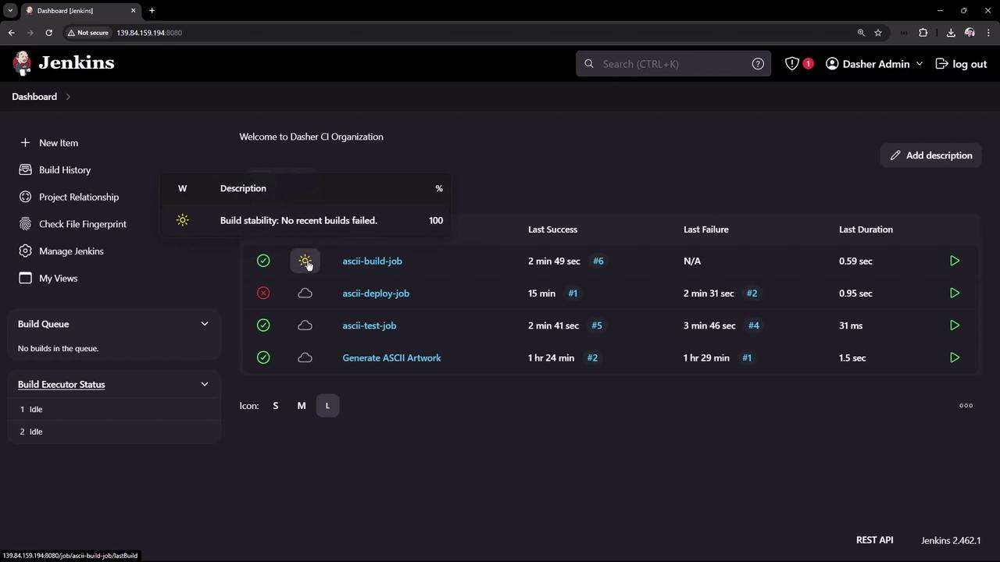
</Frame>

To interpret the status icons (sun, cloud, etc.), click **More Actions → Icon legend**:

<Frame>
  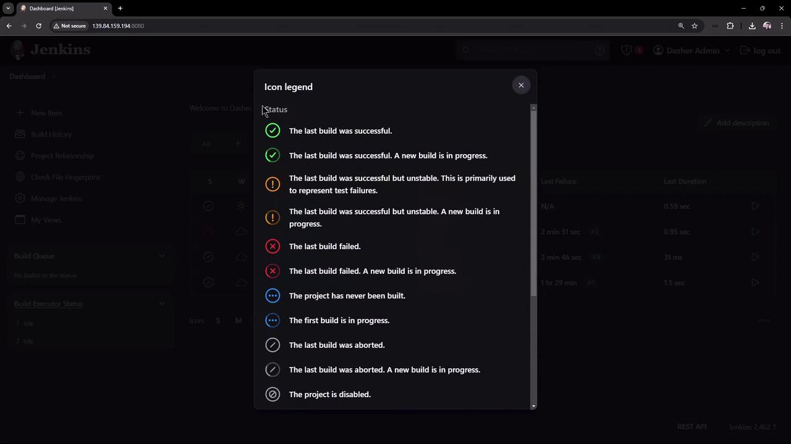
</Frame>

***

## Next Steps

* Explore [Jenkins Pipeline](https://www.jenkins.io/doc/book/pipeline/) for durable, restart-safe workflows.
* Review the [Freestyle project documentation](https://www.jenkins.io/doc/book/pipeline/freestyle/) to understand its limitations.

## References

* [Jenkins Documentation](https://www.jenkins.io/doc/)
* [Jenkins Pipeline Syntax](https://www.jenkins.io/doc/book/pipeline/syntax/)

<CardGroup>
  <Card title="Watch Video" icon="video" href="https://learn.kodekloud.com/user/courses/certified-jenkins-engineer/module/6113113b-7852-401b-9c41-c5bc8242ad99/lesson/fbae269a-391e-4b72-850d-74a294afc589" />
</CardGroup>


# Demo Installing Plugins

Source: https://notes.kodekloud.com/docs/Certified-Jenkins-Engineer/Extending-Jenkins-and-Administration/Demo-Installing-Plugins/page

This tutorial covers the installation and configuration of Jenkins plugins for artifact sharing and build visualization.

In this step-by-step tutorial, we’ll install and configure two essential Jenkins plugins—**Copy Artifact** and **Yet Another Build Visualizer**—to enable artifact sharing between freestyle jobs and to visualize your build pipelines.

***

## Plugins Overview

| Plugin Name                  | Purpose                                       | Documentation                                                                         |
| ---------------------------- | --------------------------------------------- | ------------------------------------------------------------------------------------- |
| Copy Artifact                | Share build artifacts between jobs            | [plugins.jenkins.io/copyartifact](https://plugins.jenkins.io/copyartifact/)           |
| Yet Another Build Visualizer | Display upstream/downstream job relationships | [GitHub Repository](https://github.com/jenkinsci/yet-another-build-visualizer-plugin) |

***

## 1. Installing the Copy Artifact Plugin

We already have a job called **ascii-build-job** that fetches advice from an external API:

<Frame>
  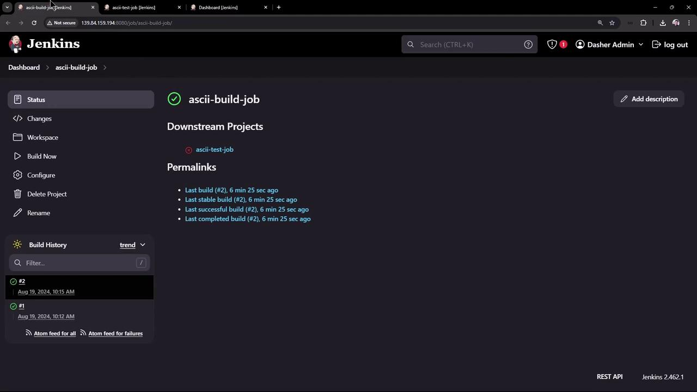
</Frame>

To allow another job to consume `advice.json`, install **Copy Artifact**:

1. Navigate to **Manage Jenkins** → **Manage Plugins**.
2. Click the **Installed** tab to check which plugins are already present:

<Frame>
  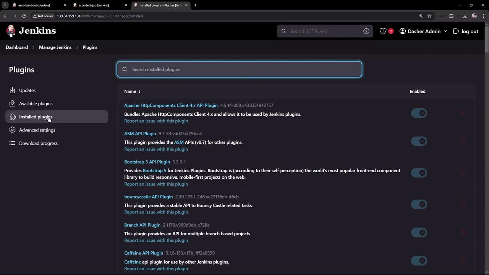
</Frame>

3. Go to the **Available** tab, search for “copy artifact”, select it, then click **Install without restart**:

<Frame>
  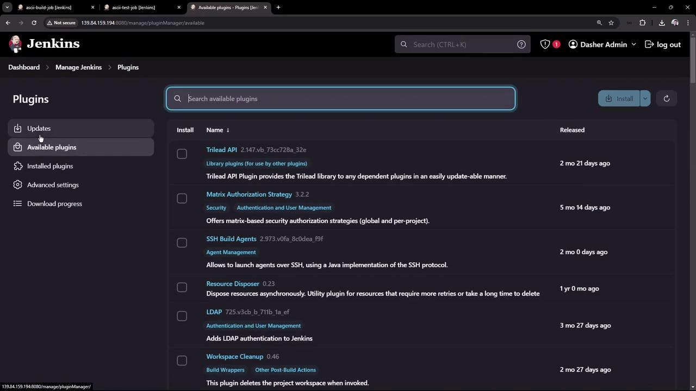
</Frame>

<Frame>
  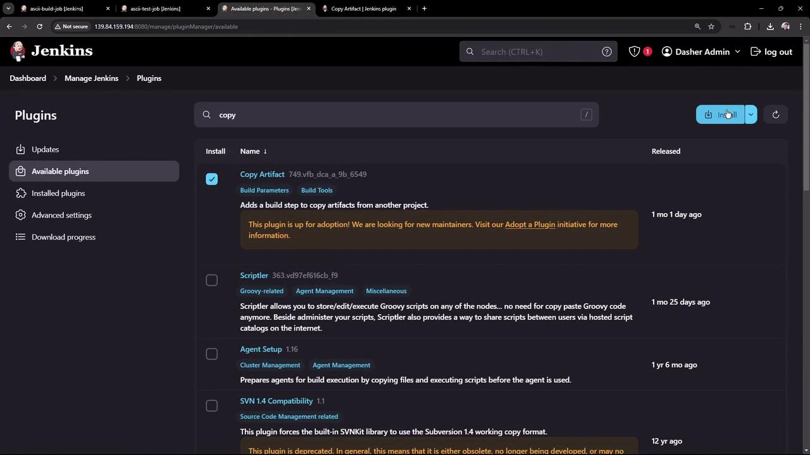
</Frame>

4. Wait until the status indicator reads **Success**:

<Frame>
  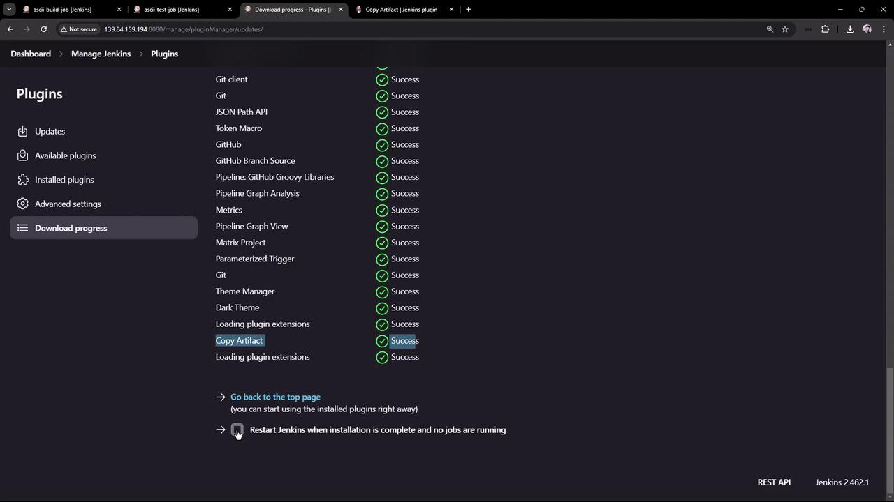
</Frame>

5. Review the plugin’s usage patterns, including declarative pipeline snippets and CLI installation:

<Frame>
  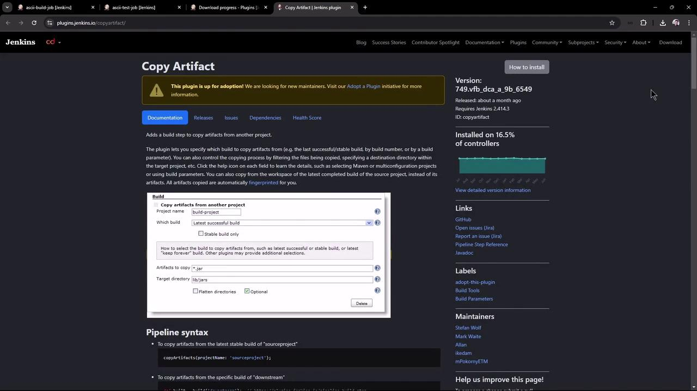
</Frame>

```groovy theme={null}
// Declarative pipeline example
pipeline {
  agent any
  options {
    copyArtifactPermission('job1,job2')
  }
  stages {
    // ...
  }
}

// Freestyle project permission
properties {
  copyArtifactPermission('ascii-test-job')
}
```

Or install via CLI:

```bash theme={null}
jenkins-plugin-cli --plugins copyartifact:1.46.1
```

<Frame>
  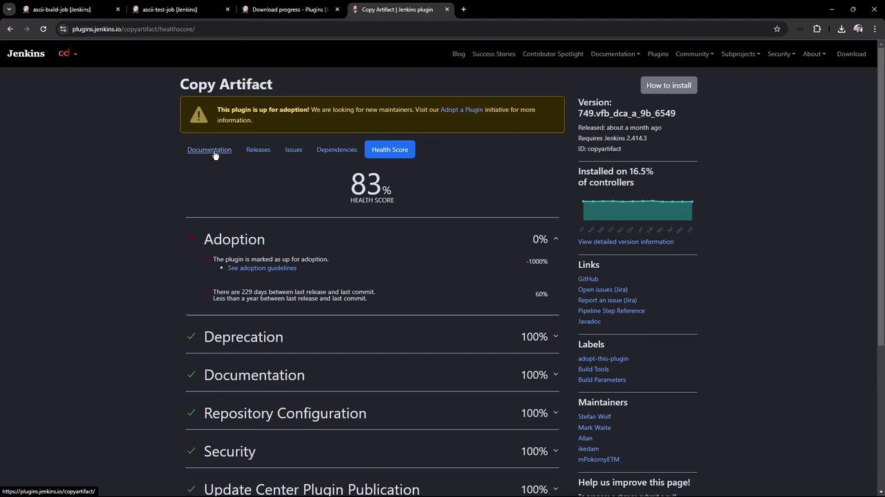
</Frame>

<Callout icon="triangle-alert">
  If you install via CLI, ensure Jenkins has been restarted or the plugin has been dynamically loaded. Always verify compatibility with your Jenkins version.
</Callout>

***

## 2. Configure the Build Job (ascii-build-job)

Edit **ascii-build-job** to fetch and archive advice:

1. **Execute Shell** – Fetch advice and output to `advice.json`:
   ```bash theme={null}
   curl -s https://api.adviceslip.com/advice > advice.json
   cat advice.json
   ```
2. **Allow Copy Artifact** – Under **Configure** → **Permission to Copy Artifact**, add `ascii-test-job`:

<Frame>
  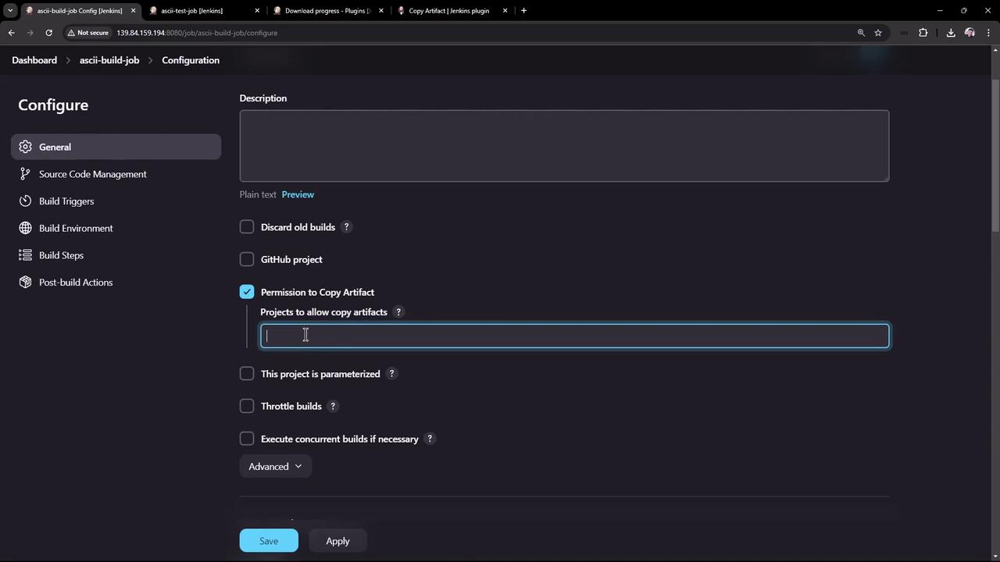
</Frame>

3. **Archive Artifacts** – Post-build action to archive `advice.json`:

<Frame>
  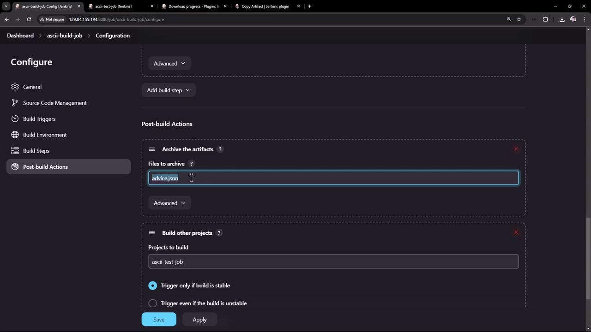
</Frame>

Save and run **ascii-build-job**. You should see `advice.json` archived under **Build Artifacts**.

***

## 3. Configure the Test Job (ascii-test-job)

Now set up **ascii-test-job** to pull that artifact and validate its content:

1. **Copy Artifacts from Another Project** (drag this step to the top):
   * **Project Name**: `ascii-build-job`
   * **Which Build**: Latest successful
   * **Artifacts to Copy**: `advice.json`

<Frame>
  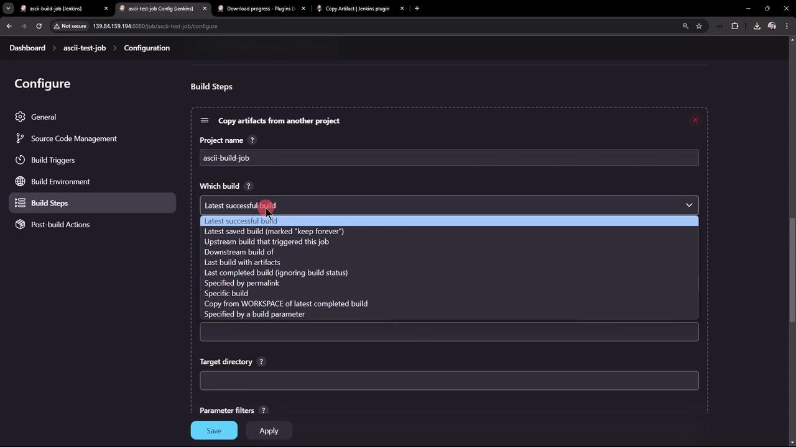
</Frame>

2. **Execute Shell** – Validate the advice message length:
   ```bash theme={null}
   # Ensure advice.json is present
   ls advice.json

   # Extract advice text
   cat advice.json | jq -r .slip.advice > advice.message

   # Validate word count > 5
   if [ $(wc -w < advice.message) -gt 5 ]; then
     echo "Advice: $(cat advice.message) has more than 5 words"
   else
     echo "Advice: not enough words"
   fi
   ```
3. **Archive Artifacts** – Only archive `advice.message` on success:

<Frame>
  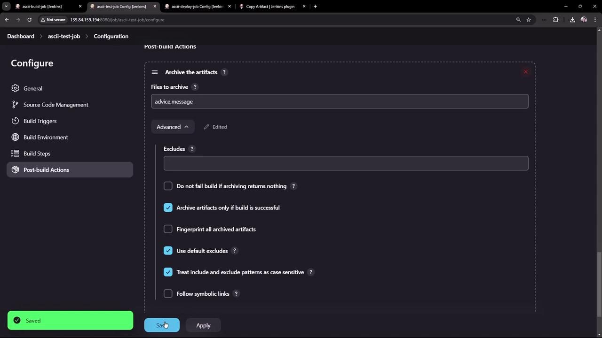
</Frame>

Save and run **ascii-test-job**. Verify both artifacts in the workspace:

<Frame>
  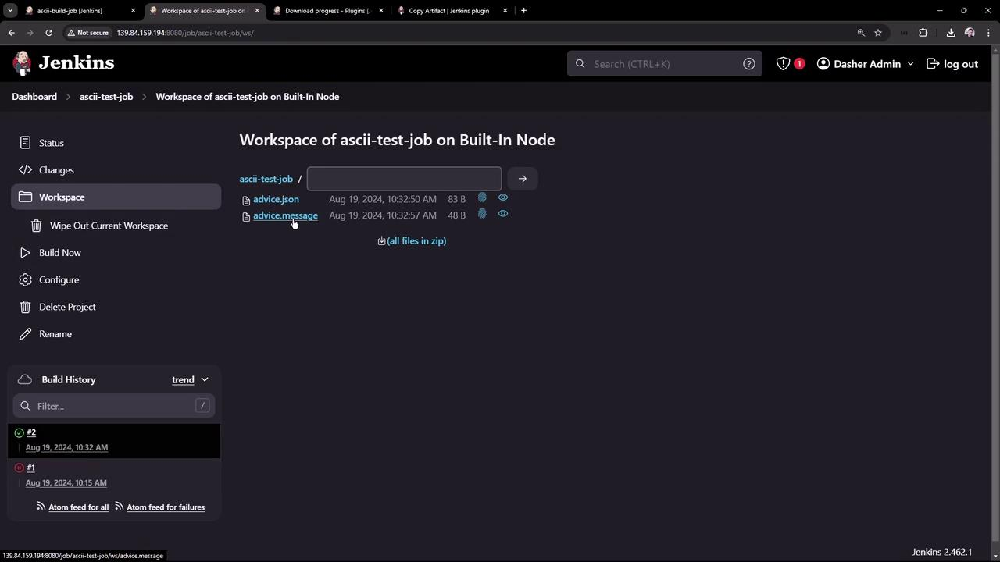
</Frame>

Console output should confirm the artifact copy and message extraction:

```text theme={null}
Copied 1 artifact from "ascii-build-job" build #3
Advice: What could you increase? What could you reduce? has more than 5 words
Finished: SUCCESS
```

***

## 4. Configure the Deploy Job (ascii-deploy-job)

Create **ascii-deploy-job** to consume `advice.message` and display it with `cowsay`:

1. **Copy Artifacts** from `ascii-test-job` (Latest stable), artifacts: `advice.message`.
2. **Execute Shell**:
   ```bash theme={null}
   sudo apt-get update
   sudo apt-get install -y cowsay
   export PATH=$PATH:/usr/games:/usr/local/games

   cat advice.message | cowsay -f $(ls /usr/share/cowsay/cows | shuf -n 1)
   ```
3. **Build Trigger** – Under **Build Triggers**, select **Build after other projects are built** → `ascii-test-job` (stable only).

Save and kick off the chain by building **ascii-build-job**. You’ll observe:

* **ascii-build-job** runs first and archives `advice.json`.
* **ascii-test-job** copies that artifact, extracts `advice.message`, and archives it.
* **ascii-deploy-job** triggers automatically and displays the advice in a random cow figure.

Console logs of **ascii-deploy-job**:

<Frame>
  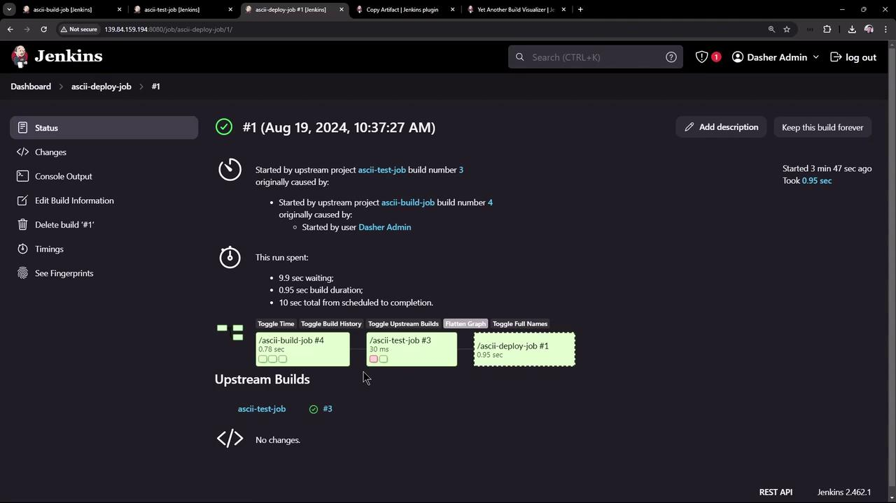
</Frame>

***

## 5. Visualizing the Build Flow

To graphically map upstream/downstream relationships, install **Yet Another Build Visualizer**:

1. Download the latest HPI from the \[releases page]:

<Frame>
  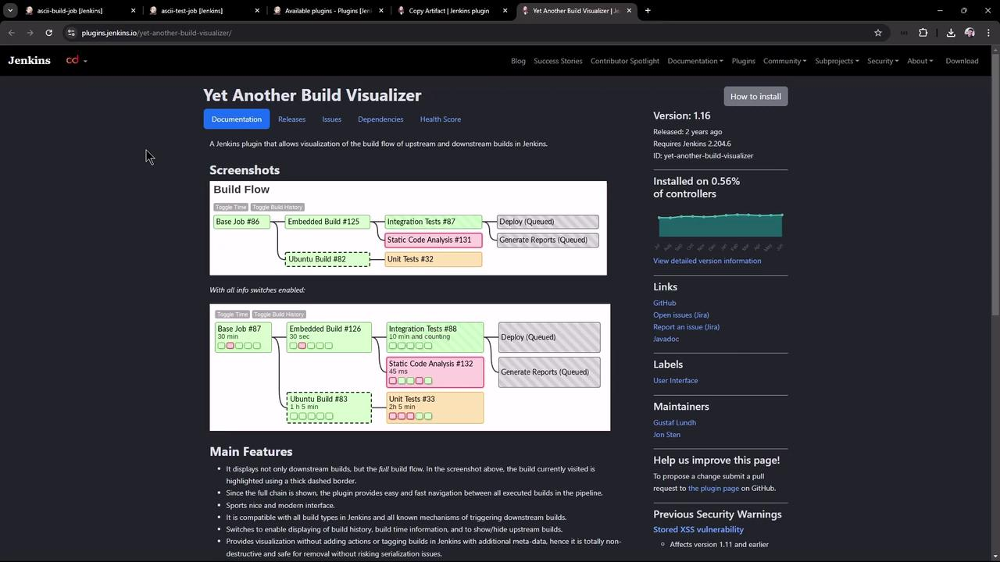
</Frame>

2. In **Manage Jenkins** → **Manage Plugins** → **Advanced**, upload and deploy the HPI:

<Frame>
  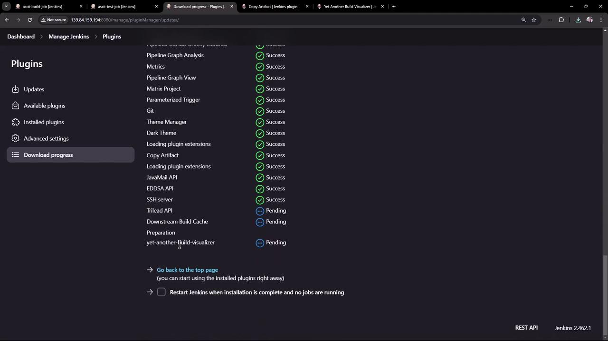
</Frame>

3. Open **ascii-build-job** to view the build flow diagram:

<Frame>
  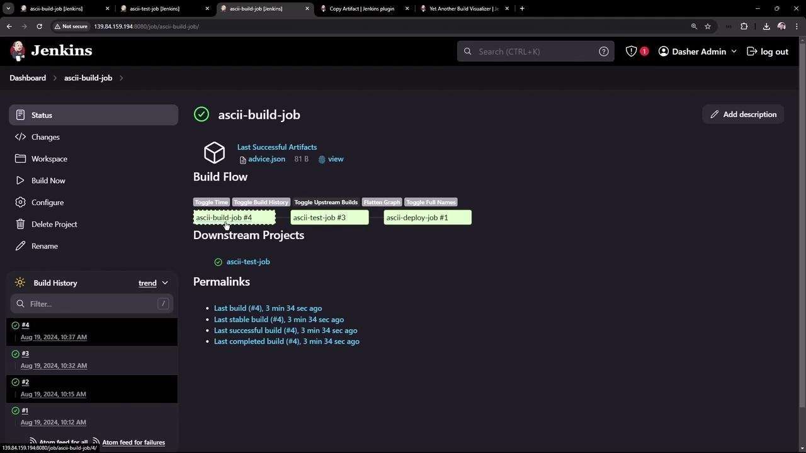
</Frame>

Use the interactive toggles to inspect build numbers, statuses, and full job names. This visualization helps you quickly understand and debug complex job chains.

***

That’s it! You’ve successfully installed and configured the Copy Artifact and Yet Another Build Visualizer plugins to streamline artifact sharing and gain clear insights into your Jenkins build pipelines.

<CardGroup>
  <Card title="Watch Video" icon="video" href="https://learn.kodekloud.com/user/courses/certified-jenkins-engineer/module/6113113b-7852-401b-9c41-c5bc8242ad99/lesson/89c5d504-de0d-43b6-a047-944462574367" />
</CardGroup>
