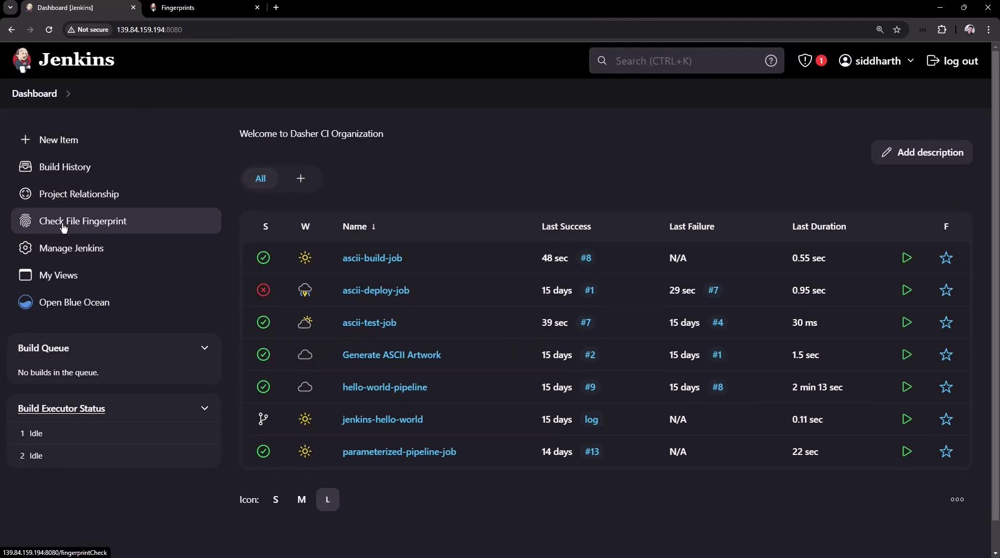

# Demo Jenkins Fingerprints

Source: https://notes.kodekloud.com/docs/Certified-Jenkins-Engineer/Extending-Jenkins-and-Administration/Demo-Jenkins-Fingerprints/page

Jenkins fingerprints track artifact usage across jobs using MD5 checksums, enabling quick discovery of file production and consumption without wasting storage.

Jenkins fingerprints provide a lightweight way to track artifact usage across jobs by storing an MD5 checksum for each file instead of the full artifact. This lets you quickly discover which builds produced or consumed a given file without wasting storage. You can review all fingerprints under **Manage Jenkins** → **Fingerprinting** or on the `/fingerprints` page of your Jenkins master.

## Use Case

Consider a simple three-job pipeline:

| Job Name       | Produces       | Consumes       |
| -------------- | -------------- | -------------- |
| **build-job**  | `advice.json`  | —              |
| **test-job**   | `reports.json` | `advice.json`  |
| **deploy-job** | —              | `reports.json` |

You need to know, for any artifact, which builds created it and which builds later consumed it. We’ll enable fingerprinting on **build-job** and then view its usage graph across the pipeline.

<Callout icon="lightbulb">
  Fingerprinting is enabled by default in Jenkins LTS. You don’t need additional plugins—just define the files or glob patterns you want to track.
</Callout>

## 1. Configuring Fingerprints

1. Open **build-job** and click **Configure**.
2. Scroll to **Post-build Actions**.
3. Click **Add post-build action** → **Record fingerprints of files to track usage**.
4. In **Files to fingerprint**, enter:
   ```text theme={null}
   advice.json
   ```
5. Click **Save**.

Repeat similar steps in **test-job** or **deploy-job** if you wish to fingerprint their outputs (`reports.json`).

## 2. Running the Job and Viewing Fingerprints

1. On the **build-job** page, click **Build Now**.
2. Once the build completes, click the build number (e.g., **#8**) under **Build History**.
3. In the **Artifacts** section, locate `advice.json`—it will have a fingerprint icon.
4. Click **View** to open the fingerprint details page.

On the fingerprint details page you’ll see:

* The MD5 checksum of `advice.json`.
* A list of all builds that produced or consumed that checksum (for example, **build-job #8** and **test-job #3**).
* Timestamps and upstream/downstream relationships, giving you full visibility into your pipeline.

## 3. Checking Fingerprints from the Dashboard

You can also verify fingerprints for ad-hoc files:

1. From the Jenkins dashboard sidebar, click **Check File Fingerprints**.
2. Upload any file (e.g., an archived JAR).
3. Jenkins will display:
   * The MD5 checksum.
   * Which jobs and builds produced or consumed that checksum.
   * Timestamps for each usage.

<Frame>
  
</Frame>

<Callout icon="triangle-alert">
  Fingerprinting very large or frequently changing files can increase Jenkins storage and processing overhead. Use precise glob patterns to limit tracked files.
</Callout>

***

## Links and References

* [Jenkins Fingerprints Documentation](https://www.jenkins.io/doc/book/managing/fingerprints/)
* [Pipeline as Code](https://www.jenkins.io/doc/book/pipeline/)
* [Managing Jenkins](https://www.jenkins.io/doc/book/managing/)

<CardGroup>
  <Card title="Watch Video" icon="video" href="https://learn.kodekloud.com/user/courses/certified-jenkins-engineer/module/6113113b-7852-401b-9c41-c5bc8242ad99/lesson/7cf1abc2-44f8-4abd-9e97-b2de553ae499" />

  <Card title="Practice Lab" icon="installation" href="https://learn.kodekloud.com/user/courses/certified-jenkins-engineer/module/6113113b-7852-401b-9c41-c5bc8242ad99/lesson/c7258333-58e2-440c-822b-507a056998f2" />
</CardGroup>
