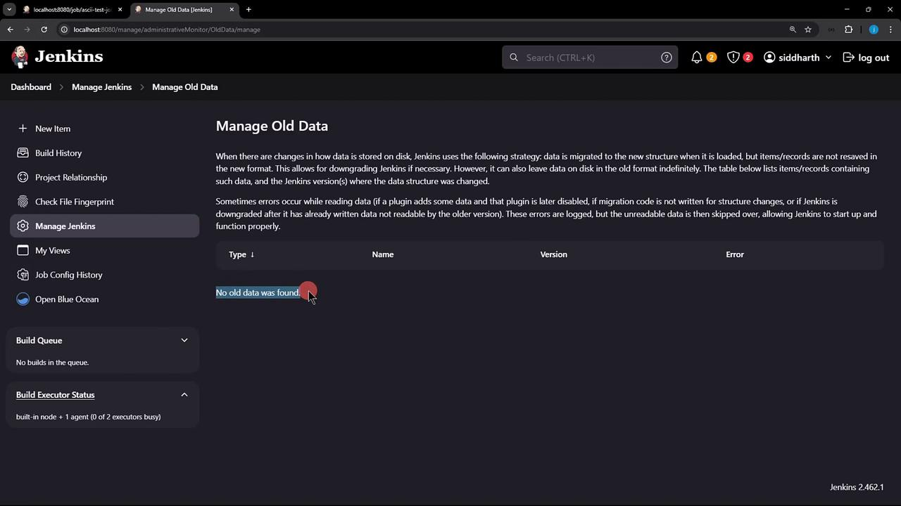
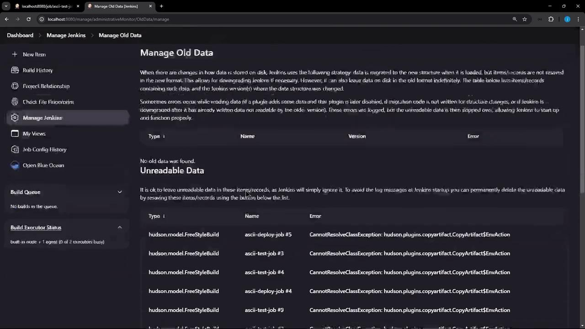

# Demo Manage Old Data

Source: https://notes.kodekloud.com/docs/Certified-Jenkins-Engineer/Extending-Jenkins-and-Administration/Demo-Manage-Old-Data/page

This article explains how to manage and remove orphaned plugin configurations in Jenkins after uninstalling plugins.

When you uninstall a plugin in Jenkins, its configuration remains in existing jobs. Jenkins’s **Manage Old Data** feature helps you locate and remove these orphaned settings to prevent unexpected behaviors.

## 1. Leftover Plugin Configuration

Even after removing the [Copy Artifact plugin](https://plugins.jenkins.io/copyartifact/), job XML still holds references to it:

```xml theme={null}
<project>
  <builders>
    <hudson.plugins.copyartifact.CopyArtifact plugin="copyartifact">
      <project>ascii-build-job</project>
      <filter>advice.json</filter>
      <selector class="hudson.plugins.copyartifact.StatusBuildSelector"/>
    </hudson.plugins.copyartifact.CopyArtifact>
    <hudson.tasks.Shell>
      <command>ls advice.json && cat advice.json | jq -r .slip.advice > advice.message && \
[ $(wc -w &lt; advice.message) -gt 5 ] && echo "Advice - $(cat advice.message) has more than 5 words" && exit 1</command>
    </hudson.tasks.Shell>
  </builders>
</project>
```

Reinstalling the plugin simply re-enables this existing configuration without warning.

## 2. Accessing the Manage Old Data Page

1. Navigate to **Manage Jenkins** → **Troubleshooting** → **Manage Old Data**.
2. Refresh the page. If Jenkins finds no outdated configurations, you’ll see:

<Frame>
  
</Frame>

3. Restart Jenkins to force detection of stale plugin entries.

## 3. Detecting Unreadable Data

After the restart, return to **Manage Old Data**. Now Jenkins lists entries like `CannotResolveClassException` for missing plugins:

<Frame>
  
</Frame>

<Callout icon="lightbulb">
  Unreadable entries indicate XML blocks pointing to plugins that no longer exist. These must be discarded to clean up job configs.
</Callout>

## 4. Discarding Unreadable Data

1. Click **Discard Unreadable Data**.
2. Confirm the prompt to remove all XML fragments referencing the deinstalled plugin.

<Callout icon="triangle-alert">
  Discarding is irreversible. Ensure you’ve backed up your job configurations before proceeding.
</Callout>

## 5. Verifying Cleanup

1. Trigger a build of **ascii-build-job**.
2. Then run **ascii-test-job**.

Before cleaning workspaces, you may still see the old artifact:

```bash theme={null}
+ ls advice.json
advice.json
+ cat advice.json | jq -r .slip.advice
Don't try and bump start a motorcycle on an icy road.
+ wc -w < advice.message
11
+ [ 11 -gt 5 ]
+ echo "Advice - Don't try and bump start a motorcycle on an icy road. has more than 5 words"
Advice - Don't try and bump start a motorcycle on an icy road. has more than 5 words
```

### Cleaning Up Local Workspaces

Remove any leftover files on the Jenkins controller:

| Job Name        | Workspace Path                               | Cleanup Command                                     |
| --------------- | -------------------------------------------- | --------------------------------------------------- |
| ascii-build-job | `/var/lib/jenkins/workspace/ascii-build-job` | `rm -rf /var/lib/jenkins/workspace/ascii-build-job` |
| ascii-test-job  | `/var/lib/jenkins/workspace/ascii-test-job`  | `rm -rf /var/lib/jenkins/workspace/ascii-test-job`  |

```bash theme={null}
rm -rf /var/lib/jenkins/workspace/ascii-build-job
rm -rf /var/lib/jenkins/workspace/ascii-test-job
```

Re-run both jobs. Now **ascii-test-job** will fail because `advice.json` no longer exists:

```bash theme={null}
$ ls advice.json
ls: cannot access 'advice.json': No such file or directory
```

## Conclusion

Uninstalling a Jenkins plugin does not automatically purge its configurations. Use **Manage Jenkins → Troubleshooting → Manage Old Data** to detect and discard stale plugin data. For a complete reset, clean up any residual workspaces on the controller.

## Links and References

* [Copy Artifact Plugin](https://plugins.jenkins.io/copyartifact/)
* [Jenkins System Administration](https://www.jenkins.io/doc/book/managing/system-administration/)
* [Jenkins Backup and Restore](https://www.jenkins.io/doc/book/system-administration/backing-up/)

<CardGroup>
  <Card title="Watch Video" icon="video" href="https://learn.kodekloud.com/user/courses/certified-jenkins-engineer/module/6113113b-7852-401b-9c41-c5bc8242ad99/lesson/1c816b8f-6b3a-4a84-8340-25a0c06a8075" />
</CardGroup>
