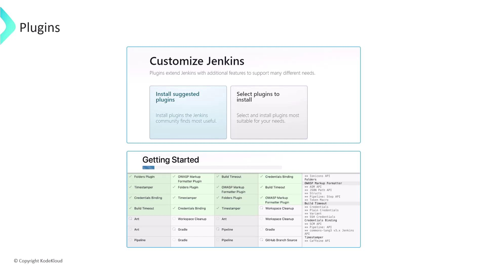
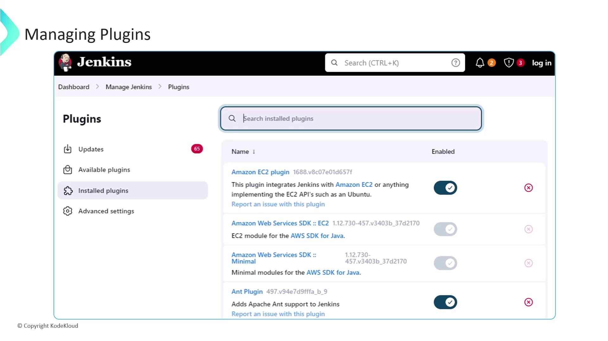

# Jenkins Plugins

Source: https://notes.kodekloud.com/docs/Certified-Jenkins-Engineer/Extending-Jenkins-and-Administration/Jenkins-Plugins/page

Jenkins plugins extend CI/CD pipeline capabilities with integrations for source control, build tools, notifications, security, and cloud services.

Jenkins plugins are the building blocks that extend your CI/CD pipeline’s capabilities. With over 1,900 community-developed plugins, you can integrate source control, build tools, notifications, security scanners, and cloud services into your automation workflow.

## Common Plugin Categories

| Category                  | Purpose                                                         | Example Plugins                               |
| ------------------------- | --------------------------------------------------------------- | --------------------------------------------- |
| Source Control Management | Integrate with Git providers                                    | `Git`, `GitHub Branch Source`                 |
| Build Tools               | Automate builds with popular frameworks                         | `Maven Integration`, `Gradle Plugin`          |
| Quality & Security        | Perform static analysis, code coverage, and vulnerability scans | `SonarQube Scanner`, `OWASP Dependency-Check` |
| Notifications             | Send build and deployment alerts                                | `Slack Notification`, `Email Extension`       |
| Cloud Integrations        | Manage resources on public clouds                               | `AWS Steps`, `Google Cloud Build`             |
| Distributed Builds        | Scale workloads across multiple agents                          | `Distributed Builds Plugin`, `Swarm Plugin`   |

## How Plugins Are Packaged

Jenkins plugins are distributed as JAR archives with `.hpi` (legacy) or `.jpi` (modern) extensions. Each package contains:

* Plugin code (Java/Groovy classes)
* Static resources (JavaScript, CSS)
* Metadata (`pom.xml`, `plugin.xml`)

By default, Jenkins stores them in:

```bash theme={null}
cd /var/lib/jenkins/plugins
```

Jenkins gives priority to a plugin if both `.jpi` and `.hpi` versions are present.

## Installing Plugins

When you set up Jenkins for the first time, choose one of the following:

1. **Install Suggested Plugins**
2. **Select Plugins Manually**

<Callout icon="lightbulb">
  Choosing **Install Suggested Plugins** provides a curated set of essential plugins, making it ideal for newcomers.
</Callout>

<Frame>
  
</Frame>

## Recommended Starter Plugins

* Git Integration
* Pipeline (Workflow)
* Maven Integration
* Gradle Plugin
* Docker Pipeline

## Managing Installed Plugins

After installation, head to **Manage Jenkins ➔ Manage Plugins** to enable, disable, update, or uninstall extensions.

<Callout icon="triangle-alert">
  Removing a plugin can break dependent functionality. Always verify plugin dependencies before uninstalling.
</Callout>

<Frame>
  
</Frame>

### Plugin Update Center

The **Updates** tab shows available plugin updates. Regularly update to benefit from new features and security fixes.

## Next Steps

* Automate plugin installation via Jenkins Configuration as Code
* Explore advanced plugins (Blue Ocean, Kubernetes, Terraform)
* Integrate with external security scanners and compliance tools

## Links and References

* [Jenkins Documentation][jenkins-docs]
* [GitHub][github] | [Bitbucket][bitbucket] | [GitLab][gitlab]
* [Maven][maven] | [Gradle][gradle] | [Node.js][nodejs]
* [Slack][slack] | [PagerDuty][pagerduty]
* [AWS][aws] | [Google Cloud][gcp] | [Azure][azure]

[jenkins-docs]: https://www.jenkins.io/doc/

[github]: https://github.com

[bitbucket]: https://bitbucket.org

[gitlab]: https://gitlab.com

[maven]: https://maven.apache.org

[gradle]: https://gradle.org

[nodejs]: https://nodejs.org

[slack]: https://slack.com

[pagerduty]: https://www.pagerduty.com

[aws]: https://aws.amazon.com

[gcp]: https://cloud.google.com

[azure]: https://azure.microsoft.com

<CardGroup>
  <Card title="Watch Video" icon="video" href="https://learn.kodekloud.com/user/courses/certified-jenkins-engineer/module/6113113b-7852-401b-9c41-c5bc8242ad99/lesson/e8361901-2fcd-4251-895d-75efc0253595" />
</CardGroup>
