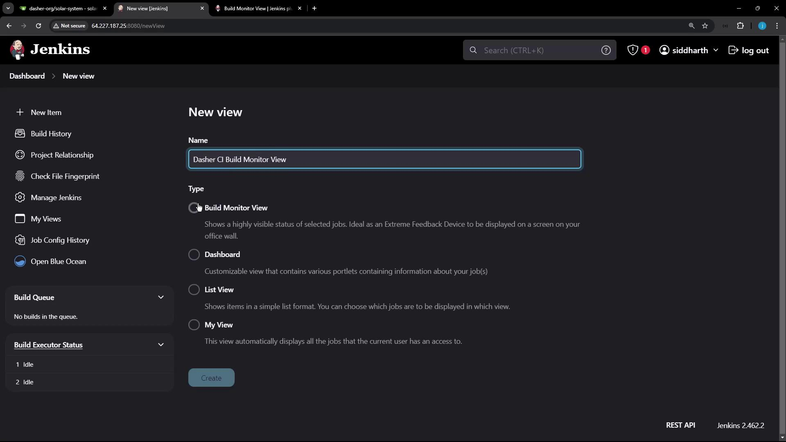
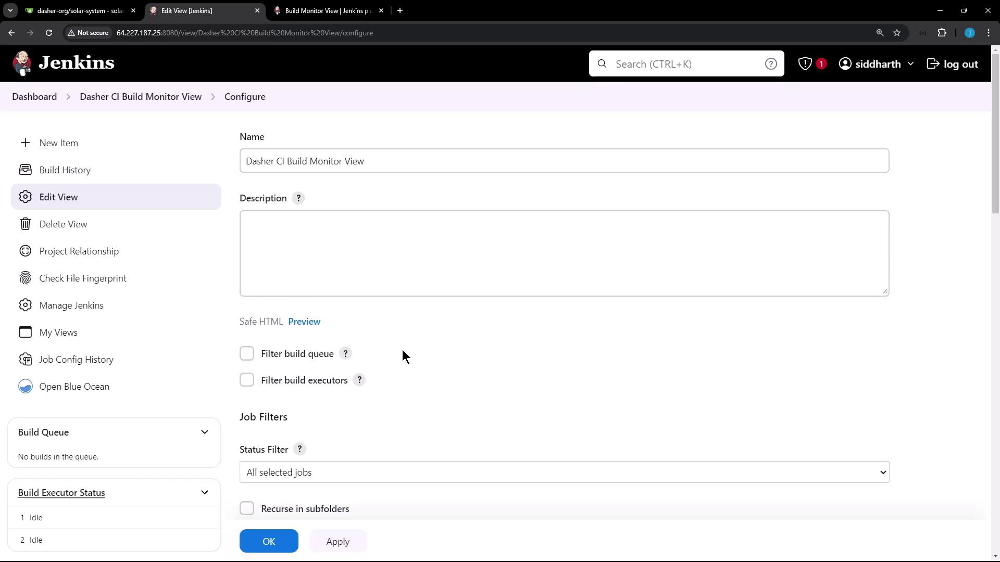
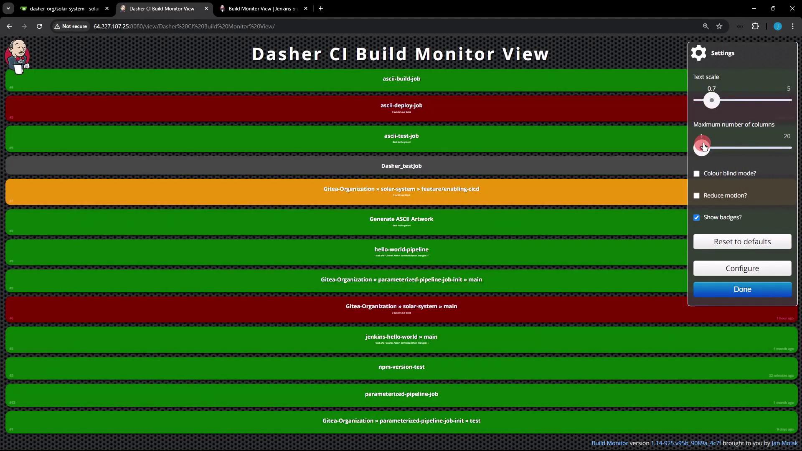
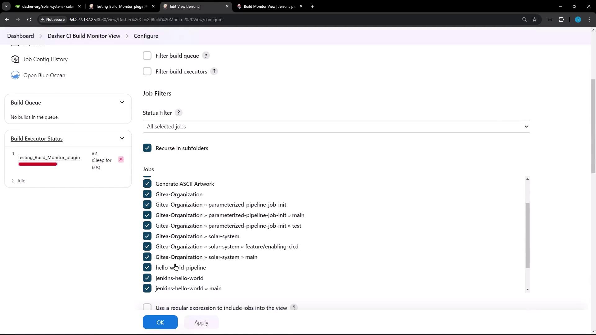

# Demo Build Monitor View

Source: https://notes.kodekloud.com/docs/Certified-Jenkins-Engineer/Jenkins-Administration-and-Monitoring-Part-1/Demo-Build-Monitor-View/page

This tutorial configures the Build Monitor View plugin in Jenkins to create a live dashboard displaying job status and progress.

In this tutorial, we’ll configure the Build Monitor View plugin in Jenkins to create a live dashboard that displays the status, progress, and triggering user for each job. This centralized view refreshes automatically, helping teams spot pipeline health at a glance.

## Prerequisites

<Callout icon="lightbulb">
  Ensure you have administrative access to your Jenkins controller. Install the [Build Monitor View Plugin](https://plugins.jenkins.io/build-monitor-plugin) via **Manage Plugins** and restart Jenkins if prompted.
</Callout>

## 1. Creating a Build Monitor View

1. From the Jenkins dashboard, click **New View**.
2. Enter a name (e.g., **Dasher CI Build Monitor View**), select **Build Monitor View**, and click **OK**.

<Frame>
  
</Frame>

3. On the configuration page, optionally add a description and set up your job filters:
   * Select individual jobs
   * Use a regular expression for dynamic inclusion
   * Choose all available jobs
4. Click **Apply** and then **Save**.

<Frame>
  
</Frame>

## 2. Configuring Display Options

Once saved, the Build Monitor View presents tiles for each job. You can customize the dashboard using these settings:

| Option            | Description                        |
| ----------------- | ---------------------------------- |
| Text scale        | Adjust the font size of job tiles  |
| Number of columns | Define how many columns to display |
| Colorblind mode   | Enable high-contrast color palette |
| Reduce motion     | Disable CSS animations             |
| Show badges       | Display build badges (e.g., PR #)  |
| Reset to defaults | Restore original settings          |

Each tile also shows the current pipeline stage and elapsed time. Status colors:

* **Green**: Success
* **Red**: Failure
* **Orange**: Unstable

<Frame>
  
</Frame>

## 3. Adding a Test Pipeline

To observe live updates in your monitor view, create a simple Pipeline job:

1. Click **New Item**, enter `Testing_Build_Monitor_plugin`, choose **Pipeline**, and click **OK**.
2. Under **Pipeline** > **Definition**, paste the following script:

```groovy theme={null}
pipeline {
  agent any
  stages {
    stage('Hello') {
      steps {
        echo 'Hello World'
      }
    }
    stage('Sleep for 60s') {
      steps {
        sh 'sleep 60s'
      }
    }
  }
}
```

3. Click **Apply** and **Save**.
4. Trigger a build via **Build Now** and watch the console:

```shell theme={null}
Started by user siddharth
[Pipeline] Start of Pipeline
[Pipeline] node
Running on Jenkins in /var/lib/jenkins/workspace/Testing_Build_Monitor_plugin
[Pipeline] stage
[Pipeline] { (Hello)
[Pipeline] echo
Hello World
[Pipeline] }
[Pipeline] stage
[Pipeline] { (Sleep for 60s)
[Pipeline] sh
+ sleep 60s
```

## 4. Adding the Job to the Monitor View

If your new Pipeline doesn’t appear automatically, update the view filters:

1. Navigate to your Build Monitor View and click **Configure**.
2. In **Job Filters**, select or add a regex matching `Testing_Build_Monitor_plugin`.
3. Click **Apply** and **Save**.

<Frame>
  
</Frame>

After saving, the dashboard will display the pipeline’s current stage and elapsed time. Upon completion, the tile turns green and shows summary details such as the triggering user, branch, and final build status.

## Links and References

* [Build Monitor View Plugin](https://plugins.jenkins.io/build-monitor-plugin)
* [Jenkins Pipeline Syntax](https://www.jenkins.io/doc/book/pipeline/syntax/)
* [Jenkins Official Documentation](https://www.jenkins.io/doc/)

<CardGroup>
  <Card title="Watch Video" icon="video" href="https://learn.kodekloud.com/user/courses/certified-jenkins-engineer/module/bf3ddc28-a03d-4738-9f98-2779d81482f5/lesson/95f4d38b-2c6b-461c-b202-d511d091c204" />
</CardGroup>
