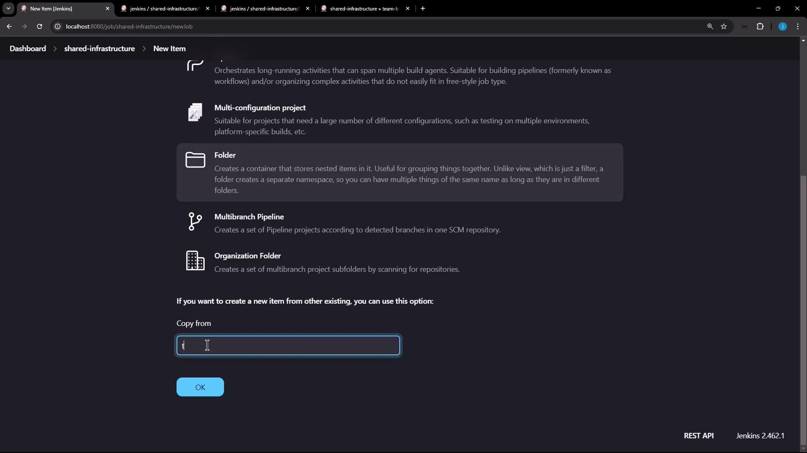
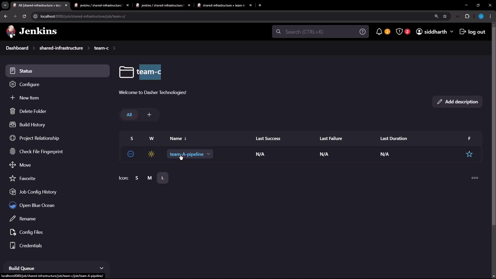
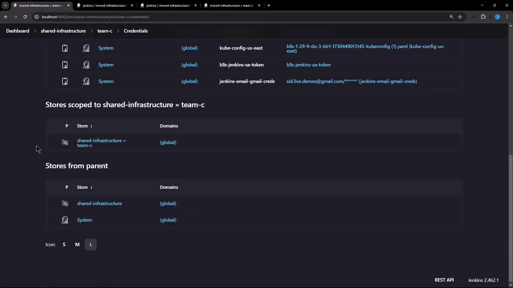

# Demo Jenkins Folder Part 3

Source: https://notes.kodekloud.com/docs/Certified-Jenkins-Engineer/Jenkins-Administration-and-Monitoring-Part-1/Demo-Jenkins-Folder-Part-3/page

This guide explains how to clone a Jenkins folder configuration from Team A to Team C, inheriting pipelines, credentials, and settings.

In this guide, you’ll learn how to clone an existing Jenkins folder configuration—**team-a**—to a new folder named **team-c**. By copying the folder, Team C automatically inherits pipelines, credentials, and settings from Team A, ensuring consistency and reducing setup time.

## Table of Contents

1. [Creating the Team C Folder](#creating-the-team-c-folder)
2. [Verifying the Copied Pipelines](#verifying-the-copied-pipelines)
3. [Accessing Inherited Credentials](#accessing-inherited-credentials)
4. [Triggering and Viewing the Build](#triggering-and-viewing-the-build)
5. [Sample Console Output](#sample-console-output)
6. [References](#references)

***

## Creating the Team C Folder

1. In Jenkins, click **New Item**.
2. Enter **team-c** for the folder name.
3. Select **Folder** as the item type.
4. Under **Copy from**, search for and choose **team-a**.
5. Click **OK** to confirm.

<Frame>
  
</Frame>

Jenkins will replicate all projects, credentials, and folder-level settings from **team-a** into **team-c**.

<Callout icon="lightbulb">
  Copied folder items (jobs) inherit the **disabled** state. You must manually enable them before running builds.
</Callout>

***

## Verifying the Copied Pipelines

Navigate into the newly created **team-c** folder. You should see **team-a-pipeline** listed—this confirms the pipeline configuration has been cloned successfully.

<Frame>
  
</Frame>

Open the pipeline’s **Configure** view and compare it to Team A’s pipeline to ensure all stages and steps match.

***

## Accessing Inherited Credentials

Since **team-c** inherits from **team-a**, it also has access to both the Shared Infrastructure credentials and the Team A credentials. Verify under **Credentials** → **team-c** → **shared-infrastructure**.

<Frame>
  
</Frame>

In your `Jenkinsfile`, use a `withCredentials` block to bind these credentials to environment variables:

```groovy theme={null}
pipeline {
    agent any
    stages {
        stage('Accessing Credentials') {
            steps {
                withCredentials([
                    usernamePassword(
                        credentialsId: 'shared-db-creds-id',
                        usernameVariable: 'SHARED_DB_USR',
                        passwordVariable: 'SHARED_DB_PSW'
                    ),
                    usernamePassword(
                        credentialsId: 'team-a-creds-id',
                        usernameVariable: 'TEAM_A_USR',
                        passwordVariable: 'TEAM_A_PSW'
                    )
                ]) {
                    script {
                        echo "Shared DB Username: ${SHARED_DB_USR}"
                        echo "Team A Username: ${TEAM_A_USR}"
                    }
                }
            }
        }
    }
    post {
        success { echo "Build completed successfully" }
        failure { echo "Build failed" }
    }
}
```

### Credentials Reference Table

| Credential ID      | Bound Variables                      | Purpose                               |
| ------------------ | ------------------------------------ | ------------------------------------- |
| shared-db-creds-id | SHARED\_DB\_USR<br />SHARED\_DB\_PSW | Shared infrastructure database access |
| team-a-creds-id    | TEAM\_A\_USR<br />TEAM\_A\_PSW       | Team A-specific secrets               |

***

## Triggering and Viewing the Build

1. Inside **team-c**, open **team-a-pipeline** → **Configure** and click **Save** to enable the job.
2. Click **Build Now** on the pipeline page.
3. Monitor the progress: each stage, including “Start,” “Accessing Credentials,” and “Post Actions,” should complete successfully.

<Frame>
  
</Frame>

***

## Sample Console Output

```text theme={null}
Started by user siddharth
[Pipeline] Start of Pipeline
[Pipeline] node
Running on Jenkins in /var/lib/jenkins/workspace/shared-infrastructure/team-c/team-a-pipeline
[Pipeline] withCredentials
Masking supported pattern matches of $TEAM_A_USR or $TEAM_A_PSW or $SHARED_DB_USR or $SHARED_DB_PSW
[Pipeline] stage
[Pipeline] { (Accessing Credentials)
[Pipeline] script
[Pipeline] echo
Shared DB Username: shared-DATABASE-username
[Pipeline] echo
Team A Username: team-AAAAA-username
[Pipeline] }
[Pipeline] // script
[Pipeline] stage
[Pipeline] { (Declarative: Post Actions)
[Pipeline] echo
Build completed successfully
[Pipeline] }
```

By cloning **team-a** into **team-c**, you ensure all pipelines, credentials, and folder-level configurations are inherited, streamlining setup for new teams and maintaining organizational standards.

***

## References

* [Jenkins Folders Plugin](https://plugins.jenkins.io/cloudbees-folder/)
* [Jenkins Credentials Binding Plugin](https://plugins.jenkins.io/credentials-binding/)
* [Declarative Pipeline Syntax](https://www.jenkins.io/doc/book/pipeline/syntax/)

<CardGroup>
  <Card title="Watch Video" icon="video" href="https://learn.kodekloud.com/user/courses/certified-jenkins-engineer/module/bf3ddc28-a03d-4738-9f98-2779d81482f5/lesson/e54cd5e0-dd8b-42d8-9728-6d2de8352453" />
</CardGroup>
