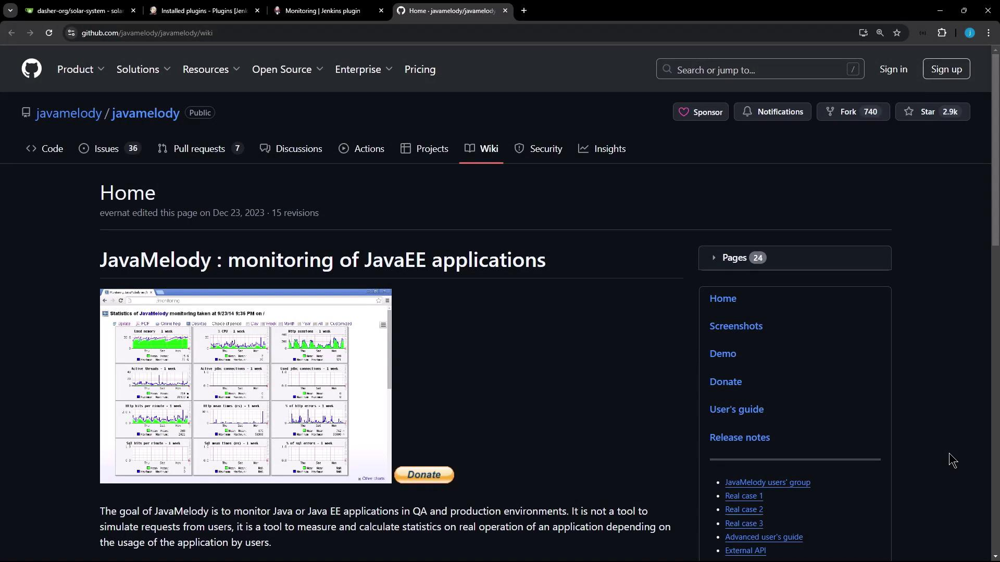
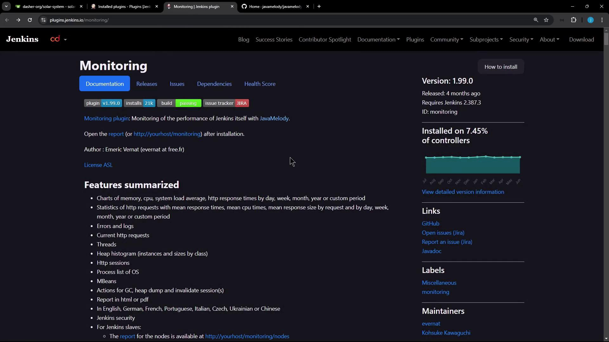
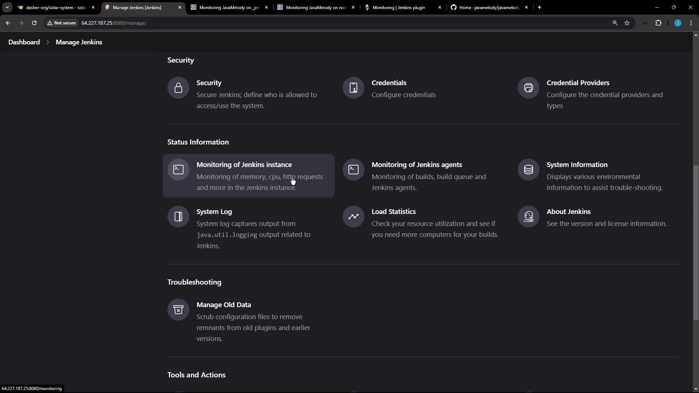
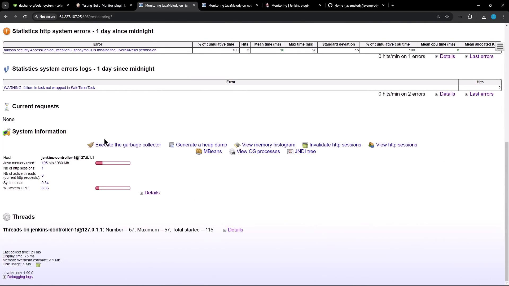

# Demo Monitoring using Java Melody

Source: https://notes.kodekloud.com/docs/Certified-Jenkins-Engineer/Jenkins-Administration-and-Monitoring-Part-1/Demo-Monitoring-using-Java-Melody/page

This guide explains how to monitor Jenkins using JavaMelody, tracking performance metrics like memory usage, CPU load, and HTTP requests.

In this guide, you will learn how to monitor your Jenkins controller and agents using **JavaMelody**, an open-source performance monitoring tool for Java applications. By the end, you’ll be able to track real-time metrics such as memory usage, CPU load, HTTP requests, and thread activity directly within your Jenkins UI.

## What Is JavaMelody?

[JavaMelody](https://github.com/javamelody/javamelody/wiki) provides in-depth dashboards for JavaEE applications, capturing critical performance data:

<Frame>
  
</Frame>

Key metrics tracked by JavaMelody:

* Memory usage (heap & non-heap)
* CPU load and system load averages
* HTTP request counts, mean/max durations
* Thread states and peak thread counts
* Error rates and log analysis

<Callout icon="lightbulb">
  JavaMelody supports HTML and PDF report generation, multi-language UI, and integrates seamlessly into any Java web application.
</Callout>

## Integrating JavaMelody with Jenkins

Jenkins is Java-based, so you can leverage the **Monitoring** plugin to embed JavaMelody into your controller and agents.

1. Go to **Manage Jenkins > Manage Plugins**.
2. Search for **Monitoring** and install the plugin.
3. Restart your Jenkins controller to activate JavaMelody.

<Callout icon="triangle-alert">
  Installing monitoring plugins may introduce additional JVM overhead. Monitor resource usage on production systems before rolling out cluster-wide.
</Callout>

For full documentation, visit the [Monitoring Plugin page](https://plugins.jenkins.io/monitoring/).

<Frame>
  
</Frame>

### Plugin Features

| Metric Category   | Details                                                     |
| ----------------- | ----------------------------------------------------------- |
| Memory & CPU      | Heap/non-heap usage, system CPU, process CPU, load averages |
| HTTP Requests     | Request counts, cumulative times, mean/max durations        |
| Thread Monitoring | Active vs. idle threads, creation rate, peak usage          |
| Errors & Logs     | Exception counts, log severity breakdown                    |
| Reporting         | Export HTML or PDF reports                                  |
| Localization      | English, German, French, and more                           |

## Accessing the Monitoring Dashboard

After restarting Jenkins, navigate to **Manage Jenkins** and scroll down to the **Monitoring of Jenkins Instance** and **Monitoring of Jenkins Agents** sections:

<Frame>
  
</Frame>

### Controller (Jenkins Instance) Monitoring

Click **Monitoring of Jenkins Instance** to open the JavaMelody dashboard for your controller. You’ll find:

* **System Information**
  * JVM vendor/version, OS name, uptime
* **Memory & CPU Charts**
  * Real-time graphs for heap/non-heap and CPU usage
* **HTTP Request Statistics**
  * Table of endpoints with hits, cumulative time, mean/max durations
* **Thread States**
  * Active vs. idle threads, thread creation rate

<Frame>
  
</Frame>

At the top, adjust the time window for all charts or click **PDF report** to export metrics for sharing.

### Agent (Node) Monitoring

Under **Monitoring of Jenkins Agents**, select any connected node to view:

* Garbage collection triggers
* Heap dump generation
* Memory histogram visualizations
* Active HTTP session details (client country, browser, user)

If only one agent is online, data will be limited, but additional nodes will appear as they connect.

## Observing Live Build Metrics

To see JavaMelody update in real time:

1. Create a Jenkins pipeline with a sleep/pause stage (e.g., `sleep 60`).
2. Trigger the job and keep the monitoring dashboard open.
3. Refresh periodically to watch thread counts rise, HTTP sessions form, and CPU usage spike.

<Frame>
  
</Frame>

In the **Threads** section, you’ll observe:

* Total vs. active threads
* Thread creation rate spikes during builds
* Peak usage metrics

Real-time insights help you identify bottlenecks and optimize Jenkins performance.

***

## Links and References

* [JavaMelody Wiki](https://github.com/javamelody/javamelody/wiki)
* [Jenkins Monitoring Plugin](https://plugins.jenkins.io/monitoring/)
* [Jenkins Documentation](https://www.jenkins.io/doc/)

<CardGroup>
  <Card title="Watch Video" icon="video" href="https://learn.kodekloud.com/user/courses/certified-jenkins-engineer/module/bf3ddc28-a03d-4738-9f98-2779d81482f5/lesson/1758f40c-870d-4e20-b055-b8f55692b438" />
</CardGroup>
