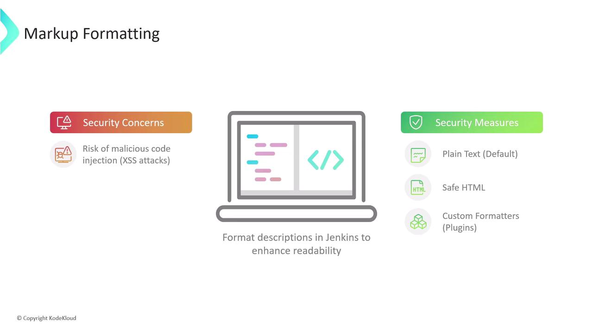
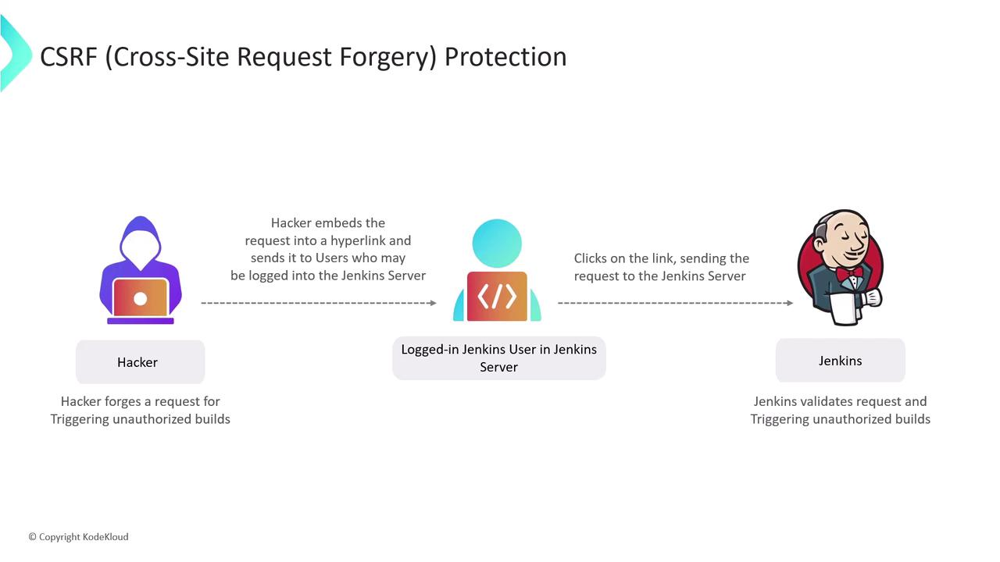
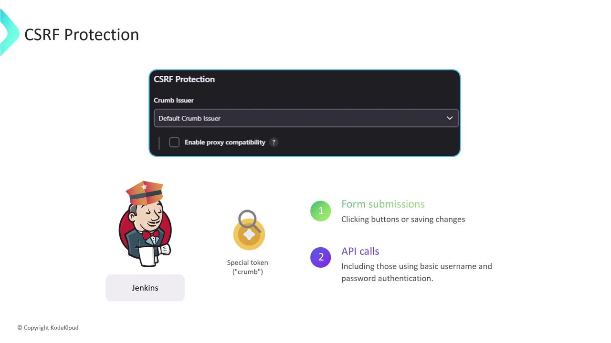

# Global Security Settings

Source: https://notes.kodekloud.com/docs/Certified-Jenkins-Engineer/Jenkins-Administration-and-Monitoring-Part-1/Global-Security-Settings/page

This guide explores Jenkins global security settings, focusing on markup formatting and CSRF protection to enhance CI/CD environment security.

In this guide, we dive into Jenkins’ global security settings to help you harden your CI/CD environment. By default, Jenkins enables strong security controls—think of them as locked doors and windows. Occasionally, you might need to relax these settings for specific integrations or troubleshooting. Always revert to the recommended defaults once your tasks are complete.

We’ll cover:

* **Markup Formatting**: Preventing [XSS attacks](https://owasp.org/www-community/attacks/xss)
* **CSRF Protection**: Defending against [CSRF exploits](https://owasp.org/www-community/attacks/csrf)

***

## 1. Markup Formatting

User-supplied descriptions (job descriptions, system messages, view notes) are rendered with a chosen formatter. Without proper controls, malicious users could inject HTML or scripts, leading to cross-site scripting vulnerabilities.

| Formatter Option                | Description                                                      | Tags Allowed                     |
| ------------------------------- | ---------------------------------------------------------------- | -------------------------------- |
| Plain text (default)            | Safest choice: escapes all HTML so it renders literally as text. | None                             |
| Safe HTML                       | Allows a small, sanitized subset of HTML for basic styling.      | `<b>`, `<i>`, `<u>`, `<p>`, etc. |
| Custom formatters (via plugins) | Richer formatting; requires careful plugin selection and review. | Varies by plugin                 |

<Frame>
  
</Frame>

### 1.1 Plain Text Formatter

With **Plain text**, all markup is escaped:

```html theme={null}
<p>Welcome to <strong><span style="color: rgb(235, 107, 86);">KodeKloud</span></strong> Jenkins Controller</p>
<script>alert('XSS');</script>
```

Renders as:

```HTML theme={null}
<p>Welcome to <strong><span style="color: rgb(235, 107, 86);">KodeKloud</span></strong> Jenkins Controller</p>
<script>alert('XSS');</script>
```

<Callout icon="lightbulb">
  Plain text is ideal for high-security environments where formatting isn’t required.
</Callout>

### 1.2 Safe HTML Formatter

The **Safe HTML** option strips unsafe elements (like `<script>`) but lets through simple styling tags:

```html theme={null}
<p>Welcome to <strong><span style="color: rgb(235, 167, 86);">KodeKloud</span></strong> Jenkins Controller</p>
<script>alert('XSS');</script>
```

Renders as:
<p>Welcome to <strong><span>KodeKloud</span></strong> Jenkins Controller</p>

<Callout icon="triangle-alert">
  Even with Safe HTML, avoid embedding untrusted content. Review any custom tags allowed by your HTML sanitizer.
</Callout>

***

## 2. CSRF (Cross-Site Request Forgery) Protection

**CSRF attacks** trick authenticated users into submitting unintended requests—triggering builds, deleting artifacts, or changing settings without consent.

### 2.1 How CSRF Works

1. Attacker crafts a malicious link or form targeting a Jenkins endpoint.
2. Authenticated user clicks the link while logged into Jenkins.
3. Jenkins executes the request under the user’s credentials, unaware it wasn’t initiated from the UI.

<Frame>
  
</Frame>

### 2.2 Enabling Crumb-Based Protection

Jenkins defends against CSRF by issuing a **crumb** (token) for every form and state-changing API call. Requests missing a valid crumb are rejected.

* **Enable CSRF Protection**\
  In **Manage Jenkins > Configure Global Security**, ensure “Prevent Cross Site Request Forgery exploits” is checked. Jenkins will use the default crumb issuer or a custom implementation.

* **Educate Users**\
  Remind team members to avoid clicking unknown links while logged into Jenkins.

By default, crumb protection is **enabled** in Jenkins—keep it that way.

<Frame>
  
</Frame>

***

## Further Reading & References

* [Jenkins Security Documentation](https://www.jenkins.io/doc/book/security/)
* [OWASP XSS Prevention Cheat Sheet](https://owasp.org/www-project-cheat-sheets/cheatsheets/Cross_Site_Scripting_Prevention_Cheat_Sheet.html)
* [OWASP CSRF Prevention Cheat Sheet](https://owasp.org/www-project-cheat-sheets/cheatsheets/Cross-Site_Request_Forgery_Prevention_Cheat_Sheet.html)

<CardGroup>
  <Card title="Watch Video" icon="video" href="https://learn.kodekloud.com/user/courses/certified-jenkins-engineer/module/bf3ddc28-a03d-4738-9f98-2779d81482f5/lesson/10ce6813-2dd0-4609-aa79-42939d610a7a" />
</CardGroup>
