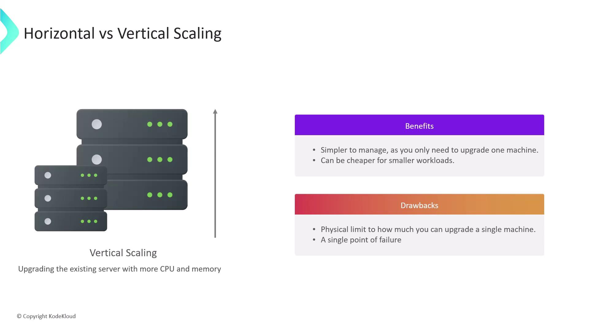

# Jenkins Scaling Capacity Planning

Source: https://notes.kodekloud.com/docs/Certified-Jenkins-Engineer/Jenkins-Administration-and-Monitoring-Part-1/Jenkins-Scaling-Capacity-Planning/page

This guide explores horizontal and vertical scaling strategies for Jenkins, focusing on resource provisioning, workload distribution, and ensuring high availability.

Effective capacity planning is crucial as your CI/CD workloads grow. In this guide, we explore the two primary scaling strategies—horizontal and vertical—and show how to apply them to a Jenkins environment. You’ll learn how to provision resources, distribute workloads, and ensure high availability for your Jenkins pipelines.

## Horizontal vs. Vertical Scaling

When demand rises, you have two main options:

| Scaling Strategy       | Description                                           | Key Benefits                                                                      | Key Drawbacks                                                                      |
| ---------------------- | ----------------------------------------------------- | --------------------------------------------------------------------------------- | ---------------------------------------------------------------------------------- |
| Horizontal (Scale-Out) | Add more servers or nodes to share the load           | • Fast capacity increase • Better fault tolerance                            | • More infrastructure to manage • Potential over-capacity for light workloads |
| Vertical (Scale-Up)    | Upgrade CPU, memory, or storage on an existing server | • Easier single-node management • Cost-effective for steady, small workloads | • Hardware limits • Single point of failure                                   |

### Horizontal Scaling (Scale-Out)

* **Quick provisioning**: Spin up additional servers or containers.
* **Resilience**: If one node fails, others continue processing jobs.
* **Elasticity**: Automatically add or remove agents based on queue length.

<Frame>
  
</Frame>

### Vertical Scaling (Scale-Up)

* **Resource boost**: Increase CPU cores, RAM, or disk on your master node.
* **Simplified setup**: Only one instance to monitor and secure.
* **Cost savings**: May be cheaper for predictable, low-traffic workloads.

<Frame>
  
</Frame>

## Applying Scaling to Jenkins

As CI/CD adoption spreads, a single Jenkins controller can become a bottleneck. Build jobs, plugins, and user sessions all consume heap memory and CPU, leading to longer garbage-collection pauses and potential downtime.

<Callout icon="lightbulb">
  Refer to the [Jenkins System Requirements](https://www.jenkins.io/doc/book/operating/system-requirements/) before planning upgrades or adding agents.
</Callout>

### Limits of Vertical Scaling in Jenkins

* Increasing heap size can worsen GC pause times.
* Physical hardware upgrades hit a ceiling and require maintenance windows.
* One controller means one failure can pause all pipelines.

<Callout icon="triangle-alert">
  Relying solely on vertical scaling creates a **single point of failure**—if the master node goes down, all CI/CD pipelines stop.
</Callout>

### Embracing Horizontal Scaling with Build Agents

Distribute workloads by adding Jenkins agents (nodes):

* **Offload builds**: Keep the controller lean by running heavy jobs on agents.
* **High availability**: Agent failures don’t impact the master’s uptime.
* **Rolling upgrades**: Update or replace individual agents without halting your CI/CD pipeline.

<Frame>
  
</Frame>

## Conclusion

For most growing Jenkins environments, horizontal scaling—deploying and managing multiple build agents—offers superior resilience and performance. Combine this with a scalable storage solution for artifacts and logs to complete your capacity-planning strategy.

## Links and References

* [Jenkins Official Documentation](https://www.jenkins.io/doc/)
* [CI/CD Best Practices](https://www.redhat.com/en/topics/devops/what-is-ci-cd)
* [Docker Hub](https://hub.docker.com/)
* [Terraform Registry](https://registry.terraform.io/)

<CardGroup>
  <Card title="Watch Video" icon="video" href="https://learn.kodekloud.com/user/courses/certified-jenkins-engineer/module/bf3ddc28-a03d-4738-9f98-2779d81482f5/lesson/8ef1f4bf-f678-4ec1-a9bd-44b96037bd75" />
</CardGroup>
