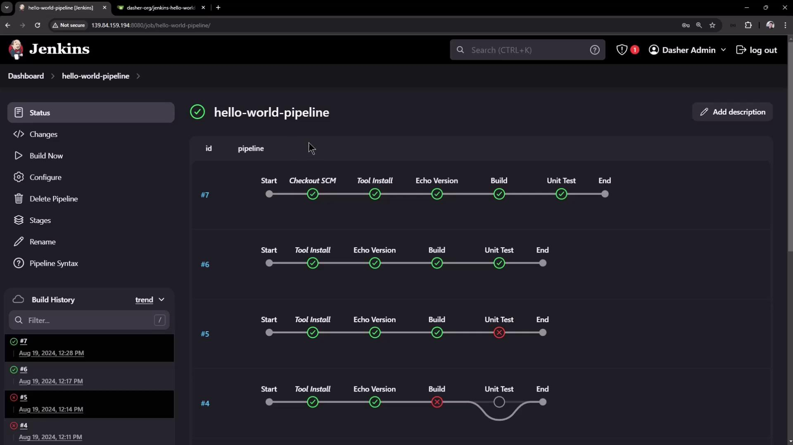
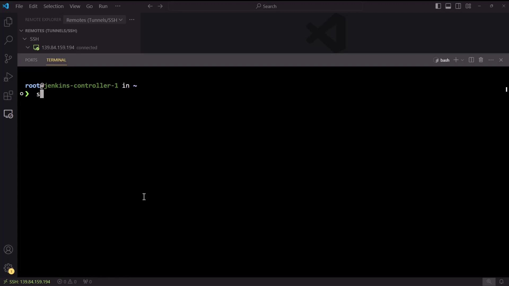
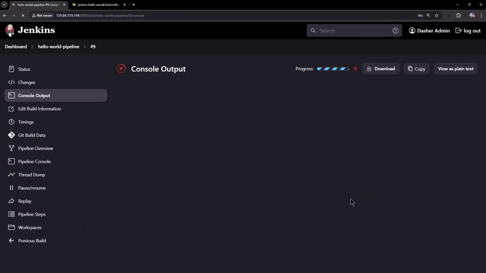
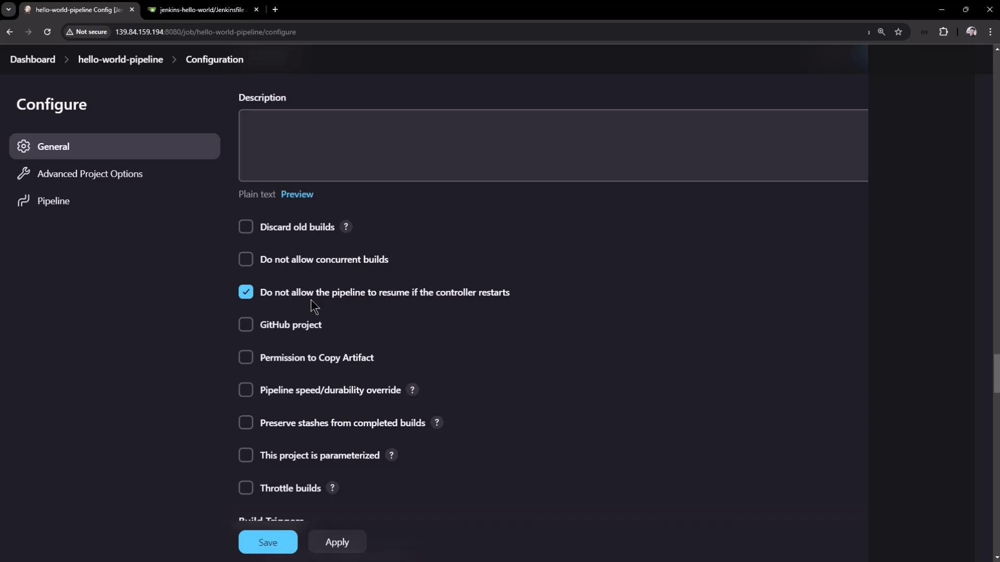

# Demo Controller Failure Pipeline Project

Source: https://notes.kodekloud.com/docs/Certified-Jenkins-Engineer/Jenkins-Pipelines/Demo-Controller-Failure-Pipeline-Project/page

This guide demonstrates modifying a Jenkins Pipeline to handle controller failures and resume from checkpoints.

A controller restart typically disrupts Freestyle jobs, but Jenkins Pipelines are checkpointed and can resume after a reboot. In this guide, you’ll modify a simple “Hello World” Pipeline to include a long-running loop, then simulate a controller failure mid-build and observe Jenkins resume from the last checkpoint.

## Prerequisites

| Component         | Requirement                                                                         |
| ----------------- | ----------------------------------------------------------------------------------- |
| Jenkins           | 2.x with the [Pipeline Plugin](https://www.jenkins.io/doc/book/pipeline/) installed |
| Maven             | “M3” configured under **Manage Jenkins > Global Tool Configuration**                |
| GitHub Repository | Contains your `Jenkinsfile` and sample code                                         |
| SSH Access        | To start/stop the Jenkins controller service                                        |

<Callout icon="lightbulb">
  Ensure your Jenkins controller has sufficient permissions to stop and start the service via `systemctl`.
</Callout>

***

## 1. Add a Long-Running Loop to the Pipeline

Open your Pipeline’s `Jenkinsfile` and locate the **Unit Test** stage. Here’s the original Declarative Pipeline:

```groovy theme={null}
pipeline {
    agent any
    tools {
        maven 'M3'
    }
    stages {
        stage('Echo Version') {
            steps {
                sh 'echo Print Maven Version'
                sh 'mvn -version'
            }
        }
        stage('Build') {
            steps {
                sh 'mvn clean package -DskipTests=true'
            }
        }
        stage('Unit Test') {
            steps {
                sh 'mvn test'
            }
        }
    }
}
```

### 1.1 Why a Direct Loop Fails

If you insert a Groovy `for` loop directly under `steps`, Declarative syntax rejects it:

```groovy theme={null}
stage('Unit Test') {
    steps {
        // This will error out
        for (int i = 0; i < 60; i++) {
            echo "${i + 1}"
            sleep 1
        }
        sh 'mvn test'
    }
}
```

### 1.2 Wrapping the Loop in a `script` Block

Correct the syntax by enclosing the loop inside a `script {}` step:

```groovy theme={null}
pipeline {
    agent any
    tools {
        maven 'M3'
    }
    stages {
        stage('Echo Version') {
            steps {
                sh 'echo Print Maven Version'
                sh 'mvn -version'
            }
        }
        stage('Build') {
            steps {
                sh 'mvn clean package -DskipTests=true'
            }
        }
        stage('Unit Test') {
            steps {
                script {
                    for (int i = 0; i < 60; i++) {
                        echo "${i + 1}"
                        sleep 1
                    }
                }
                sh 'mvn test'
            }
        }
    }
}
```

Commit and push to `main`, then trigger the build in Jenkins.

<Frame>
  
</Frame>

***

## 2. Trigger the Build and Observe the Loop

In **Pipeline Steps**, you’ll see logs like:

```plaintext theme={null}
[Pipeline] script
[Pipeline] { (Unit Test)
[Pipeline] echo
1
[Pipeline] sleep
Sleeping for 1 sec
...
[Pipeline] echo
15
[Pipeline] sleep
Sleeping for 1 sec
```

Allow the loop to run to around **step 37** before interrupting the controller.

***

## 3. Stop the Jenkins Controller Mid-Loop

SSH into your Jenkins controller and halt the service:

```bash theme={null}
sudo systemctl stop jenkins
sudo systemctl status jenkins
```

<Frame>
  
</Frame>

The Pipeline log will freeze at the last echo (e.g., **38**).

***

## 4. Restart Jenkins and Refresh the Console

Bring Jenkins back online:

```bash theme={null}
sudo systemctl restart jenkins
```

After a few seconds, refresh the **Console Output** for your running job:

<Frame>
  
</Frame>

You should see Jenkins resume:

```plaintext theme={null}
Resuming build at Mon Aug 19 18:00:22 UTC 2024 after Jenkins restart
No need to sleep any longer
Ready to run at Mon Aug 19 18:00:23 UTC 2024
[Pipeline] sleep
Sleeping for 1 sec
[Pipeline] echo
39
...
[Pipeline] echo
60
[Pipeline] sleep
Sleeping for 1 sec
[Pipeline] sh
+ mvn test
[INFO] --- surefire:3.2.5:test (default-test) @ hello-demo ---
```

The build continues from the last checkpoint and completes successfully.

***

## 5. Disabling Resume After Controller Restart

By default, Pipelines pick up after a restart. To enforce an abort-on-restart policy:

1. In Jenkins, select **Configure** on your Pipeline project.
2. Under **Build Triggers**, check **Do not allow the pipeline to resume if the controller restarts**.

<Frame>
  
</Frame>

<Callout icon="triangle-alert">
  Disabling resume will abort any in-progress Pipeline if the controller restarts. Use this only when you need a strict abort-on-restart policy.
</Callout>

***

## Conclusion

Jenkins Pipelines are designed for resilience. By checkpointing the pipeline state, Jenkins can survive controller restarts and resume where it left off. Use this feature for long-running stages, or disable it when an immediate abort is required on controller failure.

***

## References

* [Jenkins Pipeline Syntax](https://www.jenkins.io/doc/book/pipeline/syntax/)
* [Declarative Pipeline](https://www.jenkins.io/doc/book/pipeline/syntax/#declarative-pipeline)
* [Pipeline: Groovy](https://www.jenkins.io/doc/book/pipeline/groovy/)

<CardGroup>
  <Card title="Watch Video" icon="video" href="https://learn.kodekloud.com/user/courses/certified-jenkins-engineer/module/054c2c42-f54a-42a4-ab39-4b432a36aaa1/lesson/a372a6a4-5c21-493e-8fa4-f1916ad23685" />
</CardGroup>
