# Demo Create Pipeline with Parameters

Source: https://notes.kodekloud.com/docs/Certified-Jenkins-Engineer/Jenkins-Pipelines/Demo-Create-Pipeline-with-Parameters/page

This tutorial teaches how to create a parameterized Jenkins pipeline for flexible CI/CD workflows without duplicating the Jenkinsfile.

In this tutorial, you’ll learn how to build a single, parameterized Jenkins pipeline that can switch between branches, customize ports, and adjust timeouts—all without duplicating your Jenkinsfile. Parameterized pipelines make your CI/CD workflows more flexible and maintainable.

## What Is a Parameterized Pipeline?

A parameterized build in Jenkins lets you define input variables that users can set at build time. This approach helps you:

* Reuse the same pipeline for multiple branches or environments
* Pass dynamic values such as branch names, ports, or timeouts
* Reduce Jenkinsfile duplication and improve maintainability

## Example Repository

We’ll use the **parameterized-pipeline-job-init** GitHub repository, which contains a simple Spring Boot “Hello World” application. There are two branches:

* **main**: Production pipeline with containerization and Kubernetes deployment
* **test**: Basic pipeline that builds, tests, and deploys locally

<Frame>
  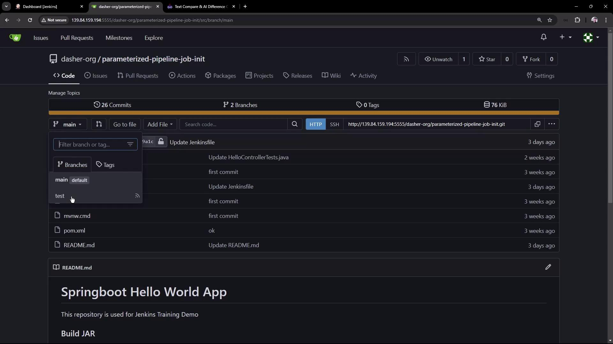
</Frame>

### Pipeline Definition: `test` Branch

```groovy theme={null}
pipeline {
    agent any
    tools { maven 'M398' }
    stages {
        stage('Maven Version') {
            steps {
                sh 'echo Print Maven Version'
                sh 'mvn -version'
            }
        }
        stage('Build') {
            steps {
                sh 'mvn clean package -DskipTests=true'
                archiveArtifacts 'target/hello-demo-*.jar'
            }
        }
        stage('Test') {
            steps {
                sh 'mvn test'
                junit(testResults: 'target/surefire-reports/TEST-*.xml',
                      keepProperties: true,
                      keepTestNames: true)
            }
        }
        stage('Local Deployment') {
            steps {
                sh 'java -jar target/hello-demo-*.jar > /dev/null &'
            }
        }
        stage('Integration Testing') {
            steps {
                sh 'sleep 10s'
                sh 'echo Testing using cURL commands......'
            }
        }
    }
}
```

### Pipeline Definition: `main` Branch

```groovy theme={null}
pipeline {
    agent any
    tools { maven 'M398' }
    stages {
        stage('Build') {
            steps {
                sh 'mvn clean package -DskipTests=true'
                archiveArtifacts 'target/hello-demo-*.jar'
            }
        }
        stage('Test') {
            steps {
                sh 'mvn test'
                junit(testResults: 'target/surefire-reports/TEST-*.xml',
                      keepProperties: true,
                      keepTestNames: true)
            }
        }
        stage('Containerization') {
            steps {
                sh 'echo Docker Build Image..'
                sh 'echo Docker Tag Image....'
                sh 'echo Docker Push Image......'
            }
        }
        stage('Kubernetes Deployment') {
            steps {
                sh 'echo Deploy to Kubernetes using ArgoCD'
            }
        }
        stage('Integration Testing') {
            steps {
                sh 'sleep 10s'
                sh 'echo Testing using cURL commands......'
            }
        }
    }
}
```

## Goal: One Job for Both Branches

Instead of creating separate Jenkins jobs, we’ll parameterize a single pipeline so it can target either branch at build time.

## 1. Create the Parameterized Job

1. In Jenkins Classic UI, click **New Item**.
2. Enter **Parameterized Pipeline Job**, select **Pipeline**, then click **OK**.
3. Under **Pipeline**, choose **Pipeline script from SCM**.
4. Point **SCM** to your Git repo and set **Branch Specifier** to `test` for now.
5. Keep **Script Path** as `Jenkinsfile`.

<Frame>
  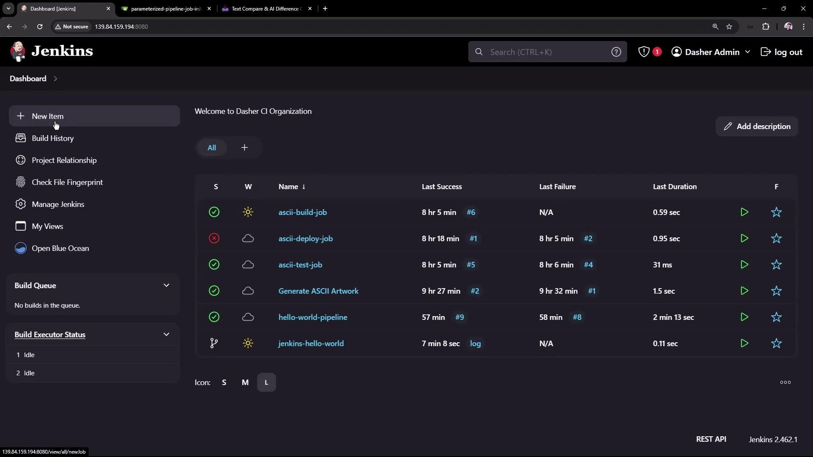
</Frame>

<Frame>
  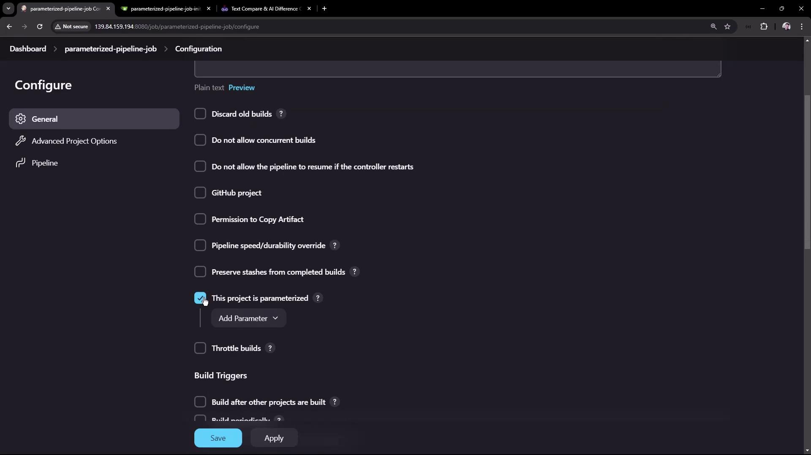
</Frame>

## 2. Verify the `test` Branch

Run the job once to ensure the `test` pipeline works as expected. In Blue Ocean, you should see all stages complete successfully:

<Frame>
  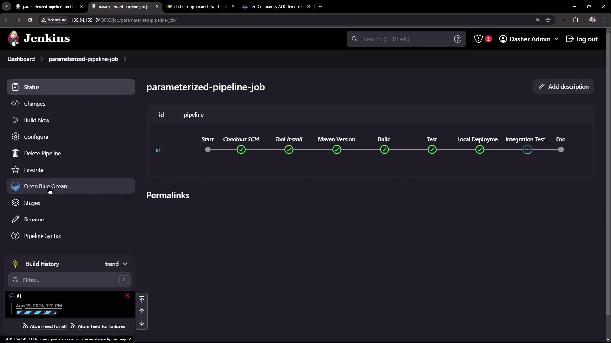
</Frame>

## 3. Define Build Parameters

Go back to **Configure** and enable **This project is parameterized**. Add the following parameters:

| Parameter    | Type   | Default | Description                        |
| ------------ | ------ | ------- | ---------------------------------- |
| BRANCH\_NAME | String | main    | Git branch to build                |
| APP\_PORT    | String | 6767    | Port for local or integration test |
| SLEEP\_TIME  | Choice | 10s     | Delay before running tests         |

<Callout icon="lightbulb">
  You can add more parameters (e.g., `TIMEOUT`, `ENVIRONMENT`) to adapt this pipeline for different use cases.
</Callout>

<Frame>
  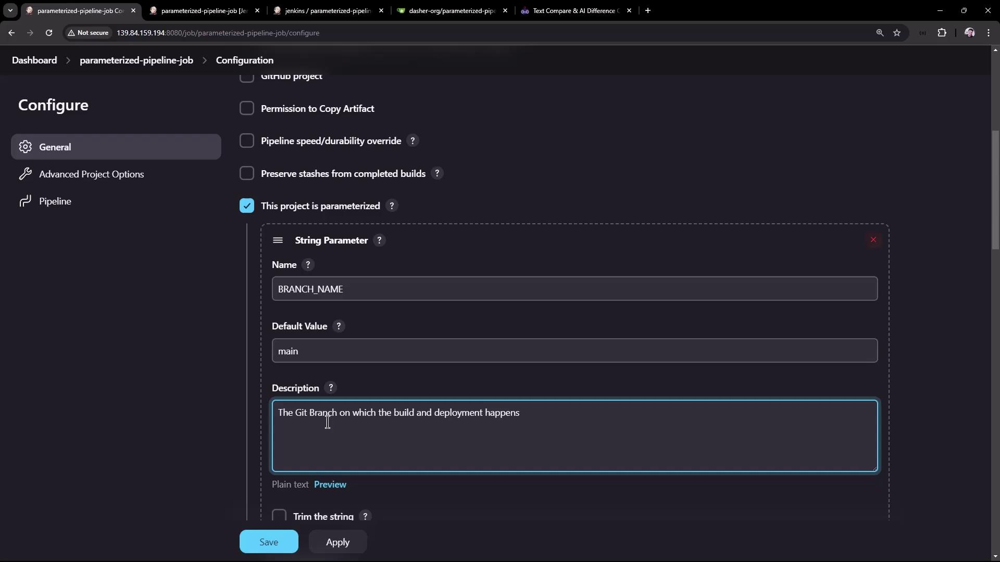
</Frame>

<Frame>
  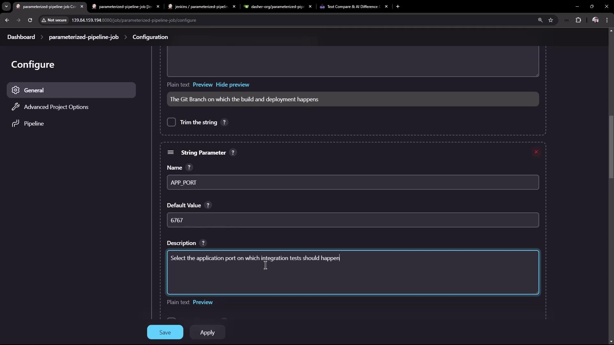
</Frame>

<Frame>
  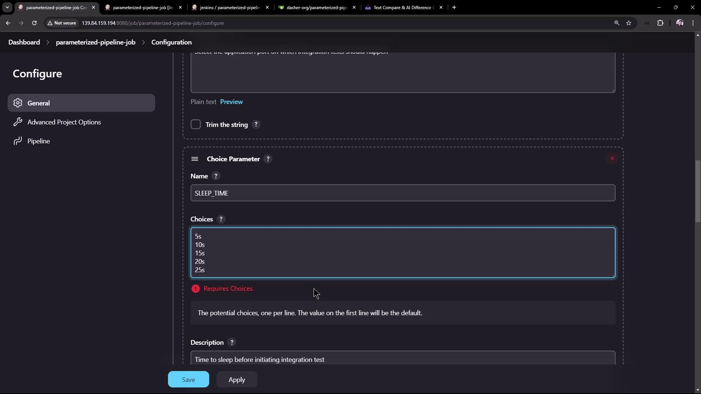
</Frame>

Next, update **Branch Specifier** under **Source Code Management** to:

```text theme={null}
*/${BRANCH_NAME}
```

<Frame>
  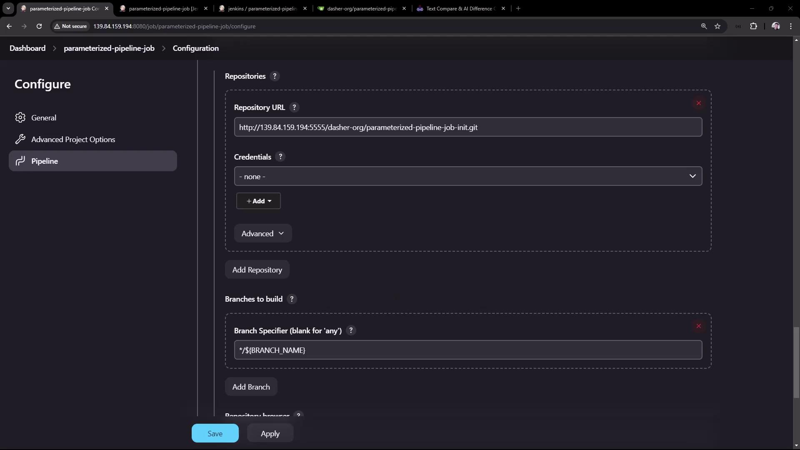
</Frame>

<Callout icon="triangle-alert">
  Make sure to commit these parameterized Jenkinsfile changes to each branch; otherwise, `${params.*}` will not be available.
</Callout>

## 4. Update the `test` Branch Jenkinsfile

Switch to the `test` branch and edit **Jenkinsfile** to leverage the new parameters:

```groovy theme={null}
pipeline {
    agent any
    stages {
        stage('Maven Version') {
            steps {
                sh "echo Print Maven Version"
                sh "mvn -version"
                sh "echo Sleep-Time - ${params.SLEEP_TIME}, Port - ${params.APP_PORT}, Branch - ${params.BRANCH_NAME}"
            }
        }
        stage('Build') {
            steps {
                sh 'mvn clean package -DskipTests=true'
                archiveArtifacts 'target/hello-demo-*.jar'
            }
        }
        stage('Test') {
            steps {
                sh 'mvn test'
                junit(testResults: 'target/surefire-reports/TEST-*.xml',
                      keepProperties: true,
                      keepTestNames: true)
            }
        }
        stage('Local Deployment') {
            steps {
                sh "java -jar target/hello-demo-*.jar > /dev/null &"
            }
        }
        stage('Integration Testing') {
            steps {
                sh "sleep ${params.SLEEP_TIME}"
                sh "curl -s http://localhost:${params.APP_PORT}/hello"
            }
        }
    }
}
```

Commit and push these updates. Then in Jenkins, select **Build with Parameters**, choose:

* **BRANCH\_NAME**: test
* **APP\_PORT**: 6767
* **SLEEP\_TIME**: 5s

<Frame>
  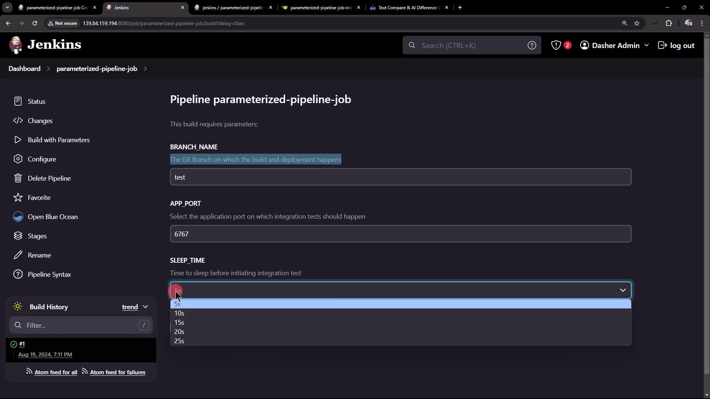
</Frame>

In the logs, you’ll see the parameter values substituted correctly:

```bash theme={null}
echo Sleep-Time - 5s, Port - 6767, Branch - test
Sleep-Time - 5s, Port - 6767, Branch - test

+ sleep 5s
+ curl -s http://localhost:6767/hello
Hello, KodeKloud community!
```

## 5. Update the `main` Branch Jenkinsfile

Repeat a similar update in the `main` branch to reference `${params.SLEEP_TIME}`:

```groovy theme={null}
pipeline {
    agent any
    stages {
        stage('Build') {
            steps {
                sh 'mvn clean package -DskipTests=true'
                archiveArtifacts 'target/hello-demo-*.jar'
            }
        }
        stage('Test') {
            steps {
                sh 'mvn test'
                junit(testResults: 'target/surefire-reports/TEST-*.xml',
                      keepProperties: true,
                      keepTestNames: true)
            }
        }
        stage('Containerization') {
            steps {
                sh 'echo Docker Build Image..'
                sh 'echo Docker Tag Image....'
                sh 'echo Docker Push Image......'
            }
        }
        stage('Kubernetes Deployment') {
            steps {
                sh 'echo Deploy to Kubernetes using ArgoCD'
            }
        }
        stage('Integration Testing') {
            steps {
                sh "sleep ${params.SLEEP_TIME}"
                sh 'echo Testing using cURL commands......'
            }
        }
    }
}
```

Commit, push, then run **Build with Parameters**:

* **BRANCH\_NAME**: main
* **SLEEP\_TIME**: 15s

<Frame>
  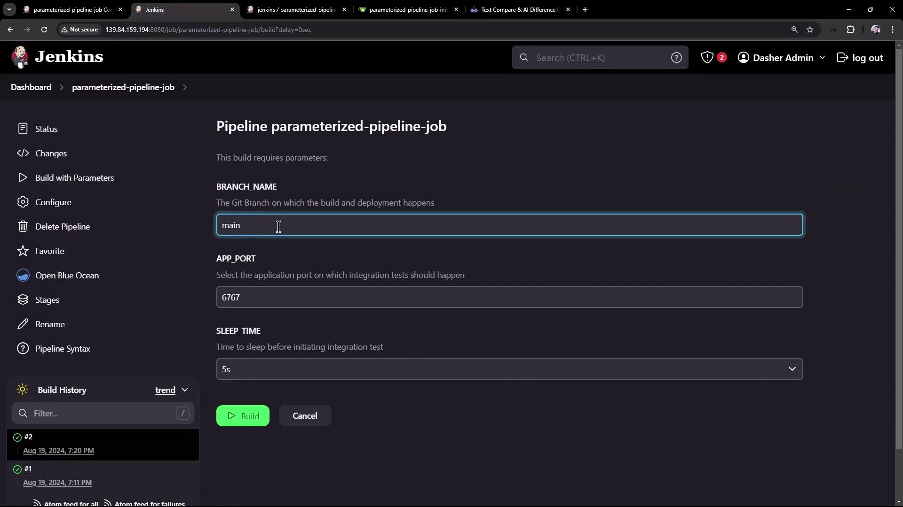
</Frame>

You should see the `main` branch pipeline honor the parameters:

<Frame>
  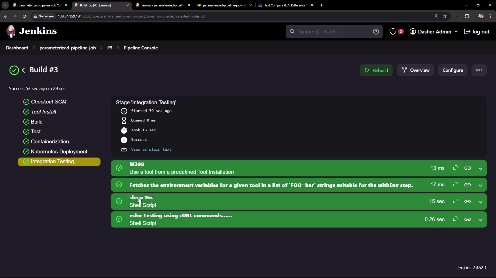
</Frame>

## Conclusion

By defining job-level parameters and referencing them in your Jenkinsfile, you can maintain a single pipeline that adapts to multiple branches and environments. This strategy:

* Reduces duplication across branches
* Simplifies CI/CD maintenance
* Enables dynamic, user-driven builds

For more on Jenkins pipelines and job parameters, check out:

* [Jenkins Pipeline Documentation](https://www.jenkins.io/doc/book/pipeline/)
* [Jenkins Parameterized Builds](https://www.jenkins.io/doc/book/pipeline/syntax/#parameters)

Happy building!

<CardGroup>
  <Card title="Watch Video" icon="video" href="https://learn.kodekloud.com/user/courses/certified-jenkins-engineer/module/054c2c42-f54a-42a4-ab39-4b432a36aaa1/lesson/e296b0b8-8248-4efc-b718-ab59d1b6e1df" />

  <Card title="Practice Lab" icon="installation" href="https://learn.kodekloud.com/user/courses/certified-jenkins-engineer/module/054c2c42-f54a-42a4-ab39-4b432a36aaa1/lesson/4587c7a4-2ffb-4226-8eb1-aea7b640891e" />
</CardGroup>
