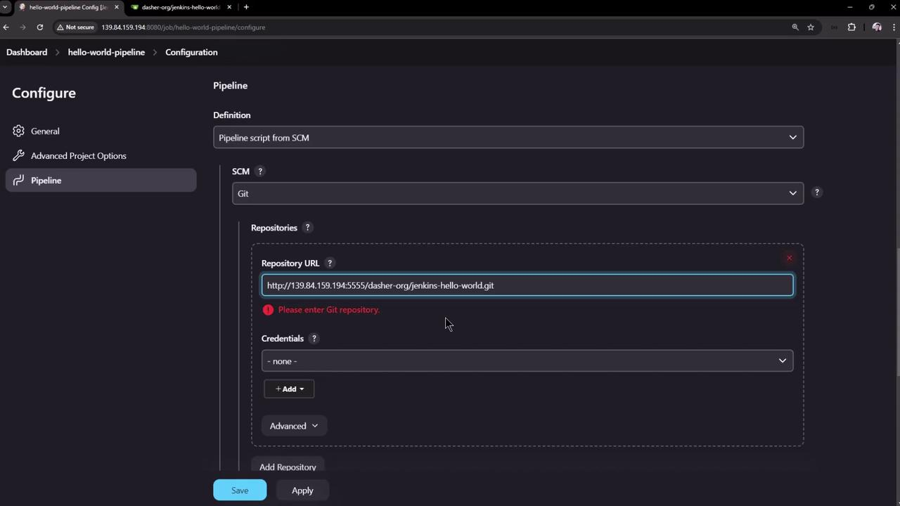
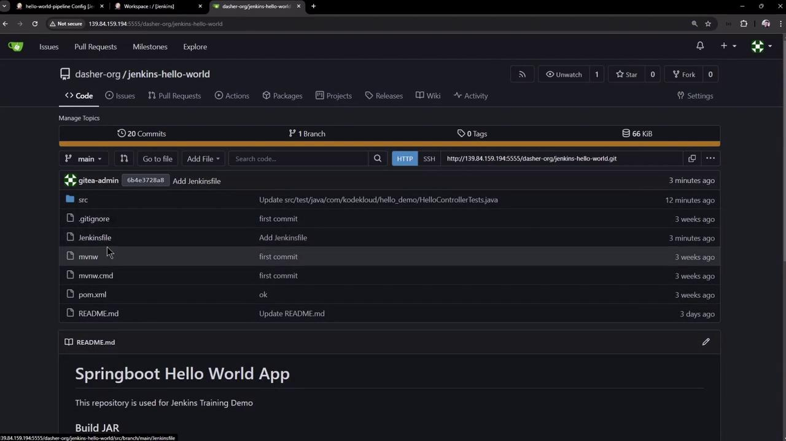
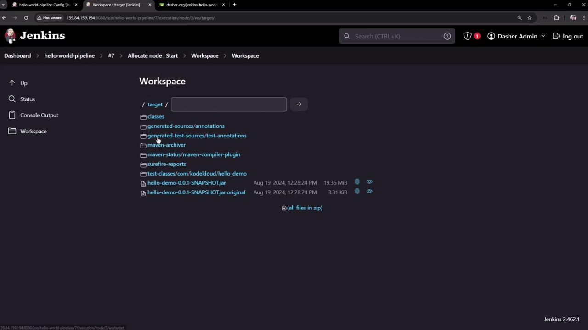
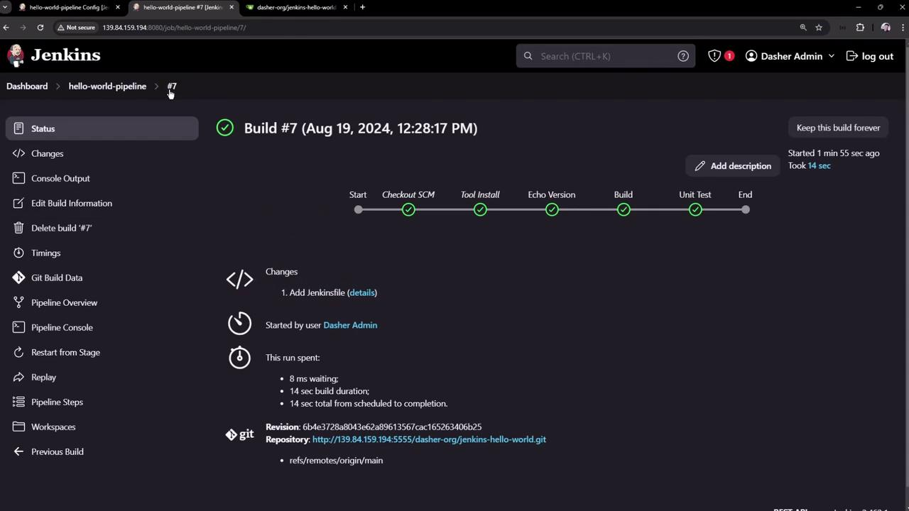

# Demo Pipeline Script from SCM

Source: https://notes.kodekloud.com/docs/Certified-Jenkins-Engineer/Jenkins-Pipelines/Demo-Pipeline-Script-from-SCM/page

This tutorial demonstrates sourcing Jenkins pipeline definitions from SCM systems like GitHub or Gitea for improved maintainability and collaboration.

In this tutorial, we’ll demonstrate how to source your Jenkins pipeline definition directly from a Source Control Management (SCM) system such as [GitHub](https://github.com) or [Gitea](https://gitea.io/). Moving your pipeline code into version control improves maintainability, traceability, and collaboration.

***

## 1. Inline Pipeline Definition (Not Recommended)

Defining a pipeline directly in the Jenkins UI is quick but hard to maintain. Changes aren’t versioned, and collaboration is limited.

<Callout icon="triangle-alert">
  Avoid storing pipeline scripts in the UI. Inline definitions lack versioning and code review.
</Callout>

```groovy theme={null}
pipeline {
  agent any
  tools {
    maven 'M398'
  }
  stages {
    stage('Echo Version') {
      steps {
        sh 'echo Print_Maven_Version'
        sh 'mvn -version'
      }
    }
    stage('Build') {
      steps {
        // Fetch source code
        git 'http://139.84.159.194:5555/dasher-org/jenkins-hello-world.git'
        // Package with Maven
        // sh 'mvn clean package -DskipTests=true'
      }
    }
    stage('Unit Test') {
      steps {
        sh 'mvn test'
      }
    }
  }
}
```

***

## 2. Creating a Jenkinsfile in Your Repository

Store your pipeline script as a `Jenkinsfile` at the root of your project repository:

1. Navigate to your app repo on GitHub or Gitea.
2. Click **Add file** → **Create new file**.
3. Name it `Jenkinsfile`.
4. Paste the pipeline script and commit to `main`.

```groovy theme={null}
pipeline {
  agent any
  tools {
    // Installs Maven configured as "M398"
    maven "M398"
  }
  stages {
    stage('Echo Version') {
      steps {
        sh 'echo Print Maven Version'
        sh 'mvn -version'
      }
    }
    stage('Build') {
      steps {
        // Auto-checkout not yet enabled
        git 'http://139.84.159.194:5555/dasher-org/jenkins-hello-world.git'
        sh 'mvn clean package -DskipTests=true'
      }
    }
    stage('Unit Test') {
      steps {
        sh 'mvn test'
      }
    }
  }
}
```

***

## 3. Simplifying the Jenkinsfile

Once Jenkins auto-checks out your code, remove the explicit `git` step to simplify:

<Callout icon="lightbulb">
  Jenkins automatically clones the repository when using **Pipeline script from SCM**.
</Callout>

```groovy theme={null}
pipeline {
  agent any
  tools {
    maven "M398"
  }
  stages {
    stage('Echo Version') {
      steps {
        sh 'echo Print Maven Version'
        sh 'mvn -version'
      }
    }
    stage('Build') {
      steps {
        // Repository checked out automatically
        sh 'mvn clean package -DskipTests=true'
      }
    }
    stage('Unit Test') {
      steps {
        sh 'mvn test'
      }
    }
  }
}
```

***

## 4. Configuring “Pipeline script from SCM”

In Jenkins:

1. Create (or open) a **Pipeline** job.
2. Under **Pipeline** > **Definition**, select **Pipeline script from SCM**.
3. Choose **[Git](https://git-scm.com)** and enter your repository details:

| Field            | Value                                                           |
| ---------------- | --------------------------------------------------------------- |
| Repository URL   | `http://139.84.159.194:5555/dasher-org/jenkins-hello-world.git` |
| Branch Specifier | `main`                                                          |
| Script Path      | `Jenkinsfile`                                                   |

If the URL is missing or invalid, Jenkins displays an error:

<Frame>
  
</Frame>

Save the job and click **Build Now**.

***

## 5. Observing Automatic Checkout and Build

When the pipeline runs, Jenkins adds a **Checkout SCM** stage:

<Frame>
  
</Frame>

### Console Output Highlights

```shell theme={null}
> git rev-parse --resolve-git-dir /var/lib/jenkins/workspace/hello-world-pipeline/.git # timeout=10
> git config remote.origin.url http://139.84.159.194:5555/dasher-org/jenkins-hello-world.git # timeout=10
> git fetch origin +refs/heads/*:refs/remotes/origin/* # timeout=10
> git checkout -f origin/main # timeout=10
```

```bash theme={null}
echo Print Maven Version
mvn --version
```

```text theme={null}
Apache Maven 3.9.8 (36645f6c9b5079805ea5009217e36cff344256)
Maven home: /var/lib/jenkins/tools/hudson.tasks.Maven_MavenInstallation/M398
Java version: 17.0.12, vendor: Ubuntu
Default locale: en_US, platform encoding: UTF-8
OS name: "linux", version: "6.8.0-39-generic", arch: "amd64"
```

***

## 6. Browsing the Repository in Your SCM

Verify your `Jenkinsfile` and project files in the web UI:

<Frame>
  
</Frame>

***

## 7. Exploring the Jenkins Workspace

Click **Workspace** in the job sidebar to view checked-out files and build artifacts:

<Frame>
  
</Frame>

***

## 8. Reviewing Completed Build Details

Inspect completed builds and each pipeline stage:

<Frame>
  
</Frame>

***

## 9. Inspecting Jenkins Home and Workspaces on the Controller

Access your Jenkins controller via SSH to list directories:

```bash theme={null}
