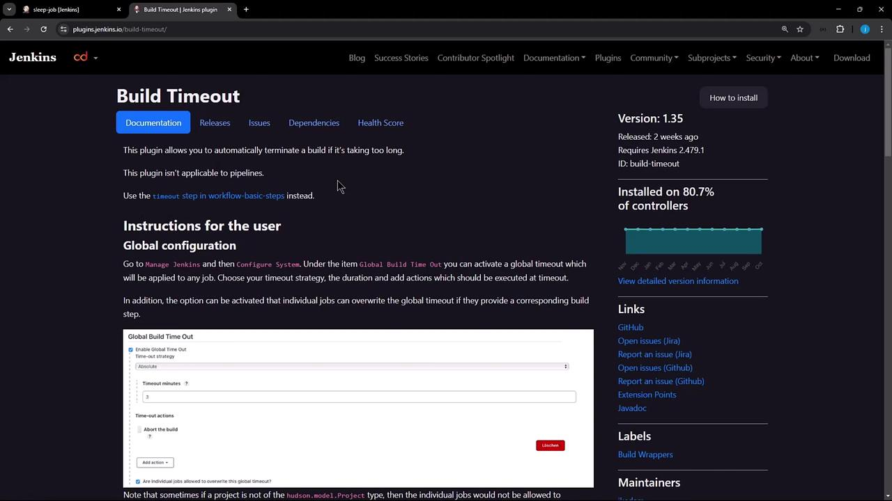
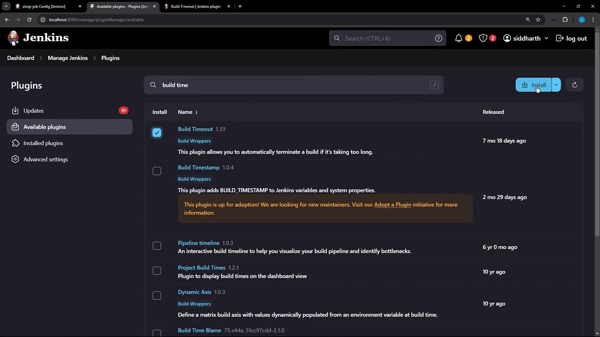
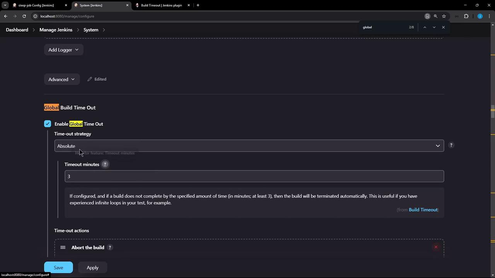
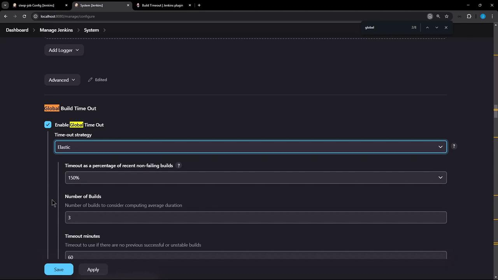
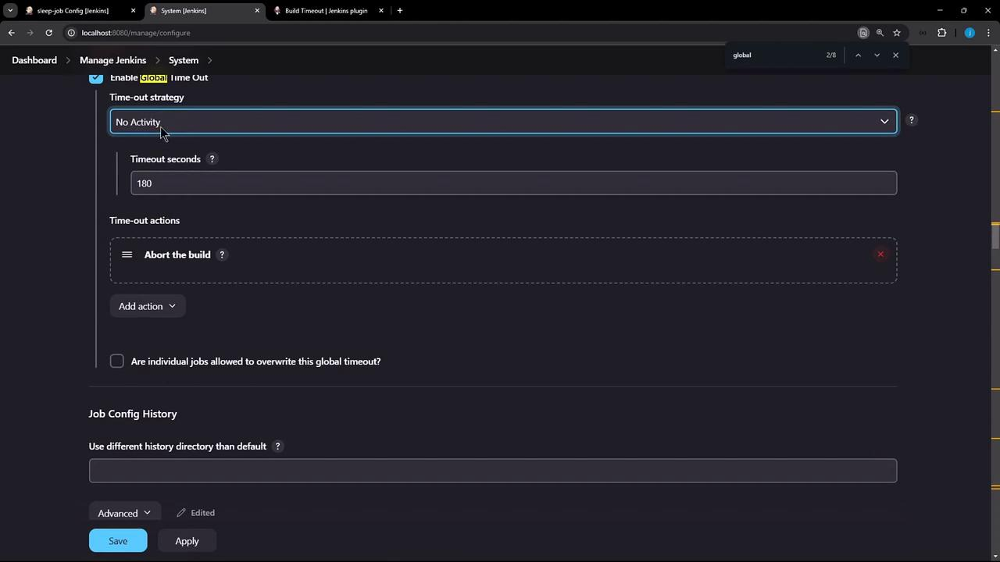
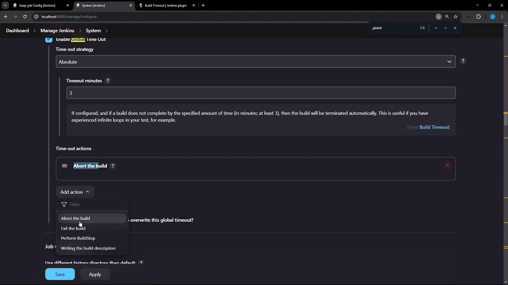
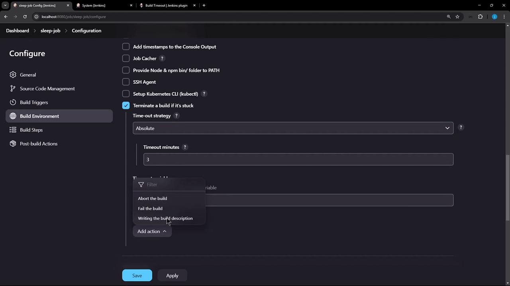
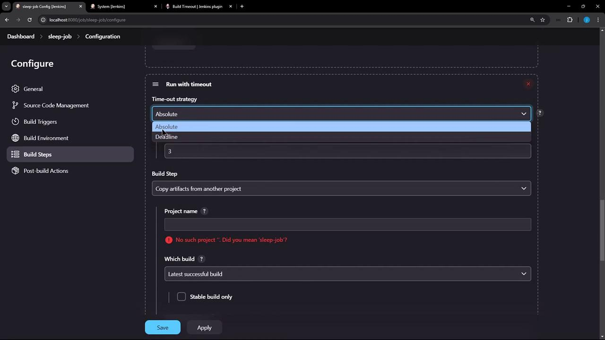

# Demo Build Timeout

Source: https://notes.kodekloud.com/docs/Certified-Jenkins-Engineer/Jenkins-Setup-and-Interface/Demo-Build-Timeout/page

This article explains the Jenkins Build Timeout plugin for automatically terminating builds that exceed a specified duration.

In this lesson, we’ll dive into the **Jenkins Build Timeout** plugin, which automatically terminates a build when it exceeds a specified duration. Please note this plugin does *not* apply to Pipeline jobs, as they use their own `timeout` step.

<Callout icon="lightbulb">
  Pipeline jobs should use the built-in `timeout` directive. Learn more in the [Pipeline Syntax](https://www.jenkins.io/doc/book/pipeline/syntax/#timeout) documentation.
</Callout>

## Plugin Overview

Before configuring any jobs, let’s review the plugin details and installation stats:

<Frame>
  
</Frame>

## Installation

1. Go to **Manage Jenkins** > **Manage Plugins**.
2. Search for **Build Timeout**.
3. Install and restart Jenkins if prompted.

<Frame>
  
</Frame>

## Configuration Scopes

You can configure timeouts at three levels:

| Scope         | Configuration Location                    |
| ------------- | ----------------------------------------- |
| Global        | **Manage Jenkins** > **Configure System** |
| Job Build Env | Individual job's **Build Environment**    |
| Build Step    | **Add build step** > **Run with timeout** |

***

## 1. Global Configuration

Navigate to **Manage Jenkins** > **Configure System** and scroll to **Global Build Time Out**. Enable the plugin and choose a timeout strategy:

| Strategy | Description                                           |
| -------- | ----------------------------------------------------- |
| Absolute | Fixed timeout in minutes (minimum **3** minutes).     |
| Elastic  | Percentage of recent successful builds.               |
| Deadline | Specific date/time cutoff (e.g., `2024-12-31 23:59`). |

<Callout icon="triangle-alert">
  The **Absolute** strategy requires a minimum value of 3 minutes. Values below this will be rejected.
</Callout>

<Frame>
  
</Frame>

In the same section, define how Jenkins should respond when time runs out:

| Post-Timeout Action       | Description                               |
| ------------------------- | ----------------------------------------- |
| Abort the build           | Halt execution and mark as **ABORTED**.   |
| Fail the build            | Mark the build as **FAILED**.             |
| Execute extra build steps | Run custom cleanup or notification steps. |
| Write a build description | Append timeout details to build metadata. |

<Frame>
  
</Frame>

Below is an example using the **Absolute** strategy with a 3-minute timeout:

<Frame>
  
</Frame>

<Frame>
  
</Frame>

With this global property, **any** job running longer than 3 minutes will be terminated automatically.

***

## 2. Job-Level Configuration

To apply a timeout to a single job:

1. Open the job configuration.
2. In **Build Environment**, check **Terminate the build if it is stuck**.
3. Choose your strategy and set the duration.

<Frame>
  
</Frame>

You can also reference environment variables for dynamic timeouts if needed:

```groovy theme={null}
def timeoutMinutes = env.BUILD_TIMEOUT ?: 5
```

***

## 3. Build-Step Timeout

For fine-grained control, add a **Run with timeout** wrapper around individual build steps:

1. Click **Add build step**.
2. Select **Run with timeout**.
3. Pick **Absolute** or **Deadline**, then set your value.
4. Add subsequent steps based on timeout status.

<Frame>
  
</Frame>

***

## Demonstration

Create a freestyle job named **sleep-job** with this shell script:

```bash theme={null}
echo "Started. Sleeping for 300 seconds..."
sleep 300
echo "Finished."
```

Trigger the build. After 3 minutes, the console will display:

```bash theme={null}
+ sleep 300
Build timed out (after 3 minutes). Marking the build as aborted.
[build-timeout] Global time out activated
```

The job stops and is marked **ABORTED**.

***

## Conclusion

You’ve learned how to:

* Install and overview the Jenkins **Build Timeout** plugin
* Configure timeouts globally, per job, or per build step
* Select strategies: Absolute, Elastic, or Deadline
* Define post-timeout actions such as aborting, failing, or running cleanup steps

With these techniques, you can keep your Jenkins builds under control and prevent runaway jobs.

## References

* [Build Timeout Plugin – Jenkins](https://plugins.jenkins.io/build-timeout/)
* [Jenkins Pipeline: timeout Step](https://www.jenkins.io/doc/pipeline/steps/workflow-basic-steps/#timeout-timeout-before-termination)
* [Jenkins Configuration as Code](https://www.jenkins.io/projects/jcasc/)

<CardGroup>
  <Card title="Watch Video" icon="video" href="https://learn.kodekloud.com/user/courses/certified-jenkins-engineer/module/7ab00946-0edd-4a13-b5c8-1b5001779f1c/lesson/9485f3ec-4409-4a27-a09f-c74fab98fb4e" />
</CardGroup>
