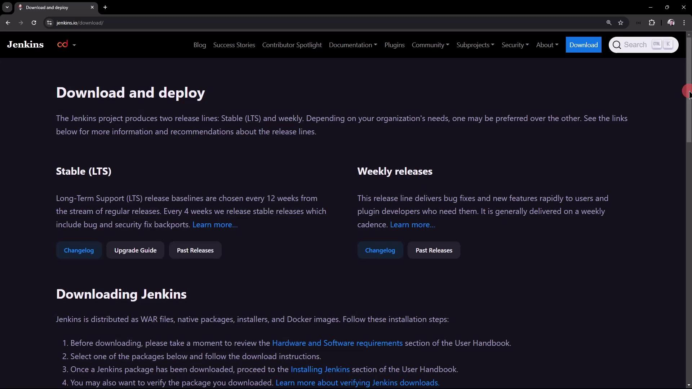
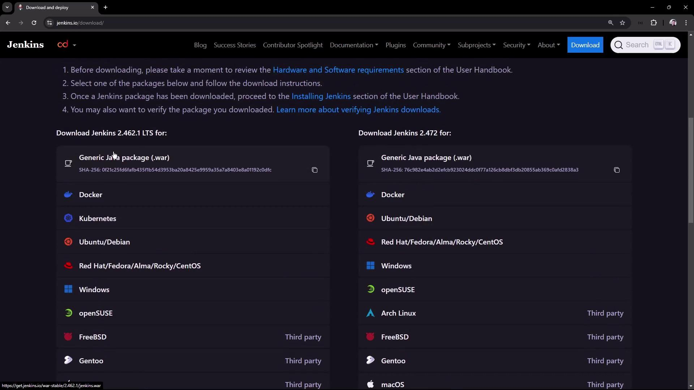
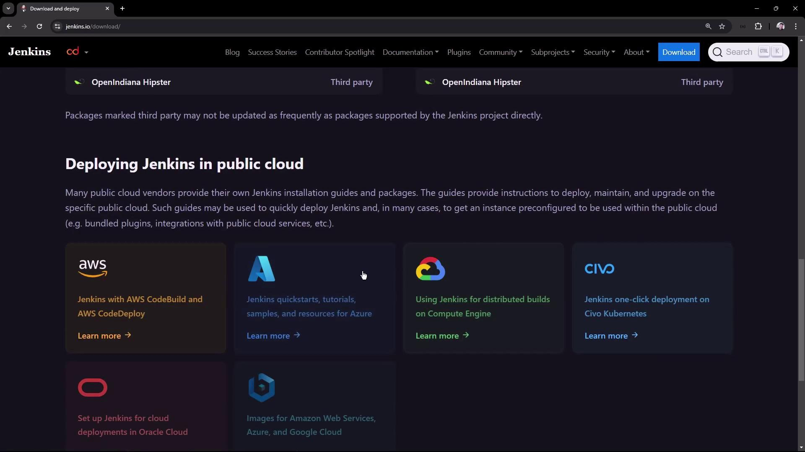
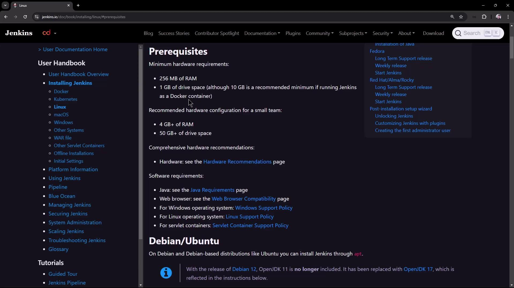

# Demo Jenkins Installation

Source: https://notes.kodekloud.com/docs/Certified-Jenkins-Engineer/Jenkins-Setup-and-Interface/Demo-Jenkins-Installation/page

This guide explains how to install Jenkins LTS on an Ubuntu VM and complete the initial setup.

In this guide, you’ll learn how to install the **Jenkins LTS** release on an Ubuntu VM, verify prerequisites, install Java 17, and complete the initial setup via the web interface. By following these steps, you’ll have a stable, secure Jenkins server ready for your CI/CD pipelines.

## Table of Contents

1. [Choose a Jenkins Release](#choose-a-jenkins-release)
2. [System Prerequisites](#system-prerequisites)
3. [Add Jenkins APT Repository](#add-jenkins-apt-repository)
4. [Install Jenkins](#install-jenkins)
5. [Verify Jenkins Service](#verify-jenkins-service)
6. [Install Java 17](#install-java-17)
7. [Start Jenkins](#start-jenkins)
8. [Retrieve Initial Admin Password](#retrieve-initial-admin-password)
9. [Complete Setup Wizard](#complete-setup-wizard)
10. [References](#references)

## 1. Choose a Jenkins Release

Jenkins provides two main release lines:

| Release Type | Characteristics                                 | Recommended For                    |
| ------------ | ----------------------------------------------- | ---------------------------------- |
| **LTS**      | Stability, security fixes over extended support | Production environments            |
| **Weekly**   | Latest features and bug fixes                   | Testing and early feature adoption |

<Frame>
  
</Frame>

Scroll to your platform on the [Jenkins download page][download]. You can select Docker, Kubernetes, Windows, or Debian/Ubuntu packages.

<Frame>
  
</Frame>

For public-cloud deployments, you also have AWS, Azure, Google Cloud, Oracle Cloud, and others:

<Frame>
  
</Frame>

In this tutorial, we’ll proceed with **Jenkins LTS** on **Ubuntu**.

## 2. System Prerequisites

Our test VM specifications:

| Resource | Specification |
| -------- | ------------- |
| RAM      | 4 GB          |
| CPU      | 2 cores       |
| OS       | Ubuntu 20.04+ |

Refer to the [Jenkins Linux prerequisites][prereq] for full details.

<Frame>
  
</Frame>

## 3. Add Jenkins APT Repository

Add the Jenkins GPG key and repository:

```bash theme={null}
sudo wget -O /usr/share/keyrings/jenkins-keyring.asc \
  https://pkg.jenkins.io/debian-stable/jenkins.io-2023.key

echo "deb [signed-by=/usr/share/keyrings/jenkins-keyring.asc] \
  https://pkg.jenkins.io/debian-stable binary/" \
  | sudo tee /etc/apt/sources.list.d/jenkins.list > /dev/null
```

Update APT and install Jenkins:

```bash theme={null}
sudo apt-get update
sudo apt-get install -y jenkins
```

## 4. Install Jenkins

During the installation, you should see output confirming the package download:

```plaintext theme={null}
Get:10 https://pkg.jenkins.io/debian-stable binary/ Packages [27.6 kB]
Hit:11 http://archive.ubuntu.com/ubuntu focal InRelease
Fetched 409 kB in 3s (147 kB/s)
Reading package lists... Done
The following NEW packages will be installed:
  jenkins net-tools
0 upgraded, 2 newly installed, 0 to remove and 8 not upgraded.
Get:1 https://pkg.jenkins.io/debian-stable binary/ jenkins 2.462.1 [91.2 MB]
```

## 5. Verify Jenkins Service

Immediately check Jenkins status:

```bash theme={null}
sudo systemctl status jenkins
```

If Java is missing, you’ll see a failure:

```plaintext theme={null}
● jenkins.service - Jenkins Continuous Integration Server
   Active: failed (Result: exit-code)
…
jenkins[31418]: jenkins: failed to find a valid Java installation
```

Inspect logs for details:

```bash theme={null}
sudo journalctl -u jenkins --no-pager
java -version
