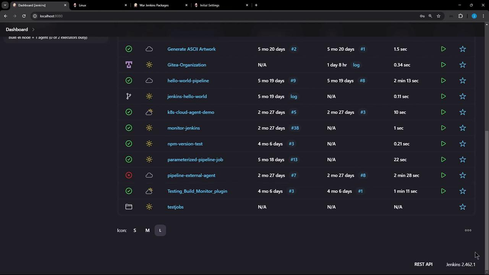
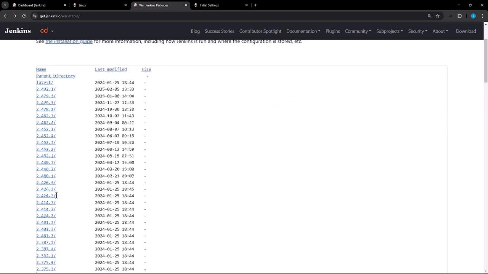
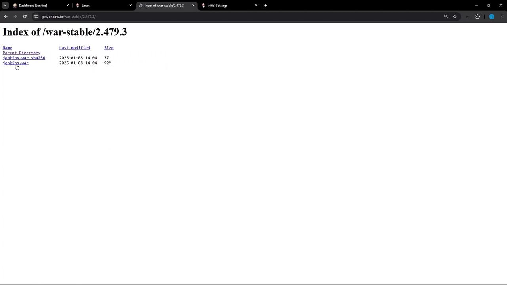

# Demo Running the Jenkins WAR as a standalone application

Source: https://notes.kodekloud.com/docs/Certified-Jenkins-Engineer/Jenkins-Setup-and-Interface/Demo-Running-the-Jenkins-WAR-as-a-standalone-application/page

This guide explains how to run Jenkins from its WAR file, providing control over JVM options, ports, and context paths for testing or side-by-side instances.

In this guide, we’ll move beyond the default `apt` installation and launch Jenkins directly from its WAR file. This approach gives you full control over JVM options, ports, and context paths—ideal for testing or side-by-side instances.

***

## 1. Inspecting the Apt-Installed Jenkins Service

Start by confirming the existing Jenkins process managed via `apt`:

```bash theme={null}
ps aux | grep -i jenkins
```

```text theme={null}
jenkins   27173  8.4  8.2 10874592 134834 ?      Ssl  17:51   0.58 /usr/bin/java -Xms1G -Xmx1G -jar /usr/share/java/jenkins.war \
    --webroot=/var/cache/jenkins/war --httpPort=8080
root      29978  0.0  0.0  4088  2080 pts/6    S+   18:03   0.00 grep --color=auto -i jenkins
```

Here you can see:

* A 1 GB heap (`-Xms1G -Xmx1G`)
* The WAR file at `/usr/share/java/jenkins.war`
* Webroot under `/var/cache/jenkins/war`
* HTTP bound to port 8080

<Frame>
  
</Frame>

***

## 2. Downloading a Specific Jenkins WAR Version

To try a newer release, browse the Jenkins WAR directory and choose **2.479.3** (released Jan 1, 2025):

<Frame>
  
</Frame>

Once you’ve picked the version, verify the file and checksum:

<Frame>
  
</Frame>

On your Ubuntu server:

```bash theme={null}
mkdir -p ~/jenkins-war
cd ~/jenkins-war
wget https://get.jenkins.io/war-stable/2.479.3/jenkins.war
