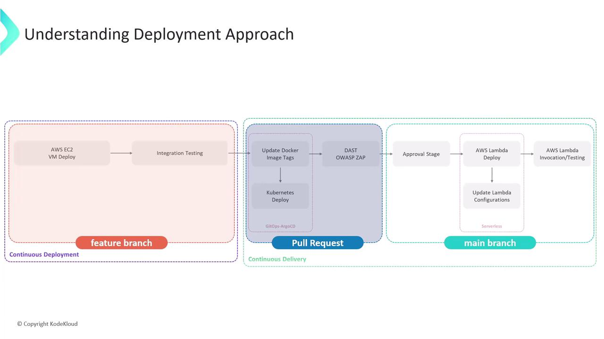
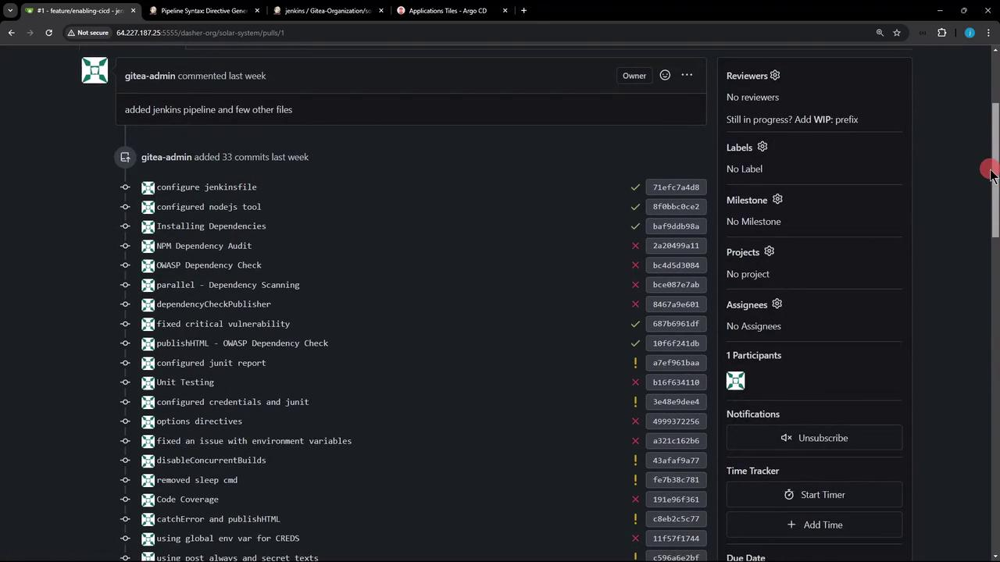
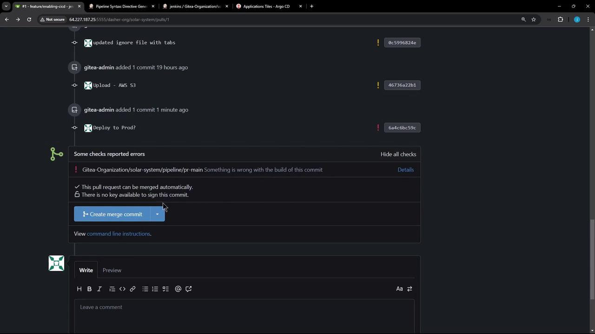
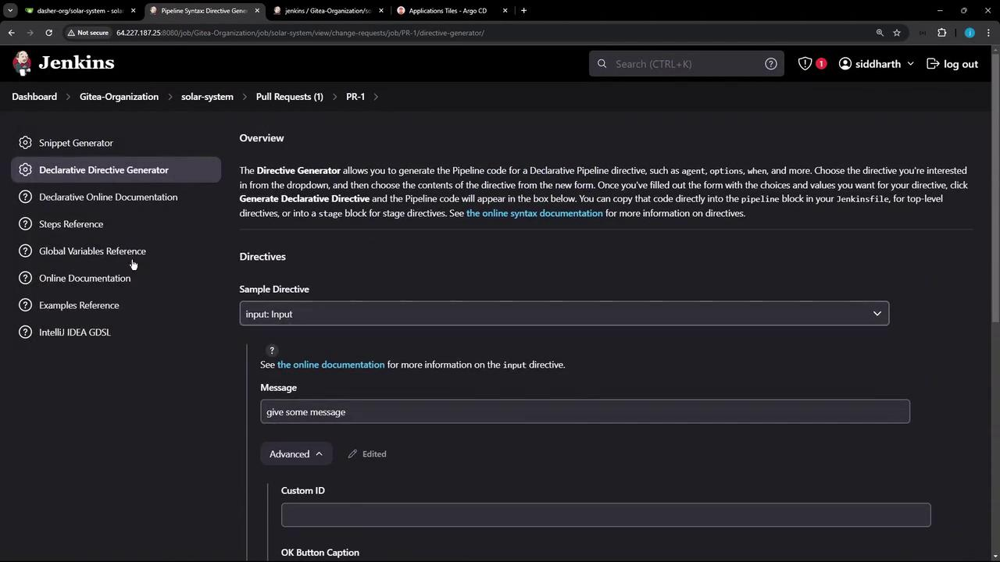
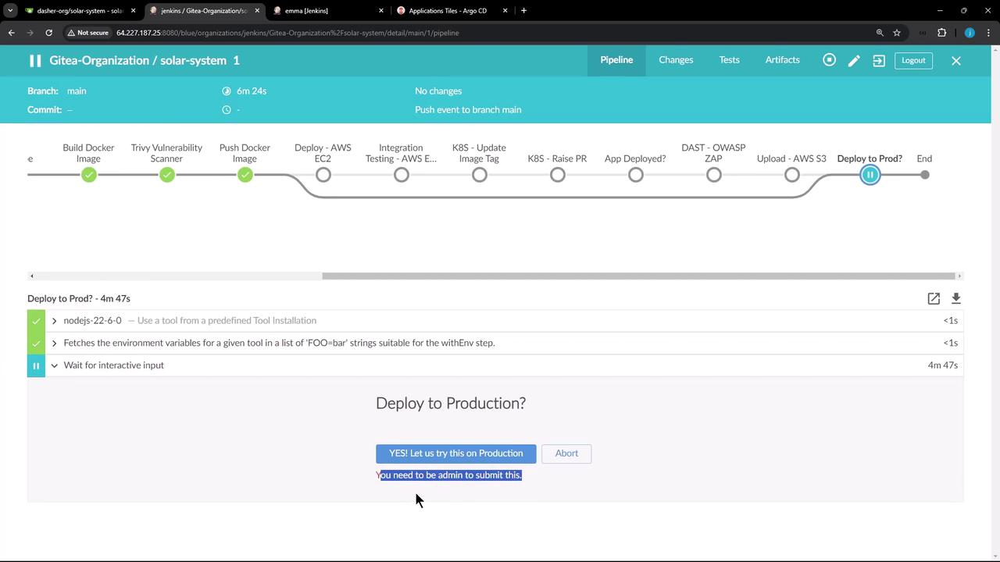

# Example:
# NAME                                  READY   STATUS      RESTARTS   AGE
# solar-system-5f66cbc859-wdlwp         1/1     Running     0          27s
# solar-system-5f66cbc859-wrs24         1/1     Running     0          21s
```

6. Approve and let the pipeline proceed to the **DAST** stage. ZAP will scan and generate reports.

<Callout icon="triangle-alert">
  If ZAP detects critical issues or unexpected content types, it exits with a non-zero code, causing the stage (and pipeline) to fail. Adjust your `-c` config or handle alerts as needed.
</Callout>

## References

* [Dynamic Application Security Testing (DAST)](https://owasp.org/www-community/DAST)
* [OWASP ZAP Docs](https://www.zaproxy.org/docs/)
* [Jenkins Pipeline Syntax: input](https://www.jenkins.io/doc/book/pipeline/syntax/#input)
* [GitOps Overview](https://www.gitops.tech/)
* [Argo CD Docs](https://argo-cd.readthedocs.io/)

<CardGroup>
  <Card title="Watch Video" icon="video" href="https://learn.kodekloud.com/user/courses/certified-jenkins-engineer/module/01d04ab3-0694-4c67-bd1a-c3eaaa8d64d3/lesson/cd8b46f4-4796-42b9-aef0-8e73c0f81e39" />
</CardGroup>


# Demo Deploy to Prod

Source: https://notes.kodekloud.com/docs/Certified-Jenkins-Engineer/Kubernetes-and-GitOps/Demo-Deploy-to-Prod/page

This lesson extends a CI/CD pipeline to include a manual approval gate before deploying to AWS Lambda.

In this lesson, we'll extend our CI/CD pipeline to include a manual approval gate before deploying to AWS Lambda. Previously, we covered:

* Deploying to AWS EC2 VMs
* Running integration tests
* Opening a pull request for Kubernetes via Argo CD
* Performing a DAST scan with OWASP ZAP

Now, on the `main` branch, we'll pause for an admin’s go‐ahead, update Lambda configuration, and run function tests. All stages trigger only on new pushes to `main`.

| Stage                         | Branch/Trigger | Purpose                                    |
| ----------------------------- | -------------- | ------------------------------------------ |
| Integration Testing – AWS EC2 | any branch     | Validate code on EC2 instances             |
| K8S – Update Image Tag        | any branch     | Bump container image in manifests          |
| K8S – Raise PR                | any branch     | Create PR for K8s changes                  |
| App Deployed?                 | any branch     | Confirm deployment status                  |
| DAST – OWASP ZAP              | any branch     | Run security scan via OWASP ZAP            |
| Upload – AWS S3               | PR\*, main     | Upload test/report artifacts to S3         |
| Deploy to Prod?               | main           | Manual approval gate for production deploy |

<Frame>
  
</Frame>

## 1. Add a Manual Approval Stage in Jenkinsfile

Edit your **Jenkinsfile** on the feature branch. After the AWS S3 upload, insert a `Deploy to Prod?` stage that runs only on `main` and waits up to one day for an admin to confirm.

### 1.1. Current CI Stages

```groovy theme={null}
stage('Integration Testing - AWS EC2') {
    // existing steps
}

stage('K8S - Update Image Tag') {
    // existing steps
}

stage('K8S - Raise PR') {
    // existing steps
}

stage('App Deployed?') {
    // existing steps
}

stage('DAST - OWASP ZAP') {
    // existing steps
}

stage('Upload - AWS S3') {
    // existing steps
}

post {
    always {
        // cleanup or notifications
    }
}
```

<Callout icon="lightbulb">
  The `post { always { … } }` block runs regardless of build outcome—ideal for reporting.
</Callout>

### 1.2. New Approval Stage

```groovy theme={null}
stage('Deploy to Prod?') {
    when {
        branch 'main'
    }
    steps {
        timeout(time: 1, unit: 'DAYS') {
            input message: 'Deploy to Production?',
                  ok: 'YES! Let us try this on Production',
                  submitter: 'admin'
        }
    }
}
```

<Callout icon="lightbulb">
  The `submitter: 'admin'` line restricts approval to users in the **admin** group.
</Callout>

***

## 2. Testing the Approval Mechanism

1. Commit and push your updated Jenkinsfile.
2. Open a pull request, merge it into `main`.
3. Jenkins will start a fresh pipeline on `main`.

<Frame>
  
</Frame>

Even if a prior build was aborted, merging triggers a new run:

<Frame>
  
</Frame>

In Jenkins Blue Ocean, all CI stages skip except the approval prompt:

<Frame>
  
</Frame>

***

## 3. Adjusting Stage Conditions for AWS S3

If you’d like the AWS S3 upload to run on both PRs and `main`, update the `when` clause:

```groovy theme={null}
stage('Upload - AWS S3') {
    when {
        anyOf {
            branch 'PR*'
            branch 'main'
        }
    }
    steps {
        withAWS(credentials: 'aws-s3-ec2-lambda-creds', region: 'us-east-2') {
            sh '''
                ls -ltr
                mkdir reports-$BUILD_ID
                cp -rf coverage/ reports-$BUILD_ID/
                cp dependency* test-results.xml trivy* zap* reports-$BUILD_ID/
                ls -ltr reports-$BUILD_ID/
            '''
            s3Upload(file: "reports-$BUILD_ID",
                     bucket: "solar-system-jenkins-reports-bucket",
                     path: "jenkins-$BUILD_ID/")
        }
    }
}
```

Use the [Declarative Directive Generator](https://www.jenkins.io/doc/book/pipeline/syntax/#declarative-directive-generator) to craft complex `allOf`/`anyOf` logic:

<Frame>
  
</Frame>

***

## 4. Verifying Submitter Restrictions

Our security uses a mock realm with [matrix-based authorization](https://www.jenkins.io/doc/book/system-administration/security/#matrix-based-security). The **admin** group has full rights; developers are read-only:

<Frame>
  
</Frame>

When a non-admin (for example, **EMA**) tries to approve, they’ll be blocked:

<Frame>
  
</Frame>

<Callout icon="triangle-alert">
  Ensure your Jenkins authorization matrix prevents unauthorized users from clicking `Proceed`.
</Callout>

***

That’s it for adding an approval gate! Next, we’ll cover deploying your application to AWS Lambda and running automated function tests.

## Links and References

* [Jenkins Pipeline Syntax](https://www.jenkins.io/doc/book/pipeline/syntax/)
* [AWS Lambda Documentation](https://docs.aws.amazon.com/lambda/)
* [OWASP ZAP](https://www.zaproxy.org/)
* [Argo CD](https://argo-cd.readthedocs.io/en/stable/)

<CardGroup>
  <Card title="Watch Video" icon="video" href="https://learn.kodekloud.com/user/courses/certified-jenkins-engineer/module/01d04ab3-0694-4c67-bd1a-c3eaaa8d64d3/lesson/3ea324f7-69ac-4a6c-8bfe-2674b9e8159d" />
</CardGroup>
