# Demo Kubernetes Deploy Update Image Tag

Source: https://notes.kodekloud.com/docs/Certified-Jenkins-Engineer/Kubernetes-and-GitOps/Demo-Kubernetes-Deploy-Update-Image-Tag/page

This tutorial automates updating Docker image tags in Kubernetes manifests using Jenkins and GitOps with Argo CD.

In this tutorial, we’ll automate updating the Docker image tag in Kubernetes manifests and commit changes back to a GitOps repository using a Jenkins pipeline, triggered by Git webhooks.

## Prerequisites

| Component        | Description                                                 | Reference                                                                       |
| ---------------- | ----------------------------------------------------------- | ------------------------------------------------------------------------------- |
| GitOps Repo      | `solar-system-gitops-argo-cd` in Gitea under `dasher-org`   |                                                                                 |
| Argo CD App      | `solar-system-argo-app` tracking the `kubernetes` directory | [Argo CD Application](https://argo-cd.readthedocs.io/en/stable/user-guide/)     |
| Jenkins Instance | Controller with credentials to push to Gitea                | [Jenkins Credentials](https://www.jenkins.io/doc/book/using/using-credentials/) |

## 1. Inspect the Manifest Repository

Open the Gitea repo `solar-system-gitops-argo-cd` and navigate to the `kubernetes` folder:

<Frame>
  
</Frame>

Examine `deployment.yml`:

```yaml theme={null}
apiVersion: apps/v1
kind: Deployment
metadata:
  name: solar-system
  namespace: solar-system
spec:
  replicas: 2
  template:
    spec:
      containers:
      - name: solar-system
        image: siddharth67/solar-system:3e9063be059342b1916f020e034344fb267d1
        imagePullPolicy: Always
        ports:
        - containerPort: 3000
```

## 2. Check Argo CD Application Status

Argo CD will show the application as **OutOfSync** before resources are applied:

<Frame>
  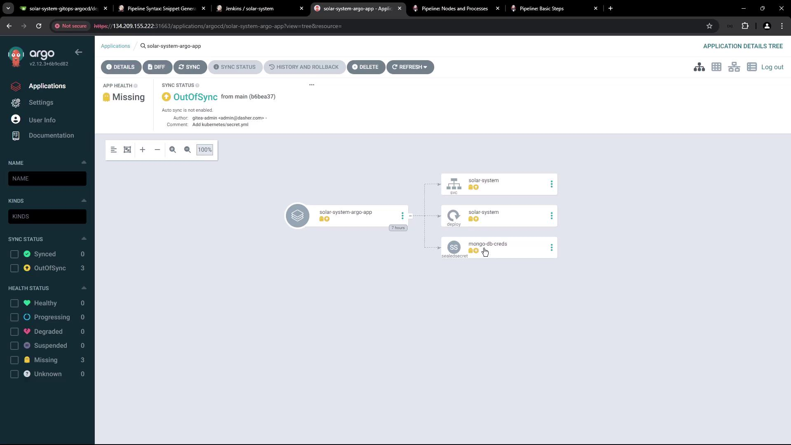
</Frame>

Verify no resources exist in the `solar-system` namespace:

```bash theme={null}
kubectl get all -n solar-system
```

## 3. Jenkins Pipeline: Add “K8S Update Image Tag” Stage

Add a new declarative stage to your `Jenkinsfile` to:

* Run only on pull request branches (`PR*`).
* Clone the GitOps repo.
* Update the Docker image tag in `deployment.yml`.
* Commit & push to `feature-$BUILD_ID`.

<Callout icon="lightbulb">
  Ensure the Jenkins agent has `git` and `sed` installed for cloning and file editing.
</Callout>

```groovy theme={null}
stage('K8S Update Image Tag') {
  when { branch 'PR*' }
  steps {
    script {
      if (fileExists('solar-system-gitops-argo-cd')) {
        sh 'rm -rf solar-system-gitops-argo-cd'
      }
    }
    sh 'git clone -b main http://64.227.187.25:5555/dasher-org/solar-system-gitops-argo-cd'
    dir('solar-system-gitops-argo-cd/kubernetes') {
      sh '''
        git checkout main
        git checkout -b feature-$BUILD_ID

        sed -i "s#image: .*#image: siddharth67/solar-system:$GIT_COMMIT#g" deployment.yml
        git config user.email "jenkins@dasher.com"
        git config user.name "Jenkins"
        git remote set-url origin http://$GITEA_TOKEN@64.227.187.25:5555/dasher-org/solar-system-gitops-argo-cd
        git add deployment.yml
        git commit -m "Update Docker image to $GIT_COMMIT"
        git push -u origin feature-$BUILD_ID
      '''
    }
  }
  post {
    always {
      script {
        if (fileExists('solar-system-gitops-argo-cd')) {
          sh 'rm -rf solar-system-gitops-argo-cd'
        }
      }
    }
  }
}
```

<Frame>
  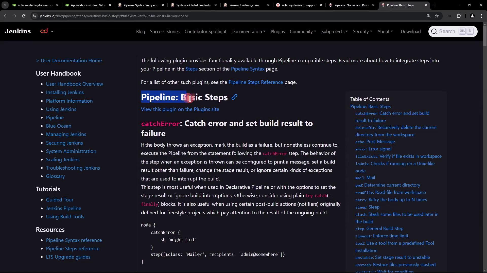
</Frame>

## 4. Configure Gitea API Token

### 4.1 Generate Token in Gitea

In Gitea user settings, create a new access token named `jenkins-token` with **read/write** scope:

<Frame>
  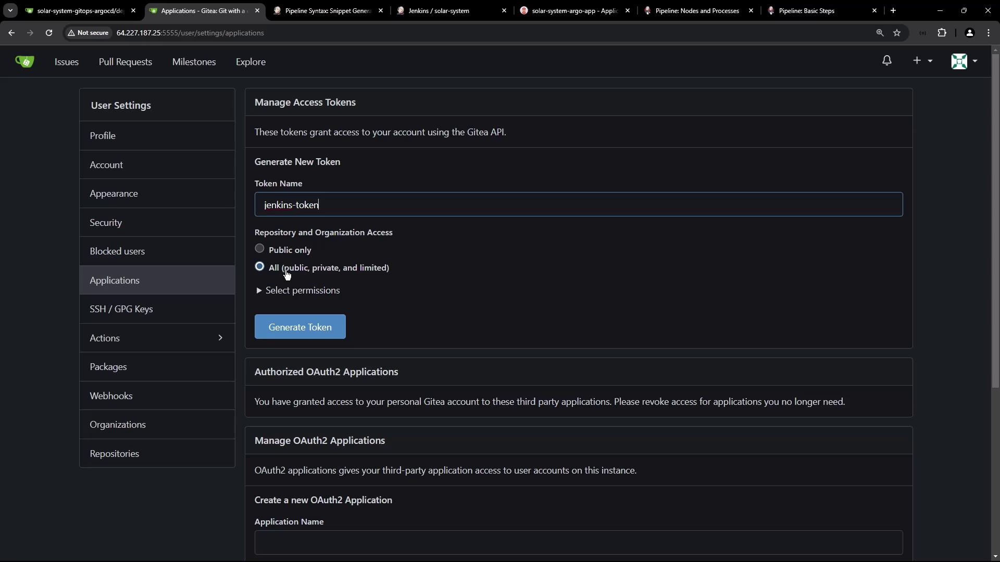
</Frame>

### 4.2 Add Token to Jenkins Credentials

Go to **Credentials > System > Global credentials** in Jenkins and add a **Secret text** credential with ID `gitea-api-token`:

<Frame>
  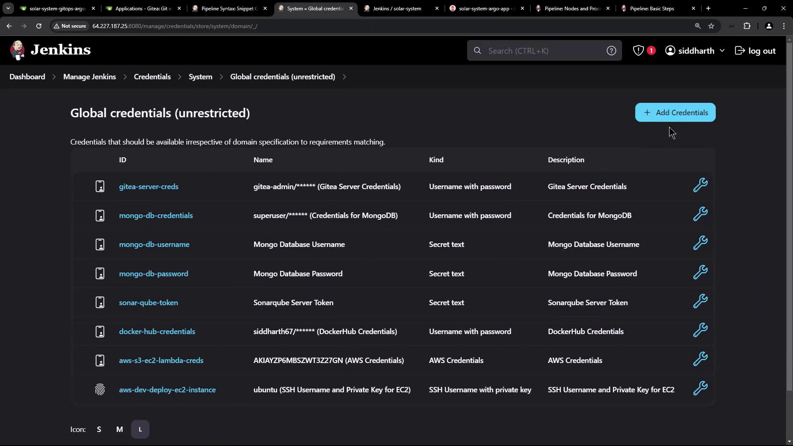
</Frame>

<Frame>
  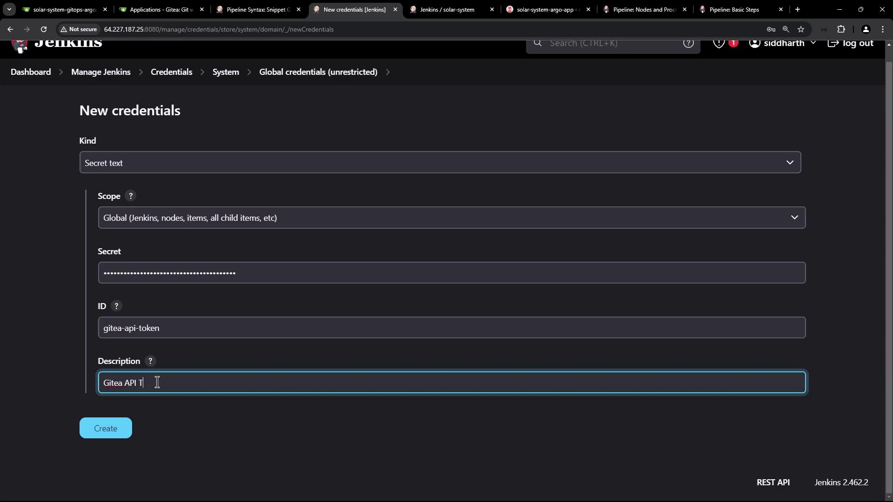
</Frame>

Reference it:

```groovy theme={null}
environment {
  GITEA_TOKEN = credentials('gitea-api-token')
}
```

<Callout icon="triangle-alert">
  Keep your API tokens secure. Do not hardcode secrets in your `Jenkinsfile`.
</Callout>

## 5. Webhook Trigger on Pull Requests

Configure a Gitea webhook to trigger Jenkins on pull request events:

<Frame>
  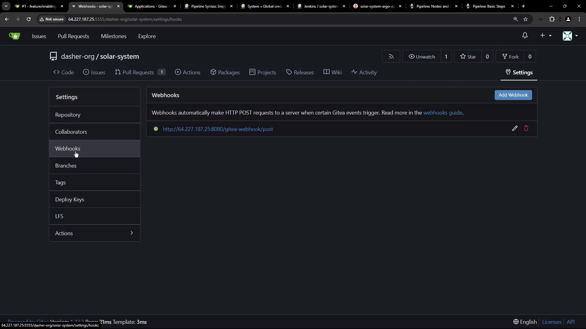
</Frame>

Enable **Pull request events**:

<Frame>
  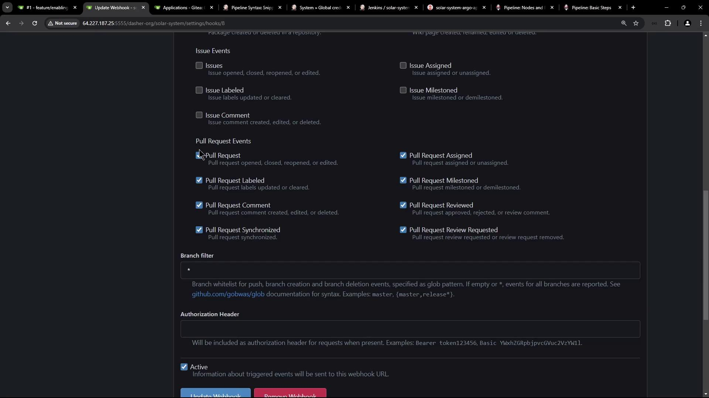
</Frame>

### 5.1 Create a Pull Request

Open a new PR against `main`:

<Frame>
  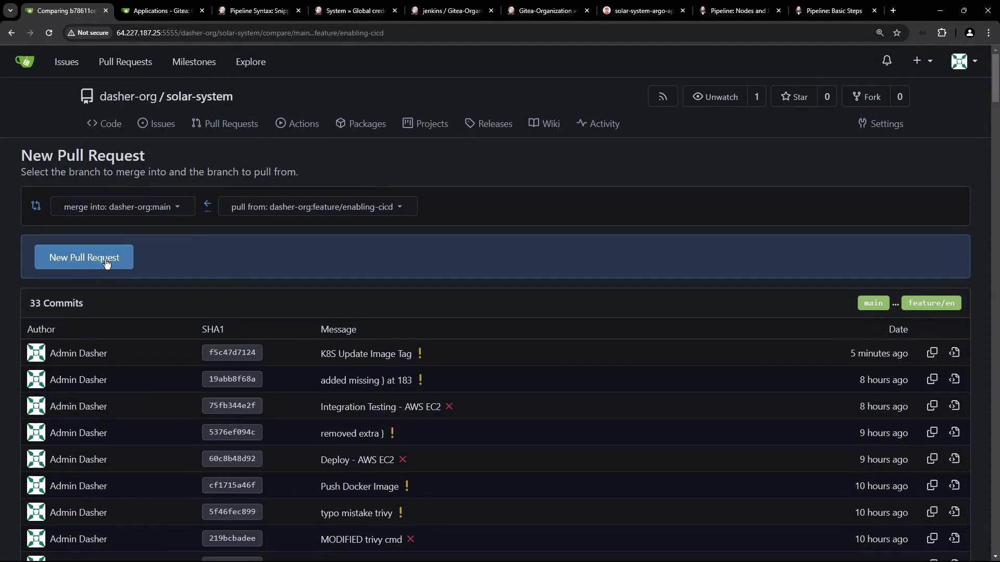
</Frame>

### 5.2 Observe Jenkins Pipeline Runs

Jenkins will build the PR branch and run the image update:

<Frame>
  
</Frame>

View the pipeline activity dashboard:

<Frame>
  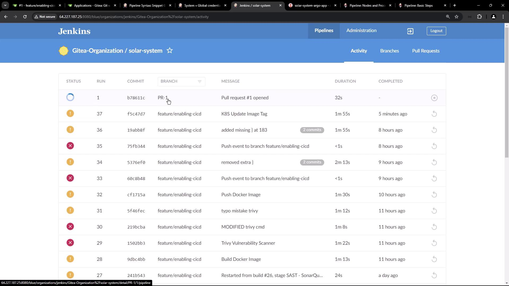
</Frame>

## 6. Confirm Image Tag Update

Check console logs:

```bash theme={null}
git clone -b main http://64.227.187.25:5555/dasher-org/solar-system-gitops-argo-cd
git checkout -b feature-1
sed -i "... deployment.yml"
git commit -am "Update Docker image to f5c47d71240f57467b284288f1c452f81341b"
git push -u origin feature-1
```

Inspect the `feature-1` branch in Gitea:

<Frame>
  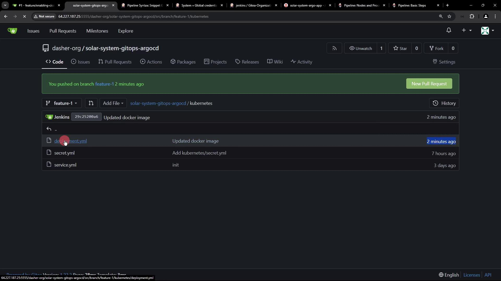
</Frame>

## 7. Sync with Argo CD

Since Argo CD tracks `main`, it remains **OutOfSync** until you merge `feature-1`:

<Frame>
  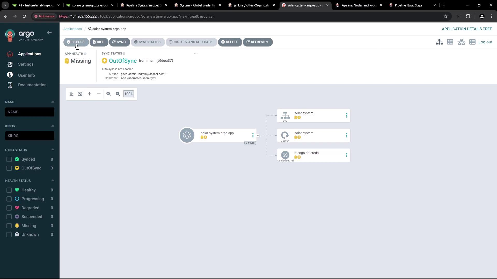
</Frame>

<Frame>
  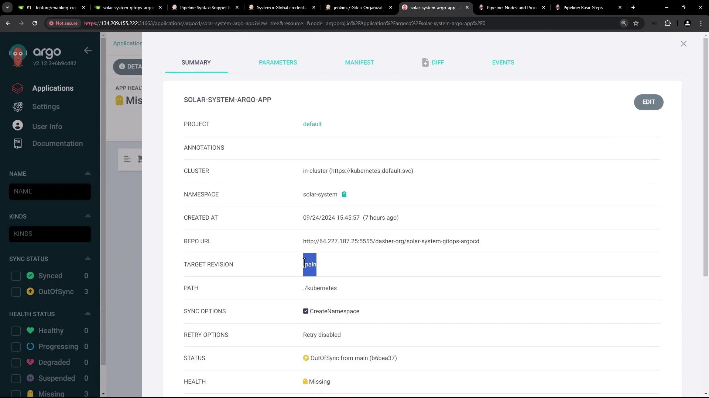
</Frame>

Next, automate merging `feature-1` into `main` so Argo CD can deploy the updated manifest.

## Links and References

* [Kubernetes Documentation](https://kubernetes.io/docs/)
* [Argo CD User Guide](https://argo-cd.readthedocs.io/)
* [Jenkins Pipeline Syntax](https://www.jenkins.io/doc/book/pipeline/syntax/)
* [Gitea Webhooks](https://docs.gitea.io/en-us/webhooks/)

Thank you for following this GitOps workflow!

<CardGroup>
  <Card title="Watch Video" icon="video" href="https://learn.kodekloud.com/user/courses/certified-jenkins-engineer/module/01d04ab3-0694-4c67-bd1a-c3eaaa8d64d3/lesson/d983bdc7-a066-4a29-967c-f29aab20054b" />
</CardGroup>
