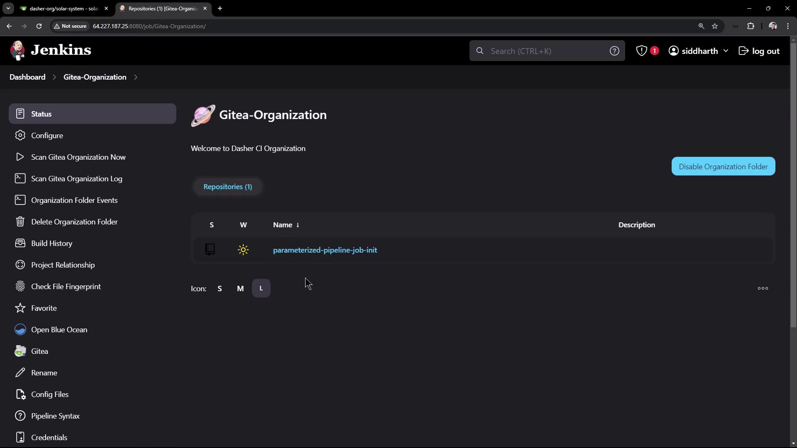
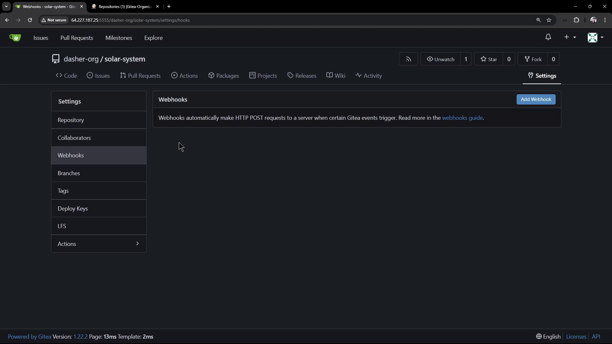
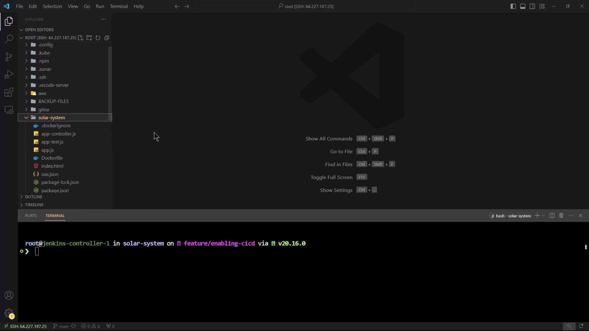
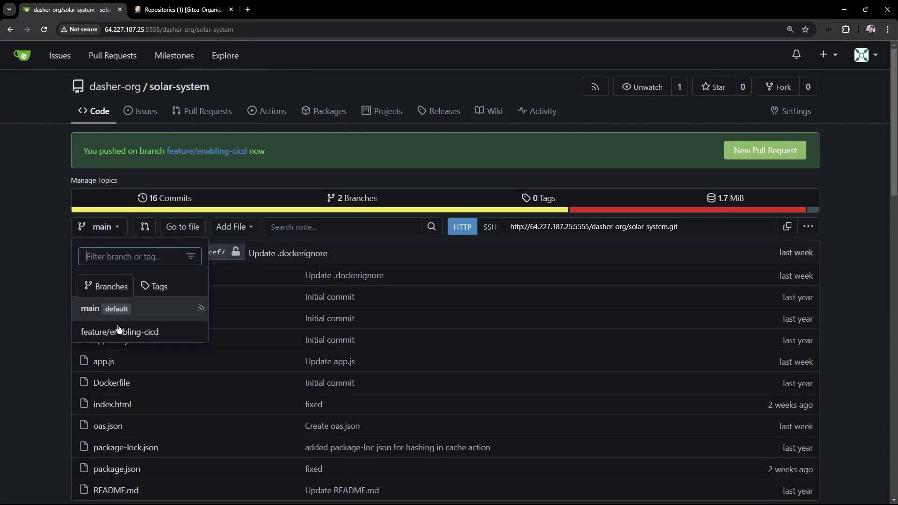
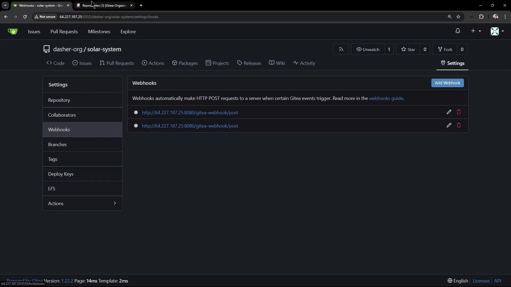
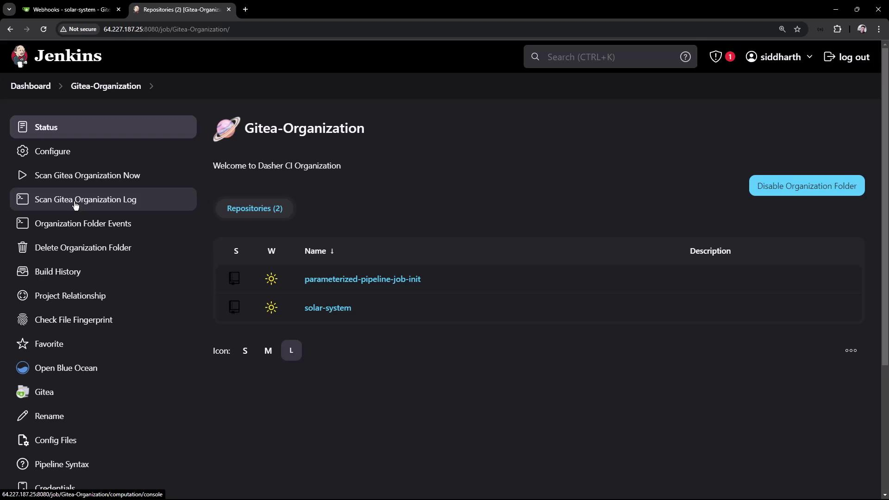
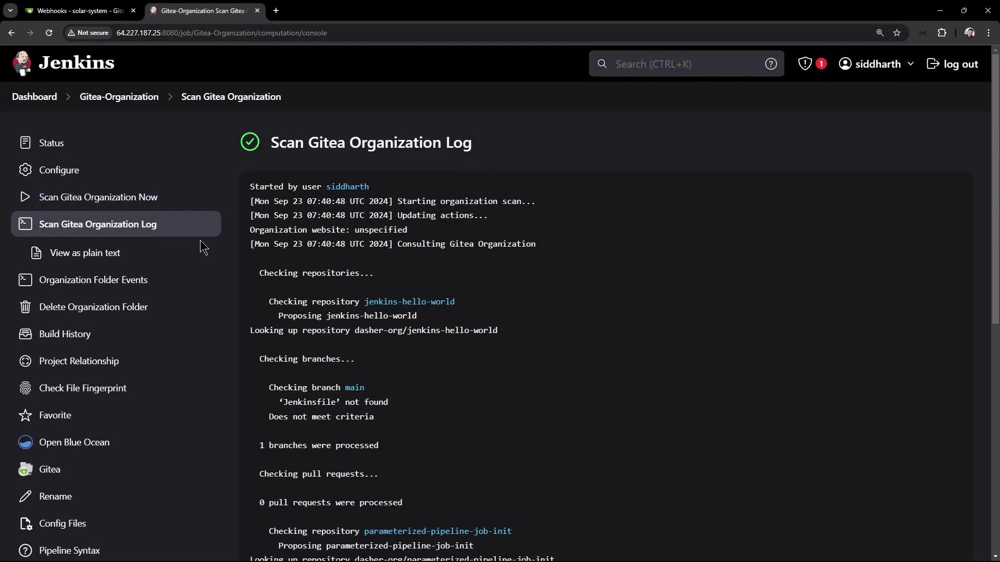
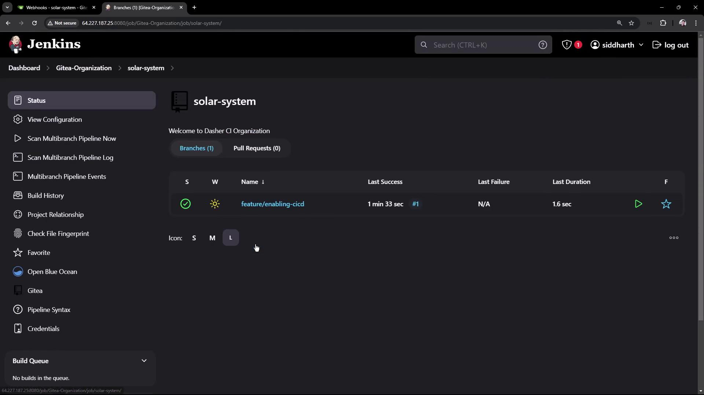
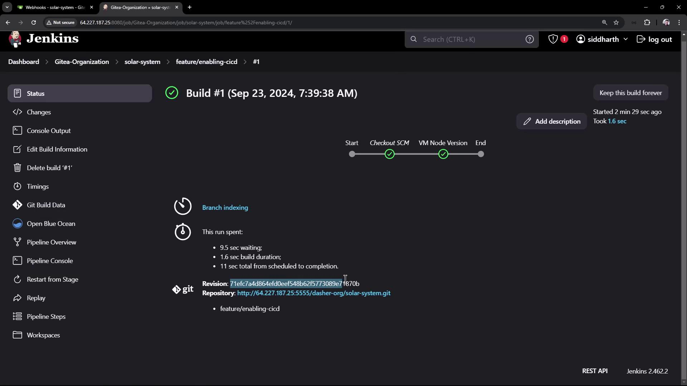
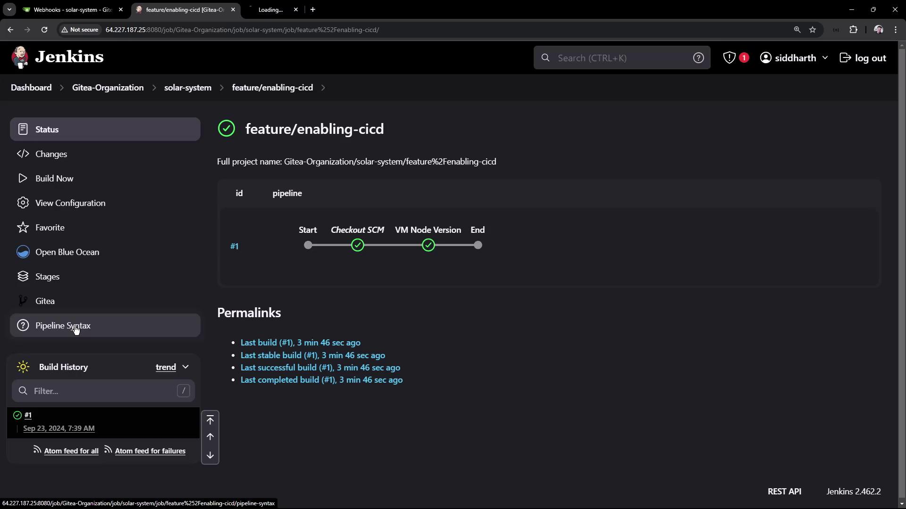

# Demo Add Jenkinsfile to Solar System Repo

Source: https://notes.kodekloud.com/docs/Certified-Jenkins-Engineer/Setting-up-CI-Pipeline/Demo-Add-Jenkinsfile-to-Solar-System-Repo/page

This tutorial explains how to set up a Jenkins pipeline for the Solar System repository by adding a Jenkinsfile.

In this tutorial, you’ll learn how to set up a basic Jenkins pipeline for the **Solar System** repository. We’ll add a `Jenkinsfile` at the repo root, push it in a feature branch, and let Jenkins automatically detect and run the pipeline via webhooks.

<Frame>
  
</Frame>

<Callout icon="lightbulb">
  * A running Jenkins instance with the [Gitea plugin installed](https://plugins.jenkins.io/gitea/).
  * A Gitea organization folder configured in Jenkins.
  * Access to your Gitea server and the **Solar System** repository.
</Callout>

***

## Why the Solar System Repo Isn’t Yet in Jenkins

By default, Jenkins scans your Gitea organization folder for repositories containing a `Jenkinsfile`. Since **Solar System** has no pipeline file or webhooks configured, it won’t appear in Jenkins:

<Frame>
  
</Frame>

***

## 1. Clone and Create a Feature Branch

Start by cloning the repo and creating a branch for CI/CD:

```bash theme={null}
git clone <YOUR_SPRINGBOARD_GITEA_URL>/your-org/solar-system.git
cd solar-system
git checkout -b feature/enabling-cicd
```

***

## 2. Add a Basic `Jenkinsfile`

Open the project in your editor:

<Frame>
  
</Frame>

Create a file named `Jenkinsfile` in the repository root:

```groovy theme={null}
pipeline {
  agent any

  stages {
    stage('VM Node Version') {
      steps {
        sh '''
          node -v
          npm -v
        '''
      }
    }
  }
}
```

This declarative pipeline runs on any agent and has one stage that prints the Node.js and npm versions.

Commit and push:

```bash theme={null}
git add Jenkinsfile
git commit -m "Add Jenkinsfile for basic pipeline"
git push --set-upstream origin feature/enabling-cicd
```

***

## 3. Confirm Branch and Webhooks in Gitea

After pushing, head to Gitea to verify your branch and watch Jenkins webhooks auto-generate:

<Frame>
  
</Frame>

You should see two new webhooks for Jenkins delivery:

<Frame>
  
</Frame>

***

## 4. Trigger a Jenkins Scan

Jenkins periodically scans the organization folder for new repositories or branches. You can also kick off a manual scan:

<Frame>
  
</Frame>

Once scanned, you’ll see the `feature/enabling-cicd` branch:

<Frame>
  
</Frame>

***

## 5. View the Multibranch Pipeline

Jenkins creates a multibranch job for **solar-system**:

<Frame>
  
</Frame>

Click on the build to inspect stages:

<Frame>
  
</Frame>

You can also view the pipeline overview:

<Frame>
  
</Frame>

### Pipeline Stages Overview

| Stage Name      | Purpose                          | Script                  |
| --------------- | -------------------------------- | ----------------------- |
| Checkout SCM    | Clone the repository             | Implicit in Declarative |
| VM Node Version | Display Node.js and npm versions | `node -v`<br />`npm -v` |

***

## 6. Use a Jenkins-Managed Node.js Tool

By default, the pipeline uses the host’s Node.js. To leverage a managed tool:

1. In Jenkins, go to **Pipeline Syntax** → **Declarative Directive Generator**.
2. Select **tools** and pick your Node.js installation (e.g., `nodejs-22-6-0`).
3. Copy the snippet and update your `Jenkinsfile`:

```groovy theme={null}
pipeline {
  agent any

  tools {
    nodejs 'nodejs-22-6-0'
  }

  stages {
    stage('VM Node Version') {
      steps {
        sh '''
          node -v
          npm -v
        '''
      }
    }
  }
}
```

Commit and push the change:

```bash theme={null}
git add Jenkinsfile
git commit -m "Use Jenkins-managed Node.js tool"
git push
```

Jenkins will automatically run a new build with the managed Node.js:

<Frame>
  
</Frame>

```bash theme={null}
+ node -v
v22.6.0
+ npm -v
10.8.2
```

***

## Conclusion

You’ve now:

* Added a `Jenkinsfile` to the **Solar System** repo
* Created webhooks in Gitea
* Triggered Jenkins to scan and build your feature branch
* Configured Jenkins to use a managed Node.js tool

Next, you can extend this pipeline with dependency installation, unit tests, and deployment stages.

***

## Links and References

* [Jenkins Gitea Plugin](https://plugins.jenkins.io/gitea/)
* [Declarative Pipeline Syntax](https://www.jenkins.io/doc/book/pipeline/syntax/)
* [Using Tools in Pipeline](https://www.jenkins.io/doc/book/pipeline/syntax/#tools)

<CardGroup>
  <Card title="Watch Video" icon="video" href="https://learn.kodekloud.com/user/courses/certified-jenkins-engineer/module/73d0066f-a01f-4d13-a00c-c9baf9aae603/lesson/b52d0e5f-a727-4bb8-9f6d-16519419213b" />
</CardGroup>
