# npm audit --audit-level=critical
@babel/traverse <7.23.2
Severity: critical
...
```

<Callout icon="lightbulb">
  NPM Audit supports four severity levels: `low`, `moderate`, `high`, and `critical`.\
  Adjust `--audit-level` based on your policy.
</Callout>

***

## 2. OWASP Dependency-Check Plugin

The OWASP Dependency-Check plugin scans multiple formats (HTML, XML, JSON, CSV) and supports quality gates.

### 2.1 Install the Plugin

1. **Manage Jenkins > Manage Plugins > Available**
2. Search **OWASP Dependency-Check**, install, and restart.

<Frame>
  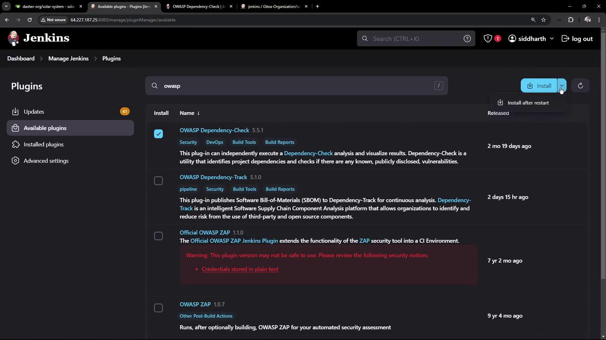
</Frame>

### 2.2 Global Tool Configuration

After restarting, go to **Manage Jenkins > Global Tool Configuration**.\
Add a **Dependency-Check** installation (e.g., version 10.0.3) and enable auto-install from GitHub.

<Frame>
  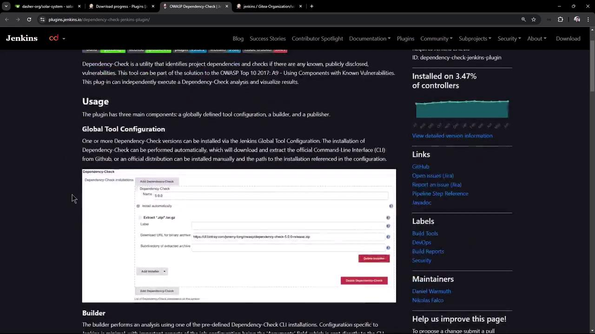
</Frame>

<Frame>
  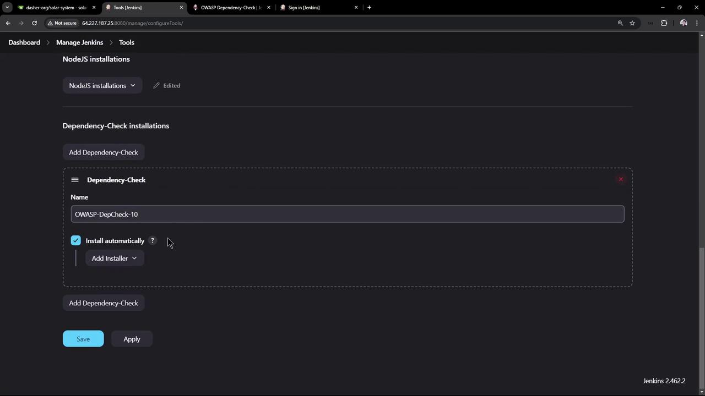
</Frame>

### 2.3 Generate Pipeline Snippet

In **Pipeline Syntax > Snippet Generator**:

* Step: **Invoke Dependency-Check**
* Installation: `OWASP-DepCheck-10`
* Arguments:
  ```bash theme={null}
  --scan ./
  --out ./
  --format 'ALL'
  --prettyPrint
  ```

<Frame>
  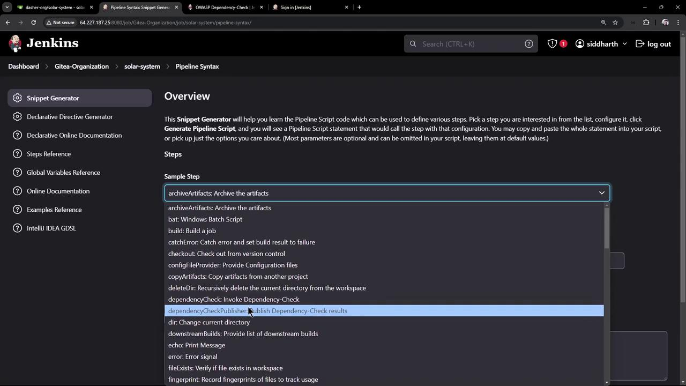
</Frame>

<Frame>
  
</Frame>

Insert into your `Jenkinsfile`:

```groovy theme={null}
stage('OWASP Dependency Check') {
  steps {
    dependencyCheck additionalArguments: '''
      --scan ./
      --out ./
      --format 'ALL'
      --prettyPrint
    ''', odcInstallation: 'OWASP-DepCheck-10'
  }
}
```

***

## 3. Running the Pipeline

Commit and push your `Jenkinsfile`. The first run downloads the NVD database (\~263 000 records), taking about 20–30 minutes. Look for logs like:

```text theme={null}
[INFO] Checking for updates
[WARNING] An NVD API Key has not been provided ...
[INFO] NVD API has 263,560 records in this update
...
[INFO] Writing report to /workspace/.../dependency-check-report.html
```

<Frame>
  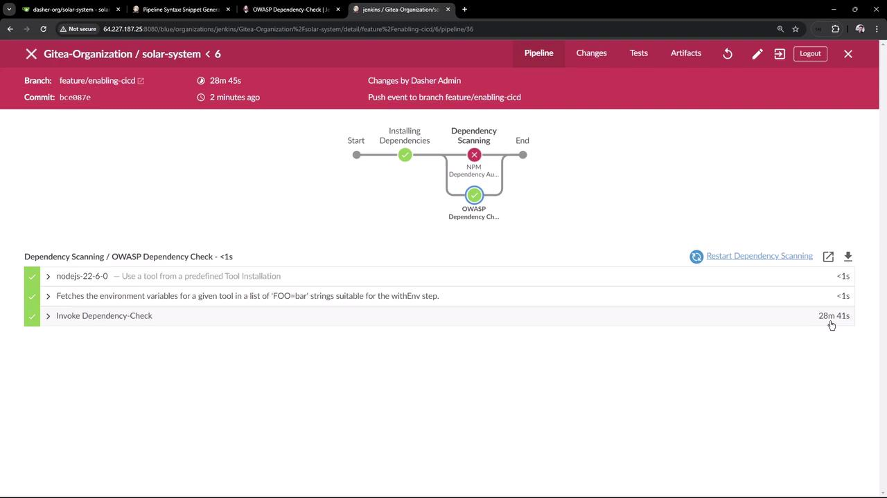
</Frame>

Reports generated in the workspace:

| Format | File Name                      |
| ------ | ------------------------------ |
| HTML   | `dependency-check-report.html` |
| XML    | `dependency-check-report.xml`  |
| JSON   | `dependency-check-report.json` |
| CSV    | `dependency-check-report.csv`  |

<Frame>
  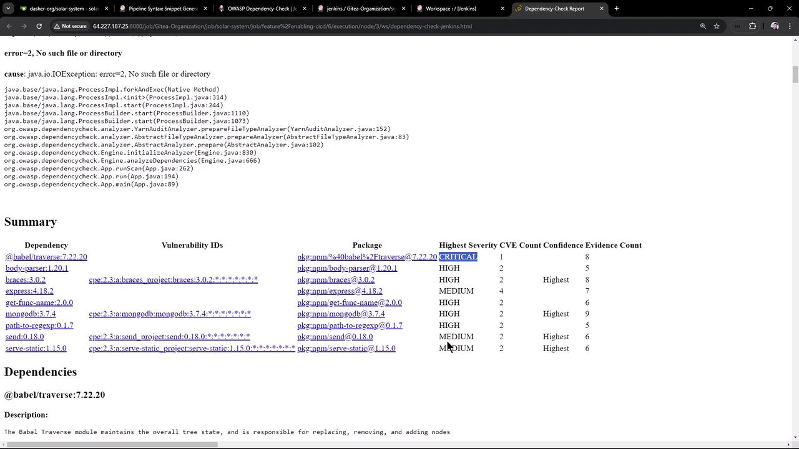
</Frame>

By default, findings don’t fail the build:

<Frame>
  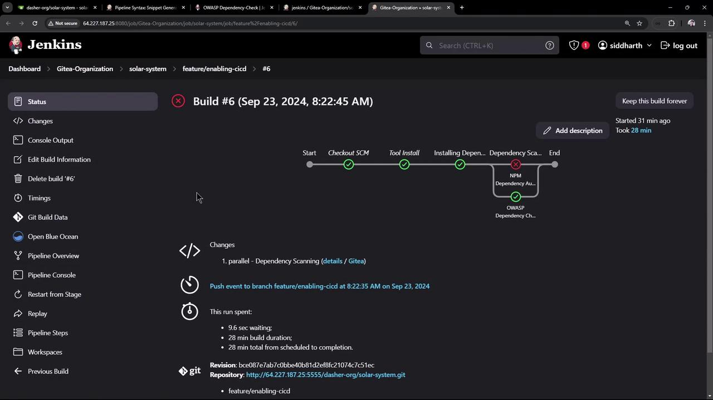
</Frame>

***

## 4. Enforcing Quality Gates

Fail builds if thresholds are exceeded:

1. In **Snippet Generator**, select **Publish Dependency-Check results**
2. Configure:
   * **XML report pattern**: `dependency-check-report.xml`
   * **Stop build** on threshold violation
   * **Failed total critical**: `1`

<Frame>
  
</Frame>

<Frame>
  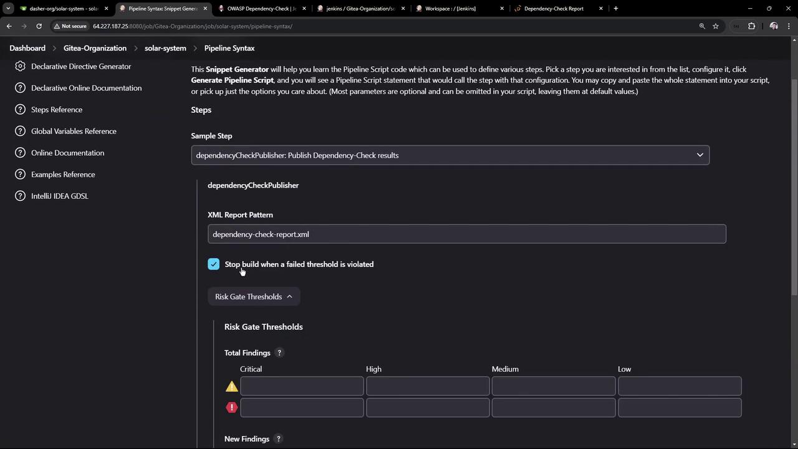
</Frame>

Generated snippet:

```groovy theme={null}
dependencyCheckPublisher failedTotalCritical: 1,
                       pattern: 'dependency-check-report.xml',
                       stopBuild: true
```

Combine both scans in parallel:

```groovy theme={null}
pipeline {
  stages {
    stage('Dependency Scanning') {
      parallel {
        stage('NPM Dependency Audit') {
          steps {
            sh '''
              npm audit --audit-level=critical
              echo $?
            '''
          }
        }
        stage('OWASP Dependency Check') {
          steps {
            dependencyCheck additionalArguments: '''
              --scan ./
              --out ./
              --format 'ALL'
              --prettyPrint
            ''', odcInstallation: 'OWASP-DepCheck-10'
            dependencyCheckPublisher failedTotalCritical: 1,
                                  pattern: 'dependency-check-report.xml',
                                  stopBuild: true
          }
        }
      }
    }
  }
}
```

On the next build you’ll see:

```text theme={null}
[INFO] Skipping the NVD API Update as it was completed within the last 240 minutes
...
Findings exceed configured thresholds
```

<Frame>
  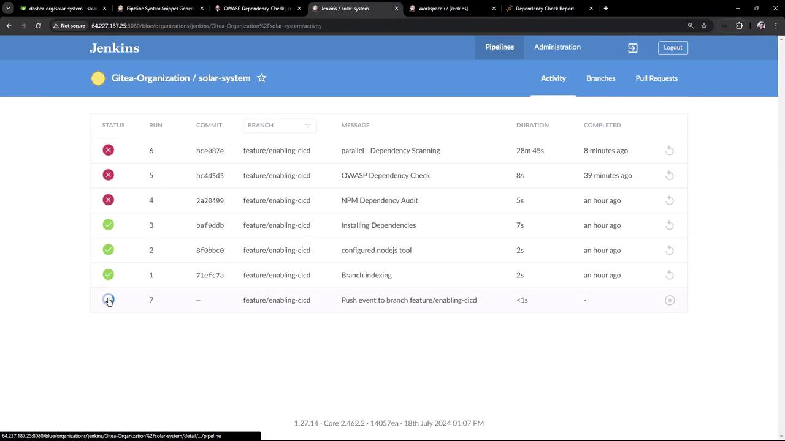
</Frame>

<Frame>
  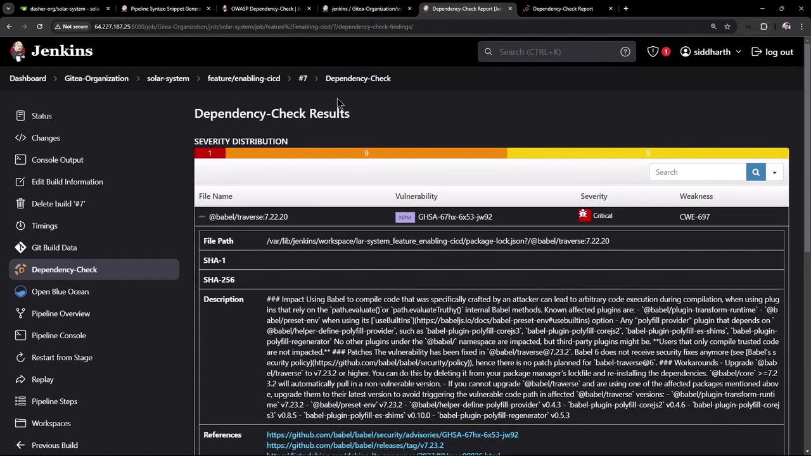
</Frame>

<Callout icon="triangle-alert">
  Builds will now fail if `critical` vulnerabilities exceed your defined threshold.\
  Review detailed results in the Jenkins UI to remediate issues.
</Callout>

***

## Conclusion

In this guide, we have:

* Integrated **NPM Audit** to catch critical Node.js vulnerabilities.
* Configured **OWASP Dependency-Check** for comprehensive scanning.
* Parallelized both stages to reduce build time.
* Enforced quality gates to automatically fail on critical findings.

Address the flagged vulnerabilities to keep your application secure.

<CardGroup>
  <Card title="Watch Video" icon="video" href="https://learn.kodekloud.com/user/courses/certified-jenkins-engineer/module/73d0066f-a01f-4d13-a00c-c9baf9aae603/lesson/f3ae0d17-31fb-40be-ad10-0a3056474a61" />
</CardGroup>


# Demo Unit Testing and Analyze JUnit Reports

Source: https://notes.kodekloud.com/docs/Certified-Jenkins-Engineer/Setting-up-CI-Pipeline/Demo-Unit-Testing-and-Analyze-JUnit-Reports/page

Optimize your Jenkins CI/CD pipeline by adding a dedicated Unit Testing stage and publishing JUnit reports for clear visibility into your test results.

Optimize your Jenkins CI/CD pipeline by adding a dedicated **Unit Testing** stage, securely managing database credentials, and publishing JUnit reports for clear visibility into your test results.

## Table of Contents

* [Pipeline Stages Overview](#pipeline-stages-overview)
* [Adding the Unit Testing Stage](#adding-the-unit-testing-stage)
* [Debugging a Failed Test Stage](#debugging-a-failed-test-stage)
* [Configuring Environment Variables](#configuring-environment-variables)
* [Managing Jenkins Credentials](#managing-jenkins-credentials)
* [Wrapping Tests with Credentials](#wrapping-tests-with-credentials)
* [Publishing and Viewing Test Results](#publishing-and-viewing-test-results)
* [Final Pipeline Snippet](#final-pipeline-snippet)
* [References](#references)

## Pipeline Stages Overview

| Stage Name              | Purpose                                       | Example Command           |
| ----------------------- | --------------------------------------------- | ------------------------- |
| Installing Dependencies | Install project dependencies with npm         | `sh 'npm install'`        |
| Dependency Scanning     | Audit packages for vulnerabilities            | `npm audit` / OWASP tools |
| Unit Testing            | Run Mocha tests and generate JUnit XML report | `sh 'npm test'`           |

## Adding the Unit Testing Stage

Open your `Jenkinsfile` and insert a `Unit Testing` stage right after `Dependency Scanning`:

```groovy theme={null}
pipeline {
    agent any
    stages {
        stage('Installing Dependencies') {
            steps {
                sh 'npm install'
            }
        }
        stage('Dependency Scanning') {
            // existing scanning steps
        }
        stage('Unit Testing') {
            steps {
                sh 'npm test'
            }
        }
    }
}
```

Commit and push the changes to trigger a new build:

```bash theme={null}
git add Jenkinsfile
git commit -m "Add Unit Testing stage"
git push origin feature/enabling-cicd
```

Navigate to the Jenkins pipeline UI; the build will start automatically.

## Debugging a Failed Test Stage

In our example, the Unit Testing stage fails because MongoDB credentials are missing:

<Frame>
  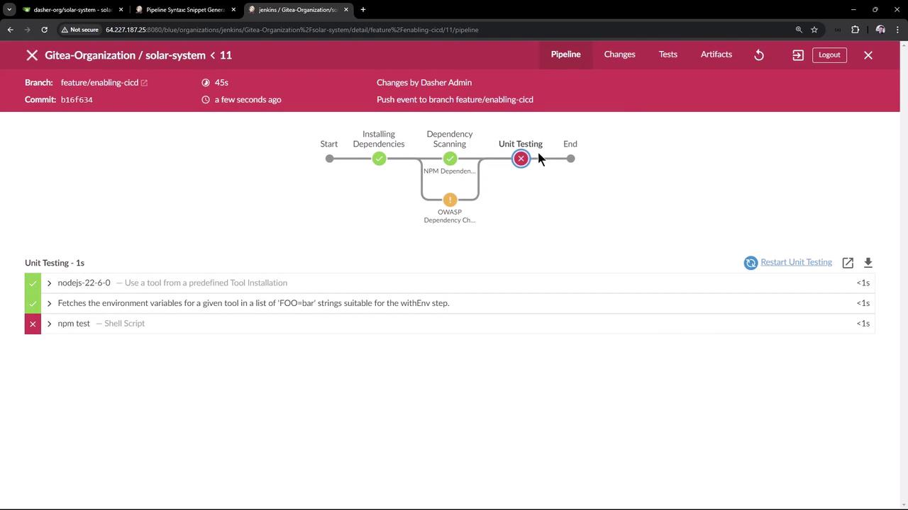
</Frame>

### Error Output

```bash theme={null}
> npm test
> Solar System@6.7.6 test
> mocha app-test.js --timeout 10000 --reporter mocha-junit-reporter --exit

MongooseError: The `uri` parameter to `openUri()` must be a string, got `undefined`. Make sure the first parameter to `mongoose.connect()` or `mongoose.createConnection()` is a string.
```

Your `app.js` expects these environment variables:

```javascript theme={null}
mongoose.connect(process.env.MONGO_URI, {
  user: process.env.MONGO_USERNAME,
  pass: process.env.MONGO_PASSWORD,
  useNewUrlParser: true,
  useUnifiedTopology: true
}, err => {
  if (err) console.log("error!! " + err);
});
```

Without `MONGO_URI`, `MONGO_USERNAME`, or `MONGO_PASSWORD`, the connection fails.

## Configuring Environment Variables

You can define `MONGO_URI` in your `Jenkinsfile`, but be aware of plaintext exposure.

```groovy theme={null}
pipeline {
    agent any
    environment {
        MONGO_URI = "mongodb+srv://supercluster.d83jj.mongodb.net/superData"
    }
    stages { ... }
}
```

<Callout icon="triangle-alert">
  Storing sensitive connection strings directly in the `Jenkinsfile` exposes them in plaintext. Use [Jenkins Credentials](#managing-jenkins-credentials) for usernames and passwords.
</Callout>

## Managing Jenkins Credentials

1. Go to **Manage Jenkins > Credentials > System > Global credentials (unrestricted)**.
2. Click **Add Credentials** and choose **Username with password**.
   * **ID**: `mongo-db-credentials`
   * **Username**: `superuser`
   * **Password**: `superpassword`

<Frame>
  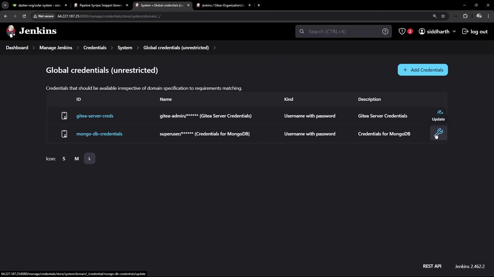
</Frame>

Use the **Pipeline Syntax** Snippet Generator to see how `withCredentials` bindings look:

<Frame>
  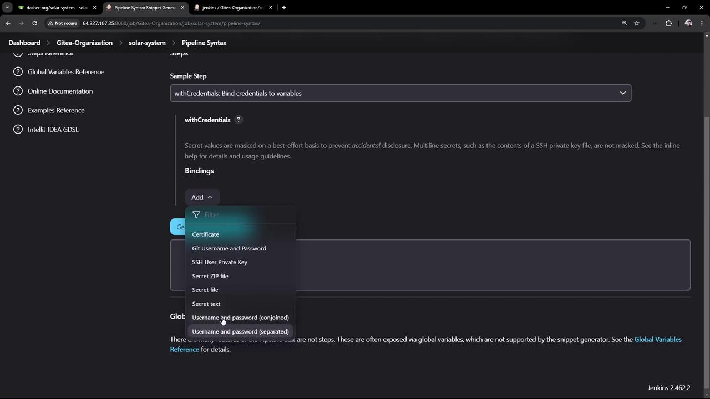
</Frame>

<Frame>
  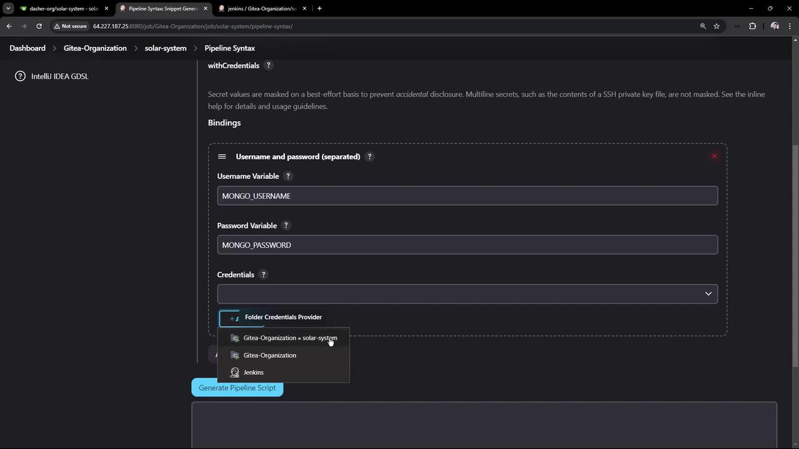
</Frame>

## Wrapping Tests with Credentials

Update the `Unit Testing` stage to inject credentials at runtime and archive JUnit reports:

```groovy theme={null}
stage('Unit Testing') {
    steps {
        withCredentials([
            usernamePassword(
                credentialsId: 'mongo-db-credentials',
                usernameVariable: 'MONGO_USERNAME',
                passwordVariable: 'MONGO_PASSWORD'
            )
        ]) {
            sh 'npm test'
        }
        // Archive JUnit XML results
        junit allowEmptyResults: true, testResults: '**/test-results.xml'
    }
}
```

<Callout icon="lightbulb">
  The `junit` step will fail the build if no XML files are found unless you set `allowEmptyResults: true`.\
  See [Pipeline Syntax: junit](https://www.jenkins.io/doc/pipeline/steps/junit/) for details.
</Callout>

Commit and push—your next build will connect to MongoDB, run tests, and generate a JUnit report.

## Publishing and Viewing Test Results

After a successful build:

1. Open the **Workspace** to verify `test-results.xml` exists.
2. Click **Test Result** in the sidebar for a summary of test cases.

<Frame>
  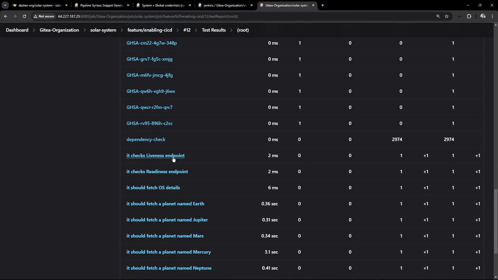
</Frame>

You’ll see each test—**liveness**, **readiness**, and **planet-fetching** endpoints—with pass/fail status.

## Final Pipeline Snippet

```groovy theme={null}
pipeline {
    agent any
    tools {
        // e.g., nodejs 'nodejs-22-6-0'
    }
    environment {
        MONGO_URI = "mongodb+srv://supercluster.d83jj.mongodb.net/superData"
    }
    stages {
        stage('Installing Dependencies') {
            steps {
                sh 'npm install'
            }
        }
        stage('Dependency Scanning') {
            parallel {
                stage('NPM Dependency Audit') {
                    steps {
                        sh 'npm audit --audit-level=high'
                    }
                }
                stage('OWASP Dependency Check') {
                    steps {
                        // OWASP scanning commands
                    }
                }
            }
        }
        stage('Unit Testing') {
            steps {
                withCredentials([
                    usernamePassword(
                        credentialsId: 'mongo-db-credentials',
                        usernameVariable: 'MONGO_USERNAME',
                        passwordVariable: 'MONGO_PASSWORD'
                    )
                ]) {
                    sh 'npm test'
                }
                junit '**/test-results.xml'
            }
        }
    }
}
```

With this setup, your Jenkins pipeline runs secure unit tests against MongoDB and provides detailed JUnit reports right in the UI.

## References

* [Jenkins Pipeline Syntax](https://www.jenkins.io/doc/book/pipeline/syntax/)
* [Mocha JUnit Reporter](https://github.com/michaelleeallen/mocha-junit-reporter)
* [Jenkins Credentials Binding Plugin](https://plugins.jenkins.io/credentials-binding/)

<CardGroup>
  <Card title="Watch Video" icon="video" href="https://learn.kodekloud.com/user/courses/certified-jenkins-engineer/module/73d0066f-a01f-4d13-a00c-c9baf9aae603/lesson/d6aa8774-59d8-44fb-bcbb-97911b4b0c3d" />
</CardGroup>
