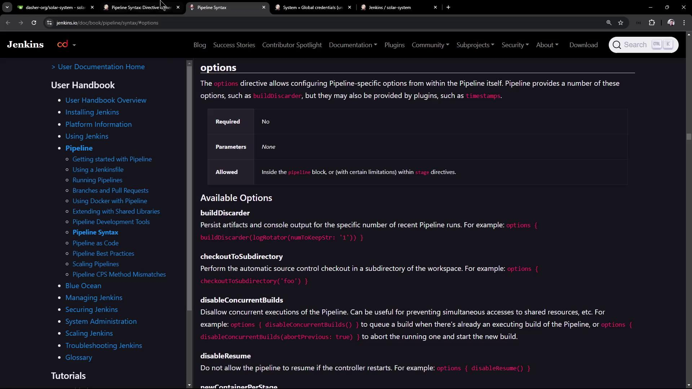
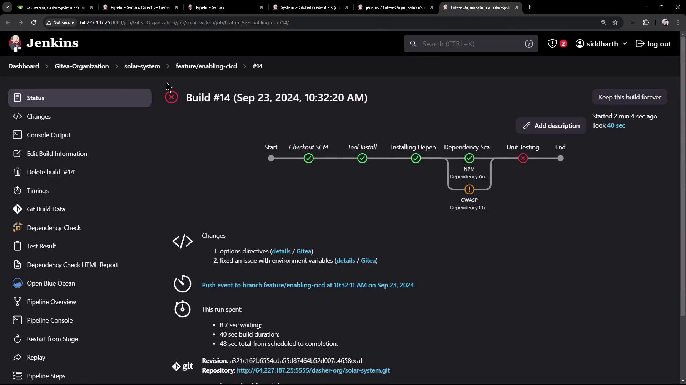
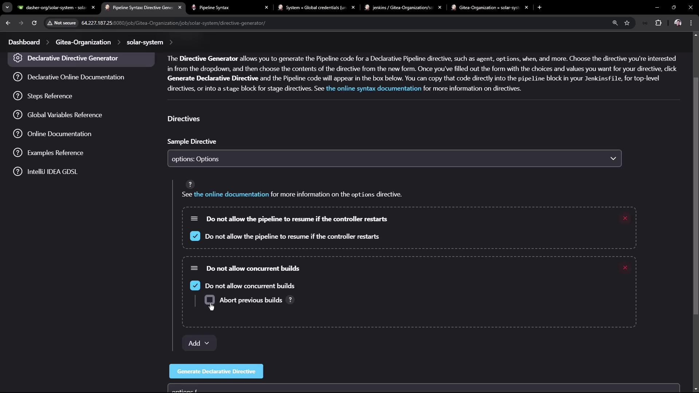

# Demo Using Options Directive

Source: https://notes.kodekloud.com/docs/Certified-Jenkins-Engineer/Setting-up-CI-Pipeline/Demo-Using-Options-Directive/page

Learn to use the options directive in Jenkins Declarative Pipelines for features like timestamps, retries, and build concurrency control.

In this lesson, you’ll learn how to leverage the `options` directive to fine-tune your Jenkins Declarative Pipeline. You can apply options globally (pipeline level) or locally (per stage), enabling features like timestamps, retries, and build concurrency control.

## Inspecting Available Options

Before configuring your pipeline, explore all supported options in the official Jenkins Pipeline Syntax documentation.

<Callout icon="lightbulb">
  Refer to the [Pipeline Syntax documentation](https://www.jenkins.io/doc/book/pipeline/syntax/) for an up-to-date list of directives you can use.
</Callout>

<Frame>
  
</Frame>

## Adding Timestamps to a Stage

Including timestamps in your console log helps you measure step durations and troubleshoot performance issues. To enable timestamps for a specific stage:

```groovy theme={null}
pipeline {
    agent any

    stages {
        stage('Install Dependencies') {
            options {
                timestamps()
            }
            steps {
                sh 'npm install --no-audit'
            }
        }
    }
}
```

## Retrying a Stage on Failure

When interacting with external systems (e.g., databases or APIs), transient failures can occur. Use `retry(count)` to automatically rerun the stage upon failure:

```groovy theme={null}
pipeline {
    agent any

    stages {
        stage('Unit Testing') {
            options {
                retry(2)
            }
            steps {
                withCredentials([usernamePassword(
                    credentialsId: 'mongo-db-credentials',
                    passwordVariable: 'MONGO'
                )]) {
                    sh 'npm test'
                }
            }
            post {
                always {
                    junit allowEmptyResults: true,
                          testResults: 'test-results.xml'
                }
            }
        }
    }
}
```

If your `MONGO_URI` is missing, Jenkins reports:

```plaintext theme={null}
MongooseError: The `uri` parameter to `openUri()` must be a string, got `undefined`.
```

With `retry(2)`, Jenkins will attempt the stage up to two additional times before failing.

<Frame>
  
</Frame>

You can track retry attempts in the console output.

## Disabling Resume and Concurrent Builds

At the pipeline level, you can:

* Prevent resume after a restart using `disableResume()`.
* Abort previous builds when a new one starts using `disableConcurrentBuilds(abortPrevious: true)`.

<Frame>
  
</Frame>

```groovy theme={null}
pipeline {
    agent any

    environment {
        MONGO_URI = "mongodb+srv://supercluster.d83jj.mongodb.net/superData"
    }

    options {
        disableResume()
        disableConcurrentBuilds(abortPrevious: true)
    }

    stages {
        stage('Install Dependencies') {
            options { timestamps() }
            steps {
                sh 'sleep 100s'
                sh 'npm install --no-audit'
            }
        }
        stage('Dependency Scanning') {
            steps {
                // Security and license checks go here
            }
        }
        stage('Unit Testing') {
            options { retry(2) }
            steps {
                withCredentials([usernamePassword(
                    credentialsId: 'mongo-db-credentials',
                    usernameVariable: 'MONGO_USERNAME',
                    passwordVariable: 'MONGO_PASSWORD'
                )]) {
                    sh 'npm test'
                }
            }
            post {
                always {
                    junit allowEmptyResults: true,
                          testResults: 'test-results.xml'
                }
            }
        }
    }
}
```

When a new build is triggered during the `sleep 100s` step, the previous build is aborted:

<Frame>
  
</Frame>

```bash theme={null}
16:06:57 + sleep 100s
16:07:25 Sending interrupt signal to process
Superseded by #16
16:07:29 Terminated: script returned exit code 143
```

<Callout icon="triangle-alert">
  Using `disableResume()` will remove the ability to resume pipeline execution after a Jenkins restart. Use it only if you have idempotent stages or external state management.
</Callout>

## Summary of Pipeline Options

| Option                         | Scope    | Description                                                         | Example                                                    |
| ------------------------------ | -------- | ------------------------------------------------------------------- | ---------------------------------------------------------- |
| `timestamps()`                 | Stage    | Prefixes each log line with a timestamp.                            | `options { timestamps() }`                                 |
| `retry(count)`                 | Stage    | Retries a failing stage up to `count` times.                        | `options { retry(2) }`                                     |
| `disableResume()`              | Pipeline | Disables pipeline continuation after a Jenkins restart.             | `options { disableResume() }`                              |
| `disableConcurrentBuilds(...)` | Pipeline | Prevents concurrent runs; can abort previous builds when triggered. | `options { disableConcurrentBuilds(abortPrevious: true) }` |

## Links and References

* [Jenkins Declarative Pipeline Syntax](https://www.jenkins.io/doc/book/pipeline/syntax/)
* [Pipeline Options Reference](https://www.jenkins.io/doc/book/pipeline/shared-libraries/#options)
* [Jenkins Credentials Management](https://www.jenkins.io/doc/book/using/using-credentials/)

Explore these resources to discover more ways to customize your Jenkins pipelines and streamline your CI/CD workflows.

<CardGroup>
  <Card title="Watch Video" icon="video" href="https://learn.kodekloud.com/user/courses/certified-jenkins-engineer/module/73d0066f-a01f-4d13-a00c-c9baf9aae603/lesson/ba134466-caa5-4ca2-b72e-dd1c2f0d1393" />
</CardGroup>
