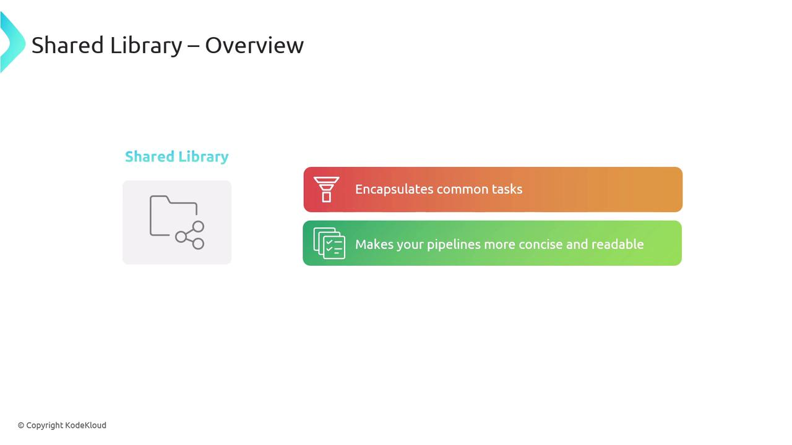
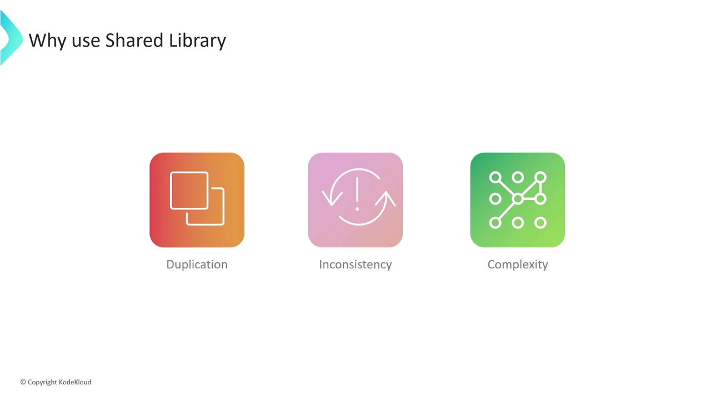
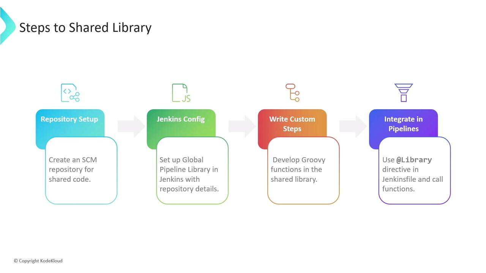
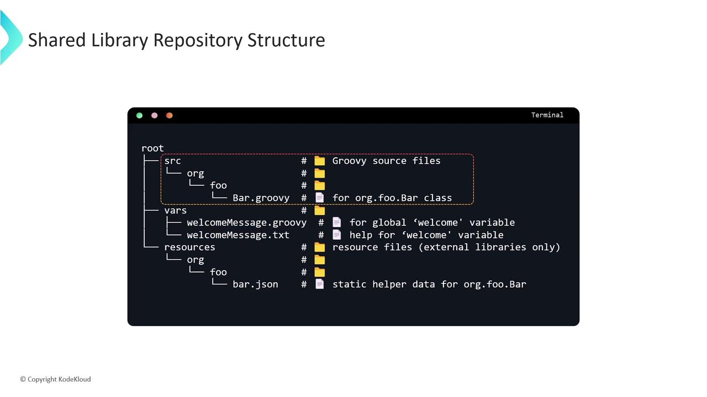
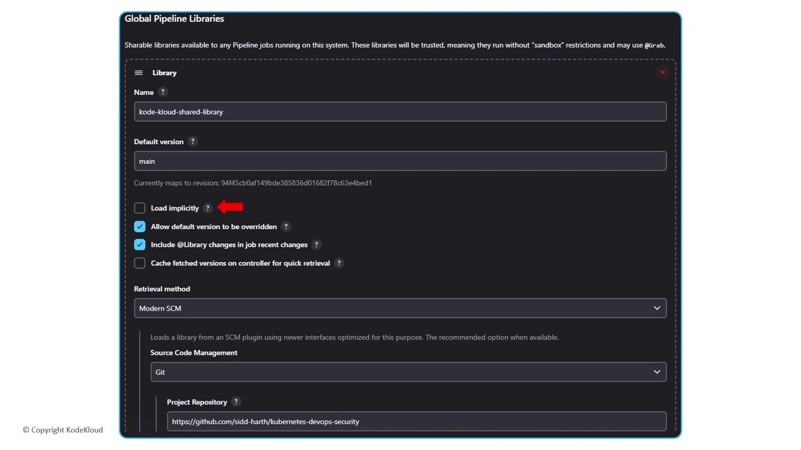

# Introduction to Shared Libraries

Source: https://notes.kodekloud.com/docs/Certified-Jenkins-Engineer/Shared-Libraries-in-Jenkins/Introduction-to-Shared-Libraries/page

Learn to use Jenkins Shared Libraries for centralizing pipeline logic, reducing duplication, and ensuring consistency across projects.

In this lesson, you’ll discover how to use **Jenkins Shared Libraries** to centralize common pipeline logic, reduce duplication, and enforce consistency across all your projects.

A Shared Library is a Git-hosted collection of Groovy scripts that define reusable pipeline steps. By abstracting repetitive tasks into library functions, your Jenkinsfiles become cleaner, easier to read, and maintain.

<Frame>
  
</Frame>

## Why Use Shared Libraries?

Imagine maintaining dozens of Jenkinsfiles, each running the same build-and-test steps. You’ll encounter:

* **Duplication**: Copy-pasting identical pipeline blocks.
* **Inconsistency**: Updates applied to one pipeline aren’t reflected in others.
* **Complexity**: Scattering changes across repositories becomes error-prone.

<Frame>
  
</Frame>

<Callout icon="lightbulb">
  Following the **DRY (Don’t Repeat Yourself)** principle helps you write pipeline logic once and use it everywhere.
</Callout>

## Example: From Hard-Coded to Library-Driven

### Before: Repeating the Welcome Message

```groovy theme={null}
// Jenkinsfile (generic)
pipeline {
  agent any
  stages {
    stage('Welcome') {
      steps {
        sh 'echo Welcome to the DevOps team from Dasher Organization'
      }
    }
    stage('Build') {
      steps {
        sh 'npm install'
        sh 'npm run build'
      }
    }
  }
}
```

Variations for Linux and Windows pipelines simply duplicate that same **Welcome** step:

```groovy theme={null}
// Jenkinsfile (windows)
pipeline {
  agent { label 'windows' }
  stages {
    stage('Welcome') {
      steps {
        bat 'echo Welcome to the DevOps team from Dasher Organization'
      }
    }
    stage('Checkout') {
      steps {
        checkout scm
      }
    }
  }
}
```

Updating the organization name to **KodeKloud** in hundreds of Jenkinsfiles is both time-consuming and risky.

### After: Centralizing the Welcome Step

Move the welcome logic into a shared library function:

```groovy theme={null}
// vars/welcomeMessage.groovy
def call() {
  sh 'echo Welcome to the DevOps team from Dasher Organization'
}
```

Invoke it in any Jenkinsfile:

```groovy theme={null}
@Library('kode-kloud-shared-library')
pipeline {
  agent any
  stages {
    stage('Welcome') {
      steps {
        welcomeMessage()
      }
    }
    stage('Build') {
      steps {
        sh 'npm install'
        sh 'npm run build'
      }
    }
  }
}
```

Now a single change in `welcomeMessage.groovy` updates every pipeline automatically.

***

<Frame>
  
</Frame>

## Setting Up Your Shared Library

1. **Create a Git repository** dedicated to your shared library.
2. **Configure Jenkins** under **Manage Jenkins > Configure System > Global Pipeline Libraries**: define the library name, default version (branch), and SCM details.
3. **Structure your repo** with `src/`, `vars/`, and `resources/` directories.
4. **Use** `@Library('your-library-name')` in Jenkinsfiles to load and call your custom steps.

***

<Frame>
  
</Frame>

### Typical Repository Layout

```text theme={null}
(shared-library-repo)
├── src/                # Optional: compiled Groovy/Java code
├── vars/               # Required: one .groovy per pipeline step
│   ├── welcomeMessage.groovy
│   └── welcomeMessage.txt  # Documentation for the step
└── resources/          # Optional: non-code files (JSON, templates)
```

| Directory  | Purpose                                                           |
| ---------- | ----------------------------------------------------------------- |
| src/       | Standard Java/Groovy classes (compiled on the classpath)          |
| vars/      | Each Groovy file defines a pipeline step; filenames use camelCase |
| resources/ | Static files loaded via `libraryResource`                         |

***

## Configuring Global Pipeline Libraries

In **Manage Jenkins > Configure System** under **Global Pipeline Libraries**, add your library:

| Field                                  | Description                                              |
| -------------------------------------- | -------------------------------------------------------- |
| Name                                   | `kode-kloud-shared-library`                              |
| Default Version                        | `main` (branch or tag)                                   |
| Retrieval Method                       | Modern SCM (Git) with repository URL                     |
| Allow default version to be overridden | Enable if you want to load other branches via `@Library` |

<Frame>
  
</Frame>

<Callout icon="triangle-alert">
  Ensure Jenkins has appropriate read permissions for your Shared Library repository.
</Callout>

***

## Advanced Example: Notification Utility

Add a reusable notification step in `vars/sendNotification.groovy`:

```groovy theme={null}
def call(String buildStatus = 'STARTED') {
  buildStatus = buildStatus ?: 'SUCCESS'
  def color, emoji
  if (buildStatus == 'SUCCESS') {
    color = '#47c265'; emoji = ':smile:'
  } else if (buildStatus == 'UNSTABLE') {
    color = '#f39c12'; emoji = ':neutral_face:'
  } else {
    color = '#e74c3c'; emoji = ':boom:'
  }
  // Example: slackSend(color: color, message: "${emoji} Build ${currentBuild.fullDisplayName} is ${buildStatus}")
}
```

Invoke it in your Jenkinsfile after tests:

```groovy theme={null}
@Library('kode-kloud-shared-library')
pipeline {
  agent any
  stages {
    stage('Build') { steps { sh 'npm install'; sh 'npm run build' } }
    stage('Test')  { steps { sh 'npm test' } }
  }
  post {
    always { sendNotification(currentBuild.currentResult) }
  }
}
```

***

## References

* [Jenkins Pipeline Shared Libraries](https://www.jenkins.io/doc/book/pipeline/shared-libraries/)
* [Jenkins Pipeline Syntax](https://www.jenkins.io/doc/book/pipeline/syntax/)
* [Groovy Language Documentation](https://groovy-lang.org/documentation.html)

<CardGroup>
  <Card title="Watch Video" icon="video" href="https://learn.kodekloud.com/user/courses/certified-jenkins-engineer/module/b0fefde6-7fea-44da-9509-27007d27869f/lesson/8a6eb6c9-043f-4db3-ab3c-dce38e2f3f1e" />
</CardGroup>
