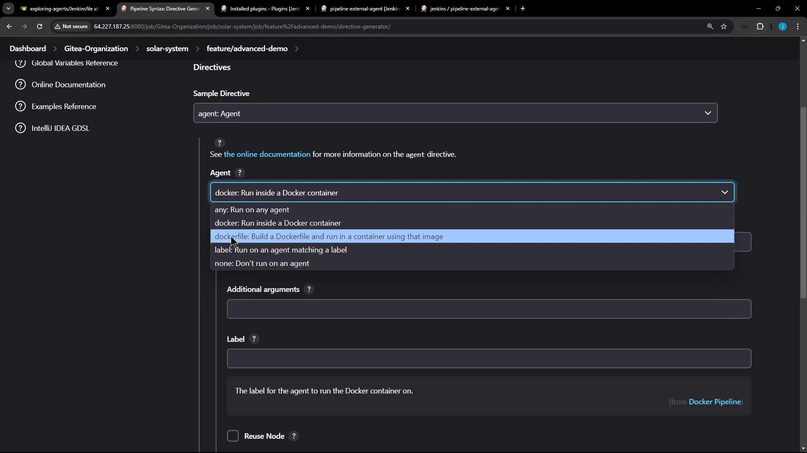
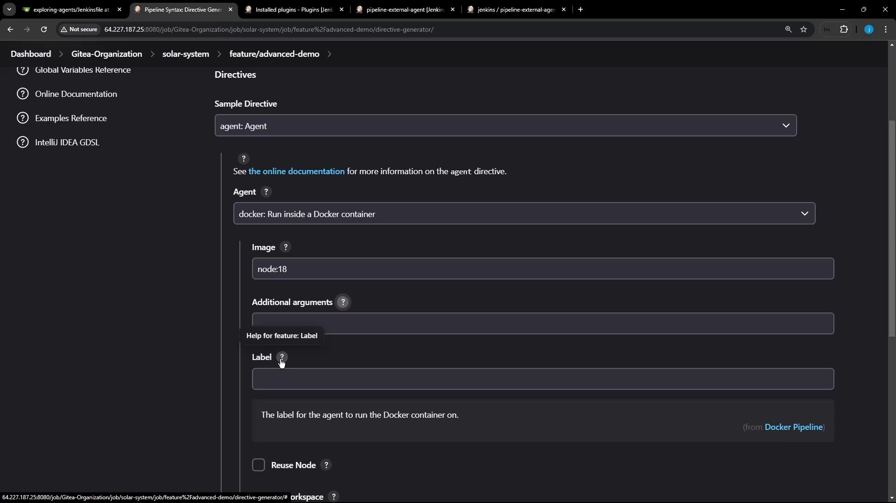
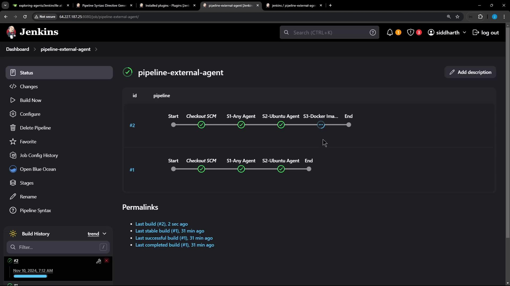

# Demo Utilize Docker Image Agent

Source: https://notes.kodekloud.com/docs/Certified-Jenkins-Engineer/Agents-and-Nodes-in-Jenkins/Demo-Utilize-Docker-Image-Agent/page

Learn to run build steps in Docker containers using the Docker Pipeline Plugin in Jenkins, including configuration and multi-agent examples.

In this lesson, you’ll learn how to run your build steps inside Docker containers by using the Docker Pipeline Plugin in Jenkins. We’ll explore how to configure a Docker agent via the Pipeline Syntax editor, write a Jenkinsfile that uses multiple agent types, and inspect the console output when pulling and running containers.

## Prerequisites

<Callout icon="lightbulb">
  Make sure the **Docker Pipeline Plugin** is installed and enabled. You can verify this under **Manage Jenkins → Manage Plugins**.
</Callout>

## Configuring a Docker Agent via Pipeline Syntax

1. Open **Pipeline Syntax** in your Jenkins instance.
2. Select **agent** from the **Snippet Generator** dropdown.
3. Choose **docker** (or **dockerfile**) as the agent directive.

<Frame>
  
</Frame>

When you select **docker**, you can configure the following fields:

| Field           | Description                                                                       |
| --------------- | --------------------------------------------------------------------------------- |
| `image`         | The Docker image to run (e.g., `node:18-alpine`).                                 |
| `args`          | Additional flags for `docker run` (for example, volume mounts or `--privileged`). |
| `label`         | Jenkins node label where the container should run.                                |
| `workspace`     | Custom workspace path inside the container.                                       |
| `registryUrl`   | URL of a private Docker registry.                                                 |
| `credentialsId` | Credentials ID for authenticating to the registry.                                |
| `alwaysPull`    | When set to `true`, Jenkins pulls the image every time.                           |

<Frame>
  
</Frame>

A minimal Jenkinsfile using a Docker agent looks like this:

```groovy theme={null}
pipeline {
  agent {
    docker {
      image 'node:18-alpine'
      alwaysPull true
    }
  }
  stages {
    stage('Build') {
      steps {
        sh 'node -v'
        sh 'npm -v'
      }
    }
  }
}
```

For more details, see the [Jenkins Pipeline Syntax Reference](https://www.jenkins.io/doc/book/pipeline/syntax/).

## Example: Multi-Stage Pipeline with Docker and Labels

The following Jenkinsfile demonstrates:

1. Running on **any** available agent
2. Running on a specific **labeled** node
3. Running inside a **Docker container** agent

```groovy theme={null}
pipeline {
  agent any

  stages {
    stage('S1 – Any Agent') {
      steps {
        sh 'cat /etc/os-release'
        sh 'node -v'
        sh 'npm -v'
      }
    }

    stage('S2 – Ubuntu Agent') {
      agent { label 'ubuntu-docker-jdk17-node20' }
      steps {
        sh 'cat /etc/os-release'
        sh 'node -v'
        sh 'npm -v'
      }
    }

    stage('S3 – Docker Image Agent') {
      agent {
        docker {
          image 'node:18-alpine'
          label 'ubuntu-docker-jdk17-node20'
          alwaysPull true
        }
      }
      steps {
        sh 'cat /etc/os-release'
        sh 'node -v'
        sh 'npm -v'
      }
    }
  }
}
```

<Callout icon="lightbulb">
  Ensure your agent labeled `ubuntu-docker-jdk17-node20` has Docker installed and is connected to the Jenkins controller.
</Callout>

Commit the Jenkinsfile to your repository and trigger a build. You’ll see all three stages execute in sequence.

<Frame>
  
</Frame>

## Console Output: Pulling & Running the Docker Image

When the **S3 – Docker Image Agent** stage runs, Jenkins pulls the image if needed:

```bash theme={null}
$ docker pull node:18-alpine
18-alpine: Pulling from library/node
43c4264eed91: Pulling fs layer
369c426a5a2a: Pulling fs layer
2f21f39bd9d19: Pulling fs layer
cdcc44a82b4: Verifying Checksum
...
Status: Downloaded newer image for node:18-alpine
```

Then Jenkins starts a container, mounts the workspace, and runs the commands:

```bash theme={null}
+ docker run -d \
    -v /home/jenkins-agent/workspace/...:/home/jenkins-agent/workspace/... \
    -e ... node:18-alpine cat

+ cat /etc/os-release
NAME="Alpine Linux"
ID=alpine
VERSION_ID=3.20.3
PRETTY_NAME="Alpine Linux v3.20"

+ node -v
v18.12.4

+ npm -v
10.7.0
```

After the steps complete, Jenkins automatically stops and removes the build container.

<Callout icon="lightbulb">
  Jenkins removes only the container; the pulled Docker image remains in the local cache.
</Callout>

## Verifying on the Jenkins Host

On your Jenkins controller or agent node, confirm there are no leftover build containers:

```bash theme={null}
$ docker ps -a
