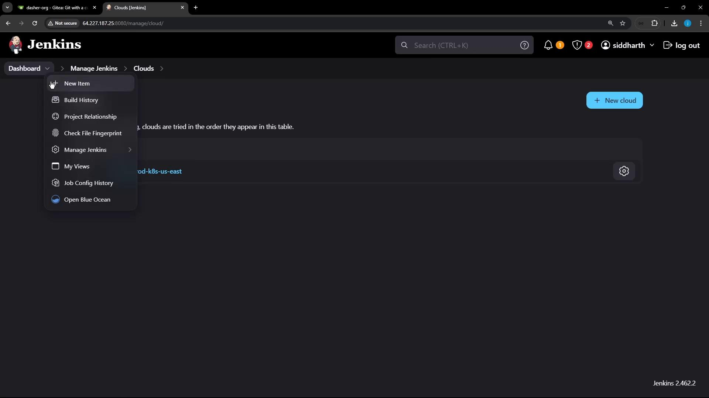
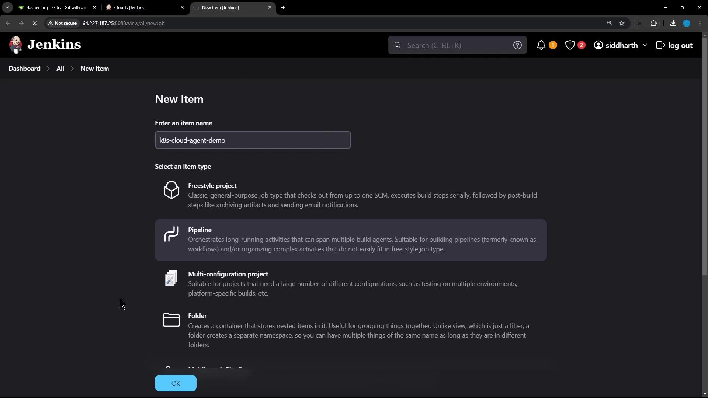
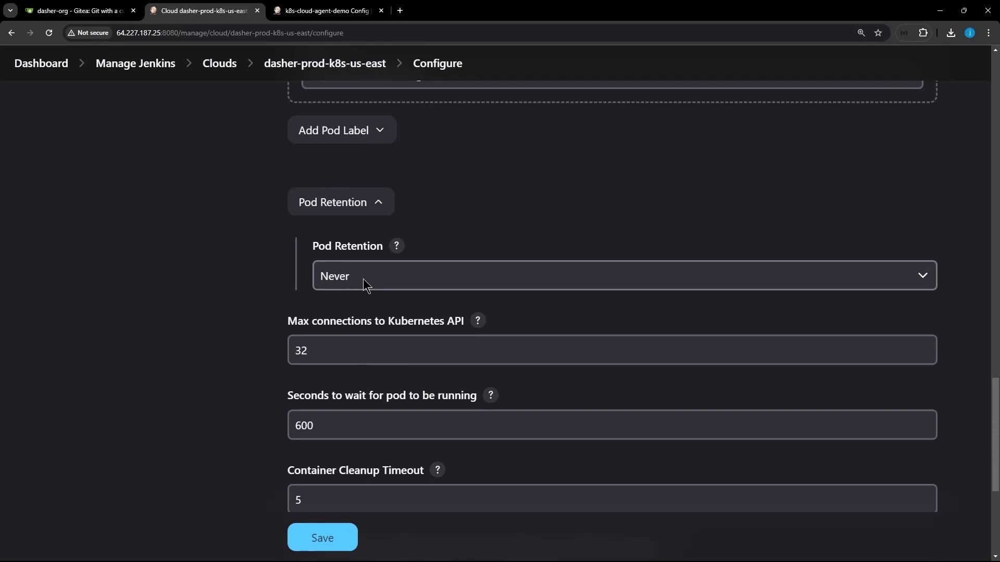
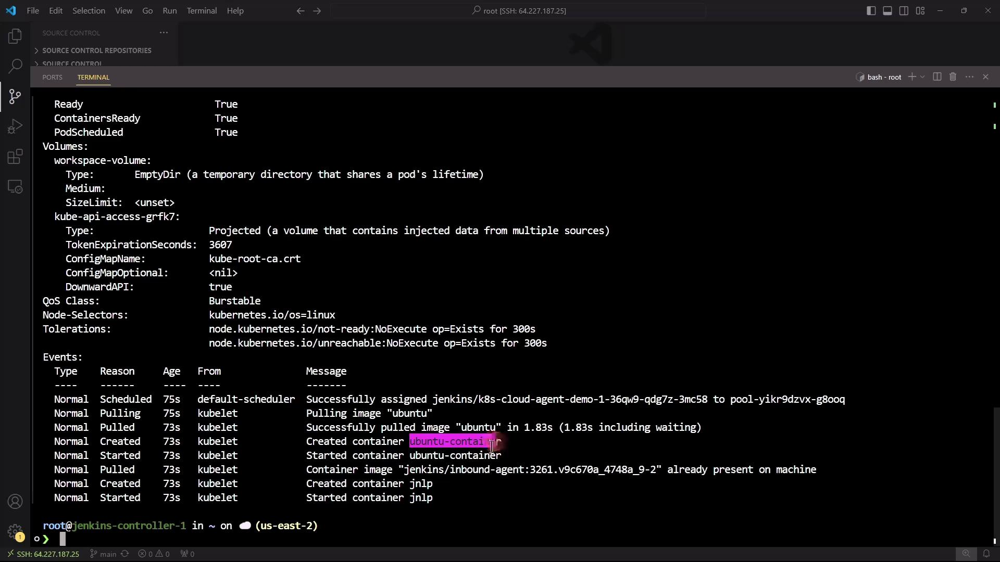
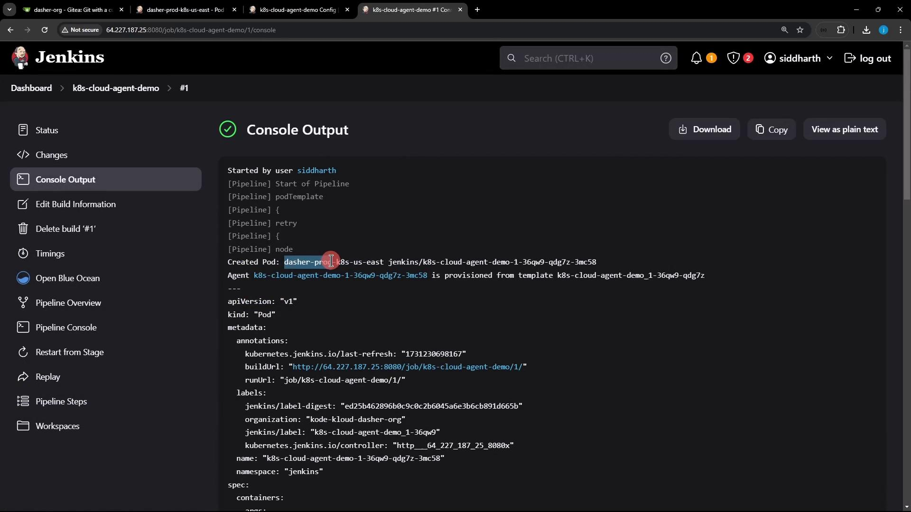
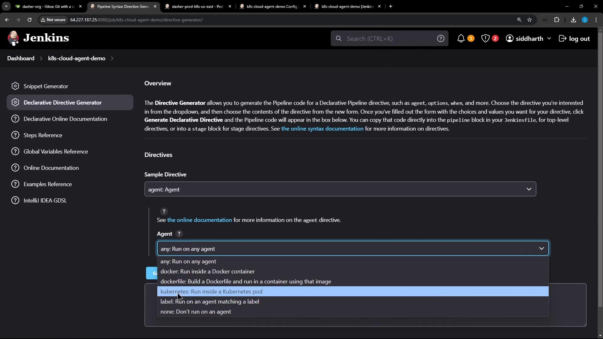

# Demo Utilize Kubernetes Pod as Agent

Source: https://notes.kodekloud.com/docs/Certified-Jenkins-Engineer/Agents-and-Nodes-in-Jenkins/Demo-Utilize-Kubernetes-Pod-as-Agent/page

Learn to configure Jenkins Declarative Pipeline to use Kubernetes Pods as dynamic build agents.

In this guide, you will learn how to configure a Jenkins Declarative Pipeline to dynamically spin up Kubernetes Pods as build agents. By the end, you can:

* Define Pod templates inline or via YAML files
* Use a default container or target specific containers per stage
* Inspect Pod definitions and events on your cluster

## 1. Create a New Pipeline Job

1. From the Jenkins dashboard, click **New Item**.

<Frame>
  
</Frame>

2. Enter the job name (**k8s-cloud-agent-demo** or your preferred name) and select **Pipeline**.

<Frame>
  
</Frame>

3. Scroll to the **Pipeline** section, choose **Pipeline script**, and prepare to paste your Declarative Pipeline.

## 2. Basic Declarative Pipeline with Kubernetes Agent

Start with a minimal pipeline that runs one stage inside a Kubernetes Pod defined inline:

```groovy theme={null}
pipeline {
  agent {
    kubernetes {
      yaml '''
apiVersion: v1
kind: Pod
spec:
  containers:
    - name: ubuntu-container
      image: ubuntu
      command: ["sleep"]
      args: ["infinity"]
  securityContext:
    runAsUser: 1000
'''
    }
  }
  stages {
    stage('Print Hostname') {
      steps {
        sh 'hostname'
        sh 'sleep 120s'  // Keep Pod alive for inspection
      }
    }
  }
}
```

<Callout icon="lightbulb">
  In the Kubernetes Cloud settings, **Pod Retention** is set to **Never**, so Pods are deleted after each build.\
  
</Callout>

## 3. Run the Build and Inspect the Pod

1. Click **Build Now** on your Pipeline job.

2. Open **Console Output** to see the steps:

   ```text theme={null}
   [Pipeline] sh
   + hostname
   k8s-cloud-agent-demo-1-36qw9-qdg7z-3mc58
   [Pipeline] sh
   + sleep 120s
   ```

3. Jenkins also prints the full Pod spec it created:

   ```yaml theme={null}
   ---
   apiVersion: "v1"
   kind: "Pod"
   metadata:
     name: "k8s-cloud-agent-demo-1-36qw9-qdg7z-3mc58"
     namespace: "jenkins"
     labels:
       jenkins/label: "k8s-cloud-agent-1-36qw9"
   spec:
     containers:
       - name: ubuntu-container
         image: ubuntu
         command: ["sleep"]
         args: ["infinity"]
   ```

4. On your Kubernetes cluster, verify the Pod:

   ```bash theme={null}
   kubectl -n jenkins get pod
   kubectl -n jenkins describe pod k8s-cloud-agent-demo-1-36qw9-qdg7z-3mc58
   ```

<Frame>
  
</Frame>

5. You will notice two containers:

   * **ubuntu-container** (your build environment)
   * **jnlp** (inbound Jenkins agent for communication)

   ```yaml theme={null}
   containers:
     - name: ubuntu-container
       image: ubuntu
       command: [sleep]
       args: [infinity]
     - name: jnlp
       image: jenkins/inbound-agent:latest
       # ...additional fields...
   ```

6. After 120 seconds, the Pod is removed due to **Pod Retention: Never**.

## 4. Viewing Pod Events

To review lifecycle events of recently terminated Pods:

```bash theme={null}
kubectl -n jenkins get events --sort-by='.lastTimestamp'
```

You’ll see events such as `Scheduled`, `Pulling`, `Started`, and `Killing`.

## 5. Using Multiple Containers

Demonstrate how to define and select containers per stage.

### 5.1 Define Two Containers with a Default

```groovy theme={null}
pipeline {
  agent {
    kubernetes {
      yaml '''
apiVersion: v1
kind: Pod
spec:
  containers:
    - name: ubuntu-container
      image: ubuntu
      command: ["sleep"]
      args: ["infinity"]
    - name: node-container
      image: node:18-alpine
      command: ["cat"]
      tty: true
'''
      defaultContainer 'ubuntu-container'
    }
  }
  stages {
    stage('Print Hostname') {
      steps {
        sh 'hostname'
      }
    }
    stage('Print Node Version') {
      steps {
        // This will run in ubuntu-container and fail
        sh 'node -v'
        sh 'npm -v'
      }
    }
  }
}
```

<Callout icon="triangle-alert">
  The **Print Node Version** stage will fail because it runs in the Ubuntu container, which lacks Node.js.
</Callout>

### 5.2 Select the Node Container for a Specific Stage

Wrap Node.js commands in a `container('node-container')` block:

```groovy theme={null}
pipeline {
  agent {
    kubernetes {
      yaml '''
apiVersion: v1
kind: Pod
spec:
  containers:
    - name: ubuntu-container
      image: ubuntu
      command: ["sleep"]
      args: ["infinity"]
    - name: node-container
      image: node:18-alpine
      command: ["cat"]
      tty: true
'''
    }
  }
  stages {
    stage('Print Hostname') {
      steps {
        sh 'hostname'
      }
    }
    stage('Print Node Version') {
      steps {
        container('node-container') {
          sh 'node -v'
          sh 'npm -v'
        }
      }
    }
  }
}
```

Run again and check the console:

```text theme={null}
[Pipeline] sh
+ hostname
k8s-cloud-agent-demo-4-lhzbb-ss3rk-sp3q6
...
[Pipeline] container
[Pipeline] sh
+ node -v
v18.20.4
[Pipeline] sh
+ npm -v
10.7.0
```

<Frame>
  
</Frame>

## 6. Advanced Options

| Feature                    | Description                                         | Example                                     |
| -------------------------- | --------------------------------------------------- | ------------------------------------------- |
| Select Cloud               | Choose a specific Kubernetes cloud configuration    | `cloud 'dasher-prod-k8s-us-east'`           |
| External YAML Definition   | Use a YAML file instead of inline `yaml` block      | `yamlFile 'jenkins-pod.yaml'`               |
| Resource Requests & Limits | Define CPU/memory requests and limits per container | Add `resources { requests { cpu '100m' } }` |
| Node Selectors             | Target specific nodes in your cluster               | `nodeSelector 'disktype': 'ssd'`            |
| Retry Logic                | Configure retry behavior on failure                 | `retries 3`                                 |

Explore more options with the [Declarative Directive Generator](https://www.jenkins.io/doc/book/pipeline/syntax/#declarative-directive-generator).

<Frame>
  
</Frame>

***

## Links and References

* [Jenkins Pipeline Syntax](https://www.jenkins.io/doc/book/pipeline/syntax/)
* [Kubernetes Concepts](https://kubernetes.io/docs/concepts/overview/what-is-kubernetes/)
* [Jenkins Kubernetes Plugin](https://plugins.jenkins.io/kubernetes/)
* [Docker Hub](https://hub.docker.com/)

<CardGroup>
  <Card title="Watch Video" icon="video" href="https://learn.kodekloud.com/user/courses/certified-jenkins-engineer/module/2175ebff-1a0f-4c0f-90ea-04e5fa96956f/lesson/4ca172fa-4bb4-4072-8c2c-13bd1d2d10f6" />
</CardGroup>
