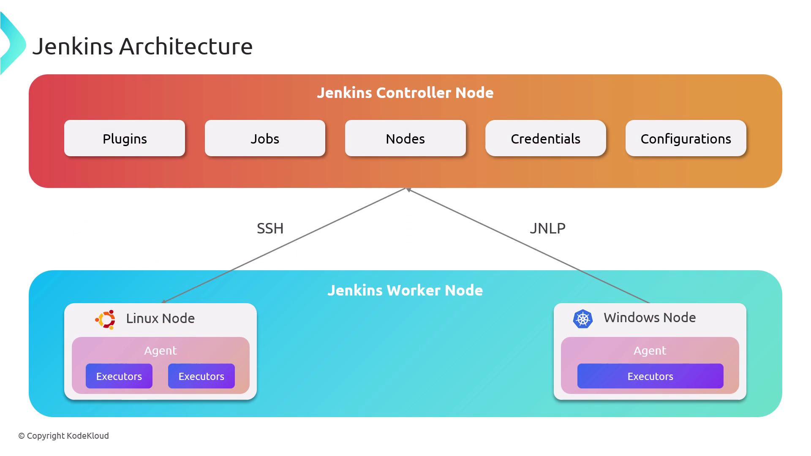
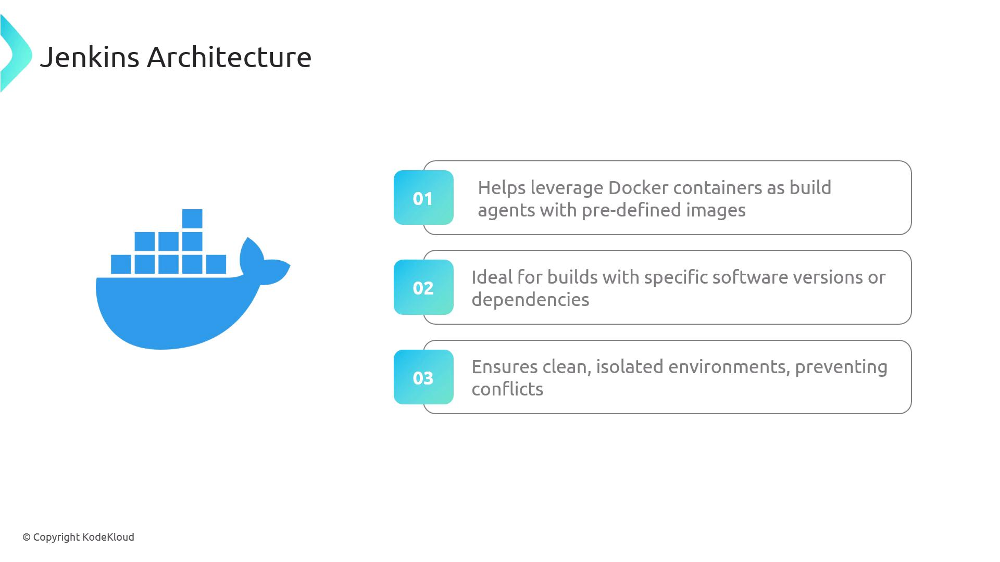
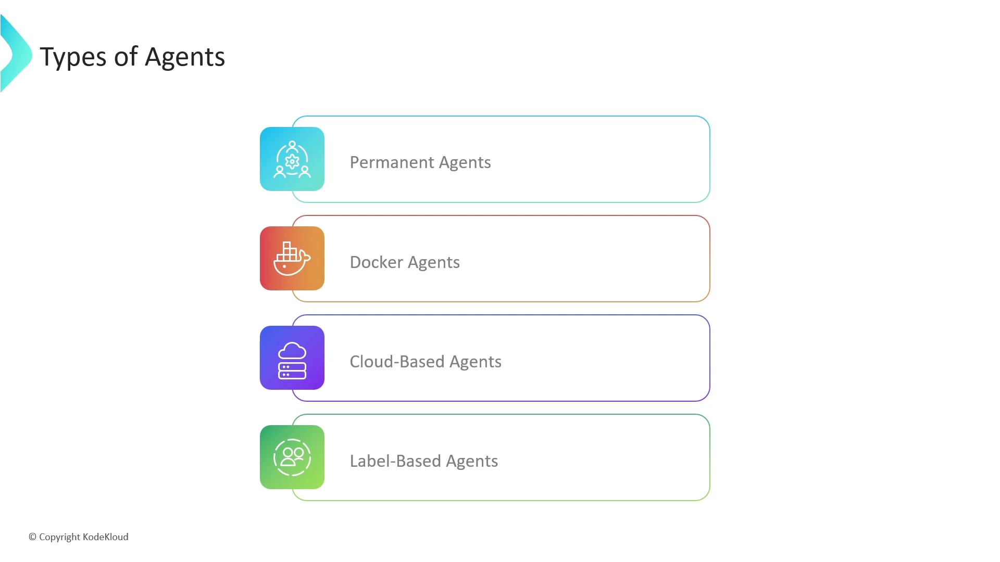

# Types of Agents

Source: https://notes.kodekloud.com/docs/Certified-Jenkins-Engineer/Agents-and-Nodes-in-Jenkins/Types-of-Agents/page

This article explains the types of Jenkins agents, their architecture, and how to declare them in a Jenkinsfile for pipeline execution.

Agents extend the Jenkins controller by running executors on remote nodes. In your [Jenkinsfile](https://www.jenkins.io/doc/book/pipeline/getting-started/#jenkinsfile), you declare the `agent` block to control where and how each pipeline stage executes. Agents handle the communication protocol, authentication, and tool resolution required for build and test jobs.

## Controller-Worker Architecture

Jenkins controllers delegate work to agents over SSH or JNLP. All required build tools must be installed on the agent node.

<Frame>
  
</Frame>

## Static vs. Containerized Agents

Besides static (permanent) agents, you can leverage Docker or Kubernetes to provision agents on demand. Container-based agents launch a clean environment each build, ensuring consistency and eliminating dependency conflicts.

<Frame>
  
</Frame>

## Common Agent Types

Below is a quick reference of the most widely used Jenkins agent types:

| Agent Type         | Description                                                                                                                                            | Use Case                                 |
| ------------------ | ------------------------------------------------------------------------------------------------------------------------------------------------------ | ---------------------------------------- |
| Permanent Agents   | Dedicated nodes with pre-installed tools (e.g., JDK, Node.js)                                                                                          | Stable, consistent environments          |
| Docker Agents      | Ephemeral containers spun up per build with required dependencies                                                                                      | Isolation, reproducibility               |
| Cloud-Based Agents | On-demand VMs or pods in cloud providers ([AWS](https://aws.amazon.com/), [Azure](https://azure.microsoft.com/), [Kubernetes](https://kubernetes.io/)) | Elastic scaling, pay-per-use             |
| Label-Based Agents | Nodes tagged by labels to match specific pipeline requirements                                                                                         | Decoupling builds from physical topology |

<Callout icon="triangle-alert">
  Permanent agents remain online even when idle, consuming resources. Consider ephemeral Docker or cloud agents for variable workloads.
</Callout>

<Frame>
  
</Frame>

## Agent Declarations in a Jenkinsfile

Use the **declarative pipeline syntax** to specify where your pipeline runs:

### 1. agent any

Runs the entire pipeline on any available agent.

```groovy theme={null}
pipeline {
    agent any
    stages {
        stage('Build') {
            steps {
                sh 'echo Running on ${NODE_NAME}'
            }
        }
    }
}
```

### 2. Label-Based Agent

Targets a node with a specific label. Ensure a node labeled `my-agent` exists.

```groovy theme={null}
pipeline {
    agent { label 'my-agent' }
    stages {
        stage('Build') {
            steps {
                sh 'echo Running on ${NODE_NAME}'
            }
        }
    }
}
```

### 3. Docker Agent

Spins up a Docker container using the specified image and arguments.

<Callout icon="lightbulb">
  Ensure Docker is installed and the Jenkins user has permissions to run containers on this agent.
</Callout>

```groovy theme={null}
pipeline {
    agent {
        docker {
            image 'node:latest'               // Node.js image
            args  '-v $HOME/.npm:/root/.npm'  // Mount NPM cache
        }
    }
    stages {
        stage('Build') {
            steps {
                sh 'npm install'
                sh 'npm test'
            }
        }
    }
}
```

### 4. Default and Stage-Level Agents

Defines a global agent and overrides it for specific stages.

```groovy theme={null}
pipeline {
    agent { label 'my-agent' } // Default for all stages
    stages {
        stage('Build') {
            agent { label 'nodejs-agent' } // Stage-specific agent
            steps {
                sh 'echo Running on ${NODE_NAME}'
            }
        }
        stage('Test') {
            steps {
                sh 'echo Tests running on default agent'
            }
        }
    }
}
```

This approach lets you mix general-purpose agents with specialized environments for individual stages.

## Links and References

* [Jenkinsfile | Getting Started](https://www.jenkins.io/doc/book/pipeline/getting-started/#jenkinsfile)
* [JNLP Agents](https://www.jenkins.io/doc/book/using/using-agents/#jnlp-agents)
* [SSH Agents](https://www.jenkins.io/doc/book/using/using-agents/#ssh-agents)
* [Declarative Pipeline Syntax](https://www.jenkins.io/doc/book/pipeline/syntax/)
* [Docker](https://www.docker.com/)
* [Kubernetes](https://kubernetes.io/)
* [AWS](https://aws.amazon.com/)
* [Azure](https://azure.microsoft.com/)

<CardGroup>
  <Card title="Watch Video" icon="video" href="https://learn.kodekloud.com/user/courses/certified-jenkins-engineer/module/2175ebff-1a0f-4c0f-90ea-04e5fa96956f/lesson/16fb202a-ae53-4ebf-bed1-74b7e3d00170" />
</CardGroup>
