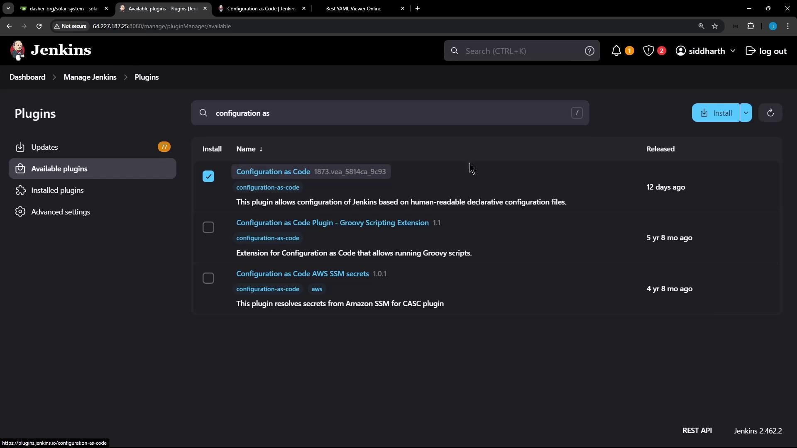
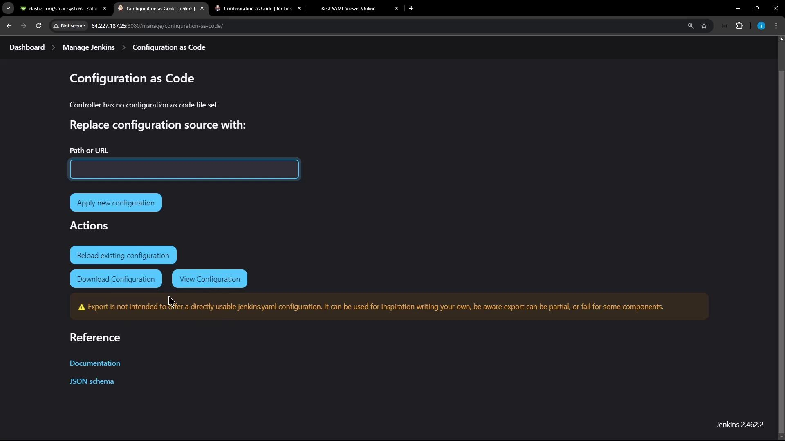
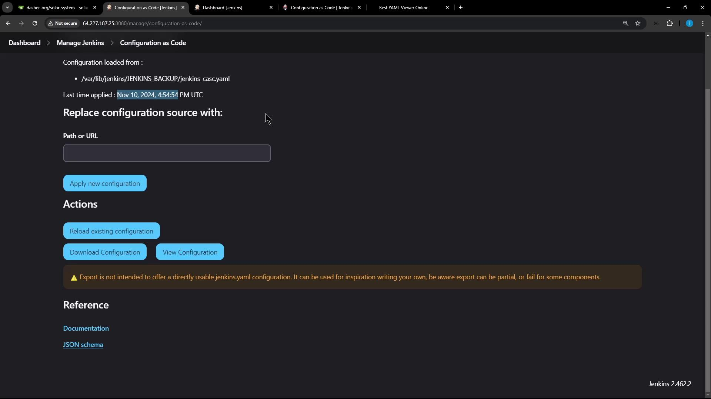

# Demo Configure and Explore JCasC

Source: https://notes.kodekloud.com/docs/Certified-Jenkins-Engineer/Backup-and-Configuration-Management/Demo-Configure-and-Explore-JCasC/page

Learn to manage Jenkins configurations using the Configuration as Code plugin with YAML for settings, security, plugins, tools, and credentials.

Managing Jenkins through dozens of UI screens can be tedious. With the **Configuration as Code (CasC)** plugin, you define your entire Jenkins setup—including core settings, security, plugins, tools, and credentials—as YAML. In this guide, you’ll learn how to:

* Install and enable the CasC plugin
* Inspect your live Jenkins configuration
* Modify a setting declaratively and apply it
* Validate and reload configurations

## 1. Installing the Configuration as Code Plugin

1. In Jenkins, go to **Manage Jenkins → Manage Plugins → Available**.
2. Search for **Configuration as Code**, select it, and click **Install** (restart if prompted).

<Frame>
  
</Frame>

After restart, you’ll see **Configuration as Code** under **Manage Jenkins → System Configuration**.

## 2. Exploring the Current Configuration

Navigate to **Manage Jenkins → Configuration as Code**. Here you can:

* **View Configuration**: Download the live settings as YAML or JSON
* **Replace Configuration**: Point to a file on disk or a Git repo
* **Reload**: Reapply the last loaded settings

<Frame>
  
</Frame>

### 2.1 Downloaded Configuration Example

When you download your live settings, Jenkins outputs JSON or YAML. Below is a shortened JSON excerpt:

```json theme={null}
{
  "jenkins": {
    "systemMessage": "Jenkins is ready to use.",
    "numExecutors": 5,
    "mode": "EXCLUSIVE",
    "scm": { "gitHub": "global-git-hub" },
    "credentials": [
      {
        "scope": "GLOBAL",
        "id": "gh_repo_secret_token",
        "username": "GitHub Username",
        "password": "GitHub Token"
      }
    ]
  }
}
```

CasC automatically converts JSON into YAML. A typical YAML will include sections like:

```yaml theme={null}
jenkins:
  systemMessage: "Jenkins is ready to use."
  numExecutors: 5
  mode: "EXCLUSIVE"
security:
  apiToken:
    tokenGenerationOnCreationEnabled: false
unclassified:
  auditTrail:
    displayName: true
tools:
  maven:
    installations:
      - name: "M308"
        properties:
          - installSource:
              installers:
                - maven:
                    id: "3.9.8"
  nodejs:
    installations:
      - name: "nodejs-22-6-0"
        properties:
          - installSource:
              installers:
                - nodeJSInstaller:
                    id: "22.6.0"
```

### 2.2 YAML Section Reference

| Section      | Description                           | Example Fields                                |
| ------------ | ------------------------------------- | --------------------------------------------- |
| jenkins      | Core Jenkins settings                 | `systemMessage`, `numExecutors`, `mode`       |
| security     | Security and API token management     | `apiToken.tokenGenerationOnCreationEnabled`   |
| unclassified | Plugin-specific configurations        | `auditTrail`, `slackNotifier`                 |
| tools        | Tool installers (Git, Maven, Node.js) | `maven.installations`, `nodejs.installations` |
| credentials  | Credentials domains and secrets       | `usernamePassword`, `string`                  |

### 2.3 Credentials Example

```yaml theme={null}
credentials:
  system:
    domainCredentials:
      - credentials:
          - usernamePassword:
              id: "gitea-server-creds"
              description: "Gitea Server Credentials"
              username: "gitea-admin"
              password: "{[SECRET_REDACTED]=}"
              scope: GLOBAL
          - string:
              id: "sonar-qube-token"
              description: "SonarQube Server Token"
              secret: "{[SECRET_REDACTED]=}"
              scope: GLOBAL
```

<Callout icon="lightbulb">
  You can explore more sections like global security, authorization strategies, and plugin settings by scrolling through the full YAML.
</Callout>

## 3. Modifying Configuration via CasC

Let’s update the Jenkins system message. First, back up and edit your YAML on the controller:

```bash theme={null}
cd /var/lib/jenkins/JENKINS_BACKUP
cp /var/lib/jenkins/casc.yaml jenkins-casc.yaml.bak
vi jenkins-casc.yaml
```

Add or update the `remotingSecurity` block:

```yaml theme={null}
remotingSecurity:
  enabled: true
  slaveAgentPort: 0
  systemMessage: "Loading data from Jenkins Configuration as Code"
```

Then, on **Manage Jenkins → Configuration as Code**, use **Replace Configuration** to point to:

```text theme={null}
/var/lib/jenkins/JENKINS_BACKUP/jenkins-casc.yaml
```

Click **Apply New Configuration**. Jenkins will validate and apply the YAML, displaying a load timestamp.

<Callout icon="triangle-alert">
  Always back up your YAML and test in a non-production instance before applying major changes.
</Callout>

## 4. Applying and Reloading Configuration

On the CasC page you can also:

* **Reload Existing Configuration**: Reapply last known-good settings
* **Download Current Configuration**: Fetch live YAML/JSON
* **View Documentation**: Open \[JCasC docs]\[casc-doc]
* **View JSON Schema**: Inspect the schema for valid YAML

Here’s a snippet of the JCasC JSON schema:

```json theme={null}
{
  "$schema": "http://json-schema.org/draft-07/schema#",
  "description": "Jenkins Configuration as Code",
  "type": "object",
  "properties": {
    "security": {
      "type": "object",
      "properties": {
        "apiToken": { "type": "object" }
      }
    },
    "cps": {
      "type": "object",
      "properties": {
        "hideSandbox": { "type": "boolean" }
      }
    }
  }
}
```

<Frame>
  
</Frame>

***

For more details, see the \[official CasC documentation]\[casc-doc] and explore the \[Jenkins schema reference]\[casc-schema].

## Links and References

* [Jenkins Configuration as Code (CasC)](https://www.jenkins.io/projects/configuration-as-code/) \[casc-doc]
* [Jenkins JSON Schema Reference](https://www.jenkins.io/doc/book/using/jenkins-schema/) \[casc-schema]
* [Jenkins Official Documentation](https://www.jenkins.io/doc/)

<CardGroup>
  <Card title="Watch Video" icon="video" href="https://learn.kodekloud.com/user/courses/certified-jenkins-engineer/module/77043650-89c2-4ad3-bbd1-e06eabe35581/lesson/793e1439-dea7-411f-93ee-2c6f7513ab74" />
</CardGroup>
