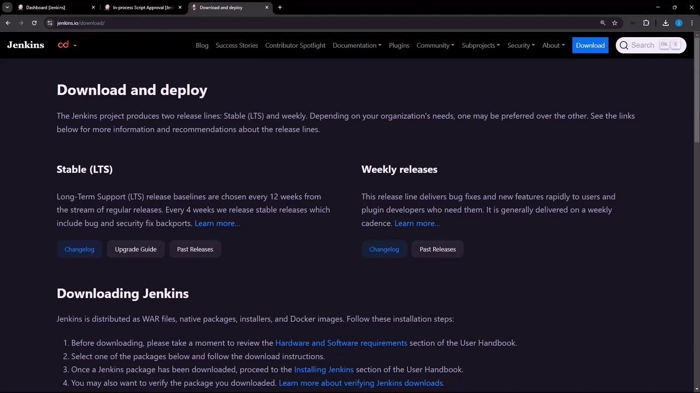
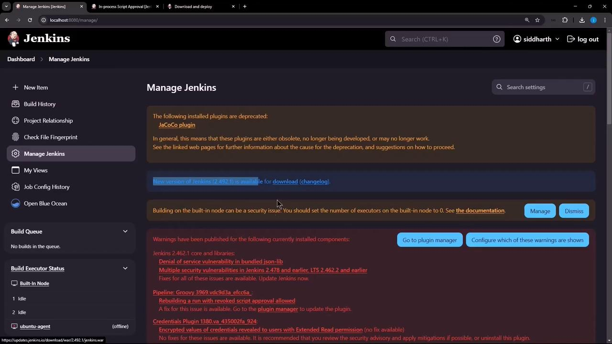
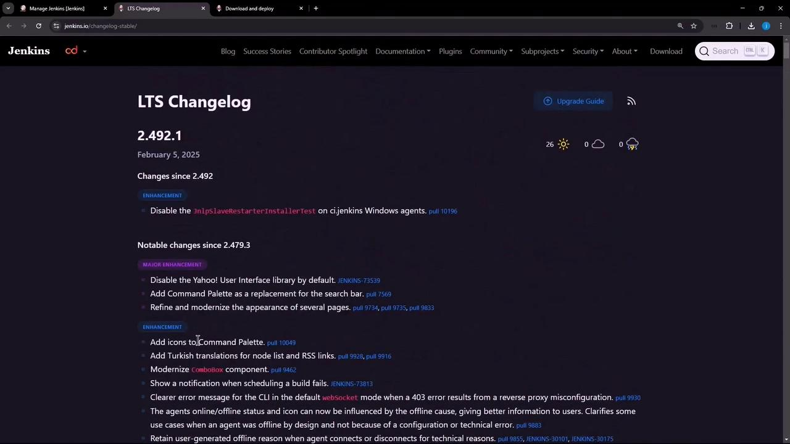
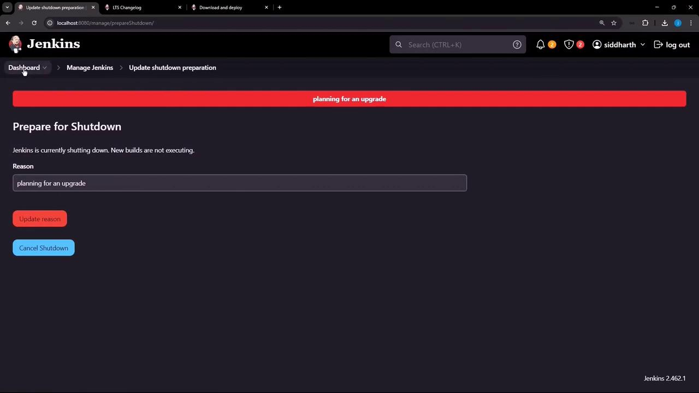
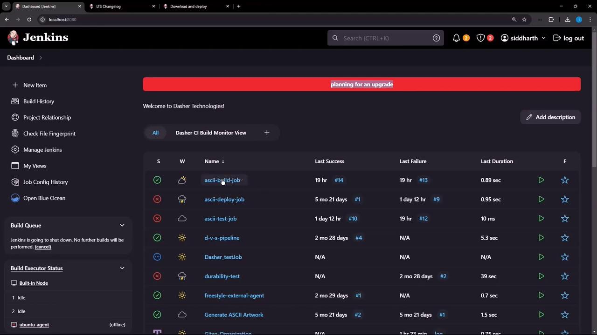
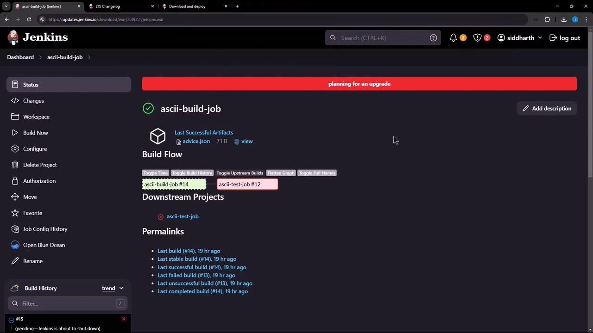

# Demo Upgrading Jenkins

Source: https://notes.kodekloud.com/docs/Certified-Jenkins-Engineer/Backup-and-Configuration-Management/Demo-Upgrading-Jenkins/page

This guide covers safely upgrading Jenkins with minimal downtime using the Prepare for Shutdown feature.

Upgrading Jenkins with minimal downtime requires planning and the built-in **Prepare for Shutdown** feature. In this guide, we’ll cover:

* Checking for new Jenkins releases
* Reviewing changelogs
* Preventing new builds during the update
* Performing the WAR file upgrade
* Verifying the new version

***

## 1. Choose Your Jenkins Release

Navigate to the [Jenkins download and deployment page](https://www.jenkins.io/download/). Compare the Stable (LTS) and Weekly packages:

<Frame>
  
</Frame>

| Release Type | Update Frequency | Ideal For                                   |
| ------------ | ---------------- | ------------------------------------------- |
| LTS          | Every 12 weeks   | Production environments requiring stability |
| Weekly       | Weekly           | Testing the latest features and bug fixes   |

***

## 2. Check for Updates on Your Dashboard

Log in to Jenkins and go to **Manage Jenkins**. The dashboard shows pending updates and plugin advisories:

<Frame>
  
</Frame>

Click **Changelog** to review the release notes:

<Frame>
  
</Frame>

For example, upgrading from **2.462.1** to **2.492.1** brings critical security fixes and performance improvements. Copy the WAR URL (e.g., `https://updates.jenkins.io/download/war/2.492.1/jenkins.war`) for the next step.

***

## 3. Prepare Jenkins for Upgrade

Before replacing the WAR, enter shutdown mode so existing builds finish and no new builds start:

1. Go to **Manage Jenkins → Prepare for Shutdown**
2. Add a reason (e.g., “Planning for upgrade”) and confirm

A banner appears and all new build requests queue:

<Frame>
  
</Frame>

Monitor the build queue to ensure no jobs are running:

<Frame>
  
</Frame>

Any attempt to start a new job—like **ascii-build-job**—will now wait until after the upgrade:

<Frame>
  
</Frame>

<Callout icon="lightbulb">
  Ensure all running builds complete and no new tasks remain in the queue before stopping the Jenkins service.
</Callout>

***

## 4. Upgrade the Jenkins WAR

On your Jenkins host, run the following commands:

```bash theme={null}
