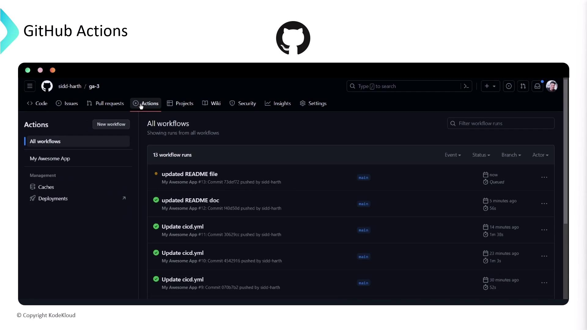
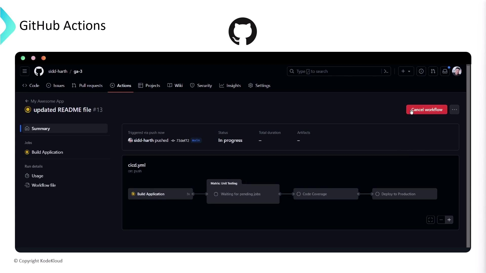
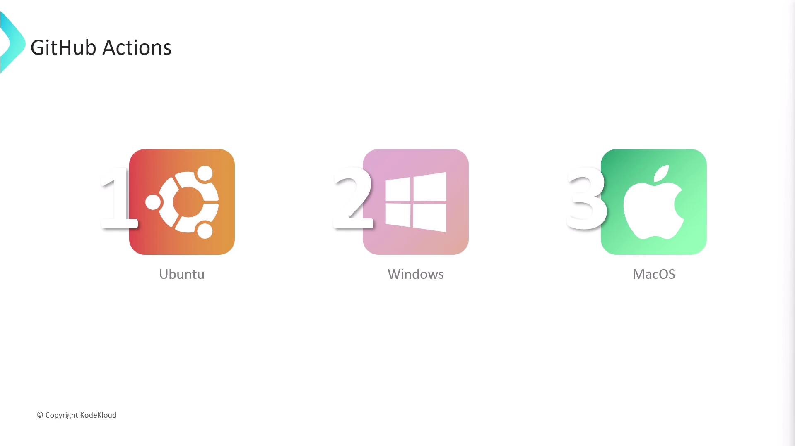
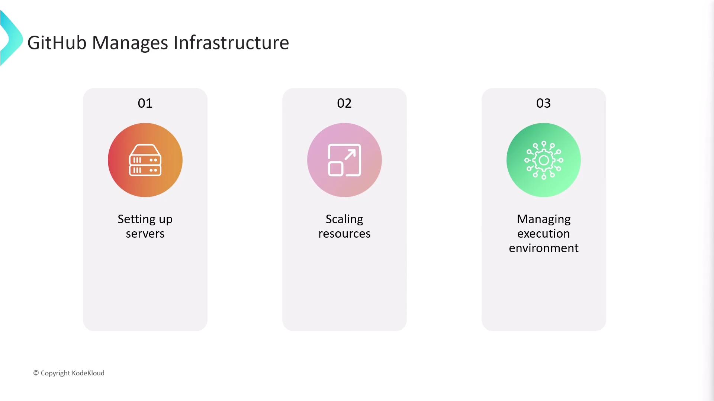
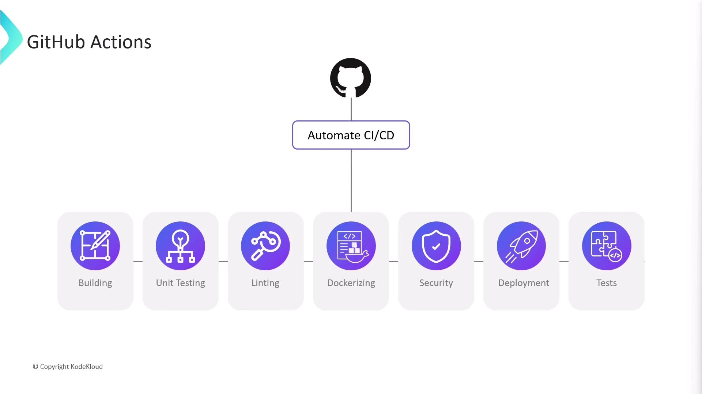
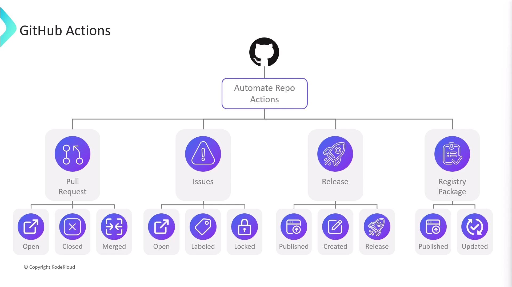

# Github Actions Basics

Source: https://notes.kodekloud.com/docs/Certified-Jenkins-Engineer/Backup-and-Configuration-Management/Github-Actions-Basics/page

GitHub Actions is a CI/CD and automation platform for GitHub repositories, enabling workflow automation for builds, tests, deployments, and repository maintenance tasks.

GitHub Actions is a powerful CI/CD and automation platform built into GitHub repositories. By defining workflow files directly in your project, you can automate builds, tests, deployments, and repository maintenance tasks without relying on external tools.

## What Is GitHub Actions?

GitHub Actions lets you create **workflows**—collections of **jobs** and **steps**—that run in response to repository events like `push`, `pull_request`, `schedule`, and more.

<Frame>
  
</Frame>

With just a YAML file, you can trigger workflows on every pull request, run unit tests, and even deploy merged changes to production.

<Frame>
  
</Frame>

GitHub Actions provides first-class support for runners on Ubuntu, Windows, and macOS.

<Frame>
  
</Frame>

All infrastructure—server provisioning, auto-scaling, and environment maintenance—is handled by GitHub, so you can focus on writing workflows.

<Frame>
  
</Frame>

## Beyond CI/CD: Repository Automation

While GitHub Actions shines for CI/CD—building, packaging, and deploying code—it also responds to many repository events, such as issues, pull requests, releases, and registry packages:

<Frame>
  
</Frame>

<Frame>
  
</Frame>

For example, on a new pull request you could automatically:

* Post a welcome comment
* Apply labels based on modified files
* Assign reviewers or assignees

These patterns can extend to issues (`opened`, `labeled`), releases (`published`), and package registry events.

## Core Concepts

### Workflows

A **workflow** is defined by a YAML file in your repository’s `.github/workflows/` directory. You can have multiple workflows, each triggered by different events:

```yaml theme={null}
