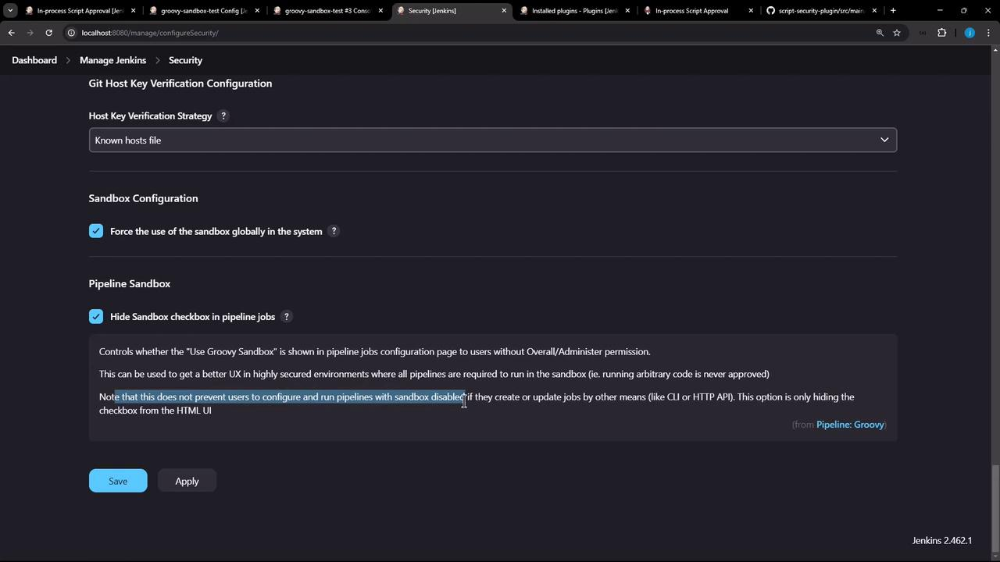

# Demo Groovy Sandbox and In process Script Approval Part 2

Source: https://notes.kodekloud.com/docs/Certified-Jenkins-Engineer/Jenkins-Administration-and-Monitoring-Part-2/Demo-Groovy-Sandbox-and-In-process-Script-Approval-Part-2/page

This guide covers enforcing the Groovy Sandbox in Jenkins and hiding the checkbox for non-admin users.

Welcome to the second lesson on the Groovy Sandbox and script approval. In this guide, you'll learn how to:

1. Enable sandbox enforcement globally in Jenkins.
2. Hide the **Use Groovy Sandbox** checkbox for non-admin users.
3. Verify the behavior as both admin and non-admin users.
4. Understand the limitations of hiding the checkbox.

***

## Sample Pipeline

We’ll demonstrate with this simple declarative pipeline:

```groovy theme={null}
pipeline {
    agent any
    stages {
        stage('Topic') {
            steps {
                echo 'Exploring Groovy Sandbox!'
            }
        }
    }
}
```

***

## 1. Force Groovy Sandbox Globally

1. Navigate to **Manage Jenkins** → **Configure Global Security**.
2. Scroll to the **Sandbox** section (use the browser’s find feature for “sandbox”).
3. Check **Force Use of Groovy Sandbox**.
4. Check **Hide the sandbox checkbox in Pipeline jobs**.
5. Click **Apply** and **Save**.

<Callout icon="lightbulb">
  Jenkins may require a restart for these permission changes to take effect.
</Callout>

***

## 2. Verify Behavior by User Role

Use the following table to confirm what each user sees in the pipeline configuration UI:

| User Role      | Pipeline Configuration UI                                   |
| -------------- | ----------------------------------------------------------- |
| Administrator  | Sees and can toggle the **Use Groovy Sandbox** checkbox.    |
| Non-Admin User | **Checkbox is hidden**; they cannot modify sandbox setting. |

***

## 3. Verify as an Administrator

1. Log in as an administrator.
2. Open any Pipeline job and click **Configure**.
3. Confirm that the **Use Groovy Sandbox** checkbox is still visible and editable.

***

## 4. Verify as a Non-Admin User

1. Via **Manage Jenkins** → **Manage and Assign Roles**, assign the **Configure Jobs** permission to a non-admin user (e.g., `Ali`).
2. Log in as `Ali` (you can use an incognito or private browsing window).
3. Open any Pipeline job (for example, “Groovy Sandbox Test”) and click **Configure**.
4. Confirm that the **Use Groovy Sandbox** checkbox is no longer displayed.

<Callout icon="triangle-alert">
  Hiding the checkbox only affects the Jenkins UI. Users with sufficient permissions can still enable or disable the sandbox by:

  * Jenkins [CLI](https://www.jenkins.io/doc/book/managing/cli/)
  * Jenkins [HTTP Remote Access API](https://www.jenkins.io/doc/book/using/remote-access-api/)
</Callout>

***

## 5. UI Screenshot

<Frame>
  
</Frame>

***

## 6. Next Steps

In the next lesson, we'll dive into the Groovy Sandbox’s **blacklist** of disallowed signatures and methods.

***

## References

* [Jenkins CLI](https://www.jenkins.io/doc/book/managing/cli/)
* [Jenkins Remote Access API](https://www.jenkins.io/doc/book/using/remote-access-api/)
* [Script Security Plugin](https://plugins.jenkins.io/script-security/)

<CardGroup>
  <Card title="Watch Video" icon="video" href="https://learn.kodekloud.com/user/courses/certified-jenkins-engineer/module/90da5b24-e8f2-455a-9756-9d69f4a7ce8e/lesson/4b1e2581-6238-4a37-a069-16b5cebcef99" />
</CardGroup>
