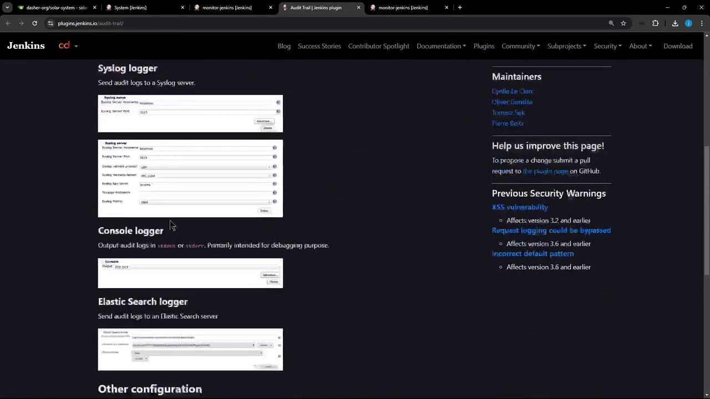
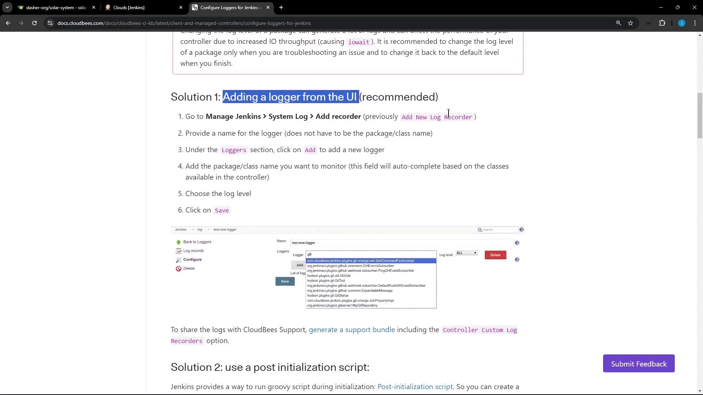
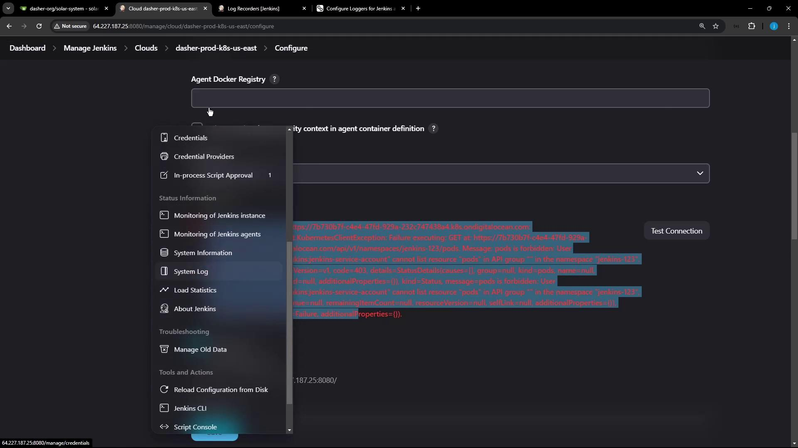
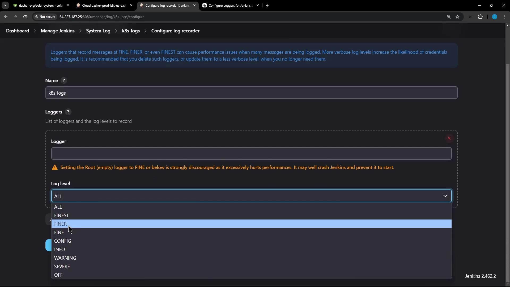
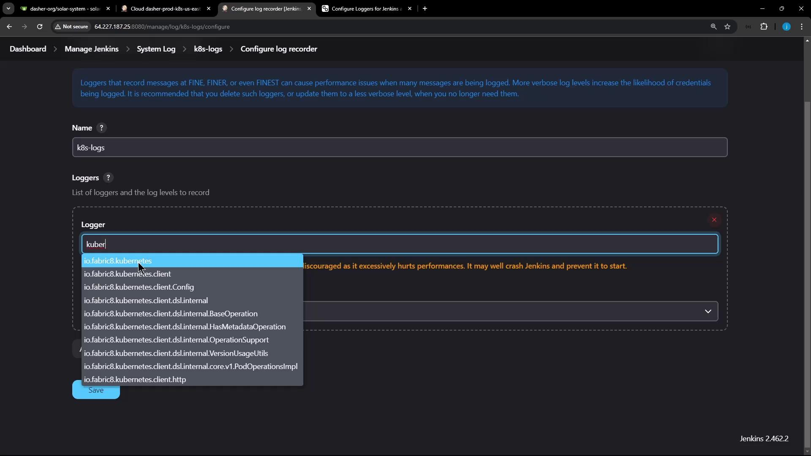
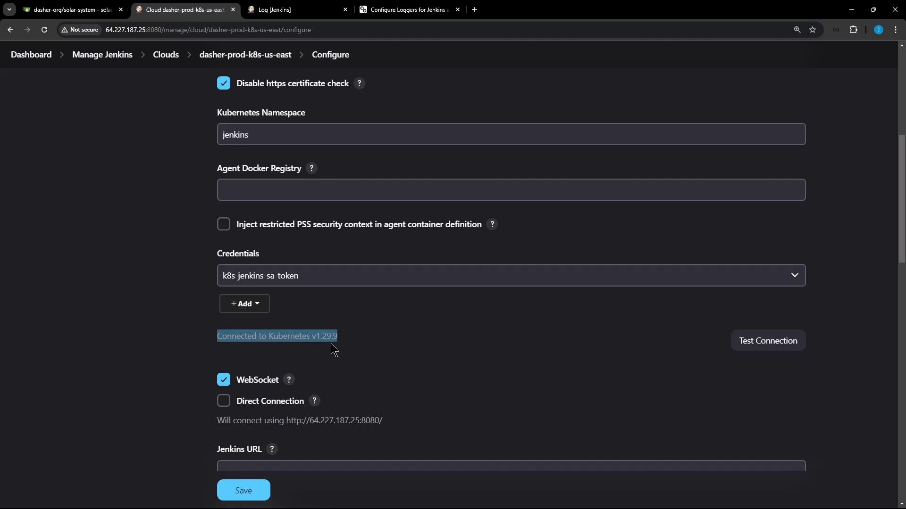

# Nov 10 10:29:36,662 PM job/monitor-jenkins/configSubmit by siddharth from 124.123.186.17
# Nov 10 10:29:37,069 PM job/monitor-jenkins/#29 Started by user siddharth, Parameters:[]
# Nov 10 2024 2:29:39,042 PM monitor-jenkins #29 Started by user siddharth, Parameters:[] on node #unknown# started at 2024-11-10T14:29:34Z completed in 4361ms complete: SUCCESS
```

<Callout icon="lightbulb">
  Ensure the Jenkins service account has write permissions to `/var/log/jenkins`.
</Callout>

### 3.3 Customize URL Patterns

1. Return to **Manage Jenkins** → **Configure System**.

2. In **URL Patterns to Log**, add:

   ```text theme={null}
   */(configSubmit|doDelete|postBuildResult|enable|disable|cancelQueue|stop|toggleLogKeep|doWipeOutWorkspace|createItem|createView|toggleOffline|cancelQuietDown|quietDown|restart|exit)
   ```

3. Click **Save**, perform another job action, then verify:

```bash theme={null}
cd /var/log/jenkins
ls
cat custom-audit-0.log-2024-11-10
# Nov 10, 2024 2:29:30,662 PM /job/monitor-jenkins/configSubmit by siddharth from 124.123.186.17
# Nov 10, 2024 2:29:34,672 PM job/monitor-jenkins/#29 Started by user siddharth, Parameters:[]
ll
# total 12
# drwxr-xr-x 2 jenkins jenkins 4096 Nov 10 14:30 ./
# drwxrwxr-x 10 root    syslog   4096 Nov 10 12:00 ../
# -rw-r--r-- 1 jenkins jenkins 2560 Nov 10 14:30 custom-audit-0.log-2024-11-10
# -rw-r--r-- 1 jenkins jenkins    0 Nov 10 14:30 custom-audit-0.log-2024-11-10.lck
```

## 4. Additional Logging Options

Beyond file-based logs, Audit Trail supports:

| Logger Type   | Use Case                            | Configuration Location                          |
| ------------- | ----------------------------------- | ----------------------------------------------- |
| Syslog        | Forward audit events to syslog      | Manage Jenkins → Configure System → Audit Trail |
| Console       | View events directly in Jenkins log | Manage Jenkins → Configure System → Audit Trail |
| Elasticsearch | Index and search logs externally    | Manage Jenkins → Configure System → Audit Trail |

<Frame>
  
</Frame>

***

## References and Further Reading

* [Audit Trail Plugin](https://plugins.jenkins.io/audit-trail)
* [Managing Plugins — Jenkins User Handbook](https://www.jenkins.io/doc/book/managing/plugins/)
* [Jenkins Documentation](https://www.jenkins.io/doc/)

<CardGroup>
  <Card title="Watch Video" icon="video" href="https://learn.kodekloud.com/user/courses/certified-jenkins-engineer/module/90da5b24-e8f2-455a-9756-9d69f4a7ce8e/lesson/280126a6-f48e-4c12-a090-07081f216ec9" />
</CardGroup>


# Demo Log Recorder

Source: https://notes.kodekloud.com/docs/Certified-Jenkins-Engineer/Jenkins-Administration-and-Monitoring-Part-2/Demo-Log-Recorder/page

This guide explains how to create and manage loggers in Jenkins for troubleshooting and debugging purposes.

In this guide, we’ll show you how to create and manage loggers in Jenkins for effective troubleshooting and debugging. Jenkins offers multiple methods to adjust logging levels—ideal for diagnosing issues in plugins, pipelines, and integrations.

<Callout icon="triangle-alert">
  Increasing verbosity generates more log output and can impact controller performance due to higher disk and I/O usage. Only raise logging levels during active troubleshooting, and revert to defaults afterward.
</Callout>

## Logging Configuration Options

You can configure custom logging in Jenkins using one of these five approaches:

| Method                             | Persistence       | Description                                                          |
| ---------------------------------- | ----------------- | -------------------------------------------------------------------- |
| 1. UI Logger                       | Dynamic (runtime) | Add or adjust loggers on the fly via the Jenkins interface.          |
| 2. Groovy Init Script              | Persistent        | Include a Groovy script in `init.groovy.d` to set levels at startup. |
| 3. Java Util Logging Properties    | Persistent        | Provide a `logging.properties` file under `$JENKINS_HOME`.           |
| 4. File System Custom Log Recorder | Persistent        | Define XML recorder files in `$JENKINS_HOME/log/` and view in UI.    |
| 5. XML Configuration via UI        | Ephemeral         | Paste an XML snippet in the UI; resets after restart.                |

1. **Add a Logger via the Jenkins UI** (recommended)
2. **Initialize via a Groovy Script**
3. **Use a Java Util Logging Properties File**
4. **File System Custom Log Recorder**
5. **XML Configuration via the UI (non-persistent)**

### 1. Add a Logger via the Jenkins UI

For dynamic control over logging, the Jenkins UI is the easiest option. For example, to troubleshoot the Kubernetes cloud plugin:

1. Go to **Manage Jenkins** → **System Log**.
2. Click **Add new log recorder**, provide a name, then add the package or logger and select the desired level.

<Frame>
  
</Frame>

<Callout icon="lightbulb">
  Using the UI allows you to switch log levels at runtime without restarting Jenkins.
</Callout>

### 2. Initialize via a Groovy Script

Place a Groovy file under `JENKINS_HOME/init.groovy.d/` to set log levels at startup:

```groovy theme={null}
import java.util.logging.Level
import java.util.logging.Logger

Logger.getLogger("hudson.plugins.git.GitStatus").setLevel(Level.SEVERE)
Logger.getLogger("hudson.security.csrf.CrumbFilter").setLevel(Level.SEVERE)
```

### 3. Java Util Logging Properties File

Drop a `logging.properties` file into `$JENKINS_HOME`:

```properties theme={null}
.level = INFO
handlers = java.util.logging.ConsoleHandler

java.util.logging.ConsoleHandler.level = INFO
java.util.logging.ConsoleHandler.formatter = java.util.logging.SimpleFormatter
```

### 4. File System Custom Log Recorder

Create XML definitions under the Jenkins home directory:

```text theme={null}
$JENKINS_HOME/
  log/
    kb-article.xml   # Custom log recorder definition
  logs/
    custom/
      kb-article.log # Recorder output file
```

### 5. XML Configuration via the UI (Non-Persistent)

You can also paste default logger settings directly in the UI (resets on restart):

```xml theme={null}
<?xml version="1.1" encoding="UTF-8"?>
<log>
  <name>kb-article</name>
  <targets>
    <target>
      <name>org.jenkinsci.plugins.saml</name>
      <level>300</level>
    </target>
    <target>
      <name>org.pac4j</name>
    </target>
  </targets>
</log>
```

## Example: Debugging Kubernetes Cloud Connection

When testing your Kubernetes cloud in Jenkins, you might see a generic error:

```text theme={null}
Error testing connection https://7b730b7f-4e4e-471d-929a-23267474384a.k8s.onddi...
io.fabric8.kubernetes.client.KubernetesClientException: Failure executing: GET at: https://7b7.../pods. 
Message: pods is forbidden: User "system:serviceaccount:jenkins:jenkins-service-account" 
cannot list resource "pods" ... Received status: Status(apiVersion=v1, code=403...))
```

<Callout icon="lightbulb">
  A 403 Forbidden often indicates missing RBAC permissions for the Jenkins service account.
</Callout>

To capture HTTP-level details:

1. Go to **Manage Jenkins** → **System Log**.
2. Click **Add new log recorder**, name it (e.g., `k8s-logs`), and set level to **All**.
3. Search for `Kubernetes` and select `io.fabric8.kubernetes.client` or the specific subpackage.

<Frame>
  
</Frame>

<Frame>
  
</Frame>

<Frame>
  
</Frame>

After saving, retry the connection and then refresh the log recorder view to see detailed HTTP exchanges:

```text theme={null}
Nov 10, 2024 5:34:35 PM FINE io.fabric8.kubernetes.client.utils.HttpClientUtils getHttpClientFactory
Using httpclient io.fabric8.kubernetes.client.okhttp.OkHttpClientFactory factory
Nov 10, 2024 5:34:35 PM FINEST io.fabric8.kubernetes.client.HttpLoggingInterceptor$HttpLogger logStart
-HTTP START-
Nov 10, 2024 5:34:35 PM FINEST io.fabric8.kubernetes.client.HttpLoggingInterceptor$HttpLogger logRequest
> GET https://7b7b35ef-.../namespaces/jenkins-123/pods
> Authorization: Bearer eyJh...
> User-Agent: fabric8-kubernetes-client/6.1.0
< 403 Forbidden
Nov 10, 2024 5:34:35 PM FINEST io.fabric8.kubernetes.client.HttpLoggingInterceptor$HttpLogger logResponse
< content-type: application/json
...
Nov 10, 2024 5:34:35 PM FINE io.fabric8.kubernetes.client.impl.BaseClient close
The client and associated httpclient ... have been closed...
```

These entries reveal the full request headers, status codes, and JSON payload.

### Example: Successful Connection

With correct RBAC and service account settings, the UI will show a one-line success. Jenkins will still record the detailed HTTP lifecycle if debug logging is enabled:

<Frame>
  
</Frame>

```text theme={null}
-HTTP START-
> GET https://bhb3f7f-4e4d-99a2-237c7438a.k8s.digitalocean.com/api/v1/namespaces/jenkins/pods
... (headers)
-HTTP END-
Nov 10, 2024 5:34:35 PM FINE io.fabric8.kubernetes.client.impl.BaseClient close
```

You can also log the Kubernetes version:

```json theme={null}
{
  "major": "1",
  "minor": "29",
  "gitVersion": "v1.29.9",
  "gitCommit": "114a1f58037bd7f90d9e630e591c5e52dd9b298",
  "gitTreeState": "clean",
  "buildDate": "2020-09-11T20:19:54Z",
  "goVersion": "go1.22.6",
  "compiler": "gc",
  "platform": "linux/amd64"
}
```

## Cleanup

After you've resolved the issue, delete any custom log recorders or reset log levels to restore Jenkins’s default performance.

## Links and References

* [Jenkins System Log](https://www.jenkins.io/doc/book/system-administration/logging/)
* [Kubernetes RBAC Documentation](https://kubernetes.io/docs/reference/access-authn-authz/rbac/)
* [Fabric8 Kubernetes Client](https://github.com/fabric8io/kubernetes-client)

<CardGroup>
  <Card title="Watch Video" icon="video" href="https://learn.kodekloud.com/user/courses/certified-jenkins-engineer/module/90da5b24-e8f2-455a-9756-9d69f4a7ce8e/lesson/12c47068-5340-4a07-bbbe-df121479166a" />
</CardGroup>
