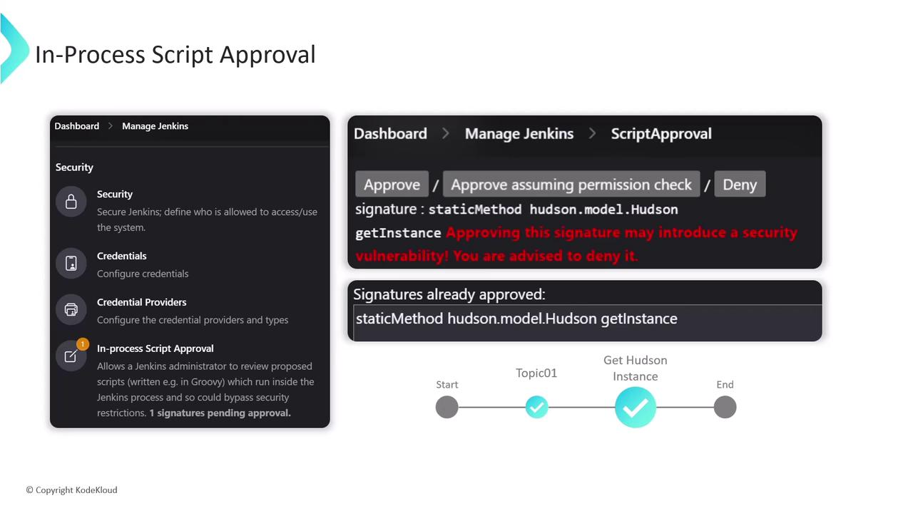
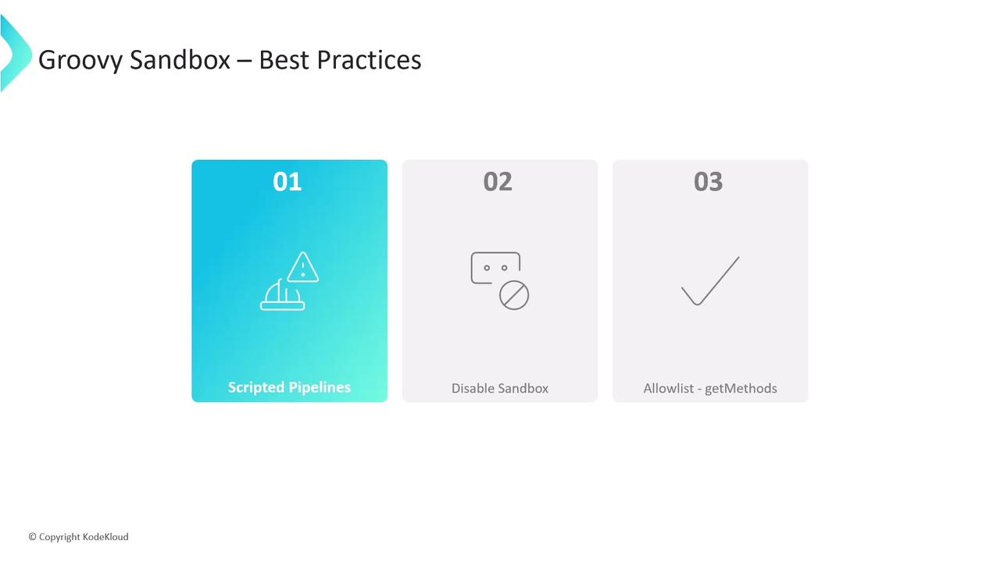
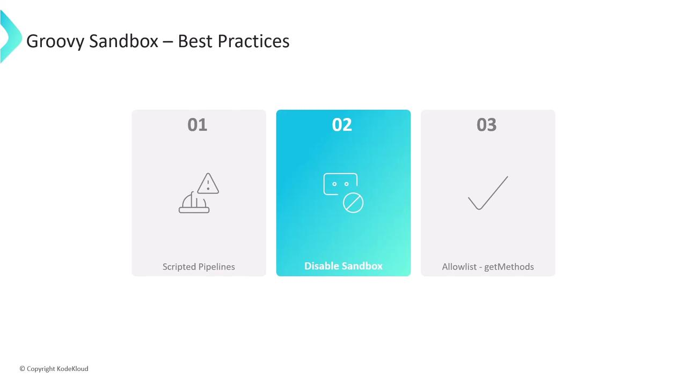
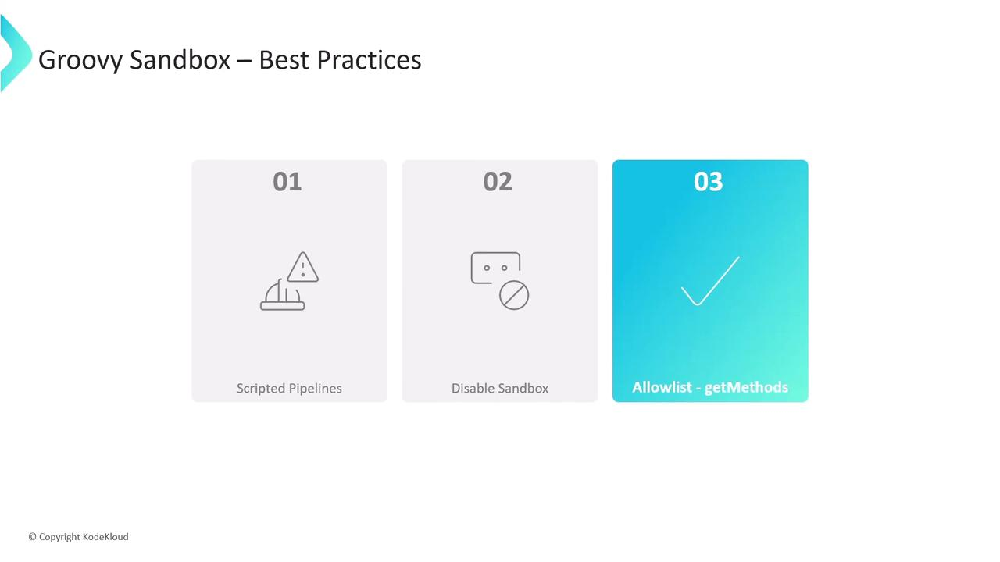

# Groovy Sandbox and In process Script Approval

Source: https://notes.kodekloud.com/docs/Certified-Jenkins-Engineer/Jenkins-Administration-and-Monitoring-Part-2/Groovy-Sandbox-and-In-process-Script-Approval/page

This guide explains Jenkins Groovy sandbox security and managing in-process script approvals, covering default behavior, unapproved methods, UI workflows, and best practices.

In this guide, you’ll learn how Jenkins enforces Groovy sandbox security and how to manage in-process script approvals. We cover default sandbox behavior, unapproved method handling, UI workflows, sandbox disabling, and best practices.

## Default Sandbox Execution in Pipelines

By default, Jenkins runs pipeline Groovy code inside a restricted sandbox provided by the [Script Security Plugin](https://plugins.jenkins.io/script-security/). This prevents unauthorized operations on the controller.

```groovy theme={null}
pipeline {
  agent any
  stages {
    stage('Topic-1') {
      steps {
        echo 'Groovy Sandbox'
      }
    }
    stage('Topic-2') {
      steps {
        echo 'In-process Script Approval'
      }
    }
  }
}
```

## How the Groovy Sandbox Works

* Jenkins checks every method call and field access against an approved allow list.
* Unapproved calls halt the script with an exception.
* Signatures awaiting approval appear under **Manage Jenkins ▶ In-process Script Approval**.

## Demonstration: Unapproved Static Method

Attempting to call a method like `Hudson.getInstance()` triggers a failure because it’s not on the allow list:

```groovy theme={null}
pipeline {
  agent any
  stages {
    stage('Get Hudson Instance') {
      steps {
        script {
          def hudson = hudson.model.Hudson.getInstance()
          println "Hudson Instance: ${hudson}"
        }
      }
    }
  }
}
```

The build stops with an `UnapprovedUsageException`:

```text theme={null}
Started by user siddharth
org.jenkinsci.plugins.scriptsecurity.scripts.UnapprovedUsageException: script not yet approved for use
    at org.jenkinsci.plugins.scriptsecurity.scripts.ScriptApproval.using(ScriptApproval.java:695)
    …
Finished: FAILURE
```

No further stages execute until an administrator approves the signature.

## In-Process Script Approval UI

When a script fails due to an unapproved signature, it’s listed in **Manage Jenkins ▶ In-process Script Approval**. Administrators can:

| Action                            | Description                                                               |
| --------------------------------- | ------------------------------------------------------------------------- |
| Approve                           | Add the signature globally, allowing all pipelines to use it immediately. |
| Deny                              | Block the signature permanently and prevent future attempts.              |
| Approve assuming permission check | Allow only if the executing user has appropriate Jenkins permissions.     |

<Frame>
  
</Frame>

Once approved, any pipeline invoking the signature will succeed until it’s removed from the allow list.

## Disabling the Sandbox in Pipeline Configuration

* Unchecking **Use Groovy Sandbox** means only administrators can run the pipeline without further approvals.
* Non-admins see a prompt indicating that a Jenkins administrator must authorize the script.
* Administrators can approve scripts directly from the job’s configuration page.

<Callout icon="triangle-alert">
  Disabling the sandbox exposes your Jenkins controller to unverified code. Only disable if absolutely necessary and you fully trust all pipeline sources.
</Callout>

## Best Practices for Groovy Sandbox

1. Prefer **Scripted Pipelines** when advanced Groovy features are required.
2. Keep the sandbox enabled to minimize security risks.
3. Approve only read-only methods (e.g., getters). Avoid allowlisting any operations that change persisted state (e.g., `execute`, setters).

<Frame>
  
</Frame>

Write and test your pipeline incrementally—each unapproved call surfaces in the Script Approval UI for review.

<Frame>
  
</Frame>

Most safe signatures start with `get`. Steer clear of methods that modify external systems or internal state.

<Frame>
  
</Frame>

## References

* [Jenkins Pipeline Syntax](https://www.jenkins.io/doc/book/pipeline/syntax/)
* [Script Security Plugin](https://plugins.jenkins.io/script-security/)
* [Managing Jenkins: Script Approval](https://www.jenkins.io/doc/book/managing/script-approval/)

<CardGroup>
  <Card title="Watch Video" icon="video" href="https://learn.kodekloud.com/user/courses/certified-jenkins-engineer/module/90da5b24-e8f2-455a-9756-9d69f4a7ce8e/lesson/0fb4e9eb-e231-4a52-a0f6-9568207bad8a" />
</CardGroup>
