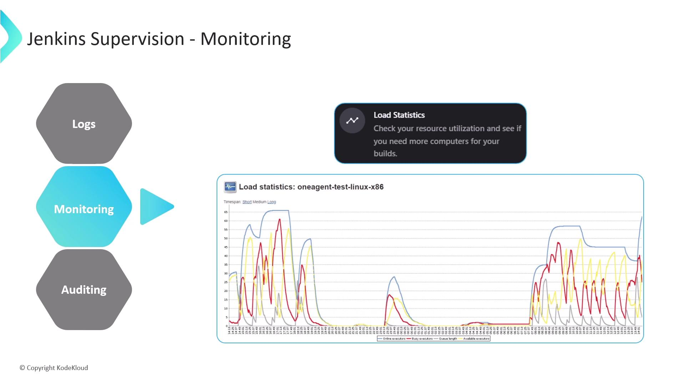
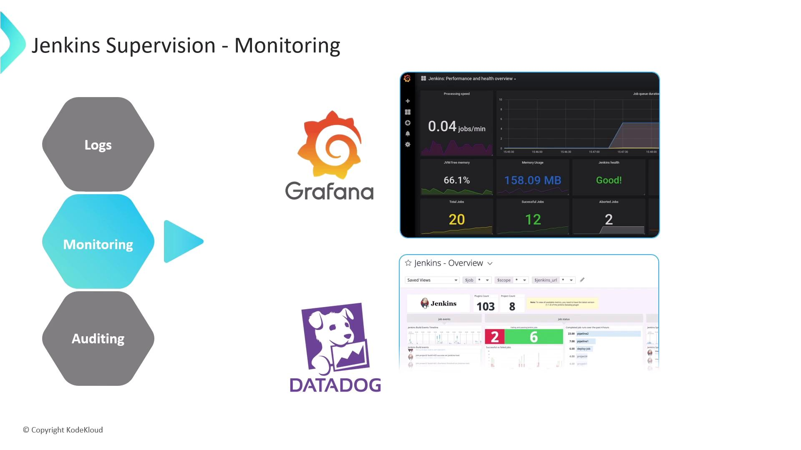
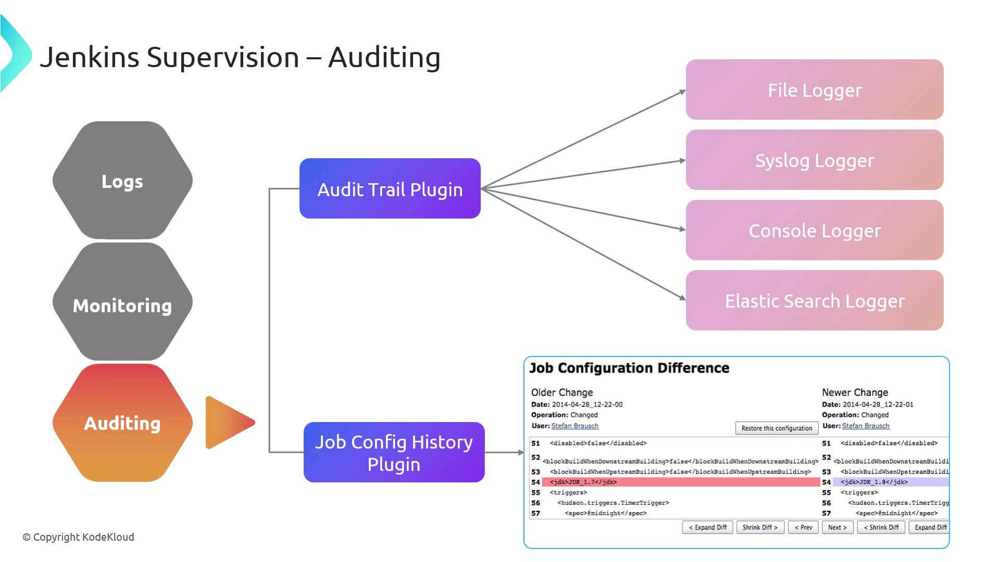

# Jenkins Supervision

Source: https://notes.kodekloud.com/docs/Certified-Jenkins-Engineer/Jenkins-Administration-and-Monitoring-Part-2/Jenkins-Supervision/page

This article discusses effective monitoring strategies for Jenkins to enhance continuous integration and delivery by detecting errors and optimizing performance.

Effective continuous integration and delivery (CI/CD) depend on actively monitoring Jenkins. Proactive supervision helps you detect system errors, plugin failures, or pipeline issues early—preventing disruptions, reducing deployment delays, and maintaining optimal throughput.

<Frame>
  
</Frame>

In this guide, we’ll explore:

1. How to access and analyze Jenkins logs
2. Built-in tools and plugins for performance monitoring
3. Auditing user actions and configuration changes

***

## 1. Accessing Jenkins Logs

Jenkins logs are the primary source for troubleshooting builds, plugins, and system health. Depending on your installation method, log locations and configuration files vary:

| Installation Type | Log Location                   | Config File Path                         | View Command Example                        |
| ----------------- | ------------------------------ | ---------------------------------------- | ------------------------------------------- |
| Standalone WAR    | Console output                 | N/A                                      | `java -jar jenkins.war`                     |
| Debian (APT)      | `/var/log/jenkins/jenkins.log` | `/etc/default/jenkins`                   | `cat /var/log/jenkins/jenkins.log`          |
| Red Hat (YUM/DNF) | `/var/log/jenkins/jenkins.log` | `/etc/sysconfig/jenkins`                 | `vi /etc/sysconfig/jenkins`                 |
| Windows MSI/ZIP   | `%JENKINS_HOME%\jenkins.out`   | `Jenkins.xml` (service wrapper settings) | `Get-Content $env:JENKINS_HOME\jenkins.out` |
| Docker Container  | Container stdout               | N/A                                      | `docker logs <container-id>`                |
| Jenkins UI        | Embedded log viewer            | N/A                                      | **Manage Jenkins** → **System Log**         |

<Callout icon="lightbulb">
  Rotate and archive Jenkins logs regularly to avoid disk space issues—especially on high-throughput servers.
</Callout>

***

## 2. Built-In Monitoring and Load Statistics

Jenkins ships with basic performance charts under **Manage Jenkins** → **Load Statistics**. Use these metrics to size agents and optimize throughput:

* **Available Executors**: Idle build slots ready to accept jobs
* **Busy Executors**: Active build slots currently executing jobs
* **Queue Size**: Number of jobs waiting for allocation
* **Overall Load**: Aggregate CPU and memory demand

<Frame>
  
</Frame>

***

## 3. Monitoring Plugins

Enhance Jenkins observability with these community-maintained plugins:

| Plugin Name                                                              | Description                                                                                                                                   |
| ------------------------------------------------------------------------ | --------------------------------------------------------------------------------------------------------------------------------------------- |
| [Monitoring Plugin](https://plugins.jenkins.io/monitoring/)              | Integrates [Java Melody](https://github.com/javamelody/javamelody/) for charts on CPU, memory, GC, response times, HTTP sessions, and errors. |
| [Disk Usage Plugin](https://plugins.jenkins.io/disk-usage/)              | Tracks per-job and workspace disk consumption with historical trends and alerts.                                                              |
| [Build Monitor Plugin](https://plugins.jenkins.io/build-monitor-plugin/) | Displays a dashboard of job statuses, highlighting failing jobs and culprits.                                                                 |

For enterprise-grade dashboards, forward Jenkins metrics to your APM or time-series database:

<Frame>
  
</Frame>

* **Datadog / New Relic** plugins: Ship Jenkins performance counters to your APM platform.
* **Prometheus Plugin** + **Grafana**: Expose metrics via Prometheus and visualize in Grafana dashboards.

<Callout icon="triangle-alert">
  Monitor plugin compatibility after Jenkins core upgrades—some plugins may require updates to continue reporting metrics.
</Callout>

***

## 4. Auditing Configuration and User Activity

Maintaining an audit trail is crucial for security and compliance. Combine these two plugins for complete coverage:

### 4.1 Audit Trail Plugin

[Audit Trail Plugin](https://plugins.jenkins.io/audit-trail/) records every user action:

* **File Logger** (default): Rotating local log files
* **Syslog Logger**: Centralizes events on a syslog server
* **Console Logger**: Streams actions to the console (avoid in prod)
* **Elasticsearch Logger**: Indexes logs for advanced search and analytics

### 4.2 Job Config History Plugin

[Job Config History Plugin](https://plugins.jenkins.io/jobConfigHistory/) version-controls your `config.xml`:

* Stores historical copies of job, folder, and global configs
* Provides a diff view and one-click rollback of changes

<Frame>
  
</Frame>

Using both plugins ensures you log **who** did **what** and can restore previous configurations if needed.

***

## Links and References

* [Jenkins Documentation](https://www.jenkins.io/doc/)
* [Kubernetes Basics](https://kubernetes.io/docs/concepts/overview/what-is-kubernetes/)
* [Terraform Registry](https://registry.terraform.io/)
* [Docker Hub](https://hub.docker.com/)

<CardGroup>
  <Card title="Watch Video" icon="video" href="https://learn.kodekloud.com/user/courses/certified-jenkins-engineer/module/90da5b24-e8f2-455a-9756-9d69f4a7ce8e/lesson/c03fd18f-98a1-48d0-9ca5-ed671a25a8c6" />
</CardGroup>
