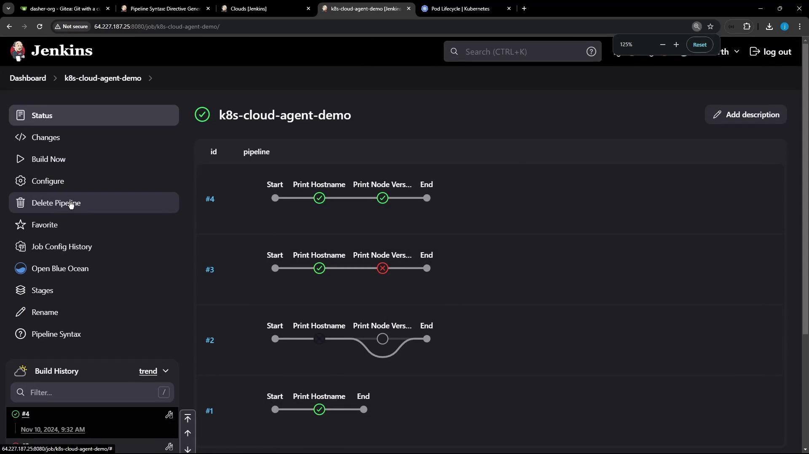
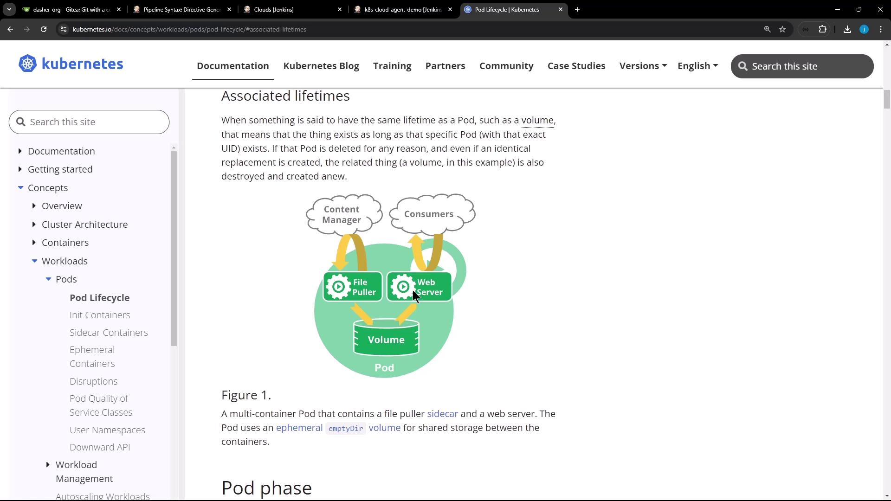

# Demo Sharing a file between containers

Source: https://notes.kodekloud.com/docs/Certified-Jenkins-Engineer/Pipeline-Enhancement-and-Caching/Demo-Sharing-a-file-between-containers/page

This demo illustrates file sharing between containers in a Kubernetes Pod using a Jenkins pipeline.

In Kubernetes, all containers in the same Pod share the same filesystem volume. This demo shows how one Jenkins pipeline stage writes a file in an Ubuntu container, and a subsequent stage reads it in a Node.js container—both running side by side in the same Pod.

<Callout icon="lightbulb">
  * A Jenkins server with the \[Kubernetes Plugin]\[] and \[Blue Ocean]\[] installed.
  * A connected Kubernetes cluster configured as a cloud agent.
</Callout>

## Jenkinsfile Overview

The following `Jenkinsfile` defines two stages: one running on Ubuntu, the other in a Node.js sidecar. They share the workspace via an `emptyDir` volume.

```groovy theme={null}
pipeline {
  agent any
  stages {
    stage('Write File in Ubuntu') {
      steps {
        // On the default Ubuntu container
        sh 'hostname'
        sh 'echo important_UBUNTU_data > ubuntu-${BUILD_ID}.txt'
        sh 'ls -ltr ubuntu-${BUILD_ID}.txt'
        sh 'sleep 60s' // keep the Pod alive briefly
      }
    }
    stage('Read File in Node.js') {
      steps {
        container('node-container') {
          sh 'node -v'
          sh 'npm -v'
          // List and display the same file
          sh 'ls -ltr ubuntu-${BUILD_ID}.txt'
          sh 'cat ubuntu-${BUILD_ID}.txt'
        }
      }
    }
  }
}
```

## Executing the Pipeline

When this pipeline runs, Jenkins dynamically provisions a Pod with two containers—`ubuntu-container` (default) and `node-container` (sidecar)—sharing an `emptyDir` workspace volume.

<Frame>
  
</Frame>

Under the hood, the Pod specification looks like this:

```yaml theme={null}
apiVersion: v1
kind: Pod
metadata:
  name: k8s-cloud-agent-demo
spec:
  restartPolicy: Never
  volumes:
    - name: workspace-volume
      emptyDir: {}
  containers:
    - name: ubuntu-container
      image: ubuntu:latest
      volumeMounts:
        - name: workspace-volume
          mountPath: /workspace
    - name: node-container
      image: node:18
      volumeMounts:
        - name: workspace-volume
          mountPath: /workspace
```

<Frame>
  
</Frame>

## Pipeline Log Example

The log below confirms the file created in the Ubuntu container is accessible in the Node.js container:

```text theme={null}
[Pipeline] stage
[Pipeline] { (Write File in Ubuntu)
+ hostname
k8s-cloud-agent-demo-5-rv7b8-8frt0-n41pw
+ echo important_UBUNTU_data > ubuntu-5.txt
+ ls -ltr ubuntu-5.txt
-rw-r--r-- 1 root root 22 Nov 10 09:47 ubuntu-5.txt
[Pipeline] // stage
[Pipeline] stage
[Pipeline] { (Read File in Node.js)
+ node -v
v18.20.4
+ npm -v
6.14.17
+ ls -ltr ubuntu-5.txt
-rw-r--r-- 1 root root 22 Nov 10 09:47 ubuntu-5.txt
+ cat ubuntu-5.txt
important_UBUNTU_data
[Pipeline] // stage
```

## Static Nodes vs. Dynamic Agents

You can run Jenkins jobs on:

| Agent Type             | Description                                         | Pros                                           | Cons                                               |
| ---------------------- | --------------------------------------------------- | ---------------------------------------------- | -------------------------------------------------- |
| Static Node (VM)       | A long-running machine with preinstalled tools.     | Always available; ideal for specialized builds | Idle resource costs; manual maintenance required.  |
| Docker Agent           | Containers spun per job and removed when done.      | Custom images; resource-efficient              | Requires Docker environment setup.                 |
| Kubernetes Cloud Agent | Pods created on demand, destroyed after completion. | Auto-scaling; shareable volumes per Pod        | Kubernetes cluster required; plugin configuration. |

<Callout icon="triangle-alert">
  Dynamic agents help you package toolchains into container images, cutting down on idle resources and improving build scalability.
</Callout>

## Further Reading

* [Jenkins Kubernetes Plugin Documentation][]
* [Kubernetes Basics][]
* [Jenkins Blue Ocean][]

[Docker Hub]: https://hub.docker.com/

[Kubernetes Basics]: https://kubernetes.io/docs/concepts/overview/what-is-kubernetes/

[Jenkins Kubernetes Plugin Documentation]: https://www.jenkins.io/doc/book/cloud/kubernetes/

[Jenkins Blue Ocean]: https://www.jenkins.io/projects/blueocean/

<CardGroup>
  <Card title="Watch Video" icon="video" href="https://learn.kodekloud.com/user/courses/certified-jenkins-engineer/module/49e48191-1afc-42bf-9ce5-b98f35b6a2fb/lesson/7a81d89b-ff77-4950-bf31-2b6d30df7a6f" />
</CardGroup>
