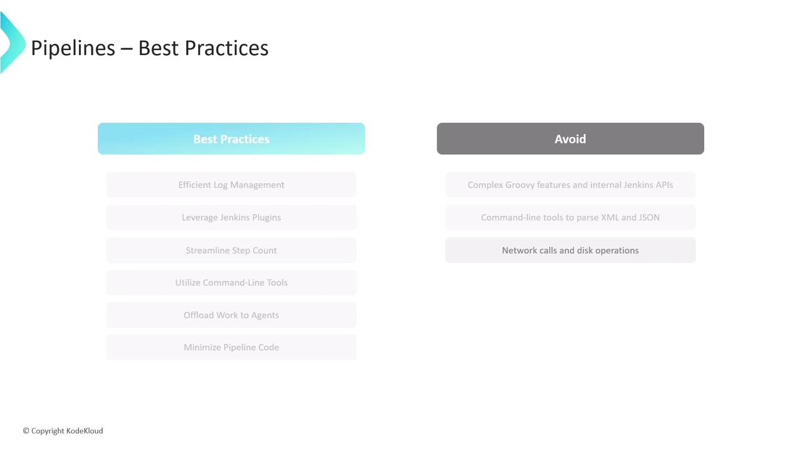

# Best Practices for Scripted Pipelines

Source: https://notes.kodekloud.com/docs/Certified-Jenkins-Engineer/Pipeline-Structure-and-Scripted-vs-Declarative/Best-Practices-for-Scripted-Pipelines/page

This article covers best practices to optimize Jenkins pipelines, focusing on scripted pipelines for improved performance, maintainability, and reliability in CI/CD workflows.

In this lesson, we’ll cover essential recommendations to optimize your Jenkins pipelines—both scripted and declarative—and then dive into guidelines that apply specifically to scripted pipelines. Following these practices will improve performance, maintainability, and reliability across your CI/CD workflows.

<Callout icon="lightbulb">
  These general best practices apply to **both** Scripted and Declarative Pipelines in Jenkins.
</Callout>

## General Best Practices

| Best Practice              | Benefit                                    | Implementation Example                                                                                              |
| -------------------------- | ------------------------------------------ | ------------------------------------------------------------------------------------------------------------------- |
| Efficient Log Management   | Reduces controller load and speeds up runs | Write build logs to a file on the agent, then compress and archive them as build artifacts via `archiveArtifacts`   |
| Leverage Jenkins Plugins   | Simplifies maintenance and updates         | Use plugins for SCM, artifact handling, deployment, and notifications instead of custom scripts                     |
| Keep Pipelines Concise     | Easier to read, debug, and maintain        | Aim for fewer than 300 steps. Consolidate related commands into external helper scripts or tools                    |
| Use Command-Line Tools     | Faster data processing                     | Offload heavy transformations or API calls to shell scripts, batch files, or CLI utilities like `curl` or `aws` CLI |
| Delegate to Agents         | Keeps controller responsive                | Schedule large data processing or long-running tasks on dedicated agent nodes                                       |
| Minimize In-Pipeline Logic | Maintains pipeline “glue”                  | Avoid embedding complex Groovy expressions—use pipeline steps and external scripts for business logic               |

## Scripted Pipeline–Specific Guidelines

1. **Stick to Basic Groovy Syntax**\
   Use only core Groovy features (loops, conditionals, closures). Avoid DSL meta-programming or AST transformations that make debugging difficult.

2. **Avoid Direct Jenkins API Calls**

<Callout icon="triangle-alert">
  Do **not** invoke Jenkins internal APIs (e.g., `hudson.model.*`) from your `Jenkinsfile`.\
  For advanced integration, develop a custom [Pipeline Step Plugin](https://www.jenkins.io/doc/developer/plugin-development/pipeline-step/) instead.
</Callout>

3. **Prefer CLI Parsers Over Groovy Libraries**\
   For XML/JSON manipulation, use tools like [xmllint](https://xmlsoft.org/xmllint.html) or [jq](https://stedolan.github.io/jq/) rather than in-pipeline Groovy parsing to reduce controller memory usage.

4. **Don’t Perform Raw Network or I/O Operations**

<Callout icon="triangle-alert">
  Never fetch URLs or read/write files directly in your `Jenkinsfile`.\
  Wrap these operations in `sh`, `bat`, or custom steps to ensure proper error handling and resource cleanup.
</Callout>

***

<Frame>
  
</Frame>

## References

* [Jenkins Pipeline Syntax](https://www.jenkins.io/doc/book/pipeline/syntax/)
* [Jenkins Plugin Development – Pipeline Steps](https://www.jenkins.io/doc/developer/plugin-development/pipeline-step/)
* [xmllint Documentation](https://xmlsoft.org/xmllint.html)
* [jq User Guide](https://stedolan.github.io/jq/)

<CardGroup>
  <Card title="Watch Video" icon="video" href="https://learn.kodekloud.com/user/courses/certified-jenkins-engineer/module/956fce34-baa6-4655-a3cf-7b12d2364544/lesson/d20a06b3-0f95-4545-b582-b82fa1a2f746" />

  <Card title="Practice Lab" icon="installation" href="https://learn.kodekloud.com/user/courses/certified-jenkins-engineer/module/956fce34-baa6-4655-a3cf-7b12d2364544/lesson/1ecacbbb-3c56-4069-b13c-e70f22f58c63" />
</CardGroup>
